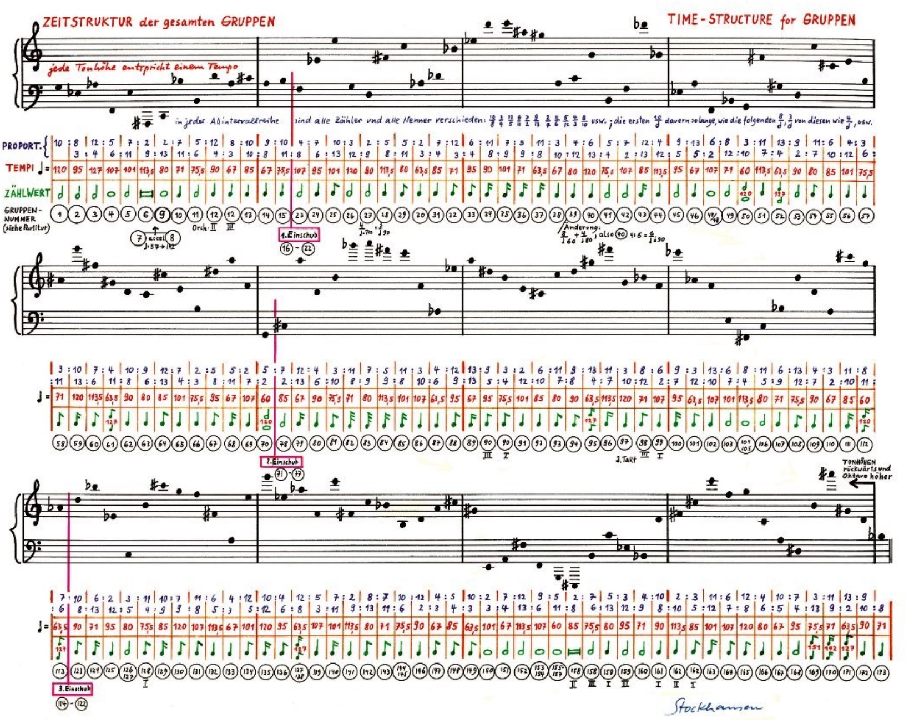

# Appunti della lezione di Giovedì 4 Giugno 2020

Caricata lezione su Edmodo su [Punkte Gruppen e Momente](https://www.youtube.com/watch?v=gCltpEWYC-E)

Fino ad ora abbiamo introdotto il paradigma e lo strato di pregiudizio di base su Stockhausen

Ed abbiamo fatto una lezione piú tecnica su Prelude

Ed abbiamo fatto una lezione su Etude, Studio I e Studio II e discusso sull'aspetto della partitura come aspetto validante, che riassume e rende conto di tutta la partitura.

_________

Oggi il discorso va impattare sull' estensione progressiva della coscienza->idea che ogni fase è una fase che trascende la precedente ed integra l'una nell'altra

Mentre i Gruppen sono una forma trascesa dei gruppi, i Momente sono uno stacco diverso

(oggi prendo il modo compositivo di ieri che diviene una sola parte del comporre d'oggi)
(Esempio, prima o poi ci si scontra con la serie, essa poi la rovesciamo, poi complementari prima serie etc... ->uso letterale della tecnica seriale, ma se decido che una singola nota non è piú una nota presa alla lettera, il principio seriale è conservato ma trascende una dimensione formale, passo dunque da _una serie che gestisce aspetti puramente materiali_ a _passaggio formale e compositivo_)

(Esempio di allievo di composizione di Donatoni: dato un insieme di suoni, mettere in atto una serie di processi e disegni che produce cosí tanto materiale che orchestro e faccio il pezzo -> molti brani di Donatoni)

Altra videolezione sarà sulle metafore, ovvero quello che nel paradigma presentato da Khun e Alcedo Coenen

Alcedo Coenen ->articolo su Contemporary Music review in cui equipara il pensiero di Stockhausen ad un pensiero paradigmatico in cui equipara:
- formule -> generalizzazioni -> tecniche nella musica
- esemplari -> pendolo -> composizioni prese come riferimento da Stockhausen (esemplari definiti in due modi)

Idea di base di Stockhausen della composizione e scrittura come estensione della coscienza, qualche cosa che da letterale diventa simbolico, prolifera in processi ulteriori.

**appunti per gabri**

### Punti e Gruppi

Punti di interesse del compositore, considerati come un'entità a se stante, ovvero la singola nota diventa importante, esempio, _oboe che suona nota molto piano, e fagotto che suona molto forte entrano in correlazione timbrico_, dunque la configurazione del serialismo integrale non si configura nel serializzare tutti i parametri, ma nel **rendere il singolo suono unico, importante ed irripetibile**, dunque ci starebbe bene l'ascolto di Kontra-Punkte.

Dunque tutte le caratteristiche sono quelle di un evento individuale che è quella del punto, caratteristiche ben descritte in **Punte**. Seguito dal brano **Kontra-punkte**, ovvero compresenza di punti, che in qualche caso, queste note singole scoppiano in una costellazione di note, ovvero dalla singola nota scoppia un'altra costellazione di note.

#### Gruppi
_Esempio_

Oboe che suona molto forte con note lunghe, diviene un gruppo che conserva caratteristiche.

Altro gruppo puó essere quello di un trombone che suona note molto staccate, che non superano mai una terza e che non rispettano peró nessun tipo di temperamento(trombone a coulisse anche micro intervalli).

Bisogna pensare i gruppi come delle classi informatiche e dunque la scrittura è messa in sequenza di gruppi.

Alcuni gruppi possono ereditare delle caratteristiche del gruppo precedente, ereditando dinamiche, note, silenzi etc... ma ad esempio cambia la modalità di esecuzione del suono.

Il motore di pensiero seriale consente questo tipo di espansione, parlando di **matrice seriale del pensiero**, la cosa importante del pensiero seriale declinato da Stockhausen, non è importante usare serie o ordini, ma io ho bisogno di aver sotto una scala, una base.

Pensando che il Stockhausen serializzi molte cose: riverberi, frasi, sezioni, etc...

Il fatto che tutto può essere serializzato, lasciando alle spalle la singola nota, ciò ci fa intendere che tutto puó esser serializzato data una scala nota (esempio di Gesang, varie scale usate).

La presenza di uno spazio serializzato ed unificato, è quello che passa dallo spazio di Studio I allo spazio unificato, infatti non conta piú lo scegliere la singola serie armonica, e che permette al compositore di prendere una scelta piuttosto che un'altra.

I gruppi possiamo dunque prenderli come estensione letterale della nota, che diventa il simbolo di qualcos'altro, espressa nella _tecnica della formula_ e descritta da una _superformula_, che è un brano. Questa _superformula_ è una mappa, in cui punti e gruppi diventano rappresentazione nel penso, ma che ha rappresentazione strutturale ancor piú grande.

Punte sono un aggregato di caratteristiche che danno luogo ad una composizione.

Scrivere per Gruppi è un'esperienza importante.

(Stockhausen è arrivato a superare il sistema temperato, gradualmente, superando i limiti della strumentalità, ad esempio, Mixtur è un'eruzione dionisica della percezione dell 12 note, con modulatore ad anello che disintegra, orizzonte profondo che definsice il fatto che finchè uso le 12 note sono costretto all'utilizzo degli strumenti)

Suono diviene dissonante e porta con se intervalli dissonanti, armoniche, a quel punto bisogna chiedere allo strumentista di suonare altro.

Il peso e la progressività di Stockhausen dagli anni '70 in poi inizia a pesare con la scrittura tradizionale, e dagli anni '70 in poi comincia a mancare in Stockhausen un po' una dimensione musicale facendo persistere solo ideologie.

#### Gruppen

Esempio di cosa significa pensare per gruppi, intervalli a specchio. (La prima serie con la debita interpretazione contiene L-stockhausen-R)

Stockhausen racconta del suo passato, di quando era in ospedale a lavorare durante la guerra, il padre che va in guerra per morire, la madre viene internata. Esperienze che prospettano per lui esperienze molto dure; la famiglia di Stockhausen era una famiglia di contadini, e non poté studiare al collegio, per via della madre e dei soldi.

La prima serie fondamentale è sviluppata in modi che non è dato sapere, ogni serie separata da stanghette è sviluppata dalla precedente. Ogni serie è però diverse.

Queste sono 12 serie per 12 suoni, ovvero 144 suoni. Ma è come se fossero 144 suoni di un'unica serie. Il tutto è nel ricercare omogeneità in un qualcosa di eterogeneo.

Ma invece di essere 144 suoni, sono 145 poichè vi è un si bemolle alla fine(per chiudere).

Vediamo ch dopo 15 c'è 23, 16-22 sono di scrittura libera, come in 71-77, 7-8, ed anche il gruppo 40. Ciò ricorda la struttura di Mikrophonie 1, che ricorda cellule alternate come fossero tamburi battenti. Ci sono 3 momenti in cui sezione arbitraria in cui le 3 sezioni vanno insieme.

Ogni suono, rappresenta una sezione del pezzo, e sta a simboleggiare una tessitura e proprietà della classe che si sta definendo, che determina i parameteri per un rapporto. Come ad esempio tra sol-mi bemolle c'è un rapporto 10:8 e continua per tutta la serie, rapporti che danno luogo a un tot di parametri. Ogni rapporto stabilisce:
- un tempo
- una durata (determinante nel gruppo ma non l'unica durata in esso)
- numeri che rappresentano il gruppo

Nei momenti arbitrari c'è un qualcosa di nascosto e che non si cosa celi.

Nella grande immaginazione di Stockhausen è tutto determinante(ma non proprio tutto).

È importante capire quale nota suoni quale gruppo ed in quale momento tra l'altro...

Inoltre vediamo dunque da un lato il principio della scala cromatica per fare una serie, per fare una serie di scale, ci vuole una scala di scale.

La seconda acquisizione importante è che la singola nota, per essere orchestrata, deve dare ad ogni nota la durata indicata sotto, ma gli attacchi rispettano i rapporti sotto, quello che avrò è un pezzo fatto di punti, ma quando questo punto diviene un'icona o un segna posto, stabilisco che ogni nota è il centro di una tessitura. Come se il primo sol racchiudesse in se piú note e non solo una.

Devo decidere ad esempio, quando la nota attacca con quale timbro, dinamica, altezza etc...
Ad esempio nota 158, tessitura minore, nota 83 tessitura maggiore.

Concatenarsi dei gruppi in base alla presenza di elementi individuali.

Stockhasuen pensa dunque i Punte e i Gruppen come un oggetto sonoro. Piú espresso per livelli.

Mentre l'oggetto sonoro è un oggetto poeietico, le proprietà dell'oggetto sonoro possono solamente essere espresse a posteriori.

Idea di consequenzialità e di sequenza di cui Stockhausen si vuole liberare.
___________

Il prossimo passo è la Moment-Forme, e di un brano che si intitola Gesang der Jungelinge.

Moment-Forme è un qualche cosa che trascende il tempo.
