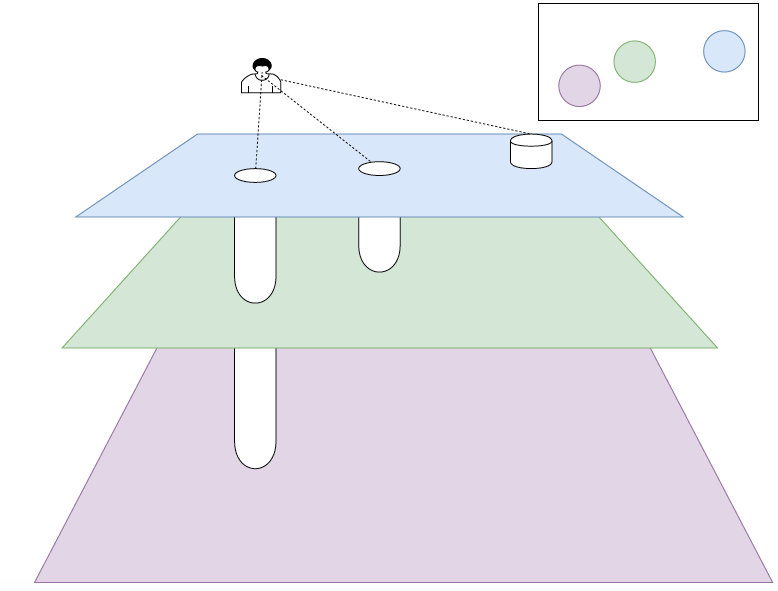
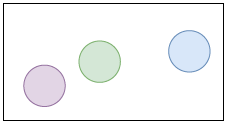
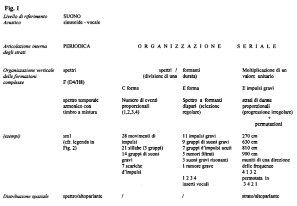
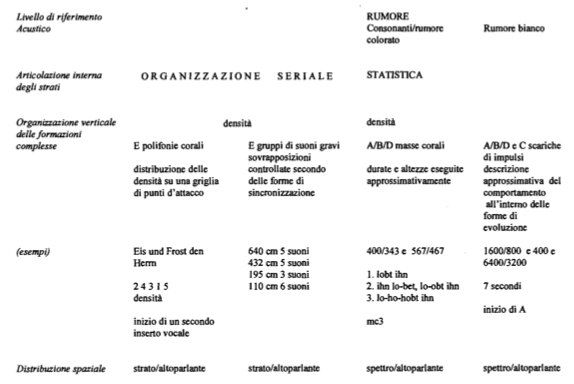

# Appunti della lezione di Giovedi 11 Giugno 2020

[Registrazione della lezione dell'11 Giugno 2020](https://www.youtube.com/watch?v=U2LyRQxm7KY&feature=emb_title)

Il tradimento dei chierici (Borghesia, secondo tradimento dei chierici)

Borghesia si è affidata e fidata del mercato e ha perso la capicità di creare innovazione. Si è persa l'oggettività della qualità.

Dibattito sull'importanza della storia e su l'importanza della cultura.

_Quando il cielo è pronto appare Buddha_

_____

### Momentform

Interpretazione grafica della _Momentform_

Vediamo in essa 3 momenti. Ovvero 3 pannelli, situazioni sonore statiche dalla forte caratterizzazione. Sembra che abbiano  molto a che vedere con i gruppi, ma i gruppi erano legati fra loro da una logica seriale, come se ogni gruppo fosse elemento espanso di una serie, oltre ad elementi di ereditarietà fra gruppi. 

In realtà la suddivisione in punti, gruppi e momenti, è una suddivisione a posteriori delle pratiche di Stockhausen, anche se in realtà questa suddivisione ha avuto dei momenti di mescolanza, esse sono dunque delle generalizzazioni o dei punti di arrivo. 

Per esempio nel brano _Momente_ del 1961, presenta delle componenti che si passano fra loro (piú simile ad una composizione per gruppi e non per momenti).

Per capire cos'è un momento, possiamo vederlo come una metafora. Immaginandosi un tessuto musicale senza direzionalità e statico nelle sue componenti, con suo colore, una sua articolazione, riconoscibilità e fisionomia e non è caratterizzato ne da un movimento, ne da una direzione e/o un climax, tutto è molto statico; come se ogni istante fosse un climax. Una cosa del genere non ha un inizio, inizia nel momento in cui noi iniziamo ad ascoltarla. Come se un momento cosí strutturato arrivasse da un passato non ascoltato che non ha un inzio(eterno), musica che potrebbe continuare all'infinito (con fine quando si taglia). 

In Stockhausen, sai che comincia un momento con tutte le sue caratteristiche, ma non sai quando finisce. Come se il momento dia un'estensione che non è finita, il momento per sua natura non ha inizio ne fine, siamo noi che lo isoliamo, guardandolo dalla cima di un pezzo, affacciandoci arriviamo ad un altro pozzo piú profondo, e poi c'è un altro pozzo ancora piú profondo. 

La forma è una specie di illusione ottica che mette in fila questi momenti ma che non sono legati fra loro, ma sono solo l'effetto di osservazione della nostra operazioni. 

*neither aim at the climax, nor at prepared (and consequently*

*expected) multiple climaxes, and the usual introductory, rising,*

*transitional and fading-away stages are not delineated in a development*

*curve encompassing the entire duration of the work. On the contrary,*

*these forms are immediately intense and seek to maintain the*

*level of continued "main points", which are constantly equally present,*

*right up until they stop. In these forms a minimum or a maximum may be*

*expected in every moment, and no developmental direction can be*

*predicted with certainty from the present one; they have always already*

*commenced, and could continue forever;*

*in them either everything present counts, or nothing at all; and each*

*and every Now is not unremittingly regarded as the mere consequence of*

*the one which preceded it and as the upbeat to the coming one—in which*

*one puts one's hope—but rather as something personal, independent and*

*centred, capable of existing on its own. They are forms in which an*

*instant does not have to be just a bit of a temporal line, nor a moment*

*just a particle of a measured duration, but rather in which*

*concentration on the Now—on every Now—makes vertical slices, as it were,*

*that cut through a horizontal temporal conception to a timelessness I*

*call eternity: an eternity that does not begin at the end of time but is*

*attainable in every moment. I am speaking of musical forms in which*

*apparently nothing less is being attempted than to explode (even to*

*overthrow) the temporal concept—or, put more accurately: the concept of*

*duration. . . .*

Traduzione in inglese di un testo in cui Stockhausen spiega cos'è la *Momentform*. Essa è la descrizione piú precisa che egli ci ha dato della *Momentform*.

In cui dice che i momenti è come se fossero cominciati da sempre, e potrebbero continuare per sempre. 

Forme in cui un istante non deve essere solo un segmento di una linea temporale e neanche una particella misurate, ma dei momenti in cui la concentrazione dell'ora, dell'adesso e di ogni adesso, crea dei tagli verticali, delle sezioni verticali. 

Il carotaggio all'interno degli infiniti tessuti musicali possibili rende l'idea della momentform. Il compositore taglia dunque queste sezioni.

Di fatto ciò che esiste filosoficamente sono dei piani paralleli(poichè non c'è nessuna comunicazione) infiniti.

Quello che vedo è davvero questo dunque:

(Vicinanza del paesaggio sonoro all'idea di momenti stockhauseniana)

Stockhausen non concepisce l'idea formale come scopo, ma concepisce l'idea formale come presupposto creativo, e la realizzazione del compositore autoriale è sempre alla fine.

La momentforme è un qualche cosa che si articola in forme molto diverse.

### Momente

Nella composizione vi sono 3 tipi di momento():

1. **K** -> Klang ovvero suono

2. **M** -> Melodia

3. **D** -> Daurer ovvero durata

C'è tutta una serie di caratteristiche del suono codificate in base all'appartenenza a questi gruppi. Ed in particolare abbiamo le voci, nella sezione Klang abbiamo solo coro maschile, coro femminile nelld Durate, ed il soprano solo nella Melodia.

La struttura è omofonica nella sezione K.

Polifonica in D.

Eterofonica in M.

##### Differenza tra polifonia ed eterofonia

La polifonia significa che il canto è organizzato in strutture contrappuntistiche e deterministiche in cui possiamo determinare cosa suona e quando suona. Mentre le strutture eterofoniche sono 

*Esempio: Melodia di 30 note ed ogni persona di un gruppo ne canta un tot in un tot di tempo->quello che noi sentiamo ha un'impostazione statistica ed aleatoria, non possiamo determinare singola occorrenza di singola nota, essa è una asincronia controllata. In ciò tutti sappiamo cosa fare.*

*Esempio: in Kontakte dice al collaboratore di fare qualcosa in 30 secondi, ad un altro un'altra cosa in 10 secondi. Cosa succede esattamente in un singolo istante non lo sappiamo, esso significa approccio statistico.*

Mentre se eseguiamo melodie in modo eterofonico.

*Esempio: cantare stessa melodia ma con durate a scelta di ogni esecutore; ognuno farà come vuole.*

L'effetto è quello di un approccio statistico. Ma a che tipo di collocazione vi sono gli eventi sonori, non lo sappiamo.

(In Gesange troviamo pratiche deterministiche e aleatorie)

Nell'etereofonia che è una pratica tipica delle sezioni M di Momente, troviamo la pratica statistica che Stockhausen usa per trattare una certa sezione di nastro. Cosa che troviamo nei 4 criteri della musica elettronica. 

**Polifonia**: impostazione deterministica contrappuntistica, ovvero quanto dura ogni nota, e so esattamente quando arriva la nota x e che cosa arriva.

**Etereofonia**: ci diamo un appuntamento e ci troviamo a cose fatte. Anche un trillo è un approccio statistico, piú sei bravo piú note fai nel trillo.

**Omofonia**: due occhi accordali.

Cosa ci sta dicendo Stockhausen?

Momenti MKD, momenti in cui alcuni dei parametri diventano melodie e KDM, KMD, etc...

Ogni momento finale, ogni estremità della struttura ad albero diventa un piano. Che differenza c'è con l'immagine vista? Nell'immagine invece di avere piani di colori diversi, abbiamo una struttura a scacchi divisa in colori, dove c'è il cerchio ha il colore condiviso con il piano sotto o sopra. Dunque il momento ha anche caratteristiche simili ai gruppi.

____

La struttura ad albero indica che vi è un qualcosa che nasce tutto insieme, e che non è frutto di una scrittura lineare da in prima a un dopo. Il fatto che possiamo decidere se vada prima il K o il D, attorno a una struttura centrale M. Ci dice che non è importante la direzionalità.

In Momente c'è una sezione in cui vi sono gli applausi, dunque essi fanno parte del brano. 

CI sono poi le sezioni **I** ovvero indeterminato; sezioni carnevalesche che non c'entrano nulla, come se nel determinismo piú totale si voglia riconquistare un momento di libertà assoluta. 

In Momente intendiamo l'idea dell'assenza di direzionalità, intercambiabilità o scatola di montaggio che diviene un portato, una conseguenza di un principio che vuole evitare ogni tipo di sviluppo. Stockhausen ha un'altra concezione di sviluppo. 

Dagli anni '50 musica verso l'assenza di sviluppo, ed è parimenti lecita una concezione lineare e drammaturgica in cui elementi compositivi si comportano linearmente e narrativamente. Questa drammaturgia ricompare nelle sue composizioni.

### Gesang der Jüngelinge

(Ascolto del brano)

Arriviamo dunque a Gesang der Jüngelinge. Nell'analisi di Gesange vi è la traduzione in inglese del testo apocrifo biblico del Profeta Daniele. Testo dell'*invocazione fanciulli nelle fornaci*, testo intenso.

(Ascolto dell'inizio de Il mio tesoro intanto dal Don Giovanni di Mozart versione cantata da Josef Protschka, bambino che canta nel Gesange, carriera come tenore e noto come interprete di Lieder tedeschi, ed interprete mozartiano)

Analisi tradotta non alla perfezione dal francese, in cui vi sono cose poco chiare...

Analisi che ci dice qualcosa dei criteri utilizzati nel Gesang.

Lo spazio è uno dei tratti fondamentali del brano, il brano era inizialmente quadrifonico, e dunque va pensato sulle due dimensioni. Dunque lo ascoltiamo male.

Stockhausen, Nono, Chowning rinunciano allo spazio perchè lo spazio non è evidentemente importante.

Allo spazio si rinuncia poichè non è un parametro compositivo...

Dunque la registrazione discografica tiene traccia solo dei parametri che fanno parte di una concezione di scrittura piú tradizionale.

Problema è che nella struttrua compositiva sono integrate cose che fanno parte del dominio dell'accadere e non del comunicare, dunque tutto ciò che appartiene al dominio dell'accadere(come lo spazio). Per Stockhausen la serializzazione è lo strumento tra periodico e statistico, caratteristiche fondamentali dell'onda sonora. Tra questi 2 poli (della pulsazione regolare e della pulsazione imprevedibile), c'è l'organizzazione seriale che deve arrivare dall'alto del compositore.

Lo spazio puó essere anche l'essenziale (I am sitting in a room), stiamo dunque parlando di accadimento e non di parametri misurabili su scala, poichè non abbiamo una scala, non possiamo discretizzare lo spazio, che avviene e ci contiente, e dunque non rientra nelle competenze della vecchia musica astratta, musica del messaggio e della combinazione.

*Lo spazio è il momente in cui abbiamo i piedi...* (È un esser dentro lo spazio,  non è un esser di fronte)

Nell'epoca di Stockhausen lo spazio era:

- Tendenza all'astrazione

- Spazio non incentrato nella percezione

Stockhausen cerca di intervenire con la concezione circolare spaziale ed esso non è solo gestito con la posizione degli altoparlanti, ma anche in termini di riverbero e ampiezza. Stockhausen concepisce lo spazio come un disco(spazio bidimensionale fatto anche di raggi in Gesang e Kontakte. Idea del riverbero come strumento di ampiezza spaziale. Come WET e DRY nei riverberi d'oggi).

È importante capire che la dimensione compositiva di Stockhausen si basa sullo spazio come *elemento strutturante della composizione*, l'idea di spazio di Stockhausen è soggetta a un'organizzazione seriale, non solo per costruire serie di posizioni spaziali, ma per simulare con procedure seriale l'ibridazione tra periodicità e statisticità che si trova nel mezzo e che vediamo in questa analisi del Gesang.

Prevalenza di caratteristiche in un certo momento è tipica della *momenteform*, ad esempio sequenza di accordi molto dissonanti, poi solo bicordi di intervalli giusti, l'impressione sarà completamente diversa, ma in realtà il criterio organizzativo si crea da una pura formazione formale. Dunque percepisco una successione, ma è a livello poietico che non c'è direzionalità (poi per me può esserci una direzionalità). Anche la densità, il numero di impulsi, il numero di accadimenti astratti, sono intesi come soggetti a permutazione seriale. 

Vi sono 6 momente in Gesange. 

Sequenza numerica *1 2 3 4* nell'analisi, fino alle proporzioni tra numeri di eventi contemporanei. Lo strumento assume significati piú diversi.

Non è tanto capire come ha scritto il pezzo Stockhausen, (in molti siti c'è scritto che Stockhausen elabora la voce, non è vero)egli considera un materiale unico. Elementi periodici, statistici, egli tende ad unificare lo spazio, in cui ogni manifestazione sonora, trovano tutti una loro gradualità. Spazio unificato.

Il tipo di elaborazione che ha la voce è: riverberazione, taglio del nastro, rallentamento del nastro.

Il resto che sentiamo sono impulsi e generatori di onda.

1. Stockhausen serializza il grado di intelleggibilità del testo
   
   - grado in cui non si capisce nulla
   
   - grado in cui si capiscono le parole

Si puó dunque serializzare qualsiasi cosa, si puó avere l'ambizione di fare melodie di timbri, ma non si puó fare una melodia di gradi di intellegibilità. La serializzazione è un tentativo di unificare scale e dimensioni dell'operare. Stockhausen opera il modello del continuum che è anche il modello dell'onda, come un qualcosa che può andare dal periodico all'imprevedibile e allo statistico.

Ci sono alcune sezioni organizzate come la sezione **F**, completamente su concezione periodica.

Nelle sezioni **A, B, D** ci sono masse che vanno in direzione del rumore (masse colorate, rumore bianco, masse corali molto dense). Richiesta esplicita al bambino che lui puoi centrare in maniera solo approssimativa, per avere un profilo melodico imprevedibile.

Il fatto inoltre dei modelli è il modello della galassia come principio di relazioni, gerarchie, appartenenze varibili (appartenenza della luna al sistema terra), o il fatto che ci sia un centro e un'orbita (pensando anche ai momenti MKD, in cui c'è un centro e una galassia). Ci sono tutte idee (quelle che Marco Giordano chiama il cartone animato), idea intuitiva che arriva quando capisci profondamente una cosa. La galassia, il continuum, l'onda, sono il cartone animato alla base di questi comportamenti compositivi.

Prossima video lezione, dal triennio. Carrellata delle attrezzature di Stockhausen per scrivere Kontakte e Gesang.

Entriamo all'interno di questo catalogo di strumenti e nell'idea dei problemi di gestione di questi strumenti, capendo cosa si intende per assistenti per eseguire una cosa. Nastro magnetico e capiremo che i suoni hanno forte impronta dagli apparecchi che vengono usati.

Sui filosofi nelle prossime lezioni:

- Adorno - Sociologia della musica

- Adorno - Filosofia della musica di Serravezza

Continueremo sul paradigma, e andiamo piú affondo nelle strategie compositive, vedendo cosa ci dice Cunen delle strategie compositive.
