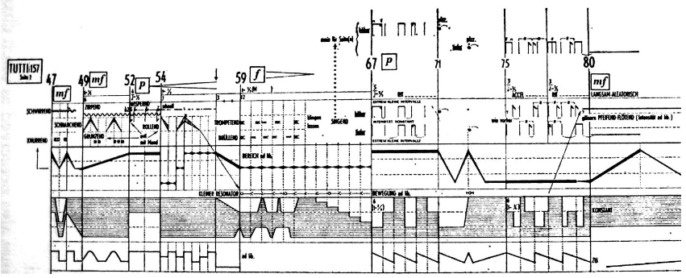
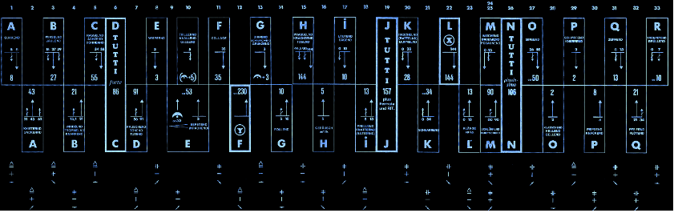
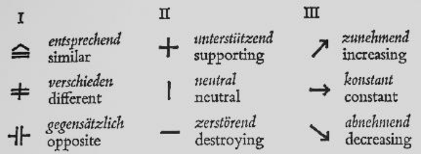

# Appunti della lezione di Lunedí 6 Luglio 2020

Lezioni di filosofia -> trascritti da Adorno

Velocità di lettura dipendente da ciò che si legge, i testi scientifici richiedono una certa lentezza.

Ordine di importanza delle lezioni sul Paradigma Stockhausen, va dalla prima all'ultima.
___________

Luigi Rognoni - Fenomenologia della musica radicale

Prima parte dei saggi molto interessante e importante, Adorno concentrato.

Nella seconda parte, Schonberg e Stravinsky, filosofia della musica moderna.

**Leggere da pagina 13 a pagina 84 di Rognongi e saggio su Schönberg e Stravinsky**

___________

Cercare di capire le risposte di Stockhausen al problema dell'indeterminazione e di quelle risorse sonore che non possono essere condotte a una rappresentazione univoca e fedele. Finchè si tratta di scrivere note e strumenti e dare i parametri, o dare un minimo e un massimo.

Non è possibile stabilire u determniato parametro preciso per la frequenza di un generatore analogico, e si da un minimo ed un massimo. Ma siamo sempre legati a quantità, se le determinaniamo in modo statistico

Schaeffer -> musica concreta non possiede un grado di astrazione tale da essere rappresentato come la musica strumentale su pentagramma, in cui non esiste un livello stabile di astrazione e di cui non possiamo fare una rappresentazione specifica con entità pre-composta, esistono i suoni sul loro darsi immediato, e la musica di Schaeffer si riduce alla sua concretezza.

(Astratto e concreto per Hegel significa il contrario di ciò che intende Schaeffer: ovvero astratto, che indica elementi della realtà considerati come oggetti, le realtà divengono dunque ab stracte; concreto è dunque nella realtà Hegeliana è realtivo al presente)

### Mikrofonie

In un brano come Mikrofonie, che risente da un lato della (giovane) cultura ma già matura, ed allargare il controllo musicale al controllo della microfonazione, il microfono diviene dunque uno strumento. Detto ai tempi di Stockhausen diviene un qualcosa da chiarire.

C'è inoltre lo strumento, ovvero un tam-tam che viene esplorato con oggetti e metodi di percussione, un po' come un sistema ricco di possibilità che viene saggiato, come con un synth nuovo si va esplorando qua e là.

Concetto di sistema sonoro, ovvero una virtualità di suoni che possiamo esplorare in mille modi ma che non riusciamo mai ad esaurire (un'opera musicale aperta è un sistema sonoro che non si lascia mai completare, immaginarsi il sistema sonoro a temperamento di Studie II, mentre la musica tonale dopo pezzi in tonalità Maggiore e minore con 12 tonalità hai finito), in Mikrofonie vi sono zoommate del suono che consente di far ascoltare il micro e diviene un sistema inesauribile, e di cui la partitura non può darci tutti gli aspetti.

(Pezzo è fatto anche di elementi spettacolari, se ho un esecutore dal vivo è una scelta di base e se ho bisogno di aggiungere un qualcosa, lo posso fare. Sono i fini dunque che determinano i mezzi. Diviene tutto dipendente dall'esigenza del momento, il problema è avere un'esigenza, deve esserci una necessità forte che mi spinge a fare certe cose.)

Verificare cosa Stockhausen cerca di imbrigliare in  una scrittura deterministica che deterministica non può essere. Inoltre c'è un problema, ovvero esiste una discrezionalità nel montaggio del pezzo, ovvero dopo la versione di Stockhausen le altre versioni vengono indirizzate.(un po' come scambi di Posseur, che è finito per essere 2 cose diverse, diviso in poietico ed estesico, per nastro).

[informazioni da articolo di stockhausenspace](http://stockhausenspace.blogspot.com/2014/05/opus-15-mikrophonie-i.html)
#### Informazioni tecniche

Brano che si basa su 2 squadre:
1. una che agisce sul tam-tam(che ha una superficie piatta), che tende avere un suono che sul corpo tende a chiudersi, mentre il gong ha un suono che tende ad aprirsi
  - un esecutore dunque al tam-tam che sollecita il sistema sonoro
  - un esecutore al microfono, che lo allontana e lo gira, con un microfono quasi sicuramente cardiode
  - escutore al filtro, filtro Maihak w49(che ha 2 potenziometri separati che permettono di controllare con un solo insieme di movimenti sia la banda che il posizionamento di un filtro) passabanda di cui si controlla frequenza centrale e ampiezza banda(che si denotano in partitura)
2. la seconda è esattamente uguale alla prima squadra

Ovviamente il controllo preciso della frequenza del filtro, non è possibile e sono indicati i gesti.

Abbiamo dunque piú un movimento che dei valori ben precisi.

Le operazioni dell'esecutore sono scritte in maniera geroglifica, con pittogrammi con gesti, indicazioni ritmiche, indicazioni tradizionali, indicazioni verbali sulla tipologia di oggetti per percuotere il tam-tam.

Stockhausen è ben consapevole che la partitura non è esaustiva, che è una partitura descrittiva di certi elementi e dunque non possiamo ricavare alcuni elementi.

#### Struttura

Coppia di squadre suona in modo antifonico.

Nel vecchio eseme di settimo anno di composizione, in cui vi era il coro diviso in 2, doppio coro a 4, che in alcune parti canta a 8.

Stockhausen nella struttura di Mikrofonie alterna i due "cori", le due squadre per cui o suona uno o l'altro; ciò viene rispettato tranne in 4 momenti indicati con la parola tutti o con sovrapposizione.

Per la maggior parte del pezzo i "cori" procedono separatamente. Ciò implica un problema tra fini e mezzi, perchè usare due squadre quando se ne puó usare solamente uno?

Le sezioni in cui Stockhausen prescrive che ci siano due cori, può giustificare la presenza dei 2 cori. Anche se in realtà i 2 cori hanno una relazione strutturale che li lega, Stockhausen ha bisogno di due squadre, poichè ha bisogno di 2 terzetti di cervelli diversi; perchè ciò che fa il gruppo due rifà ciò che fa il gruppo uno ma pensieri diversi.

Questa realzione si rifà a una micro serie di Stockhausen:

(Braxton e Jewsky realazione di improvvisazione)

##### Relazioni tra gruppo a e b

- I
  - simile
  - differente
  - opposta
- II
  - di supporto
  - neutra
  - distruttiva
- III
  - incrementa
  - resta costante
  - diminuisce

Il bello è che alcuni aspetti di queste serie siano intuitivi mentre altri bisogna andarli a cercare.

Vi è una contrapposizione drammatica nell'inquadrare tutti in modo seriale, deterministico e senza alternativa e possibilità, ma all'interno questi elementi deterministici presentano una grande differenza. Come se Stockhausen desse un ordine al bagaglio culturale degli esecutori.

Il principio costruttivo della simmetria pravale su principi di simmetria locale. E bisogna sapere scegliere e saper razionalizzare le scelte che vanno a coprire una indefinita disponibilità di suono e comportamenti che è difficile imbrigliare acusticamente e sonoricamente.

Gli elementi di _TUTTI_ che definisce Stockhausen, si ritrova il principio carnevalesco in cui alcune regole vengono sospese.

#### Le sezioni

È un errore concettuale dire che un esecutore suona uno strumento diverso, ma i 3 esecutori delle due squadre concorrono ed insistono sullo stesso sistema, due escutori trinitari.

Le 33 sezioni hanno un'icredibile collezione di parole descrittive di quello che deve essere il suono.

La _rappresentazione strutturale_ ci da delle relazioni qualitiative di cui ci sfugge il contenuto esatto)

La _partitura(intavolatura)_ è una specie di intavolatura.

<table bgcolor="#C0C0C0" border="1" cellpadding="5" cellspacing="0" style="width: 818px;"><colgroup><col style="mso-width-alt: 14299; mso-width-source: userset; width: 293pt;" width="391">
 <col style="mso-width-alt: 877; mso-width-source: userset; width: 18pt;" width="24">
 <col style="mso-width-alt: 14738; mso-width-source: userset; width: 302pt;" width="403">
 </colgroup><tbody>
<tr height="20" style="height: 15.0pt;">
  <td height="20" style="height: 15.0pt; width: 293pt;" width="391">I Quakend</td>
  <td style="text-align: center; width: 18pt;" width="24">1</td>
  <td style="width: 302pt;" width="403">I: croaking, quacking&nbsp;</td>
 </tr>
<tr height="20" style="height: 15.0pt;">
  <td height="20" style="height: 15.0pt;">II Knisternd - Gackernd</td>
  <td style="text-align: center;">2</td>
  <td>II: crisping, crinkling - cackling&nbsp;</td>
 </tr>
<tr height="20" style="height: 15.0pt;">
  <td height="20" style="height: 15.0pt;">I Winselnd - Jaulend</td>
  <td style="text-align: center;">3</td>
  <td>I: whimpering&nbsp; - wailing&nbsp;</td>
 </tr>
<tr height="20" style="height: 15.0pt;">
  <td height="20" style="height: 15.0pt;">II Wirbelnd - Trommelnd - Knarrend</td>
  <td style="text-align: center;">4</td>
  <td>II: whirling - drumming - grating&nbsp;</td>
 </tr>
<tr height="20" style="height: 15.0pt;">
  <td height="20" style="height: 15.0pt;">I Rassenlng - Aechzend - Donnernd</td>
  <td style="text-align: center;">5</td>
  <td>I: clashing, clanking - groaning, creaking - thundering&nbsp;</td>
 </tr>
<tr height="20" style="height: 15.0pt;">
  <td height="20" style="height: 15.0pt;">I+II Tutti forte</td>
  <td style="text-align: center;">6</td>
  <td>I+II: Tutti forte</td>
 </tr>
<tr height="20" style="height: 15.0pt;">
  <td height="20" style="height: 15.0pt;">II Rauschend - Toenend - Tutend /&nbsp; 
I + II
  Glaesern Singend</td>
  <td style="text-align: center;">7</td>
  <td>II: rushing, rustling -&nbsp; ringing,
  resounding - hooting&nbsp; /&nbsp; 
I + II: glassy
  singing (whining)</td>
 </tr>
<tr height="20" style="height: 15.0pt;">
  <td height="20" style="height: 15.0pt;">I Wispernd</td>
  <td style="text-align: center;">8</td>
  <td>I: whispering&nbsp;</td>
 </tr>
<tr height="20" style="height: 15.0pt;">
  <td height="20" style="height: 15.0pt;">II Berstend (Krachend)</td>
  <td style="text-align: center;">9</td>
  <td>II: bursting (crashing)</td>
 </tr>
<tr height="20" style="height: 15.0pt;">
  <td height="20" style="height: 15.0pt;">I Trillernd Knallend Gellend</td>
  <td style="text-align: center;">10</td>
  <td>I: trilling, tinkling - banging, clanging - yelling&nbsp;</td>
 </tr>
<tr height="20" style="height: 15.0pt;">
  <td height="20" style="height: 15.0pt;">I Collage</td>
  <td style="text-align: center;">11</td>
  <td>I: Collage</td>
 </tr>
<tr height="20" style="height: 15.0pt;">
  <td height="20" style="height: 15.0pt;">II Y (Ypsilon)</td>
  <td style="text-align: center;">12</td>
  <td>II: Y (Ypsilon)</td>
 </tr>
<tr height="20" style="height: 15.0pt;">
  <td height="20" style="height: 15.0pt;">I Zirpend - Schnarchend - Grunzend</td>
  <td style="text-align: center;">13</td>
  <td>I: chirping - snorting, snoring -
  grunting&nbsp;</td>
 </tr>
<tr height="20" style="height: 15.0pt;">
  <td height="20" style="height: 15.0pt;">II Rollend</td>
  <td style="text-align: center;">14</td>
  <td>II: rolling&nbsp;</td>
 </tr>
<tr height="20" style="height: 15.0pt;">
  <td height="20" style="height: 15.0pt;">I Prasselnd - Kraechzend - Tosend /&nbsp; 
I +
  II Pizzicato</td>
  <td style="text-align: center;">15</td>
  <td>I: spattering, jangling - cawing&nbsp; -
  roaring&nbsp;&nbsp; /&nbsp; 
I + II: Pizzicato</td>
 </tr>
<tr height="20" style="height: 15.0pt;">
  <td height="20" style="height: 15.0pt;">II Geraeusch ad lib.</td>
  <td style="text-align: center;">16</td>
  <td>II: noise ad lib</td>
 </tr>
<tr height="20" style="height: 15.0pt;">
  <td height="20" style="height: 15.0pt;">I Laeutend - Saegend</td>
  <td style="text-align: center;">17</td>
  <td class="xl65">I: pealing, tolling - sawing&nbsp;</td>
 </tr>
<tr height="20" style="height: 15.0pt;">
  <td height="20" style="height: 15.0pt;">II Prellend - Knatternd (Ratternd)</td>
  <td style="text-align: center;">18</td>
  <td>II: slapping, rebounding - chattering, flapping (clattering)</td>
 </tr>
<tr height="20" style="height: 15.0pt;">
  <td height="20" style="height: 15.0pt;">I + II Tutti 157</td>
  <td style="text-align: center;">19</td>
  <td>I + II: Tutti 157</td>
 </tr>
<tr height="20" style="height: 15.0pt;">
  <td height="20" style="height: 15.0pt;">I Raschelnd (Rattelnd) - Murmelnd</td>
  <td style="text-align: center;">20</td>
  <td>I: crackling (rattling) - murmuring&nbsp;</td>
 </tr>
<tr height="20" style="height: 15.0pt;">
  <td height="20" style="height: 15.0pt;">II Schnarrend</td>
  <td style="text-align: center;">21</td>
  <td>II: twanging, rasping</td>
 </tr>
<tr height="20" style="height: 15.0pt;">
  <td height="20" style="height: 15.0pt;">I X(Xi)</td>
  <td style="text-align: center;">22</td>
  <td>I: X(Xi)</td>
 </tr>
<tr height="20" style="height: 15.0pt;">
  <td height="20" style="height: 15.0pt;">II Klaenge ad lib.</td>
  <td style="text-align: center;">23</td>
  <td>II: pitched sounds ad lib</td>
 </tr>
<tr height="20" style="height: 15.0pt;">
  <td height="20" style="height: 15.0pt;">II 4 sec before the entry of moments 24,
  25</td>
  <td style="text-align: center;">24</td>
  <td>II: 4 sec before the entry of moments 24, 25</td>
 </tr>
<tr height="20" style="height: 15.0pt;">
  <td height="20" style="height: 15.0pt;">I Wischend - Brummend - Posaunend /&nbsp; 
II
  Schluerfend - Quietschend</td>
  <td style="text-align: center;">25</td>
  <td>I: wiping, swishing - growling (low buzzing) - tromboning /&nbsp; 
II: shuffling,
  slurping - squeaking, squealing</td>
 </tr>
<tr height="20" style="height: 15.0pt;">
  <td height="20" style="height: 15.0pt;">I + II Tutti pianissimo</td>
  <td style="text-align: center;">26</td>
  <td>I + II: Tutti pianissimo</td>
 </tr>
<tr height="20" style="height: 15.0pt;">
  <td height="20" style="height: 15.0pt;">I Singend (II Streichtoene)</td>
  <td style="text-align: center;">27</td>
  <td>I: singing (whining) (II: String tones)</td>
 </tr>
<tr height="20" style="height: 15.0pt;">
  <td height="20" style="height: 15.0pt;">II Klatschend - Heulend - Bellend</td>
  <td style="text-align: center;">28</td>
  <td>II: clapping - howling - baying, barking</td>
 </tr>
<tr height="20" style="height: 15.0pt;">
  <td height="20" style="height: 15.0pt;">I Schwirrend - Knurrend</td>
  <td style="text-align: center;">29</td>
  <td>I: whizzing, whirring - grumbling, snarling</td>
 </tr>
<tr height="20" style="height: 15.0pt;">
  <td height="20" style="height: 15.0pt;">II Piepsend - Knackend</td>
  <td style="text-align: center;">30</td>
  <td>II: cheeping - cracking&nbsp;</td>
 </tr>
<tr height="20" style="height: 15.0pt;">
  <td height="20" style="height: 15.0pt;">I Zupfend</td>
  <td style="text-align: center;">31</td>
  <td>I: plucking</td>
 </tr>
<tr height="20" style="height: 15.0pt;">
  <td height="20" style="height: 15.0pt;">II Pfeifend - Floetend</td>
  <td style="text-align: center;">32</td>
  <td>II: piping, whistling - fluting&nbsp;</td>
 </tr>
<tr height="20" style="height: 15.0pt;">
  <td height="20" style="height: 15.0pt;">I Trompetend - Bruellend /&nbsp; 
Silence at end
  1'11''</td>
  <td style="text-align: center;">33</td>
  <td>I: trumpeting - bellowing, bawling&nbsp;</td>
 </tr>
</tbody></table>

Questa è una partitura delle descrizioni del suono, come se la partitura strutturale e l'intavolatura non dicono, descrivendo qual'è il contenuto acustico che deve uscire, con verbi e avverbi come se fosse un gioco di carte, in cui mettiamo in ogni carta una descrizione del suono che esca.
Stockhausen descrive i suoni, con una partitura descrittiva dei suoni con verbi impressionistici, quasi spiritosi.

Necessità di avere un controllo totale sul suono che però non ha un esito univoco per gli esecutori.

Come se tutto ciò si fosse fermato ad un livello di interpretazione o si fa un salto che poi fa divenire tutto un qualcosa di improvvisativo, il compositore ha costruito lo scheletro che diviene totalmente improvvisativo.

La partitura verbale delle 33 sezioni è il risultato a posteriori. A noi interessa quale tipo di problema sollecita la scrittura di parole che indichino qualità sonore.

I filtri inoltre non reagiscono allo stesso modo.
______________

Opera prima di Lina Wertmüller ovvero _I basilischi_, con tema principale di Ennio Morricone, cantato in dialetto Minervinese (il film si svolge a Minervina Murge)

Ciò che intorno nella città ti manda segnali differenti rispetto al paese.

Il GINT non ebbe nulla a che fare con l'elettronica.

Morricone ebbe un Synket che era pensato per la sonorizzazione filmica e televisiva. Esso era uno strumento fatto da un uomo di cinema per il cinema.
Avere un Synket va definito piú come l'essere un uomo di cinema.

Unica presenza elettronica nel GINT fu l'intervento di Jewsky documentato nei dischi.

### Ascolti

#### Mikrofonie II

Brano poco noto e meno eclatante la risultante acustica di combinazione dei mezzi microfono-tamtam-filtro, in essa vi sono coro-organo hammond.

**Ascolto di Mikrofonie II**

##### Organico
- organo hammond
- soprano 1
- soprano 2
- basso 1
- basso 2
- 4 modulatori ad anello

L'idea di Stockhausen era quella di fare con le voci ciò che era stato fatto con il tam-tam, surrogando la distorsione prodotta da un certo uso dei microfoni prodotta dalla modulazione ad anello.

Cosa succede con la varietà della voce e la varietà della distorsione con modulatore ad anello, è proprio la RM che ha un  qualcosa di sovraimposto che la microfonazione non ha. La modulazione ad anaello rende tutto piú pesante, fisso e meno agile.

Si sento delle voci bianche in cui si riconoscono: Momente, Gesang e Carèe. Questa è una forma di metamusica, in cui inserisce delle sorta di flashback.
C'è anche in azione quel modello e la metafora del _continuum_ che è attivo in Stockhausen. Il principio della _relatività progressiva_ si integra totalmente con il pensiero di Stockhausen, che a livello parziale diviene ad essere parte di un sistema.

Mikrofonie II ha stesso numero di sezioni di Mikrofonie I, come se ci fosse una stessa struttura portante con impianto basato su 33 sezioni.

[articolo di stockhausenspace su Mikrofonie II](http://stockhausenspace.blogspot.com/2014/05/opus-17-mikrophonie-ii.html)

In esso abbiamo le 33 sezioni con le indicazioni delle sezioni di brani riportate, con indicazioni molte etorogenee.

Ruolo del microfono viene simulato dalla RM.

<table bgcolor="#2E8B57" border="1" cellpadding="7" cellspacing="0" style="margin-left: auto; margin-right: auto; text-align: left; width: 611px;"><colgroup><col style="mso-width-alt: 1133; mso-width-source: userset; width: 23pt;" width="31">
 <col style="mso-width-alt: 14884; mso-width-source: userset; width: 305pt;" width="407">
 <col style="mso-width-alt: 6326; mso-width-source: userset; width: 130pt;" width="173">
 </colgroup><tbody>
<tr height="20" style="height: 15.0pt;">
  <td class="xl63" height="20" style="height: 15pt; text-align: center; width: 23pt;" width="31"><b>Moment</b></td>
  <td class="xl64" style="width: 305pt;" width="407"><b>Voice Attitudes</b></td>
  <td class="xl66" style="width: 130pt;" width="173"><b>Time Windows</b></td>
 </tr>
<tr height="20" style="height: 15.0pt;">
  <td class="xl63" height="20" style="height: 15pt; text-align: center;">1</td>
  <td class="xl64" style="width: 305pt;" width="407">Soprano 1 &amp; 2: high solemn Levite chant  
Bass 1 &amp; 2: deep voiced speech </td>
  <td class="xl65" style="width: 130pt;" width="173"> </td>
 </tr>
<tr height="20" style="height: 15pt;">
  <td class="xl63" height="20" style="height: 15pt; text-align: center;">2</td>
  <td class="xl64" style="width: 305pt;" width="407">S+B: normal speech rhythm whispered</td>
  <td class="xl65" style="width: 130pt;" width="173"><i>GESANG DER JÜNGLINGE</i></td>
 </tr>
<tr height="60" style="height: 45pt;">
  <td class="xl63" height="60" style="height: 45pt; text-align: center;">3</td>
  <td class="xl64" style="width: 305pt;" width="407">S: Levite chant becomes sexy,
  seductive  
S: Like a baby to baroque invention to hoarse 
B: drunken, belching&nbsp; 
B: cool jazz/string bass to snobbish</td>
  <td class="xl65" style="width: 130pt;" width="173"><i> </i></td>
 </tr>
<tr height="20" style="height: 15pt;">
  <td class="xl63" height="20" style="height: 15pt; text-align: center;">4</td>
  <td class="xl64" style="width: 305pt;" width="407">S: old enraged crone 
B: abusive to
  exhausted&nbsp; 
B: Sicilian street hawker</td>
  <td class="xl65" style="width: 130pt;" width="173"><i> </i></td>
 </tr>
<tr height="20" style="height: 15pt;">
  <td class="xl63" height="20" style="height: 15pt; text-align: center;">5</td>
  <td class="xl64" style="width: 305pt;" width="407">S+B: whispered, vocal click</td>
  <td class="xl65" style="width: 130pt;" width="173"><i>CARRÉ</i></td>
 </tr>
<tr height="20" style="height: 15pt;">
  <td class="xl63" height="20" style="height: 15pt; text-align: center;">6</td>
  <td class="xl64" style="width: 305pt;" width="407">S: stammering 
B: resigned</td>
  <td class="xl65" style="width: 130pt;" width="173"><i> </i></td>
 </tr>
<tr height="20" style="height: 15pt;">
  <td class="xl63" height="20" style="height: 15pt; text-align: center;">7</td>
  <td class="xl64" style="width: 305pt;" width="407">S: normal speech 
B: irregular military commands</td>
  <td class="xl65" style="width: 130pt;" width="173"><i> </i></td>
 </tr>
<tr height="20" style="height: 15pt;">
  <td class="xl63" height="20" style="height: 15pt; text-align: center;">8</td>
  <td class="xl64" style="width: 305pt;" width="407">S+B: whispered short syllables</td>
  <td class="xl65" style="width: 130pt;" width="173"><i>MOMENTE</i></td>
 </tr>
<tr height="20" style="height: 15pt;">
  <td class="xl63" height="20" style="height: 15pt; text-align: center;">9</td>
  <td class="xl64" style="width: 305pt;" width="407">B: sleepy, yawning&nbsp;&nbsp;  
B: nasal police
  officer</td>
  <td class="xl65" style="width: 130pt;" width="173"><i> </i></td>
 </tr>
<tr height="20" style="height: 15pt;">
  <td class="xl63" height="20" style="height: 15pt; text-align: center;">10</td>
  <td class="xl64" style="width: 305pt;" width="407">S: anxious / short chords 
B: whistling</td>
  <td class="xl65" style="width: 130pt;" width="173"><i> </i></td>
 </tr>
<tr height="20" style="height: 15pt;">
  <td class="xl63" height="20" style="height: 15pt; text-align: center;">11</td>
  <td class="xl64" style="width: 305pt;" width="407">S+B: whisper</td>
  <td class="xl65" style="width: 130pt;" width="173"><i>GESANG DER JÜNGLINGE</i></td>
 </tr>
<tr height="20" style="height: 15pt;">
  <td class="xl63" height="20" style="height: 15pt; text-align: center;">12</td>
  <td class="xl64" style="width: 305pt;" width="407">S: weeping&nbsp;  
S: deep voice speech 
B: clicks </td>
  <td class="xl65" style="width: 130pt;" width="173"><i> </i></td>
 </tr>
<tr height="20" style="height: 15pt;">
  <td class="xl63" height="20" style="height: 15pt; text-align: center;">13</td>
  <td class="xl64" style="width: 305pt;" width="407">S: laughing, hum 
B: operatic to
  suddenly cold</td>
  <td class="xl65" style="width: 130pt;" width="173"><i> </i></td>
 </tr>
<tr height="20" style="height: 15pt;">
  <td class="xl63" height="20" style="height: 15pt; text-align: center;">14</td>
  <td class="xl64" style="width: 305pt;" width="407">S: exhausted (gasping) 
B: calm as a judge</td>
  <td class="xl65" style="width: 130pt;" width="173"><i> </i></td>
 </tr>
<tr height="20" style="height: 15pt;">
  <td class="xl63" height="20" style="height: 15pt; text-align: center;">15</td>
  <td class="xl64" style="width: 305pt;" width="407">S: yelling to slightly
  tipsy 
B: fast baroque</td>
  <td class="xl65" style="width: 130pt;" width="173"><i> </i></td>
 </tr>
<tr height="20" style="height: 15pt;">
  <td class="xl63" height="20" style="height: 15pt; text-align: center;">16</td>
  <td class="xl64" style="width: 305pt;" width="407">S: single chords&nbsp;&nbsp;  
S: birdlike, headtone 
B: jazzy slow swing in
  falsetto / whistle</td>
  <td class="xl65" style="width: 130pt;" width="173"><i> </i></td>
 </tr>
<tr height="20" style="height: 15pt;">
  <td class="xl63" height="20" style="height: 15pt; text-align: center;">17</td>
  <td class="xl64" style="width: 305pt;" width="407">S+B: whisper</td>
  <td class="xl65" style="width: 130pt;" width="173"><i>CARRÉ</i></td>
 </tr>
<tr height="20" style="height: 15pt;">
  <td class="xl63" height="20" style="height: 15pt; text-align: center;">18</td>
  <td class="xl64" style="width: 305pt;" width="407">S: solemn Levite
  chant&nbsp;&nbsp;  
S: stammering 
B: menacing to frightened</td>
  <td class="xl65" style="width: 130pt;" width="173"><i> </i></td>
 </tr>
<tr height="20" style="height: 15pt;">
  <td class="xl63" height="20" style="height: 15pt; text-align: center;">19</td>
  <td class="xl64" style="width: 305pt;" width="407">S+B: whispered</td>
  <td class="xl65" style="width: 130pt;" width="173"><i>MOMENTE</i></td>
 </tr>
<tr height="40" style="height: 30pt;">
  <td class="xl63" height="40" style="height: 30pt; text-align: center;">20</td>
  <td class="xl64" style="width: 305pt;" width="407">S+B: chord to whisper</td>
  <td class="xl65" style="width: 130pt;" width="173"><i>CARRÉ</i><i> and</i> 
<i>GESANG DER JÜNGLINGE</i></td>
 </tr>
<tr height="40" style="height: 30pt;">
  <td class="xl63" height="40" style="height: 30pt; text-align: center;">21</td>
  <td class="xl64" style="width: 305pt;" width="407">S: witch-like 
B: lightly
  swinging&nbsp;&nbsp;  
B: German crooner</td>
  <td class="xl65" style="width: 130pt;" width="173"><i>CARRÉ</i><i> and</i> 
<i>GESANG DER JÜNGLINGE</i></td>
 </tr>
<tr height="40" style="height: 30pt;">
  <td class="xl63" height="40" style="height: 30pt; text-align: center;">22</td>
  <td class="xl64" style="width: 305pt;" width="407">S: dreamily, rocking a
  baby&nbsp;  
S: demonic </td>
  <td class="xl65" style="width: 130pt;" width="173"><i>CARRÉ and</i> 
<i>GESANG DER JÜNGLINGE</i></td>
 </tr>
<tr height="20" style="height: 15pt;">
  <td class="xl63" height="20" style="height: 15pt; text-align: center;">23</td>
  <td class="xl64" style="width: 305pt;" width="407">S: giggle&nbsp; 
S: fearful 
B: whistle&nbsp; 
B: hoarse
  call</td>
  <td class="xl65" style="width: 130pt;" width="173"><i> </i></td>
 </tr>
<tr height="20" style="height: 15pt;">
  <td class="xl63" height="20" style="height: 15pt; text-align: center;">24</td>
  <td class="xl64" style="width: 305pt;" width="407">S: chanting, becoming vamping at the mirror 
B: typewriter
  clattering</td>
  <td class="xl65" style="width: 130pt;" width="173"><i> </i></td>
 </tr>
<tr height="20" style="height: 15pt;">
  <td class="xl63" height="20" style="height: 15pt; text-align: center;">25</td>
  <td class="xl64" style="width: 305pt;" width="407">S: vamp at the mirror 
B: "Louis
  Armstrong"  
B: typewriter clattering</td>
  <td class="xl65" style="width: 130pt;" width="173"><i> </i></td>
 </tr>
<tr height="20" style="height: 15pt;">
  <td class="xl63" height="20" style="height: 15pt; text-align: center;">26</td>
  <td class="xl64" style="width: 305pt;" width="407">S: "whirring" 
B: natural speech&nbsp;  
B: absently</td>
  <td class="xl65" style="width: 130pt;" width="173"><i> </i></td>
 </tr>
<tr height="20" style="height: 15pt;">
  <td class="xl63" height="20" style="height: 15pt; text-align: center;">27</td>
  <td class="xl64" style="width: 305pt;" width="407">S: quiet whistle 
B: soft cursing&nbsp;  
B: Don Cossack
  Choir</td>
  <td class="xl65" style="width: 130pt;" width="173"><i> </i></td>
 </tr>
<tr height="20" style="height: 15pt;">
  <td class="xl63" height="20" style="height: 15pt; text-align: center;">28</td>
  <td class="xl64" style="width: 305pt;" width="407">S: asking uncertainly 
B: calling out  
B: Don Cossack
  Choir</td>
  <td class="xl65" style="width: 130pt;" width="173"><i> </i></td>
 </tr>
<tr height="40" style="height: 30pt;">
  <td class="xl63" height="40" style="height: 30pt; text-align: center;">29</td>
  <td class="xl64" style="width: 305pt;" width="407">S: slow staccato chords ala
  coloratura soprano  
S: boisterously cheerful 
B: bebop jazz&nbsp;  
B: organ sounds</td>
  <td class="xl65" style="width: 130pt;" width="173"><i> </i></td>
 </tr>
<tr height="20" style="height: 15pt;">
  <td class="xl63" height="20" style="height: 15pt; text-align: center;">30</td>
  <td class="xl64" style="width: 305pt;" width="407">S: deep voiced
  speech 
B: falsetto  
B: whistle</td>
  <td class="xl65" style="width: 130pt;" width="173"><i> </i></td>
 </tr>
<tr height="40" style="height: 30pt;">
  <td class="xl63" height="40" style="height: 30pt; text-align: center;">31</td>
  <td class="xl64" style="width: 305pt;" width="407">S: cheerful shouts to unhappy
  memories&nbsp; 
S: suggestively, giggling 
B: chant</td>
  <td class="xl65" style="width: 130pt;" width="173"><i> </i></td>
 </tr>
<tr height="20" style="height: 15pt;">
  <td class="xl63" height="20" style="height: 15pt; text-align: center;">32</td>
  <td class="xl64" style="width: 305pt;" width="407">S+B: whisper</td>
  <td class="xl65" style="width: 130pt;" width="173"><i>MOMENTE</i></td>
 </tr>
<tr height="20" style="height: 15.0pt;">
  <td class="xl63" height="20" style="height: 15pt; text-align: center;">33</td>
  <td class="xl64" style="width: 305pt;" width="407">S: headtone staccato chords 
B: fast speech</td>
  <td class="xl65" style="width: 130pt;" width="173"> </td>
 </tr>
</tbody></table>

Queste descrizioni richiamano sempre l'idea che questo materiale possa far realizzare altro.

Cosa lega i 2 brani?

- la struttura a 33 sezioni
- presenza di materiale prescrittivo
- idea che ci sia una distorsione (I microfono, II RM)

Di specifico in Mikrofonie II autonomia per descrivere aspetti qualitativi delle voci e soprattuto la dimensione autobiografica e metamusicale che realizza una forma particolare di realtività progressiva, presenza di 3 composizioni, che sono tutti Momenti.

______
Prossima lezione alle 11-14
