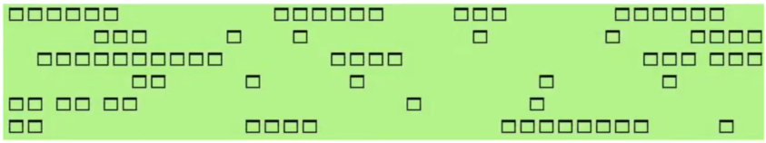
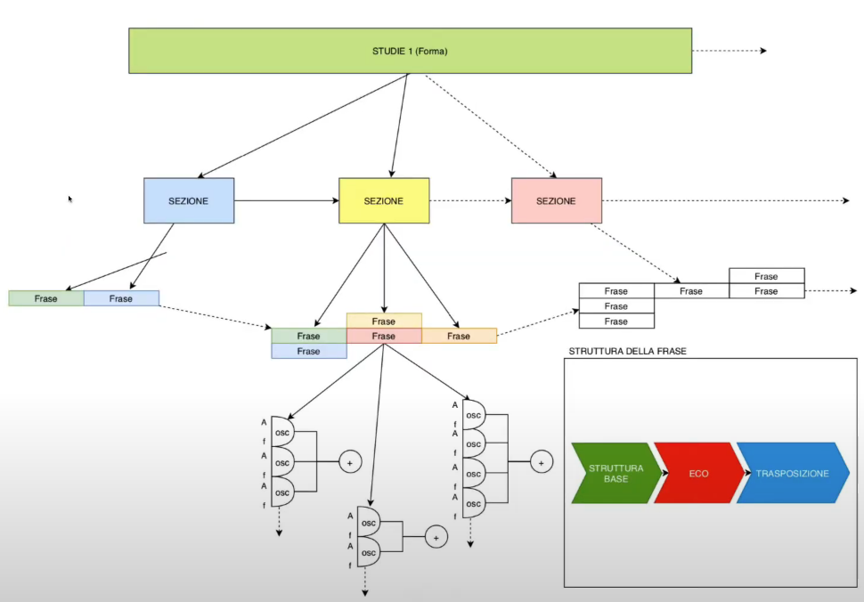
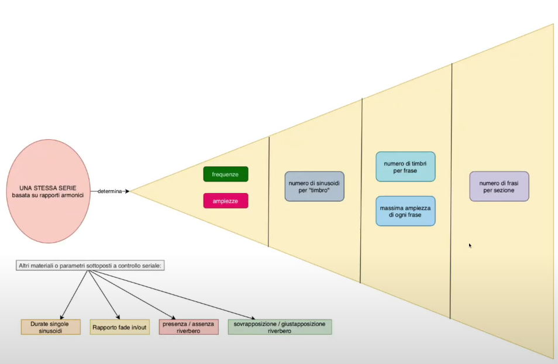
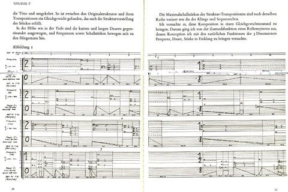
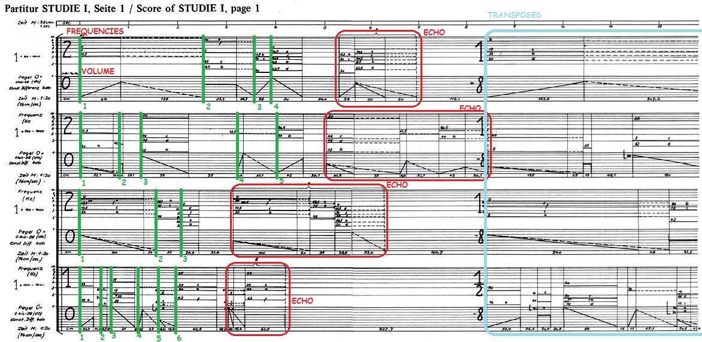
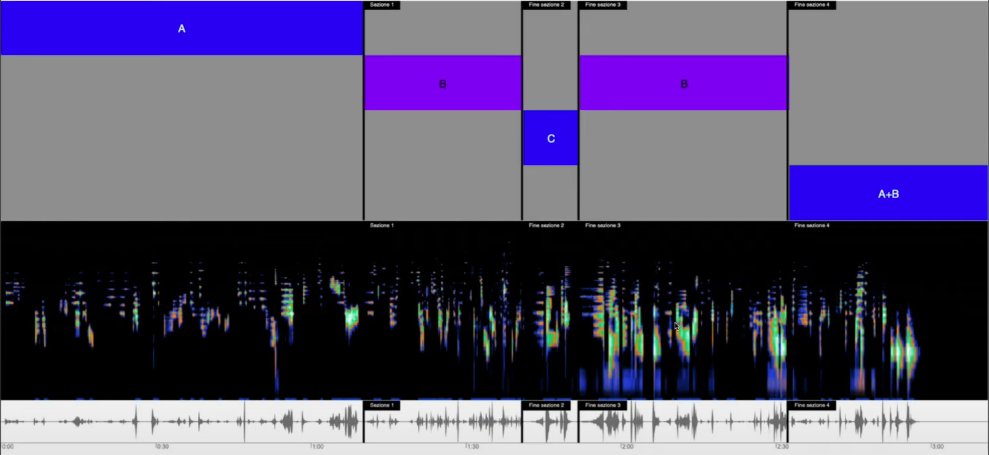
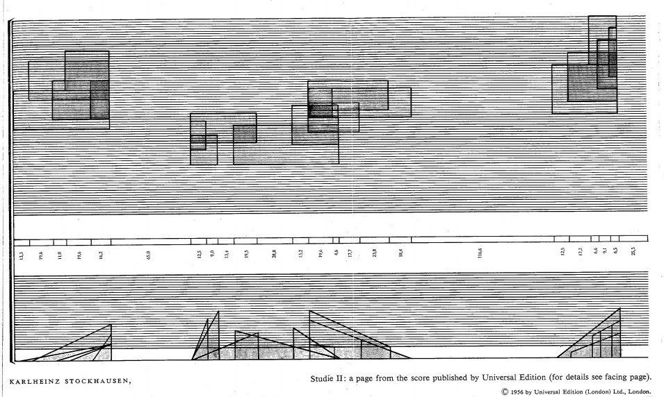

# Stockhausen: Etude, Studie I, Studie II

[Link alla lezione](https://www.youtube.com/watch?v=440Lt6hqPwc&feature=emb_logo)

Lezione tecnica su tre composizioni elettroacustiche che rappresentano l'apprendistato elettronico di Stockhausen.

3 studi:
- Etude del 1952
- Studie I
- Studie II del 1954

### Etude (1952)

Composizione dal titolo francese poichè fu realizzata presso gli studi del GRMC di Parigi(attuale INA/GRM), sotto Pierre Schaeffer che non mostrò mai particolare interesse con il lavoro di Stockhausen, il quale non si trovava a proprio agio con la tecnica del collage, in quel momento Stockhausen era a Parigi per studiare con Messiaen, ma poichè vi era l'unica possibilità di confrontarsi con la musica elettronica.

Brano abbastanza semplice ha una polifonia a 6 strati, basati su un materiale di base di 6 registrazioni, 6 campioni, di corde di pianoforte percosse. Registrazioni poste a modifiche di vario genere attraverso, il Fonogeno Cromatico(quello con la tastiera), e si ricavano frammenti di varia lunghezza collocati su un nastro guida, ed il pezzo è una sovrapposizioni di nastri guida, immagine simile alla seguente.

Immagine realizzata per una pagina del sito [stockhausenspace](https://stockhausenspace.blogspot.com/), sito ricco di informazioni su Stockhausen. I criteri che presiedono l'organizzazione del materiale sono criteri seriali. Ricordiamoci che quando si parla di serialità, di organizzazione seriale, matrice seriale procedimenti, non ci si riferisce soltanto ad una serie numerica che raggruppa i materiali. Non ci si riferisce soltanto al fatto che esiste una serie numerica che raggruppa i materiali, quanto al fatto ad un livello inferiore piú generale del materiale, c'è un'idea che questi materiali possano essere disposti in una scala neutra. Cosí come in una serie dodecafonica, il presupposto irrinunciabile è che esista una scala cromatica, in cui i 12 gradi della scala sono organizzati in maniera sequenziale, cosí il pensiero seriale ha il bisogno di organizzare i materiali, in serie, ma queste serie devono corrispondere a disponibilità di materiali disposti in una sequenza neutra, come i 12 gradi della scala cromatica.
Matrice seriale e pensiero seriale implicano una forma di organizzazione scalare che sottende l'organizzazione seriale propriamente detta.

### Studie I (1954)

Realizzato da Stockhausen due anni dopo Etude, esso è schematizzato nella figura sottostante.

In Studie I, Stockhausen cerca di trasferire il pensiero seriale nel dominio della sintesi additiva. Il problema vero, come diceva Schoënberg "è la scelta", quando si ha che fare con una scrittura fatta di sinusoidi, il problema sono le frequenze. Quale criterio scegliere per organizzare le frequenze? Si presenta il problema dell'applicazione del pensiero seriale descritto precedentemente. Il problema dunque non è serializzare, poichè la serie è una sequenza di indici, ma questi indici a che cosa puntano? Puntatori a quale locazione di ipotetica scala? A quale materiale organizzato?

Nel caso di Studie I ogni mistura di suoni sinusoidali, fa riferimento a una serie in rapporto armonico, e la struttura del pezzo è gerarchizzata, anche se il fatto di avere misture molto diverse per numero di sinusoidi impegnate, e materiali di base molto diversi che cambiano da frase a frase, sezione a sezione, l'effetto risulta dunque molto piú caotico rispetto a Studie II.

#### Organizzazione di Studie I

Organizzato a livello generale, in una sequenza di **sezioni**, organizzate a loro volta in **frasi**, collocate a loro volta in un rapporto di simultaneità (polifonia o sovrapposizione), o giustapposizione(collocate in un rapporto di consequenzialità temporale).

Ciascuna frase è costituita da un certo numero di suoni o misture di base, realizzate da un certo numero di oscillatori. La frase è a sua volta strutturata (per un'esigenza di sviluppo e per creare una correlazione strutturale tra le varie sezioni, che sia solamente la giustapposizione di elementi) in questo modo:
- Struttura di Base
- Ripetizione in eco, riverberato con un processo di illusione/allontamento spaziale
- Tutta la sequenza viene trasposta

In questo brano, la stessa serie, determina una serie di elementi gerarchizzati ed ordinati l'uno sull'altro:
- dal dettaglio, _le frequenze e ampiezze oscillatori_
- a un livello piú superiore ed astratto, _il numero di sinusoidi per ciascuna mistura_
- a un livello ancora superiore, in cui la stessa serie organizza il _numero dei timbri che compaiono in ogni frase_ e _l'ampiezza massima che deve raggiungere ogni frase_
- la stessa serie presiede all'organizzazione del _numero massimo di frasi per sezione_ del brano

Questo aspetto appena approfondito ci fa intendere ancora meglio, come la serie in se sia una sequenza di indici in se astratti, che hanno bisogno di un materiale pre-ordinato, posto in forma di scala, a quei questi indici possano essere associati, per la scelta di un elemento piuttosto che un altro all'interno di una scala. Mentre la sequenza seriale applicata alle frequenze ci è nota, poichè la relazione fra frequenze e note è famigliare, poichè la differenza è minima; applicarsi a cose che non hanno niente a che fare con le note (ad esempio il numero di timbri per ogni fra o il numero di frasi per sezione, o maggiore e minore densità dei timbri), ci fa capire che **la serialità è un principio astratto**, una specie di DNA, principio ordinatore, che non ha assolutamente alcun residuo tematico(come alcune opere di Schönberg o Berg). L'ambito di applicazione della serialità dipende dalla scala sottesa, che nel caso della dodecafonica sono le 12 altezze ordinate, ma per Stockhausen sono scale di elementi eterogeni, che a volte sono _scale qualitative_.
In Studio I ci sono altri parametri che sono sottoposti a controllo seriale:
- durute singole sinusoidi
- rapporto tra fade in e fade out (rapporto di durata) -> misture pensate con principio di attacco e rilascio che hanno delle durate variabili
- principio duale di presenza/ assenzad del riverbero -> elemento puramente qualitativo e non quantitativo
- principio secondo cui determniate frasi vengono sovrapposte o giustapposte -> definito ancora da un criterio seriale -> si tratta anche in questo caso di una definizione qualitativa

Dunque da questo capiamo meglio la matrice seriale che sta alla base del lavoro di Stockhausen.

Prima pagina della partitura Studie I di Stockhausen

In essa capiamo come Studie I sia strutturato il brano.
In quelli che possono essere considerati i righi abbiamo sopra la disposizione delle frequenze e sotto gli inviluppi,

In questa rappresentazione presa da [stockhausenspace](https://stockhausenspace.blogspot.com/), si capisce che ognuna delle sezioni puó essere organizzata con diverse frasi.

Nell'immagine vediamo come ci siano 4 frasi, la durata di tutta la sezione è determinata dalle durate complessive della frase in se e della sua duplicazione in eco(riquadrata in *rosso*), le singole misture(determinate dalle linee *verde*).

Nella frase iniziale abbiamo dunque 4 misture per la frase superiore, 5 misture per la seconda, 3 per la terza e 6 per la quarta. Si denota un criterio dunque di organizzazione per cui abbiamo una maggiore densità nel tempo(frase piú corta), con piú misture nella quarta, mentre la frase con sole 3 misture ad esempio è piú lunga. Quindi l'organizzazione seriale serve a distribuire in maniera soddisfacente i parametri. Osserviamo come sono distribuite le frequenze (le lettere dell'alfabeto sono delle note di riferimento), mentre le line sotto sono riferite ad una scala in dB, mentre il _64_ sotto si riferisce ai cm del nastro. Dunque possiamo dire che se 64 cm sono circa un secondo, siamo in un dominio di un magnetofono(forse Telfeunken T8) che è in un dominio di circa 76 cm al secondo. La sezione cerchiata in *azzurro*. rappresenta una struttura trasposta, in cui c'è un rapporto costante di trasposizione. Il rapporto di trasposizione non è identico per le 4 frasi che sono sovrapposte, ma è variabile come si vede dalla frazione. Indicazione _-8_ si riferisce alla scala in dB.

### Studie II (1954)
Quella sottostante è una rappresentazione della forma generale di Studie II, che vediamo avere una forma piú semplice.

Studie II è un brano di 3 minuti e 10 secondi circa, come l'Etude, mentre lo Studie I dura molto di piú. Poichè l'organizzazione seriale dello Studie I è molto piú complessa, piú _"cervellotica"_. In Studie II c'è una notevole semplificazione. In particolare la Sezione _"A"_, si caratterizza per un rapporto piú sintagmatico fra le frasi(agllomerati o misture), come se i criteri che in Studie I erano serializzati(con giustapposizioni e sovrapposizioni anche multiple, anche compresenti in stessa sezione), Stockhausen si preoccupa più di una maggiore leggibilità.
##### A
Abbiamo dunque la lunga sezione _"A"_ che dura circa un minuto, in cui abbiamo misture prevalentemente giustapposte.

##### B
In questa sezione abbiamo prevalentemente una polifonia, che ritroviamo nella quarta sezione(quando viene riproposta _"B"_ la seconda volta)
##### C
In questa sezione abbiamo una presenza notevole di silenzi, con misture isolate.
##### A+B
È una sezione riassuntiva di tutto il processo, che presenta sia strutture sovrapposte che giustapposte.

Cosa è interessante di tutto ció?

Quello che in Studie I era un principio organizzativo onnipresente, per il quale in qualsiasi momento della partitura momenti di giustapposizione e sovrapposizione, diventa in Studie II un principio organizzatore della forma.
Tutto ció in vista di una notevole semplificazione.

Pagina della partitura di Studie II, e dobbiamo riflettere su che cosa abbiamo semplificato.

**Esempio della prospettiva rinascimentale**

_Sistema di organizzazione dello spazio come spazio unificato.
Nello spazio prospettico unificato rispetto all'occhio dell'osservatore, ogni cosa ha una sua dimensione ben precisa che dipende dalla distanza che si vuole rendere all'occhio rispetto all'oggetto osservato. Questo spazio è implacabile, nel senso che se una cosa è piú lontana, viene raffigurata piú piccola(senza motivazioni teologiche o filologiche). Poichè la scatola spaziale che è centrata sull'occhio dell'osservatore, disponendo tutte le linee paralelle su una linea di fuga, un percorso che va verso il punto di fuga è uno spazio unificato. Questo spazio è pre-esistente alle cose che vi vengono collocate all'interno. Nella tradizione dell'arte antica, ed in molte raffigurazioni simboliche, è il significato della figura che ne determina la posizione spaziale e le dimensioni. Mentre nella pittura piú antica, lo spazio era come la somma degli spazi individuati delle singole figure; mentre lo spazio vuoto era un elemento residuale. Nella prospettiva rinascimentale lo spazio vuoto è normativo, era uno spazio pre-esistente che fa soggiacere tutti gli elementi della raffigurazione alle sue leggi particolari_

Stockhausen nel caso di Studie II effettua un'operazione simile a quella prospettica, perchè comprende che creare uno spazio di frequenze per ogni mistura, sezione o frase, diventa un po' come una prospettiva polverizzata in tante prospettive diverse. Dunque si organizza preventivamente quello spazio di frequenze soggiacente, cioè lo spazio scalare implicito al pensiero seriale, se lo organizza con il procedimento del temperamento con rapporto 5:1 come se fosse il rapporto 2:1 dell'ottava normale e considera la 	\sqrt[25]{5} (ovvero 1.06649494220837), come il rapporto che ci permette di incrementare i valori della frequenza per moltiplicazioni successive. Il rapporto 5:1 delle sequenze viene diviso in tanti gradi discreti pari a un valore della frequenza moltiplicato per questo fattore \sqrt[25]{5}.
Ciò significa che la scelta delle frequenze non è piú un tormento legato alla singola mistura, anche se in Studie II c'è la soluzione delle sequenze armoniche, ma qui abbiamo la creazione di un sistema sonoro, astratto e pre-esistente che sceglier preliminarmente un insieme finito di sequenze per scegliere i materiali delle singole misture. Dopodichè all'interno di questo spazio di frequenze le misture possono essere concepite come _rettangoli_, mentre gli inviluppi sono concepiti come _triangoli_, che esprimo degli attacchi o dei rilasci.

### I tre studi a confronto

 Caratteristiche|Etude|Studie I|Studie II|
--|-----|--------|---------|
Anno|1952|1953-1954|1954|
Durata| 3'35"| 9'31"|3'10"|
Materiale|Concreto|Di sintesi|Di sintesi|
Organizzazione|Seriale|Seriale|Seriale|
Sistema delle frequenze|-|Serializzato|Unificato|
Timbrica|Omogenea|Eterogenea|Omogenea|
Disposizione del materiale|Stratificata|Stratificata variabile|Unità timbriche|

Riassumendo possiamo dire che esiste un percorso evolutivo che porta dall'Etude del 1952 allo Studie II del 1954, che è ad esempio la **durata** che in Studie I è triplicata(rispetto all'Etude) per poter dire tutto ciò che c'è da dire con quel materiale, considerando l'introduzione della ridondanza artificiale come quella della ripetizione in eco e trasposizione.
E poi identifichiamo un ritorno con la semplificazione dello spazio delle frequenze e con il pre allestimento di un sistema sonoro ad una durata più contenuta (con Studie II).

Il **materiale** è concreto nell'Etude per ragioni contestuali, mentre è di sintesi negli Studie.

L'**organizzazione** è seriale in tutti i casi.

**Sistema delle frequenze** è serializzato ma basato su frequenze armoniche nel caso di Studie I, mentre è unificato in Studie II.

La **timbrica** risulta abbastanza omogenea nell'Etude, risulta molto eterogenea nello Studie I e torna ad essere molto omogenea in Studie II.

La **disposizione del materiale** è stratificata nell'Etude, stratificata ma in modo variabile per lo Studie I mentre è organizzata in _unità timbriche_ in Studie II, che sono come delle vere e proprie note.

Quella di Studie II è una vera e propria _individuazione_ (come avrebbero detto Adorno e Rognoni), perchè semplifica notevolemente il problema della scelta. E consente di scrivere una partitura, che è una rappresentazione quasi perfetta, che rasenta quella rappresentabilità della musica tradizionale che ci è data dalla partitura.

La nostra esperienza di misture infatti non è tale da poterci far intendere come suoni una pagina della partitura di Studie II, ma sicuramente non ci sono scarti; capacità di rendere in modo univoco in una rappresentazione della musica, che è una capacità che vediamo nascere da quello che chiamiamo un _pre-giudizio Gadameriano_, ovvero che la **musica** per avere una sua validazione, validità e certificazione, **deve avere un suo corrispettivo testuale**, un elemento che faccia da testo, elemento che potrebbe essere usato per riprodurre Studie II con altri mezzi.

C'è un però, poichè dato che Studie II è un brano per nastro magnetico, viene congelato in un'esecuzione unica, e mancando il tramite dell'esecutore, la rappresentazione astratta di questa musica, anche se è perfetta, risulta immotivata, e puó risultare al massimo una partitura di lettura, perdendo il suo senso primario come partitura.

Questa partitura può essere descrittiva, prescrittiva(possiamo pensare che la partitura sia concepita prima della realizzazione su nastro), ma non è una partitura istruttiva, poichè non c'è esecuzione o istruzione da impartire, e dunque non c'è sostanziale utilità della partitura tradizionale.

C'è dunque una fibrillazione del pre-giudizio, e dunque la concezione esistente esige che ci sia una rappresentazione grafica che faccia testo.

Questa è la motivazione che porterà alla rappresentazione dettagliata di Kontakte, per i processi, per lo strumentario, per una resa del materiale musicale. Kontakte è un esempio della fibrillazione della mentalità testuale, chiaro esempio del fatto che ci debba essere un testo validante della musica. Ma nel caso di Studie II manca nell'elettronica la parte istruttiva, poichè le partiture di Kontakte e Studie II sono un lascito culturale, testimonianza di coerenza, controllo e autorialità (Stockhausen dunque esprime il fatto che abbia realizzato una cosa, dicendoci come l'ha fatta, dicendoci qual'è il suo DNA), segnando un'etica della scrittura, dove la scrittura diviene la testimonianza di un processo, di una scrittura, e di una capacità di controllare il mezzo.

In Studie II tutte le rivervberazioni sono fatte con camere di riverberazione, il che ci da un'informazione importante, che a Stockhausen gli poteva dar fastidio, e che lui cerca di risolvere questa collocazione sul piano della forma di suono riverberato e diretto, quini in presenza di spazi incongrui, mentre il fatto che tutto sia ottenuto con code riverberanti, fa si che lo spazio sonoro sia unificato come le frequenze. SI tratta di una semplificazione di una razionalizzazione che avvicina la pratica elettroacustica a quella della musica tradizionale; dunque Studie I da questo punto di vista sembra una composizione piú avanzata e meno schiava di dictat della tradizione, esso è un paradosso, poichè Studie II avviene su un piano di astrazione maggiore rispetto a Studie I e dunque la qualità della composizione in Studie II risulta sicuramente migliorata.
