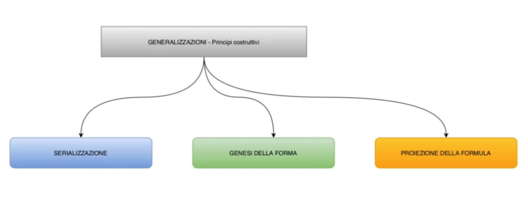
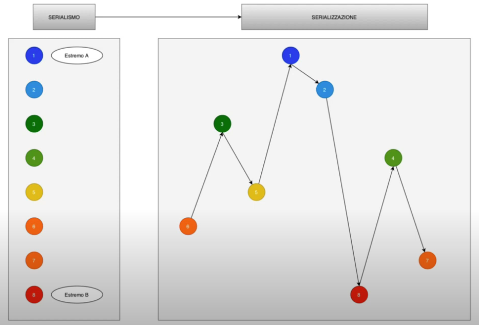
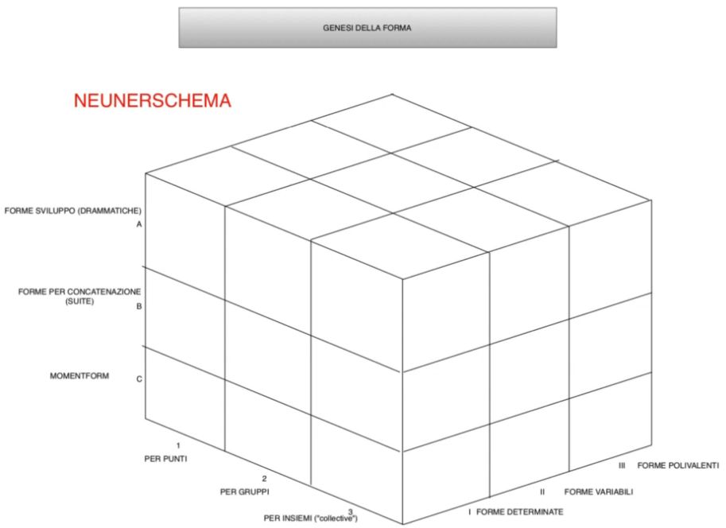
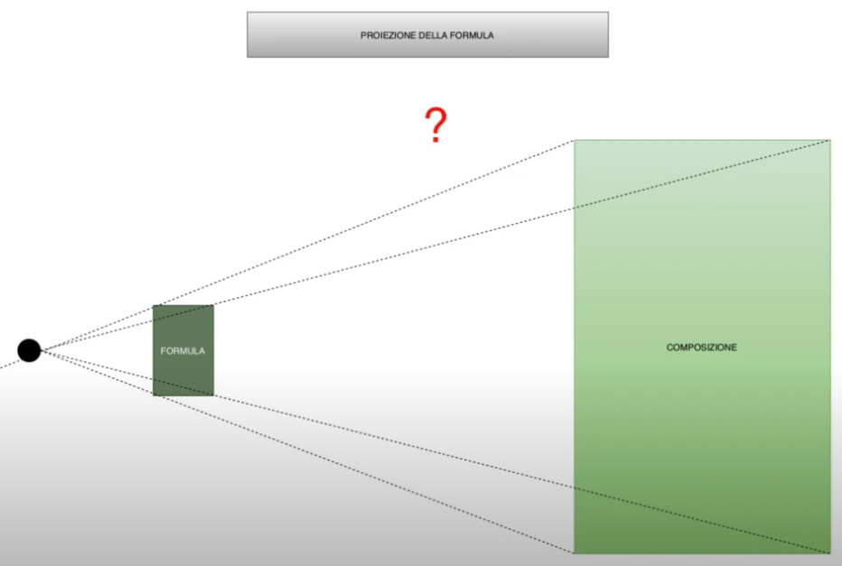
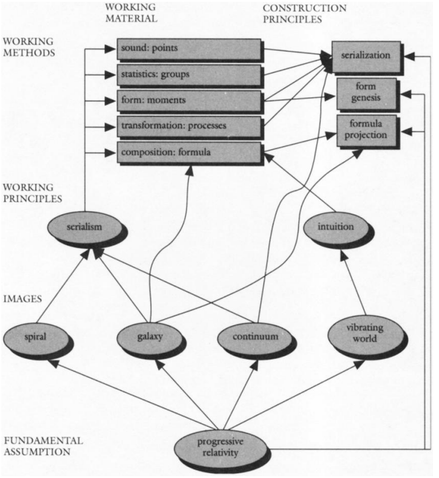

# Paradigma Stockhausen - I principi costruttivi

## Introduzione

Ultimo atto della disamina del paradigma Stockhausen.

Arriviamo alla parte delle generalizzazioni che riguarda i principi costruttivi.

Bisogna ricordare che tutto questo modo di analizzare l'opera di Stockhausen è in analogia col paradigma delle scienze ed è una proposta dle musicologo olandese Alcedo Coenen.

Tutta questa trattazione ha come fonte principale gli scritti di Stockhausen(e da ciò derivano alcuni dei problemi che questa circostanza ci porta).

## I principi costruttivi

1. serializzazione
2. genesi della forma
3. proiezione della formula

### Serializzazione

Essa è un'operazione concreta laddove il serialismo diciamo che è un principio.

Il serialismo è quel principio che mi consente di stabilire 2 estremi all'interno di un possibile parametro e di gradure tra questi due estremi una gamma.

La serializzazione è invece quel processo di distribuzione dei gradi di questa gamma, che possono essere i parametri piú strani come ad esempio: comprensibilità del testo, a molti altri.

_In questa immagine possiamo vedere quale sia la differenza concreta tra serialismo e serializzazione._

La serializzazione è la disposizione di questo materiale graduato in un enunciato, ed essa è una possibile disposizione di questi gradi. Ovviamente la serializzazione è un processo di simulazione(in un certo senso) dei gradi intermedi che sussistono tra la totale prevedibilità ed il totale ordine(per Stockhausen periodicitá) ed il totale disordine statistico.
________
## Genesi della forma

Questo è l'aspetto piú problematico dei principi costruttivi di Stockhausen.

Il cubo rappresentato ci aiuta a capire cosa sia il **neunerschema** ovvero uno schema a 3x3x3 dimensioni che ci permette di combinare ognuno degli elementi all'interno di questi 3 sottogruppi con ciascuno degli altri, ed all'interno di queste tre terne possiamo definire quello che è lo schema specifico di ogni composizione che per Stockhausen deve avere una sua struttura unica.

La struttura unica da sostanza a quel carattere della musica di Stockhausen per cui ogni pezzo è un'idea compositiva completamente nuova, sia pure collocata in una regione dell'opera di Stockhausen caratterizzata da un procedimento di massima che è lo stesso. Ad esempio i pezzi scritti con al _momentform_ sono tanti, pezzi scritti con la formula sono diversi, ma all'interno di queste grandi famiglie di brani i brani rappresentano sempre idee nuove.

#### Forme di sviluppo
Esse sono drammatiche (per esempio la _forma sonata_ è un tipo di sviluppo, Stockhausen si inventa qualsiasi tipo di sviluppo drammatico laddove si presentano degli elementi che hanno delle evoluzione, come Plus-Minus).

#### Forme per concatenazione

Per Stockhausen ad esempio la _suite_ è una forma per concatenazione, anche se ci risulta difficile capire bene cosa siano come le momentform.
L'esempio delle suite viene fatto da Stockhausen in un articolo intitolato _Invenzione e scoperta_ del 1963.

#### Momentform

Essa risulta sia tra i materiali che tra gli schemi formali.

È difficile dunque nella pratica di Stockhausen capire la differenza concreta tra le  _Forme per concatenazione_ e la _momentform_, ovvero: perchè una momentform non può essere giudicata una forma per concatenazione?

Forse leggendo tra le righe di Stockhausen, si intende che le suite hanno in comune degli aspetti che caratterizzano un po' tutti i brani, la Suite Barocca è infatti caratterizzata da:
- forma bipartita
- omogeneità di tonalità, salvo incursioni nel maggiore o minore della stessa tonica
- vi è il presupposto della cristallizzazione della forma di danza
- ci sono dunque elementi unificanti che informano di se ognuno di questi pezzi

Nella momentform non c'è nulla di tutto ciò, ci sono tendenze statistiche all'interno di ogni Momente, ma tendenzialmente ogni Momente è a se stante. Ma i Momente possono essere di dimensioni e durate molto diverse, è questa classificazione risulta un po' a priori e di cui si fa fatica a capire quale sia il presupposto concreto, ovvero il presupposto storico, la concretizzazione storica di questa differenza tra forme di concatenazione e Momentform nel repertorio contemporaneo(qualcosa di un po' ambiguo).

#### Punti
Altra ambiguità riguarda il tipo di criterio seguito va per punti, gruppi e sottoinsiemi, sembra quasi che questi

#### Sottogruppi
#### Insiemi
Questi insiemi (definiti da Coenen collective), parola tedesca collective, esempio di un collective, non è ne un gruppo ne un'aggregazione di punti, non ulteriormente scomponibile.

Anche qui sembra che la necessità di simmetria e perfetta corrispondenza in ogni punto di organizzazione sistematica, prevalga sulla effettiva realizzazione di opere ben definite.

Coenen parla di _collective_ per la prima volta, e dunque anche qui prendiamo questa suddivisione con le pinze.

### Le forme

#### Forme determinate
Partitura scritta tutta per intero.
#### Forme variabili
Forme in cui sono presenti elementi di casualità ed indeterminazione.
#### Forme polivalenti
Le forme polivalenti sono forme che scaturiscono da processi come in Plus-Minus, e qui vediamo realizzata quella differenza tra forme variabili e forme polivalenti, ovvero quella differenza che c'è tra forme aleatorie(Scambi di Poesseur o Plus-Minus di Stockhausen) e opere aperte. In forme variabili c'è un elemento di casualità, mentre le forme polivalenti si strutturano man mano che si procede con l'allestimento dell'opera ma con tutte forme prevedibili ed incluse nel materiale di base.
________
## Proiezione della formula

Essa è un qualche cosa di Stockhausen non ci da alcuna dimostrazione completa.
Sappiamo che _Mantra_ è scritto con una formula. Sappiamo che _Licht_, ovvero la grande opera di Stockhausen di cui Coenen ci riporta la formula, è basata su una formula. Ma anche se non sono chiari i processi che conducono alla proiezione effettiva, la stessa parola _proiezione_, ci da in qualche modo un indizio rilevante. Sostanzialmente la concezione geografica(concezione della carta geografica). La carta geografica con le sue astrazioni, convenzioni e riduzioni in scala, è una rappresentazione di ciò che succede nella realtà(che è molto piú esteso). Ovviamente c'è tra la carta geografica e i contorni delle entità geografiche, c'è una somiglianza che non è necessariamente presente tra ciò che è contenuto nella formula e ciò che è contenuto nella composizione. Ovvero se una formula è costellata di aggragati(momenti, punti, transizioni), quello che facciamo più fatica a tradurre è come avviene il passaggio da questi momenti in forme più estese. Però questi momenti geografici rappresentano in maniera letterale oppure iconica, o iconica, o retorica(traslato come metafora), un tropo; questa cosa è abbastanza chiara.

Ovvero un singolo evento musicale all'interno della formula puó essere sviluppato in estensione di discorso musicale che eredita come un materiale genetico di fondo tutto ciò che è contenuto nella sua sintesi all'interno della formula, è abbastanza chiara e affascinante.

## Schema

_Schema finale dell'articolo di Coenen_

In questo schema vediamo messi in relazione i 4 cardini del paradigma Stockhausen, ovvero:

1. gli assunti fondamentali o valori di base
2. le immagini o metafore o modelli
3. i principi operativi
4. i metodi di lavoro, suddivisi in:
  - principi costruttivi
  - materiali di lavoro

In questo schema non figurano le strutture mistiche di Stockhausen, ma è presente la relatività progressiva di Stockhausen, ovvero quella capacità che ha un determinato materiale, processo, metodo o concetto di estendersi e di essere riassorbito a un livello superiore di operatività. Cosí come i punti sono riassorbiti nei gruppi, i gruppi si estendo la loro concezione ai momenti e a loro volta momenti, punti e gruppi vanno a costituire il materiale geografico all'interno delle formule.

### Assunti fondamentali

In realtà _principio di relatività progressiva_ significa: ripensare un dato stadio del proprio sviluppo(scientifico, artistico o cognitivo), ripensarlo e ricollocarlo in una struttura piú complessa; questa complessità è crescente fino alla formula, dopodichè Stockhausen smette di render conto di questo processo, un po' per il prevalere della musica intuitiva ed un po' poichè la formula rappresenta il tetto di questo processo, ovvero la galassia nella sua estensione massima, in cui non si può postulare un ulteriore principio di espansione.

### Immagini
Questo _principio di relatività progressiva_ ha delle immagini molto eloquenti in:
- spirale
- galassia
- idea di continuum
- idea di mondo vibrante(ovvero la totalità delle cose è soggetta a vibrazione ovvero è il soggetto di una qualche attività di tipo musicale)

### Metodi di principio

L'idea di _mondo vibrante_ a passa per il principio di _intuizione_, che è un germe di arbitrio, di non spiegato e insbiegabile che abbiamo all'intero dei brani di Stockhausen fin dall'inizio

Il _serialismo_ più volte descritto e definito.

### Metodi di lavoro

Che riguardano a loro volta i materiali ben precisi:
- suono -> forma punti
- parametrici statistici(moltiplicati) -> formano i gruppi
- la forma -> produce momenti (momentform)
- processi di trasformazione legate a forme drammaturgiche -> legate a processi(applicabili a pezzi finalizzati anche direttamente dall'autore)
- principio compositivo -> formula(punto di arrivo)

Coenen collega l'_intuizione_ solamente alla formula, mentre il principio del _serialismo_ è onnicomprensivo. Anche se il principio dell'_intuizione_ si dovrebbe estendere a tutte quelle zone oscure(carnevalesche, ovvero in cui vi è una sospensione delle regole), che inizia ben prima del momento della musica intuitiva.

Perchè Coenen collega l'intuizione direttamente alla formula?

Perchè i processi che conducono alla proiezione della formula(che è un principio costruttivo), restano in parte inspiegati per molto versi(nell'ombra). Sono stati fatti tentativi puntuali di ristabilire legame con la formula, ma è molto difficile realizzare discorsi che vadano al di là delle ipotesi.

Sia il processo, sia i momenti, i gruppi e i punti sono legati alla _serializzazione_(legame reciproco); la _genesi della forma_ è legata a momenti (ma in teoria anche ai processi dovrebbe esser legata); la _proiezione della formula_ è collegata al principio compositivo della formula.

È dunqu da notare Coenen colleghi il modello della galassia alla proiezione della formula, ovvero un modo di descrivere il principio geografico; ovvero che ci sia una dimensione globale, una dimensione locale e un continuum che interessa questa pluralità di scale e livelli.

Quindi il principo della relatività progressiva va ad informare di se tutto, ad esempio l'allargamento progressivo del serialismo a parametri che sono via via sempre piú staccati dal suono e sempre piú concettuali ed intellegibili(non percepibili), è un'applicazione del principio di relatività progressiva, che si applica anche alla serializzazione e alle varie forme di genesi della forma.

Restano ovviamente dei punti oscuri, come la parte dei principi costruttivi, in cui si avverte una prevalenza di necessità(quasi medievale) di simmettria e coerenza dei numeri, rispetto al concreto operare del compositore.

Questa ultima considerazione dello schema del compositore puó concludere questa galoppata sul paradigma Stockhausen. Cercando di chiarire il rapporto tra ispirazione e poi il passo faticoso che ci porta allo scrivere la prima nota o al sintetizzare la prima manciata di millisecondi del suono.
