# Kontakte & l'hardware dello Studio della WDR di Colonia

Hardware presente allo studio della WDR di Colonia tra il 20 Febbraio del 1958 e il 1960, data di uscita di Kontakte.

20 Febbraio: data piú lontana tra quelle riportate nel diario di produzione dei suoni che compare in partitura.

Klang material che reca varie date dal 20 Febbraio 1958 al 14 Maggio del 1959.

### Oscillatori e generatori di suono

##### Impulsgeber IG2 112 Willisen

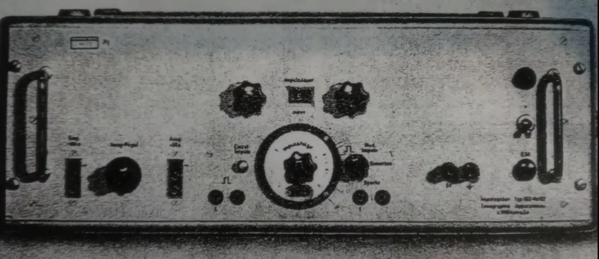

Generatore di impulsi IG2 122 della marca Willisen, che è il piú importante pezzo di hardware di Kontakte, poichè l'impulso e la gestione di frequenza e durata di questi impulsi è il fattore piú significativo.

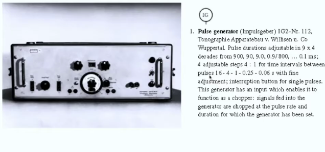

Immagine dalla partitura tradotta. In essa vi sono le funzionalità. Per il controllo della durata dell'impulso abbiamo una matrice di 36 durate suddivise in 9 step da 1 a 9. Che vanno da 0.9 a 0.1 ms moltipllicati per i 4 step. La frequenza degli impulsi è calcolata in intervallo di tempo, intorno a 4 durate principali. Abbiamo la possibilità di emettere un impulso timbrico. Questo oggetto funziona da modulatore per segnale in ingresso (chopper), tagliare e scavare ampiezza del segnale e i rispettivi impulsi.

##### Wessgenerator MG-60 Wandel und Goltermann

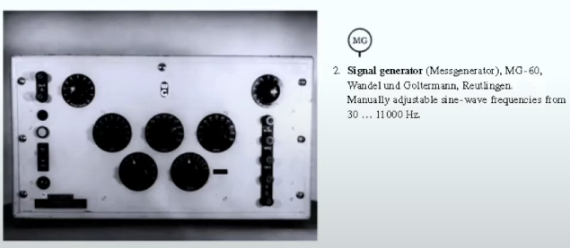

In realtà il modello in foto è un MG-50 e l'MG-60 è quello sottostante.

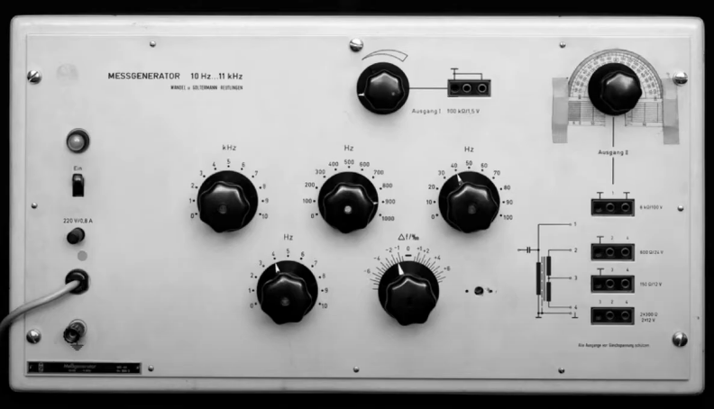

La quale differenza è la possibilità di controllare finemente il voltaggio in uscita.

La gestione è eseguita attraverso 5 manopole che permettono di gestire parametri e frequenza.

Oscillatore di base che ha una gamma di frequenze da 30 Hz a 11 KHz.

##### AG-10 Heathkit

Stockhausen con un oscillatore Heathkit.

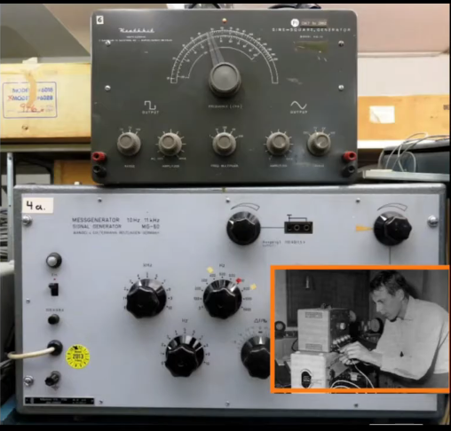

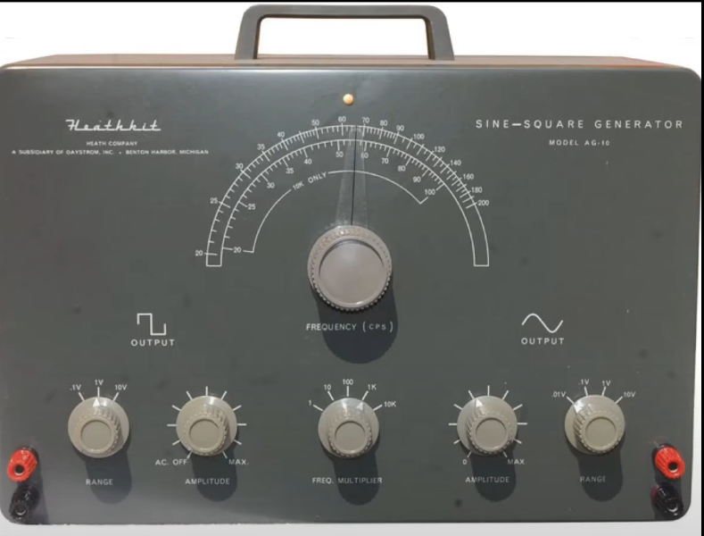

Di questo oscillatore si trova anche il manuale in rete. Oggetto che si montava da se, che genera 2 segnali separati con unico controllo di frequenza. La frequenza è regolata da pomello grande e ampiezza da moltiplicatore. Le uscite sono due e separate.

Controllo per ampiezza e range separate, all'interno del range si riscala il voltaggio massimo emesso dall'oscillatore. 

Oggetto singolare e complicato da montare e l'unico oggetto usato da Stockhausen per generare onde quadre.

##### Tieftonggenerator TTG-14 Wandel und Goltermann

Generatore di onde a bassa frequenza, il cui range va da 0.1 Hz a 1100 Hz. Oggetto molto importante, poichè in combinazione con l'oscillatore Rhode und Schwarz ST1-4032(non abbiamo nessuna traccia di esso).

##### Rhode und Schwarz ST1-4032

L'ST1-4032 ha range frequenziale da 30 a 20000 Hz. Il TTG-14 e ST1-4032 venivano usati spesso insieme perchè il TTG-14 modula in frequenza ST1-4032, e tutto insieme serve per realizzare AM.

Inoltre il TTG-14 è usato come scopo particolare, ovvero di controllare in modo continuo la velocità di scorrimentro del nastro.

### Magnetofoni

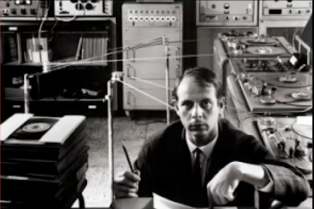

#### T8

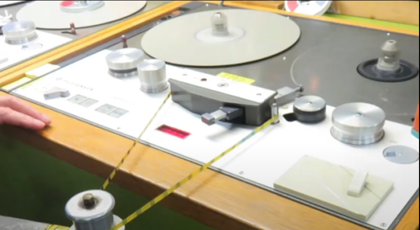

Particolare poichè ha 3 settaggi di velocità particolare. Inoltre puó essere controllato dal TTG attraverso la bassa frequenza dell'oscillatore. Una frequenza di 50 Hz corrisponde alla velocità massima, abbassando la frequenza la lettura velocità di lettura si abbassa. Ovviamente è possibile controllare la lettura del nastro anche manualmente.

##### T9

Altro magnetofono a 4 piste.

### Amplificatori

##### UBM 12121 Rohde und Schwarz

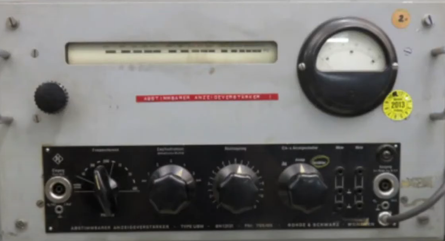

Oggetto particolare, poichè è un amplificatore sintonizzabile con display. Un amplificatore in cui si può selezionare la banda di frequenza da amplificare (ve ne sono 3: da 45 a 400 Hz, da 300 a  2200 Hz e da 1800 a 14000 Hz). La sensibilità di questo amplificatore è regolabile attraverso 5 gradi di sensibilità e sia in modo continuo attraverso un circuito di feedback(11 gradi di feedback). Oggetto di cui abbiamo notizie solo attraverso questa partitura. La modulazione nel continuo era un qualcosa non da poco e venivano  usati degli oggetti del genere per poter raggiungere dei risultati.

### Filtri

##### 3 filtri per terze CW1 n.2010,11,12 Wandel und Goltermann

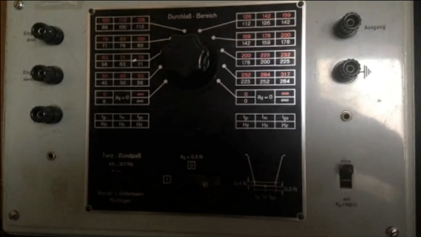

Primo di una serie di filtri che Stockhausen utilizzò. Modello che poteva presentare in varie configurazioni che si differenziavano per la differenza di bande passanti. Stockhausen usa modelli 2010, 2011 e 2012. Il modello in figura ha una serie di frequenze separate fra loro a intervalli di terza(da 89 Hz a 317 Hz). Gli altri modelli: 2011(317 Hz 2016 Hz) e filtro 2012 (1800-2016 fino a 11400). Frequenze a cui lavora il filtro ed è selezionabile. Ogni filtro contiene due serie alternate di filtri in figura.

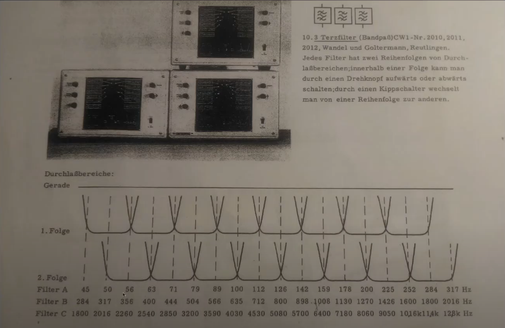

Si vede che le serie di filtri si alternano.

Per selezionare la serie rossa o bianca si seleziona con la levetta in basso a destra. Mentre la manopola grande sceglie la coppia di frequenze.

##### Maihak W49

I 3 filtri per terze appena visti furono accompagnati da un filtro passabanda, in cui regoliamo la profondità o efficenza del filtro con il cursore da 1 a 8, mentre gli altri cursori regolano la banda passante del filtro.

Famoso filtro W49 della Maihak usato sempre con il cursore dell'efficenza del filtro a 1 (ovvero il massimo della capacità selettiva che si poteva ottenere).

Mentre con i cursori destri si regolava la banda passante.

#### Albis

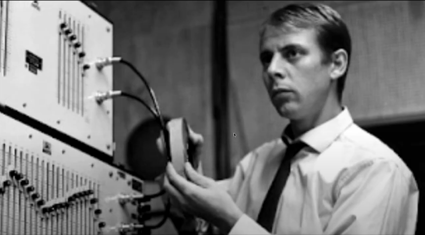

Nelle foto in tenuta classica vediamo Stockhausen in foto che usa questo filtro Albis, con un'interfaccia molto chiara. 

##### Albis hauptfilter

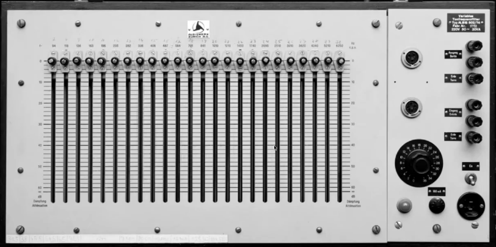

Anch'esso accordato per terze.

##### Albis Zusatzfilter

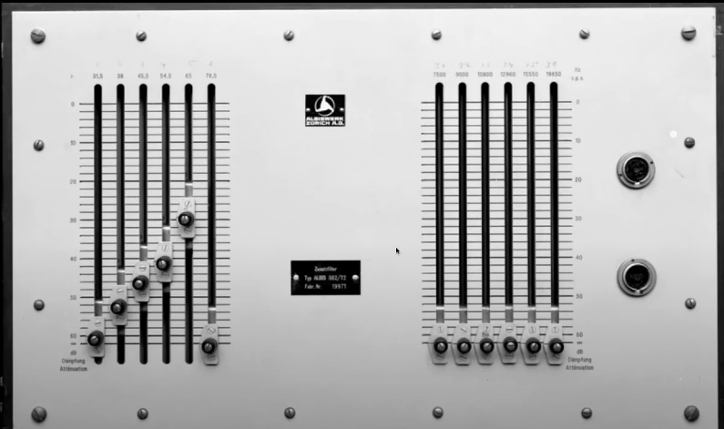

Filtre per frequenze molto basse e molto acute (sotto 78 Hz e sopra 11000 Hz), che non venne usato da Stockhausen in Kontakte.

### Sviluppi della WDR

##### Amplificatore V41

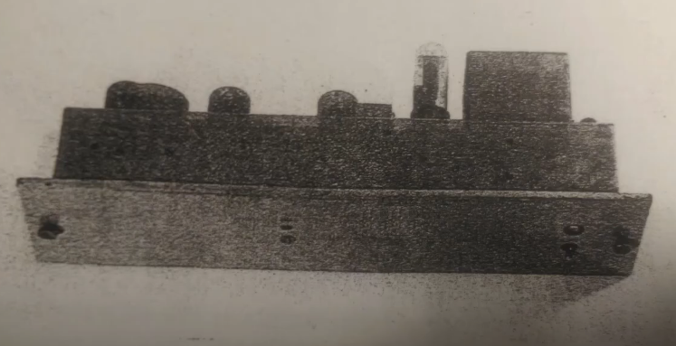

Amplificatore spesso associato a sintetizzatori, e sviluppato alla WDR 

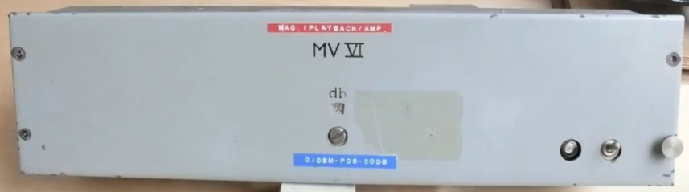

Interfaccia dell'amplificatore v41.

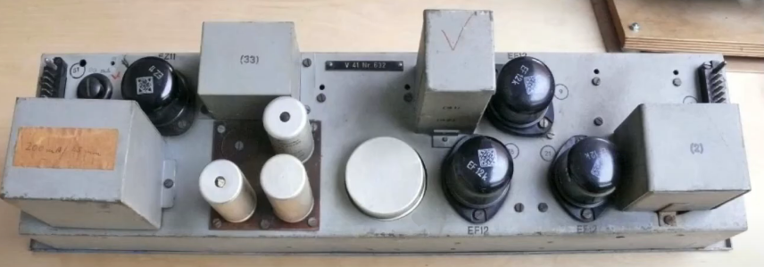

Veduta dall'alto dell'amplificatore.

È un oggetto presente nell'hardware indicato da Stockhausen.

##### Ringmodulator

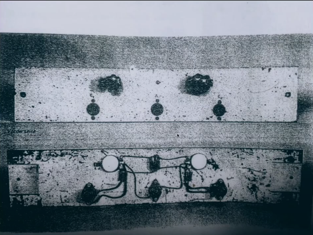

Altro oggetto sviluppato alla WDR. 

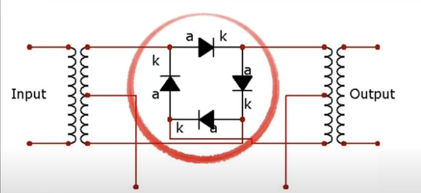

Esso consta di un anello di diodi che riproduce nel dominio analogico quello che nel dominio digitale è una moltiplicazione tra 2 segnali.

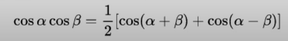

Dunque se moltiplico 2 segnali che sono i 2 coseni a frequenze diverse(angoli diversi), il risultato è un segnale che è la somma di due coseni  che hanno frequenza pari a somma e differenza del segnale originale, il tutto moltiplicato per 0,5(1/2), diviso per due perchè in natura non si crea dal nulla l'energia. 

Esempio se moltiplico segnale da 25 Hz con uno da 100 Hz otterrò un segnale di 125 Hz ed uno di 75 Hz

### Riverbero

##### EMT 140 n.103 W. Franz KG Lahr

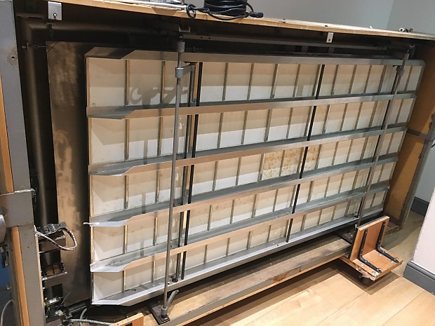

Oggetto con lastra metallica e meccanismi di riverberazione.

Esso si trova alla fine della partitura di Stockhausen. Se con il generatore di impulsi potevamo creare il primo criterio della musica elettronica *unificazione strutturale del tempo*, per cui ritmi e altezze vengono unificate ad un'unica grandezza, il riverbero crea l'effetto di profondità e lontanaza, ovvero gli elementi caratteristici dello spazio.

### Spazializzazione

##### Rotationlautsprecher

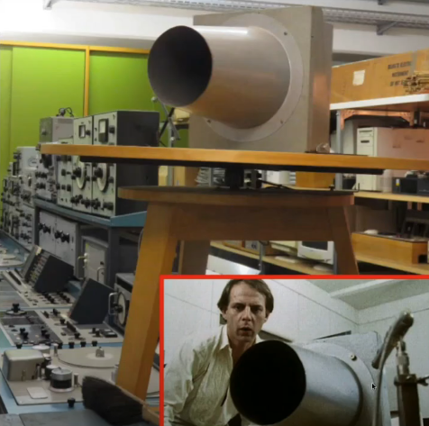

Altoparlante rotante, ovvero altorparlante con una guida davanti che viene fatto rotare all'interno di 4 microfoni disposti nei 4 punti cardinali. La rotazione di questo altoparlante permette di ottener effetti di rotazione e collocazione spaziale, scindendo il singolo segnale nella distribuzione dell'energia nello spazio. Dunque ogni volta che sentiamo i movimenti la spazializzazione è ottenuto con questo oggetto.

__________

Kontakte secondo le testimonianze di Stockhausen e collaboratori, è stato ottenuto lavorando molto in modo performativo, eseguendo indicazioni simultaneamente con piú apparecchiature, ottenendo subito un risultato concreto. 

_____

Quelle elencate sono tutte le apparecchiature usate in partitura. Le sigle indicate in partitura (IG o MG), sono riportate nei diagrammi e negli schemi di generazione del suono che accompagnano il materiale datato. 

La terza parte è costituita da riquadri che riportano l'esecuzione.

Ultima parte pentagrammi per strumenti acustici e rappresentazione pittografica ed iconica di ciò che succede all'interno del suono. 
