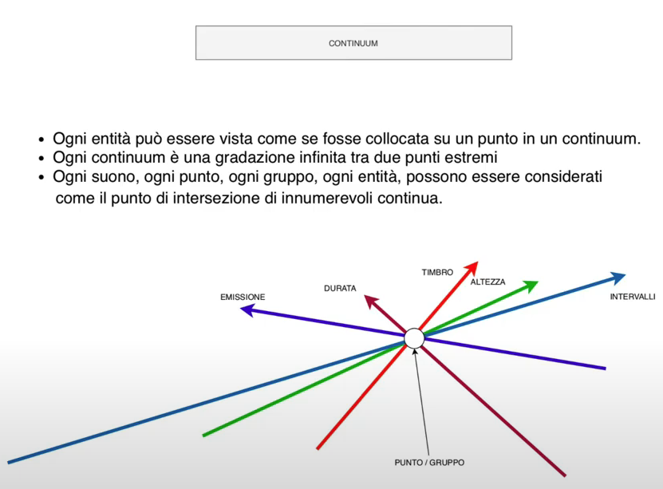
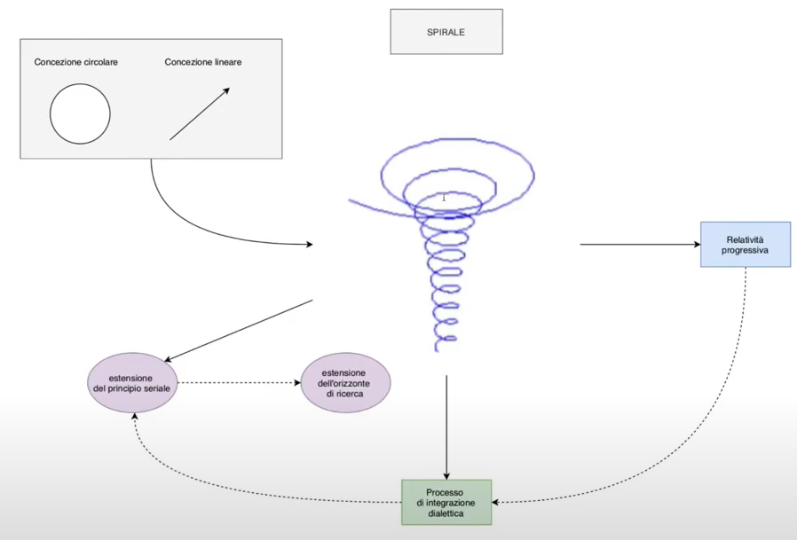
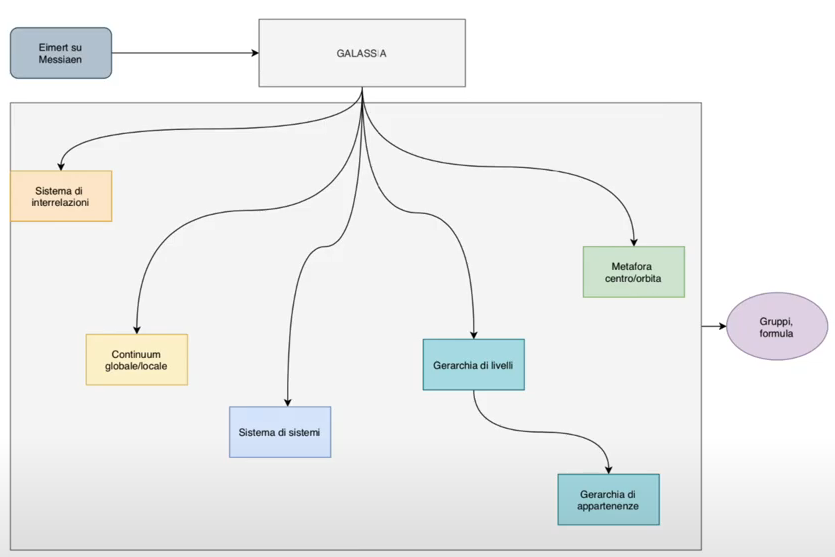

# Paradigma Stockhausen: i Modelli

Torniamo a parlare di paradigma Stockhasueniano, che abbiamo precedentemente definito nelle sue 4 componenti principali.

In questa lezione parliamo dei modelli, ovvero quelli che in un paradigma scientifico sono immagini e metafore e che qui diventano, immagini e metafore di caratteristiche del mondo, dell'universo e dell'operare del compositore che in Stockhausen vengono individuati in 4 momenti.

### Vibrazione (movimento universale, "respiro di Dio")

Ricordandosi che Stockhausen è un mistico, si parla di "respiro di Dio".

La vibrazione è un qualche cosa che puó essere:

1. periodica

2. aperiodica

##### Vibrazione Periodica

Che possiede 2 caratteristiche:

- frequenza

- ampiezza

A Stockhausen non interessa il fatto che una vibrazione sia dotata di frequenza e ampiezza, ma il fatto che siccome ogni cosa(su scala variabile) è dotata di una vibrazione, vuol dire che **ogni cosa ha una frequenza ed un'ampiezza**.

##### Vibrazione Aperiodica

Parlando di vibrazione aperiodica, Stockhausen si esprime in termini di probabilità, tutto ciò a che fare con la **teoria dei punti e dei gruppi**. Ovvero nel modo di trattare punti e gruppi; poichè a seconda se ci si riferisca all'onda periodica, oppure che ci si riferisca ad un ambito non determinabile ma probabile (statistica contro determinismo), ci sono 2 modi di operare completamente diversi(a volte antagonisti, a volte integrati nel modo di trattare punti e gruppi nel comporre di Stockhausen).

La **scala** di  questa vibrazione è variabile, nel senso che  ciò che vibra puó essere l'intero universo o una particella subatomica; è importante però che se tutto vibra e la qualità della vibrazione è unica. Ció vuol dire che il macrocosmo puó essere reintrodotto nel microcosmo, o il microcosmo puó riflettersi nel macrocosmo, a scale differenti, sulla base differente di **proporzioni**, ovvero se in sè le grandezze sono diverse, le proporzioni possono essere identiche tra il micro ed il macro, ció permette di **estendere le proporzioni a scale e parametri diversi**, ció significa che se io opero seguendo una certa proporzione a livello di microforma, il seguire questa stessa proporzione a un livello di macroforma o estensione temporale molto piú vasta, seguendo la stessa proporzione e quantità, è un qualcosa che ha senso e permette al microambito di riflettersi nel microambito. Questo è un qualcosa alla base dell'idea di Stockhausen di poter per esempio: applicare una stessa serie a parametriche e scelte su scale molto diverse.

Tutto ció presuppone che le **proporzioni siano riconoscibili** ovvero di un'identità che si offre alla percezione, alla nostra attenzione e che questa identità sia riconoscibile a tutti i livelli, essa è ovviamente una condizione ideale di quella che Stockhausen chiama **percezione estesa**; tenendo a mente che non tutti sono in grado di capire o percepire che una proporzione sussiste nella forma e nel timbro; anche se esiste una metafisica delle proporzioni e della scalabilità di queste vibrazioni, che fa si l'esistenza di stesse proporzioni a livelli diversi conferisca alla composizione un'unità ed una coerenza che porta dunque a definirli **livelli strutturali unificati**. Ovvero i livelli della scrittura, in quella che Stockhausen chiama _scrittura strutturale_, non drammatica e non narrativa, in cui i livelli strutturali devono essere legati tra se da una qualche forma di DNA numerico, proporzionale, quantitativo, che li renda coerenti gli uni con gli altri.

### Continuum

Concetto complesso, poichè è una parola usata da molti compositori con significati diversi.

La definizione piú coerente e convincente di _continuum_ ce la diede Trevor Wishart a metà degli anni '90, in un'opera intitolata _Sonica Art_ ma in realtà rappresenta una metafora della contrapposzione tra quantità discretizzate  e possibilità infinite. Nel contnuum si drammatizza la scelta, in esso c'è lo stupore di individuare uno stato, una condizione istantanea ed individuale, all'interno di infinite combinazioni possibili

Per ogni entità diciamo: un punto, un gruppo o delle composizioni, tutte le composizioni di un compositore nell'arco della sua vita, tutta la musica esistente, la singola sinusoide di una mistura in una frase di studio I. Dunque ogni entità puó essere  vista come vista come un **grumo di realtà su un punto di un continuum**, non solo ogni entità ma anche ogni parametro.

**Ogni continuum è una gradazione infinita tra 2 punti estremi**, non dati una volta per tutte ma variabili(esempio: il minimo e massimo che un oscilttatore analogico puó esprimere), ed **ogni suono, ogni gruppo ed ogni identità possono essere considerati come il punto di intersezione di innumervoli _continua_**(plurale latino di continuum), l'immagine descrive l'entità si collaca al punto di convergenza, confluenza ed intersezione e di quantità ed entità diverse, ovvero tutte le caratteristiche che possono essere descritte, corrono su uno spazio continuo e la singola identità realizzata, raggruma dentro di sè un punto preciso di queste linee. Pensando il punto ed il gruppo in termini di classe inforamtica(oggetto), fatto di proprietà e metodi, ma i dati che essa gestisce, assumono una configurazione precisa. Le frecce in figura rappresentano l'ambito di valori che ciascuna proprietà può assumere, ed il punto o gruppo è la classe cosí come si manifesta. Il valore del punto o gruppo diviene diverso al cambiare di una delle proprietà a corollario. Se creiamo un'immagine simile ma con frecce orientate in maniera diversa, la linea ideale che congiunge l'entità, anch'essa è considerata un continuum, ovvero l'idea che sostanzialmente tutto ció che contribuisce a descrivere o creare suoni organizzati, si collochi in uno spazio continuo. Ogni entità puó collocarsi in uno spazio multi dimensionale in cui le coordinate multiple del punto, descrivono, creano e danno luogo all'oggetto.

### Spirale

La teoria dell'evoluzione continua, rischia di farci tornare sempre all'inzio, da dove siamo partiti. In realtà è vero che siamo sempre da capo, una volta che un sistema di scrittura viene realizzato pienamente, se non viene superato, diventa un sistema opprimente, un sistema chiuso. La necessità di ogni volta trascendere, ci da l'idea di un movimento circolare, con la quale ci troviamo sempre allo stesso punto. Questo trascendere significa bensí integrare ciò che già esiste in una realtà nuova e più estesa, questo stesso principio governa l'estensione della percezione che secondo Stockhausen è alla base dell'esistenza umana, e che governa la ragion d'essere per realizzare musica, arte. L'evoluzione è dunque continua, benchè il movimento di ricerca ed individuazione, sublimazione sia di **concezione circolare**, ovvero ritorni sempre ad un punto particolare in cui poi bisogna cominciare da capo, il fatto che tutto ció integri progressivamente il già visto e sperimentato, in una dimensione nuova, in cui il significato assume una dimensione nuova ad esempio: il fatto che la singola nota di una serie non rappresenti piú l'altezza di un suono, ma un gruppo, ovvero un gruppo di note, esempio di questa circolarità che integra, sublima e sviluppa le proprietà di un concetto. Ciò che a un livello della spirale è una nota, ad un altro livello è un gruppo ed ad un livello ancora successivo diviene una regione geografica, una formula della superpartitura che genera una composizione di quelle realizzate per mezzo di una formula.

Si realizza con il concetto di spirale la **relatività progressiva** ovvero il fatto che ogni cosa è connessa alla precedente ma in un modo che tende ad integrare progressivamente, e non a sostituire i metodi precedenti. Il principio, ovvero la matrice seriale almeno per tutti gli anni '60 è uno di quegli elementi che sono costanti, ovvero la spina dorsale della spirale.

C'è poi un **processo di integrazione dialettica** che è connaturato alla **relatività progressiva**. Integrazione dialettica significa che ogni proprietà, ogni assetto, ogni procedura, che fa parte di un dato momento della scrittura di Stockhausen, entra in crisi per poi essere riassunto in una forma di sintesi nuova. L'idea della sintesi è legata all'idea dialettica, e iniziamo a capire (forse per la prima volta) che il paradigma di Stockhausen non è altro che una _sequenza di paradigmi e rivoluzioni scientifiche_. Anche le rivoluzioni scientifiche infatti rileggono il passato integrando, conservando l'utilizzabile e scartando l'inutilizzabile. Anche le rivoluzioni scientifiche procedono a spireale ad esempio: nella tecnica dei punti, ogni nota della serie diventa un suono, questa caratteristica diviene inutilizzabile nella teoria dei gruppi, dato che il gruppo è rappresentato da singola nota ma formato da piú note, vuol dire che l'identità tra ciò che ascolto e la nota scritta della serie non è piú utilizzabile(elemento paradigmatico che viene scartato).

**Estensione del principio seriale** è un tipico esempio (realizzazione pratica di ciò appena descritto), dall'organizzazione di cose pronunciate esattamente alla lettera derivate da una serie, alla gestione di aspetti piú complessi di gruppi di note, valori e altezze, ció comporta un'**estensione dell'orizzonte di ricerca**, poichè nel momento in cui il lavoro seriale del mio orizzonte di ricerca, viene acquisito, passa nelle retrovie dell'operare, mentre nell'avanguardia del mio operare rientrano cose nuove ed orizzonti divers, come: ciò che si affaccia al nostro orizzonte per la prima volta è sconosciuto e tutto da esplorare, e man mano che entriamo in questo orizzonte o spazio, ci diviene famigliare, mentre all'orizzonte ci si affacciano nuove possibilità. Tutto ciò con questo movimento a spirale, _circolare, progressivo_, la spirale è un cerchio che si muove nelle tree dimensioni. Esso puó avere sempre lo stesso diametro, ma in Stockhausen, almeno fino a _Mantra_ ovvero fino agli anni '70, il diametro di questa spirale si estende progressivamente. 

### Galassia

Finalmente la metafora usata spesso da Stockhausen che descrive piu

