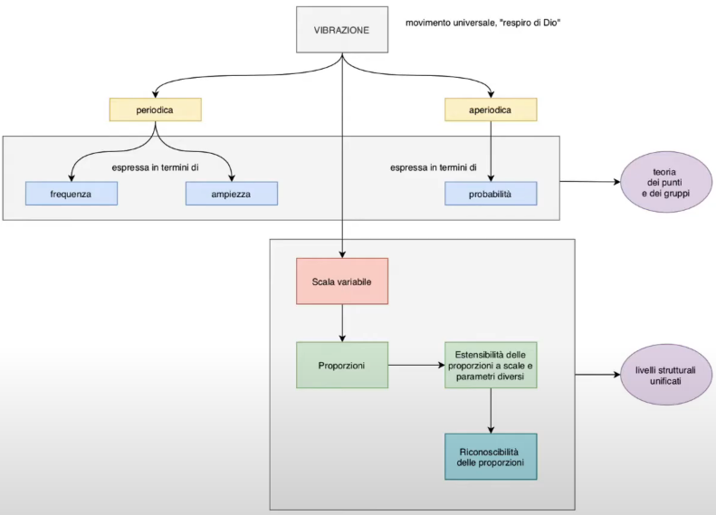

# Paradigma Stockhausen: i Modelli

Torniamo a parlare di paradigma Stockhasueniano, che abbiamo precedentemente definito nelle sue 4 componenti principali.

In questa lezione parliamo dei modelli, ovvero quelli che in un paradigma scientifico sono immagini e metafore e che qui diventano, immagini e metafore di caratteristiche del mondo, dell'universo e dell'operare del compositore che in Stockhausen vengono individuati in 4 momenti.

### Vibrazione (movimento universale, "respiro di Dio")

Ricordandosi che Stockhausen è un mistico, si parla di "respiro di Dio".

La vibrazione è un qualche cosa che puó essere:

1. periodica

2. aperiodica

##### Vibrazione Periodica

Che possiede 2 caratteristiche:

- frequenza

- ampiezza

A Stockhausen non interessa il fatto che una vibrazione sia dotata di frequenza e ampiezza, ma il fatto che siccome ogni cosa(su scala variabile) è dotata di una vibrazione, vuol dire che **ogni cosa ha una frequenza ed un'ampiezza**.

##### Vibrazione Aperiodica

Parlando di vibrazione aperiodica, Stockhausen si esprime in termini di probabilità, tutto ciò a che fare con la **teoria dei punti e dei gruppi**. Ovvero nel modo di trattare punti e gruppi; poichè a seconda se ci si riferisca all'onda periodica, oppure che ci si riferisca ad un ambito non determinabile ma probabile (statistica contro determinismo), ci sono 2 modi di operare completamente diversi(a volte antagonisti, a volte integrati nel modo di trattare punti e gruppi nel comporre di Stockhausen).

La **scala** di  questa vibrazione è variabile, nel senso che  ciò che vibra puó essere l'intero universo o una particella subatomica; è importante però che se tutto vibra e la qualità della vibrazione è unica. Ció vuol dire che il macrocosmo puó essere reintrodotto nel microcosmo, o il microcosmo puó riflettersi nel macrocosmo, a scale differenti, sulla base differente di **proporzioni**, ovvero se in sè le grandezze sono diverse, le proporzioni possono essere identiche tra il micro ed il macro, ció permette di **estendere le proporzioni a scale e parametri diversi**, ció significa che se io opero seguendo una certa proporzione a livello di microforma, il seguire questa stessa proporzione a un livello di macroforma o estensione temporale molto piú vasta, seguendo la stessa proporzione e quantità, è un qualcosa che ha senso e permette al microambito di riflettersi nel microambito. Questo è un qualcosa alla base dell'idea di Stockhausen di poter per esempio: applicare una stessa serie a parametriche e scelte su scale molto diverse.

Tutto ció presuppone che le **proporzioni siano riconoscibili** ovvero di un'identità che si offre alla percezione, alla nostra attenzione e che questa identità sia riconoscibile a tutti i livelli, essa è ovviamente una condizione ideale di quella che Stockhausen chiama **percezione estesa**; tenendo a mente che non tutti sono in grado di capire o percepire che una proporzione sussiste nella forma e nel timbro; anche se esiste una metafisica delle proporzioni e della scalabilità di queste vibrazioni, che fa si l'esistenza di stesse proporzioni a livelli diversi conferisca alla composizione un'unità ed una coerenza che porta dunque a definirli **livelli strutturali unificati**. Ovvero i livelli della scrittura, in quella che Stockhausen chiama _scrittura strutturale_, non drammatica e non narrativa, in cui i livelli strutturali devono essere legati tra se da una qualche forma di DNA numerico, proporzionale, quantitativo, che li renda coerenti gli uni con gli altri.

### Continuum

Concetto complesso, poichè è una parola usata da molti compositori con significati diversi.

La definizione piú coerente e convincente di _continuum_ ce la diede Trevor Wishart a metà degli anni '90, in un'opera intitolata _Sonica Art_ ma in realtà rappresenta una metafora della contrapposzione tra quantità discretizzate  e possibilità infinite. Nel contnuum si drammatizza la scelta, in esso c'è lo stupore di individuare uno stato, una condizione istantanea ed individuale, all'interno di infinite combinazioni possibili

Per ogni entità diciamo: un punto, un gruppo o delle composizioni, tutte le composizioni di un compositore nell'arco della sua vita, tutta la musica esistente, la singola sinusoide di una mistura in una frase di studio I. Dunque ogni entità puó essere  vista come vista come un **grumo di realtà su un punto di un continuum**, non solo ogni entità ma anche ogni parametro.

**Ogni continuum è una gradazione infinita tra 2 punti estremi**, non dati una volta per tutte ma variabili(esempio: il minimo e massimo che un oscilttatore analogico puó esprimere), ed **ogni suono, ogni gruppo ed ogni identità possono essere considerati come il punto di intersezione di innumervoli _continua_**(plurale latino di continuum), l'immagine descrive l'entità si collaca al punto di convergenza, confluenza ed intersezione e di quantità ed entità diverse, ovvero tutte le caratteristiche che possono essere descritte, corrono su uno spazio continuo e la singola identità realizzata, raggruma dentro di sè un punto preciso di queste linee. Pensando il punto ed il gruppo in termini di classe inforamtica(oggetto), fatto di proprietà e metodi, ma i dati che essa gestisce, assumono una configurazione precisa. Le frecce in figura rappresentano l'ambito di valori che ciascuna proprietà può assumere, ed il punto o gruppo è la classe cosí come si manifesta. Il valore del punto o gruppo diviene diverso al cambiare di una delle proprietà a corollario. Se creiamo un'immagine simile ma con frecce orientate in maniera diversa, la linea ideale che congiunge l'entità, anch'essa è considerata un continuum, ovvero l'idea che sostanzialmente tutto ció che contribuisce a descrivere o creare suoni organizzati, si collochi in uno spazio continuo. Ogni entità puó collocarsi in uno spazio multi dimensionale in cui le coordinate multiple del punto, descrivono, creano e danno luogo all'oggetto.

### Spirale

