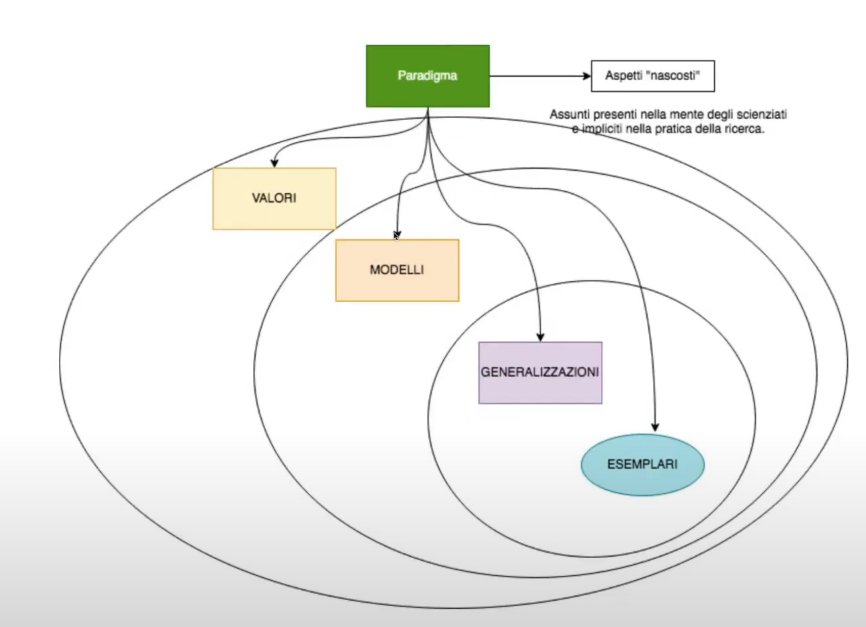
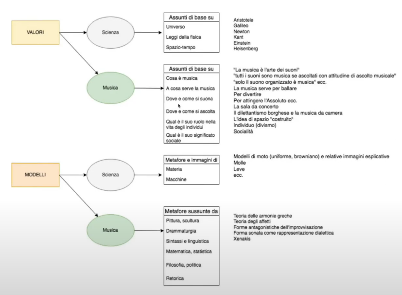
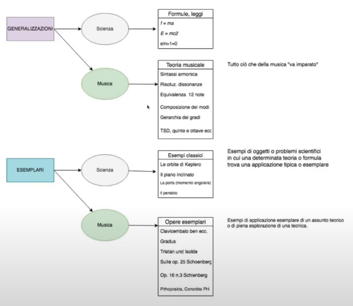
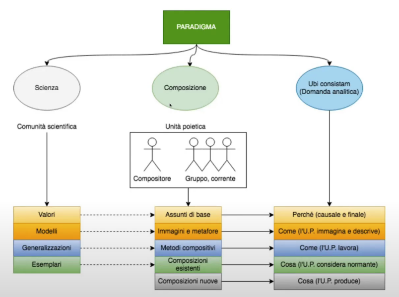
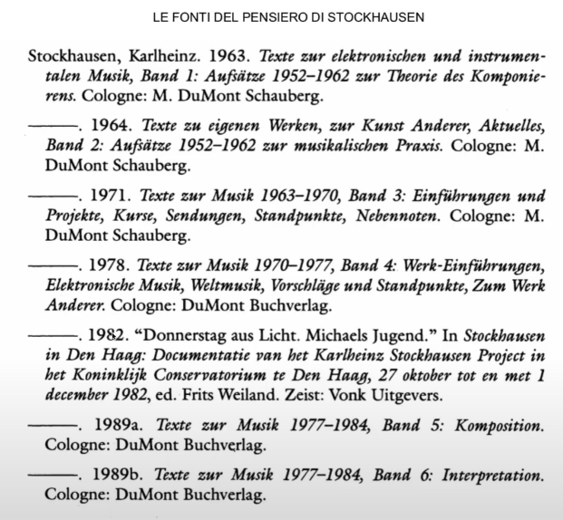

# Stockhausen Paradigma Prima Parte

### Significato della parola _Paradigma_

Equiparazione di un autore o di un autore o gruppo di autori che chiamiamo _unità poietica_ cioè singolo autore che gruppo.

Equiparazione tra paradigma tra senso scientifico ed estetico è frutto della riflessione di un musicolo olandese(Alcedo Cunen), che ha pensato di stabilire una relazione tra il paradigma delle relazioni scientifiche (come definito da Thomas Khun) e i fatti estetici relativi ad arte e musica.

È come se un autore agisse nell'arco della sua esistenza agisse sulla base di un paradigma, di una condizione epistemologica paragonabile a quella che si svolge nella scienza di un determinato periodo.


Il **Paradigma Vigente** è l'insieme di una serie di credenze, assunti e rappresentazioni che caratterizza la scienza di un certo periodo.
Thomas Khun sostiene che: tutte le rivoluzioni scientifiche avvengono secondo uno schema simile, si ha una rivoluzione scientifica quando si presenta un'anomalia, ovvero quando il paradigma presente non è in grado di risolvere quest'anomalia, questo mette in crisi il vecchio paradigma e fa emergere nuove ipotesi, ipotesi che tuttavia che anche se fanno emergere il nuovo paradigma fanno creare un conflitto tra vecchio stato di cose e nuovo. Alla fine il nuovo paradigma è quello che esce dal conflitto e si ha un nuovo assetto di convinzioni, rappresentazioni e assunti di base.

Quello che interessa riguarda la costituzione del paradigma vigente, riferito alla produzione di Stockhausen (riferito ), paradigma vigente è un insieme stabile di condizioni e convinzioni. È utile questa parificazione del paradigma scientifico perchè ci permette di considerare eventuali fratture storiche, eventuali rotture del paradigma, eventuali anomali sotto questo punto di vista concettuale.

### Di che cosa è fatto un paradigma?
Un paradigma è fatto specialmente di aspetti nascosti, assunti, che sono nella mente di chi pensa, agisce e svolge la ricerca, impliciti sia a livello teorico che a livello pratico. Lo scienziato che si muove all'interno di un paradigma lo fa dando per assodate alcune cose.
È facile citare il concetto di _pregiudizio_, i paradigmi sono dei pregiudizi, ma non nel senso negativo illuministico. In realtà il pregiudizio è un elemento inevitabile del nostro pensiero ed attività di ricerca artistica ed intellettuale. _Filosofia di Gadamer_ che sostiene che: "il pregiudizio è quell'insieme di nozioni note, nozioni date per assodate a partire dalla quale si va alla ricerca dell'ignoto."
```
Esempio Informatico di cos'è il pregiudizio.
Quando scrivimo un programma in C usiamo delle librerie ponendo degli #include, non scriviamo il codice interno agli header, quelle librerie (librerie standard del linguaggio C).
Esse le possiamo paragonare a pregiudizio filosofico, una serie di cose che diamo per scontate.
```
```
Esempio Matematico della parabola.
Studiamo che la parabola è una conica, ma quasi nessuno studia la dimostrazione che descrive in che modo la parabola derivi dall'intersezione di un cono con un piano.
Questa cosa la diamo per scontata.
```
Esempi di Librerie, SDK, librerie di oggetti, è forse quello piú illuminante, poichè esprime dei pregiudizi, un qualcosa che diamo per scontato.
Principio dell'incapsulamento, i dati sono incapsulati. Esso è lo stesso principio della filosofia _Gadameriana_, una serie di dati incapsulati nelle nostre nozioni che diamo per scontato e li usiamo per andare avanti.

Tutti diamo per scontato all'inizio della nostra esperienza musicale, che la musica sia la _musica tonale_, essa è una specie di libreria nascosta in noi che dice che o essa è tonale o non puó esser chiamata musica, tutti abbiamo avuto nella nostra testa una fase del genere, comunque ci interessa capire che la tonalità è un elemento considerabile come un pregiudizio.

Un paradigma è costituito da:
1. Valori
2. Modelli
3. Generalizzazioni
4. Esemplari


Questa rappresentazione grafica sta a rappresentare il rapporto di inclusione che hanno fra loro questi elementi. In particolare: i **valori** sono elementi fondativi, fondamenta ultime delle nostre conoscenze; i **modelli** sono delle metafore o rappresentazioni, immagini per render l'idea della nostra ricerca; le **generalizzazioni** sono punti di arrivo della ricerca dati per buoni e resi come elementi generali; gli **esemplari** sono i casi specifici in cui determinate teorie scientifiche possono esser date per esemplificate.

Ora vediamo come tutto ciò puó tradursi in un paradigma musicale.


#### I valori per la Scienza
Essi sono gli assunti di base, le cose che nessuno mette in discussione, senza le quali non c'è possibilità di intendersi.
(Eg. Se scienziati parlano senza condividere valori, non si capiscono).
Esempi di valori possono essere i modelli:

1. dell'universo
2. le leggi della fisica
3. il funzionamento dello spazio-tempo.

Nomi accanto agli assunti di base, sono i nomi di quei personaggi, filosofi o scienziati che hanno stabilito paradigmi:
- Aristotele -> riferimento paradigma piú antico fisica e metafisica.
- Galileo -> paradigma più antico per le scienze astronomiche.
- Newton -> ha elaborato un'idea di spazio-tempo, considerando lo spazio ed il tempo come una scatola omogenea invariante, alla base della fisica.
- Kant -> ha stabilito un assunto di base, cioè che ogni giudizio scientifico si basa sulla nostra percezione delle spazio-tempo, e non sulle cose in se stesse.(Tagliando di fatto la possibilità di ragionare sulla cosa in se, sulla metafisica).
- Einstein -> ha cambiato attraverso una rivoluzione scientifica, il paradigma di spazio-tempo di Newton.
- Heisenberg -> ha introdotto i nuovi assunti della meccanica quantistica che la fisica odierna pratica, senza queste assunzioni di base di Einstein e Heisenberg, non potremmo costruire la fisica del presente.



#### I valori in Musica
I valori di base in musica sono assunti di base su:  
1. Cos'è musica
2. A cosa serve la musica
3. Dove e come si suona musica
4. Dove e come si ascolta musica
5. Qual'è il ruolo della musica nella società e nella vita degli individui
6. Qual'è il significato sociale della musica

- "La musica è l'arte dei suoni" (in vecchi manuali di musica)
- "Tutti i suoni sono musica se ascoltati con attitudine di ascolto musicale"
- "Solo il suono organizzato è musica"(lo troviamo in Schaeffer e in Varése con il libro _Il Suono Organizzato_)
###### Assunti di base sulla funzione della musica
- La musica serve a ballare -> assunto strano, ma musicisti delle balere la hanno come assunto
- La musica serve per divertire
- La musica serve per attingere l'Assoluto

- La sala da concerto -> come luogo di base deputato all'ascolto
- Il dilettantismo borghese e la musica da camera -> trasformazione dello spazio domestico in spazio musicale
- Idea di "spazio costruito" -> Idea che lo spazio possa essere costruito e gestito dal compositore
- Individuo -> contrapposizione tra individuo eccezionale(virtuoso) ed il suo pubblico
- Socialità -> dimensione sociale della musica, un dj per esempio, non puó concepire la musica senza che alla base di essa ci sia una socialità

#### I modelli per la Scienza
Metafore ed immagini di:
1. Materia
2. Macchine
- modelli di moto(moto uniforme)
- modelli astratti di molle e leve
#### I modelli in Musica
Repertorio di metafore prese da altre arti o scienze:
1. Pittura, scultura
2. Drammaturgia
3. Sintassi e linguistica
4. Matematica e statistica
5. Filosofia, politica -> articolo "Libera interpretazione come rappresentazione figurale" -> tesi che sostiene che la libera improvvisazione -> rappresentazione figurale come modello di società, qualche cosa che è allo stesso tempo reale e metaforico, reale e figurale, reale e traslato
6. Retorica
- Teoria delle armonie grece -> varie teorie dell'armonia antica portassero a diverse reazioni psicologiche
- Teoria settecentesca degli affetti -> contrapposizione di allegria e tristezza legata a modi e ai ritmi
- Forme antagonistiche dell'improvvisazione -> diversi modelli di contrapposizione fra improvvisatori, in accordo, in disaccordo, costruttivi e distruttivi (Mikrophonie I)
- Forma Sonata come rappresentazione di una dialettica -> primo e secondo tema etc...
- Teorie di Xenakis -> stocastica e uso di formule statistiche per calcolare l'evenienza di un dato sonoro
- Puntillismo -> metafora artistica per certo modo di scrivere la musica

Queste sono tutte metafore e modelli descrittivi.

#### Le generalizzazioni per la Scienza
Sono in genere delle formule molto semplici
come E = mc^2
#### Le generalizzazioni in Musica
in musica è tutto ciò che è codificato nella _teoria musicale_
- Sintassi armonica -> quando si fa un basso di armonia non si puó passasare da IV a VI grado
- Risoluzione delle dissonanze-> fatto che le dissonanze devono risolvere
- in dodecafonia ci sono 12 note che per definizione sono in relazione soltanto fra loro, senza obblighi di comparire in esatto ordine
- composizione dei modi -> con toni e semitoni
- gerarchia della scala -> quinte e ottave
- funzioni tonica, sottotonica
- classificazione accordi
- suddivisione gerarchica per 3 o per 2

Semilavorati della musica tradizionale, semilavorati in musica tradizionale che possono essere in continua evoluzione

#### Esemplari per la Scienza
esempi tipici
- esempio porta momento angolare
- pendolo -> per spiegare attrito o moto
- orbite per spiegare -> attrazione corpi celesti
- piano inclinato -> meccanismi gravità
#### Esemplari in Musica
In musica abbiamo opere esemplari come:
- Il Clavicembalo ben temperato -> scritto per dimostrare la perfetta organizzazione dello spazio temperato -> si può scrivere per ognuna delle 12 tonalità maggiori e minori
- il Gradus -> di mementium -> enciclopedia della tecnica pianistica
- Tristan und Isolde -> inizio di un certo modo di trattare l'armonia che prelude l'atonalita
- suite op.25 di Schoënberg -> è normativa sulla dodecafonia
- op 16 n.3 Schoënberg -> liberazione totale da qualsiasi vincolo teorico -> scrittura coloristica -> melodia di timbri
Phitoprakta e Concrete PH di Xenakis -> applicazione di una concezione statistica per la distribuzione del materiale e non deterministica

### Paradigma



Riassumendo chiamiamo il compositore(o gruppo di compositori ovvero corrente tipo gli Spettralisti, seconda scuola di Vienna o gruppo Darmstasdt): **unità poietica**

Questi valori, modelli, generalizzazioni ed esemplari del paradigma  diventano:
1. valori = assunti di base sulla musica
2. modelli = Immagini e metafore di base
3. generalizzazioni = metodi compositivi
4. esemplari = si suddividono in
- 4a. composizioni esistenti -> alla base di determinato nuovo paradigma
- 4b. composizioni nuove -> ciò che un'unità poietica produce una volta che il paradigma è stabilizzato

associamo a queste composizioni la domanda analitica l'_ubi consistam_ ovvero la ragione d'essere, e dunque:
- perchè causale e finale per quanto riguarda gli assunti di base
- come(l'U.P. immagina e descrive) -> per immagini e modelli
- come(l'U.P. lavora) -> come lavora, metodi compositivi
- cosa (l'U.P. considera normante)
- cosa (l'U.P. descrive)


Scienza|Composizione|Ubi consistam (Domanda analitica)
-------|------------|-------------
valori | assunti di base sulla musica|perchè (causale e finale)
modelli|Immagini e metafore di base|come(l'U.P. immagina e descrive)
generalizzazioni|metodi compositivi|come(l'U.P. lavora)
esemplari (1)|composizioni esistenti|cosa (l'U.P. considera normante)
esemplari (2)|composizioni nuove|cosa (l'U.P. descrive)

Alcuni dei testi alla base di quanto sappiamo della musica di Stockhausen


- _Texte zur elektroni..._ -> 6 volumi
- testo del 1982 -> Stockhausen all'Aia -> esperimenti al Conservatorio dell'Aia

Non ci sono musicisti paragonabili per importanza, estensione del pensiero, profondità e coerenza a quello di Stockhausen

### Esemplari
