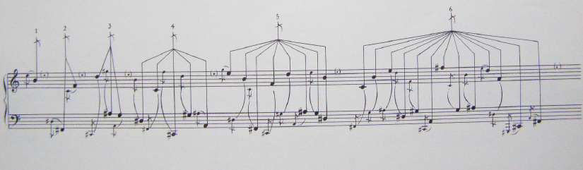

# Stockhausen - Plus-Minus

[Link alla lezione](https://www.youtube.com/watch?v=-b3fr9jLCuU&feature=emb_logo)

[Partitura Plus-Minus](Stockhausen_Plus-Minus_Score.pdf)

Composizione di Stockhausen del 1963-63 che corrisponde all'esemplare piú significativo della modalità di composizione della rappresentazione di un processo, che caratterizza il periodo dei primi anni '60, concorrenzialmente alla Momentforme. Stockhausen non è contrario per principio alle forme drammaturgiche, ovvero quelle che hanno movimento, direzionalità precisa, ovvero _forme orientate_. La caratteristica della Momentforme è che essa non è orientata, ed all'interno del momento, pur riscontrando delle tendenze o linee di tendenza statistiche, tendenzialmente il _momento_ è pensato da Stockhausen come un qualcosa che non cambia, qualcosa sempre simile a se stesso. Una sequenza continua di climax, anzichè come le forme drammaturgiche orientate: un qualcosa che va verso un climax e poi si estingue.

Il processo mette in questo caso in scena un qualcosa di drammatico, mette in scena  un qualcosa di drammaturgico, orientato nel tempo, con dei riferimenti, degli sviluppi, delle relazioni orientate temporali, rispetto ad una Momentform che non ha queste relazioni.

Nel complesso, cosa significano le 3 parti della composizione e quali sono i criteri alla base di questa partitura. Le motivazioni che spingono Stockhausen a creare determinate regole, meccanismi che fanno scattare il gioco della composizione, ovvero cosa da a questo processo il carattere di una certa composizione o di un'altra. Quanto entra in gioco la scelta dell'esecutore, e quanto entra in gioco di chi finalizza la partitura, e su quali elementi le scelte vanno a cadere?

### Le regole

Siamo di fronte dunque a una scatola di montaggio sulla quale, direttori, esecutori, compositori si cimentano per la realizzazione. In cui essi sono chiamati a finalizzare la stesura finale a partire da un set di regole e materiali.

Queste regole e materiali, devono essere simili ad un gioco. Laddove siamo in presenza di regole ben determinate e di una mescolanze di obblighi e possibilità, ovvero dove ci sono meccanismi che mandano avanti la struttura temporale, Laddove siamo in presenza di obbiettivi; dove ci sono meccanismi simili al gioco siamo in presenza di una forma originaria, ovvero la _forma ludica_.

Abbiamo esempi anche in Italia di forme compositive del genere come le partiture di Guaccero, come un modello del gioco che possiamo paragonarlo al gioco del calcio.
Il gioco del calcio è un gioco che ci impone delle regole ben precise, accadimenti che non siamo sicuri che interverrano, siamo certi di determinate cose, ma non siamo in grado di determinare il dettaglio di cosa succederà in un determinato istante. C'è dunque un _elemento aperto_ ed un _elemento chiuso_.
Le regole del gioco, sono regole che servono a mandare avanti in maniera sensata il gioco, ovvero regole che creiino differenze sostanziali a seconda che un determinato accadimento si svolga in un certo senso piuttosto che in un'altro.
Nel _gioco dell'oca_, che è un tipo di procedimento stocastico, in cui un determinato stato del gioco determina lo stato successivo del giocatore. Plus-Minus assomiglia molto a un gioco dell'oca, anche se non è simile, poichè il movimento è incostante da una cella all'altra. Questo movimento incostante da una casella all'altra ci rimanda a questa metafora del gioco.

Fin ora abbiamo detto che si tratta di:
- una specie di _gioco di società per musicisti_
- il risultato finale deve essere finalizzato da qualcuno sulla base delle regole(giocare la partita)
- risultato finale sarà congelato alla fine
- differenza sostanziale tra lo _spettacolo gioco_ e lo _spettacolo prefissato_  (se vediamo un film o piece teatrale sappiamo piú o meno cosa succederà, come partitura scritta in tutti i suoi i dettagli, mentre nello _spettacolo gioco_ in cui alcuni elementi sono determinati, altri sono determinabili, oppure in base a decisioni prese in fase di allestimento, ed il pezzo è completo solo quando lo sentiamo fino alla fine)

### La Partitura

Abbiamo:
- 3 parti che sono un set di istruzioni
- 7 pagine di simboli (ha molto dell'idea del gioco, pittogrammi o sistemi di simboli)
- 7 pagine che contengono un elenco di strutture accordali e una serie di strutture sottoforma di acciaccature

#### Strutture accordali (materiale musicale)

Anche se con questo tipo di scrittura i simboli acquisiscono significati diversi.
Simbolo acciaccatura, note che vanno a riempire spazio di note ornamentali nel pezzo che sono annotati nelle pagine dei simboli che sono annotate con acciaccature.
Caratteristica delle strutture è che al loro interno sono semistrutturate, ovvero divise al loro interno ed esiste una gerarchia, e vediamo dunque una tipica concezione di Stockhausen come idea di sistema/galassia, ovvero sistema di sistemi con una _dimensione locale_ ed una _dimensione globale_, ed esiste una scala di gradazioni tra locale e globale.
Esiste in queste strutture un criterio, ovvero che sono armonicamente in crescendo, vi sono anche strutture molto originali, come le _strutture ad albero_ da pagina 21, da 2 rami a 7 rami, mentre il contenuto armonico dei rami è abbastanza omogeneo come densità. Ciò per quanto riguarda le strutture divise in 6 rami principali.

Per le strutture notate con numeri romani, il fatto che siano 7, ci fa intendere che queste strutture armoniche(campi armonici ovvero selezione di altezze), che vanno ad abbracciare un registro e che possono contenere cluster, vanno assegnati a 7 tipi fondamentali di accadimento sonoro in ciascuna pagina, ce ne sono 7 tipi fondamentali che per ogni pagina bisogna assegnare. Assegnazione come se fosse un DNA armonico di questi eventi sonori, e che finisce di essere uno dei pochi elementi statitici che identificano questo pezzo. Ogni evento sonoro per ogni pagina viene assegnato a questi accordi, chiaramente vi sono 7 pagine di eventi sonori(simboli), 7 pagine di materiali notati e per ogni pagina i 7 elementi fondamentali acquisiscono diversi ambiti, dunque anche questi campi armonici varia di struttura in base a denistà e tessitura (in genere stutture VI e VII contengono dei cluster), ma rispetto alle note ornamentali (gruppi di 6), i fattori di rappresentazione dei campi armonici sono meno sviluppati, Stockhausen può dunque basarsi sulla tessitura.

Inoltre di base i 7 campi armonici per ogni pagina hanno la stessa nota superiore, "quasi una nota tematica per ogni pagina" e possibilità di estendere il campo armonico nel registro piú basso.

C'è dunque una volontà compositiva di articolare, e presentare materiali diversi, sin dalla scelta della sua rappresentazione, anche non sapendo cose esso voglia dire nel corpo finale del pezzo. Queste rappresentazioni sono in una condizione ibrida tra una stesura musicale ed una stesura piú simbolica, come se fossero qualcosa di simile a una sottoformula, in cui il modo in cui rappresenti determinati accadimenti sta a significare un certo modo di gestirli nella partitura vera e prorpia(un'acciaccatura in partitura non diviene per forza acciaccatura nel pezzo).

#### Istruzioni (regole)

1. 7 pagine di note e 7 pagine di simboli
2. uno o più interpreti possono realizzare uno o piú livelli di queste 14 pagine, si possono combinare fino a 7 livelli diversi(il pezzo puó essere eseguito da un solista o 7 solisti, ognuno dei quali si fa responsabile di ogni coppia simbolo e pagina)(regola che non ci dice se uno da uno vanno intesi insieme o se un solo un solo interprete puó mescolare 2 o piú livelli)
3. Una pagina di simboli deve esser applicata ad ogni pagina di note
4. Simboli in un quadrato signifcano un singolo evento musicale(punto, gruppo, minimomento), ma cosa sia l'evento musicale è da determinare
5. Le pagine dei simboli e gli eventi numerati devono seguire le altre pagine continuamente:

  - _Zentralklang_ ovvero suono centrale, suono di riferimento, suono base che corrisponde a uno dei cluster con numeri romani

  - _Akzidentien_ in esso abbiamo delle forme che hanno una lunghezza e durata l'una rispetto all'altra, suoni accessori rispetto al _Zentralklang_, essi possono essere indeterminati nel pitch:
    - corti
    - medi
    - lunghi
    - indeterminati

  - _Nebennoten_, ovvero note secondarie, ovvero quelle prese dai gruppi 1-6 che sono soggette soltanto a 2 leggi:
    - pronunciate come acciaccature (piú veloce possibile)
    - accellerando
    - ritardando

6. abbiamo inteso che _Zentralklang_ e _Akzidentien_ formano il corpo centrale, la forma base, e abbiamo quindi 7 forme principali che possono andarsi a costruire:

Vediamo come ci sono varie configurazioni, che nel loro complesso cerchi e simboli accessori sono chiamati _elementi_; essi possono essere o un singolo elemento come il _Zentralklang_ oppure un simbolo diverso, o una sovrapposizione dei suoni, qui Stockhausen ci da tutti i 7 tipi di eventi, ognuno di questi tipi è associato a uno degli accordi.
7. Uno dei 7 numeri romani è associato a uno dei 7 tipi di eventi, la differenza da una pagina all'altra cambia con le pagine di note
8. Sopra alcuni _Zentralklang_ ci sono delle bandierine, che portano scritto "+,-, o un numero" che significano che ad ogni successiva ricomparsa dello stesso simbolo, finchè non c'è bandierina diversa, allo stesso simbolo puó essere tolto o aggiunto un numero di elementi pari a quelli indicati dal numero.(cuore del pezzo).
Esempio:

Se abbiamo un simbolo con +1, la successiva comparsa dello stesso simbolo, possiamo aggiungere un elemento, che possiamo aggiungere a destra, a sinistra, ed esso puó essere un _z  _Zentralklang_ completo, un _Akzidentien_ o complesso dei due.
9. In caso piú _Akzidentien_ si trovino uno dietro l'altro devono essere eseguiti alla massima velocità possibile, ciò comporta che un singolo tipo puó subire delle aumentazioni, e gli si possono montare elementi aggiuntivi dello stesso tipo, fino a 13 aggiunte, se arriviamo a 13 si azzera tutto e si torna a 1, ovvero stato iniziale.
10. Se la partitura ti impone di sottrarre(-), la partitura si complica, poichè devi fare la stessa cosa(ovvero aggiungere), quello che vai a aggiungere è un elemento di pausa dello stesso valore di quello che avresti aggiunto se fosse stato un "+". Ciò crea delle strutture di silenzi.
11. Le strutture di silenzi,  devono funzionare come nastri che contengono un suono fantasma. Dobbiamo quindi aggiungere 2 bande negative (nastri), metafora del sibilo del nastro, silenzi che sono pure durate che devono essere abitate da uno sfondo, denominata "banda fantasma". ("Very soft, undefinable"). Cosa succede quando si arriva a -13, l'elemento viene eliminato, e se lo incontriamo un'altra volta esso non potrà esser suonato. Vi sono casi in cui un simbolo non ha la possibilità di realizzarsi come aumentazione o diminuzione.

(altre istruzioni fino a 35)

Le scelte molto diverse danno identità alla singola esecuzione e meccanismo di conservazione del DNA sonoro.

#### I simboli

##### Segni < e >
Tra gli elementi piú significativi abbiamo segni di ">" e "<" con all'interno dei numeri.

Essi stanno a rappresentare (elemento seriale), diminuzione o aumentazione all'interno di un parametro dell'evento sonoro. Esso puó essere la dinamica, puó essere il timbro o altro.
Tutto ciò è espresso nelle regole e questi parametri vanno a determinare parametri di:
dinamica, registro, durata. Ed essi ci stabiliscono una direzionalità e un andamento graduale che va a determinare la stesura effettiva del pezzo. Il fatto che il percorso sia obbligato ci da un'identità complessiva. Ma il fatto che questi segni possano essere applicati a parametri diversi ci da una certa libertà.

##### Simboli delle durate relative

Che stanno a indicare pause o assenze di pause tra evento sonoro ed un altro. E forse l'elemento piú interessante(il quinto dell'immagine), che non fa si che la composizione sia fatta di sole tessere; ma sono possibili sovrapposizioni di eventi sonori. Le frecce ci indicano fino a quando un dato elemento deve sconfinare nella durata dell'elemento successivo. Come il sesto simbolo che indica che l'evento deve durare fino alla fine del successivo. L'ultimo simbolo indica che l'evento deve durare fino a che non vi sia una pausa.
Questa regola del gioco ci preserva la variabilità nella densità degli accadimenti, assicurandoci un certo aggancio, tondino di ferro della dimensione orizzontale, capacità di addensare, rarefare e sovrappore elementi senza avere una piatta giustapposizione.

#### Altri simboli

Simboli che prescrivo elementi particolari

Suono con sordina, accenti, riverberazioni, ritmi periodici o aperiodici...

##### Respiro delle pause

##### sovrapposizioni

Polifonia nella dimensione orizzontale
##### Indicazioni di tipo articolativo o di ritmica

##### Timbro

Proporzione tra elementi rumorosi privi di altezza ed elementi di suono con altezza precisa, mescolanza per ottenere un determinato timbro e divisione inoltre tra _hard_ e _soft_ che è una caratteristica più decisa e sfumata dello stesso timbro

La pagina che contiene tutti questi ultimi simboli ci da dunque la struttura cellulare di questa composizione e degli accadimenti.

Mentre la regola delle sovrapposizioni e rapporti tra elemento ed un altro (> e <) ci determinano la parentela tra elemento ed un altro.

Le bandierine ci determinano la quantità di materiale che adoperiamo o la quantità di silenzio colorato che addizioniamo al nostro brano.

#### Correlazioni fra pagine

Obbligi di correlazione nel tempo e obblighi di correlazioni armoniche, ovvero ulteriori fattori che modulano la coesione ed il legame piú o meno stretto tra una pagina e l'altra.
