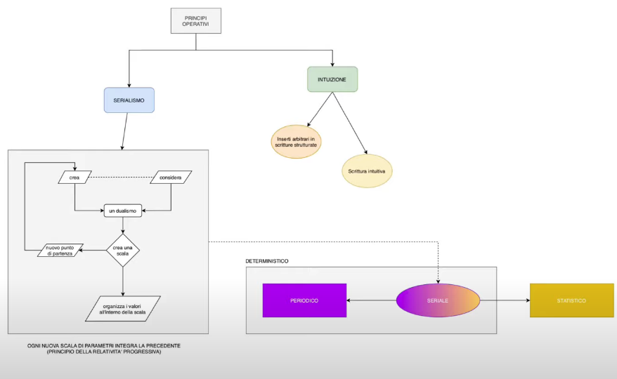
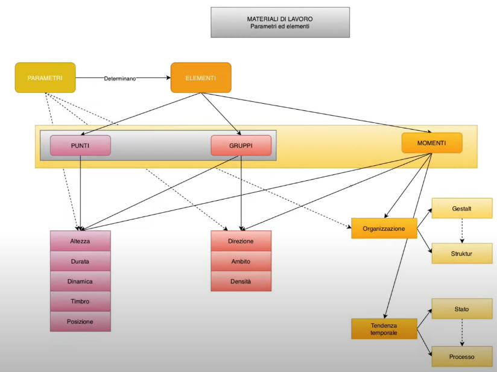
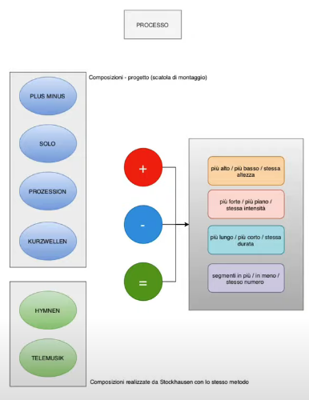
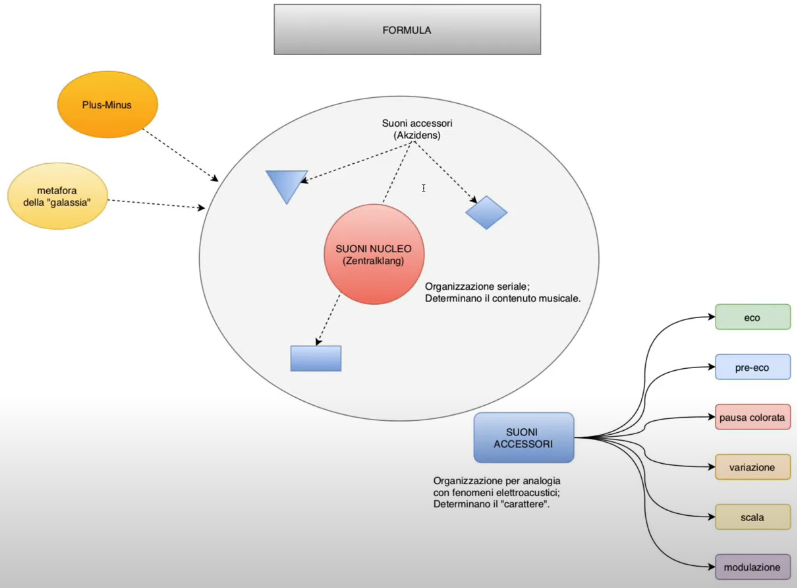

# Principi operativi e materiali di base

[link alla lezione](https://www.youtube.com/watch?v=PujFLtA54R4&feature=emb_title)

## Metodi di lavoro e generalizzazioni

**Generalizzazioni** e **metodi di lavoro** sono quei termini che utilizziamo per indicare quella fase di acquisizione all'interno di un paradigma. Nel mondo scientifico esse sono le formule, nella composizione diventano complesse.
_________

### Metodi nella tradizione

I metodi per come la musica viene concepita  dalla seconda metà del Novecento ad oggi prevede dei:
1. Principi operativi
2. Materiali di base
3. Principi costruttivi

Oggi ci occupiamo dei principi operativi e dei materiali di base di cui si serve Stockhausen.
Ovviamente è impossibile separare ció che è materiale da ciò che è procedura, infatti in Stockhausen è operante un principio dialettico ed un cambio di prospettiva, infatti ció che in un momento è il fine diviene in una seconda fase un mezzo e uno strumento(vedi Punkte, Gruppen e Momente).

#### Principi operativi

È lo spazio concettuale all'interno del quale la musica si muove. Con esso intendiamo lo spazio nodale (qualcosa di molto ampio):
- dalla modalità gregoriana alla rinascimentale
- la tonalità, che è il mondo organizzato sulla gerarchia della scala maggiore e minore e che prende le mosse dal barocco seicentesco (da Corelli e Vivaldi fino a Bach)
- atonalità, fenomeno novecentesco (momento breve e tarda stagione dello sviluppo tonale, con Schönberg e Skriabjin), libertà assoluta e scelta di nota per nota
- politonalità, fenomeno novecentesco incorcia con la modalità (Hindemith e Bartok)
- dodecafonia che ricolloca sotto un capello questo spazio lato nato da atonalità e politonalità

#### Materiali di base

Tutti quelli deifinito come i semilavorati ovvero elementi pre composti di cui la musica tradizionale si serve per esprimere i suoi enunciati(esemplari), come:
- modi
- scale
- funzioni tonali
- progressioni
- accordi
- serie
- sequenze
- etc...


#### Principi costruttivi

Essi sono le varie forme, ovvero tutto ció che è principio organizzativo formale, come:
- forma sonata
- contrappunto
- forme di danza (vanno da danze antiche a rondò)
- fuga (tipo particolare di forma contrappuntistica)
- forma di aria
- forme tripartite
- madrigale
- etc...
____________
### Metodi in Stockhausen

#### Principi operativi di Stockhausen
- serialismo
- principio della relatività progressiva(integrazione progressiva di aree operative, quando acquisisce procedura essa serve per passaggio concettuale operativo, estensione percezione, in forme e coscienza)
- intuizione, che nel mondo Stockhauseniano spiritualista ed esoterico che mira alla condivisione dei saperi, mondo lontano dalla storia, dalla politica e dall'impegno sociale, mondo lontano dalla contingenza; intuizione che serve come momento di totale libertà inventiva (momenti carnevaleschi); musica intuitiva (con partiture verbali, partiture non giustificate da alcun principio operativo). Idea dell'intuizione come principio creativo.
#### Materiali di base di Stockhausen
- punti
- gruppi
- formula
- momenti
- il processo
#### Principi costruttivi di Stockhausen
- serializzazione
- processo (sia materiale, sia procedura)
- proiezione della formula
_________________
### I principi operativi di Stockhausen


Essi sono:
1. serialismo
2. intuizione

#### Intuizione

Fa capo agli inserti arbitrari (momenti carnevaleschi, ovvero sospensione e sovvertimento delle regole), poi la scrittura intuitiva che è tipica di una composzizione piú tarda.

#### Serialismo

È un principio per cui il compositore crea o prende in considerazione un dualismo, cioèè una polarità, due condizioni possibili di una determinata cosa; e dunque si crea una tensione polare(Esempio del Gesang, dualismo massima e minima intellegibilità del testo, ovvero parametro che non ha nulla a che vedere con i prametri tradizionali della musica), dopo aver creato il dualismo, il compositore crea una scala con questo dualismo.
Da un lato l'algoritmo arriva alla conclusione organizzando con una scala, oppure la scala diventa il punto di partenza per un nuovo dualismo, che viene ulteriormente sottoposto a processo di scale; questo meccanismo circolare è quello che noi chiamiamo **serialismo**, e di cui la serializzazione è soltanto un esito finale, solo una pratica operativa conseguente a questo che è uno spazio creativo.
Il serialismo e la serializzazione sono la risposta che Stockhausen da a un problema di fondo che è il _creare uno spazio intermedio_, tra la totale prevedibilità e regolarità degli eventi (segnale periodico) e dall'altro canto vi è il mondo statistico del _totalmente imprevedibile_ quando la statistica regna incontrastata.
Nel mezzo c'è una quantità di gradi intermedi che possiamo simulare.


_Esempio: differenza tra riprodurre i suoni di una scala e di una serie prodotta con numeri casuali.
Uno stato periodico ed uno statistico.
E dunque tutti gli elementi intermedi che sono composti e che si collocano a metà, attraverso una serie di gradi che possono solo essere simulati, e dunque una serializzazione che sta a metà tra il caos e lo statistico._

Esempio di ciò lo abbiamo ascoltato in Gesang, nella trattazione approfondita della condizione intermedia della serializzazione che si individua nell'analisi di Decroupet del Gesang di Stockhausen.
____________
### Materiali di base (o di lavoro) di Stockhausen



I materiali di lavoro sono:
1. I parametri, ovvero delle caratteristiche che di per se da sole non suonano, ma che accorpate in una struttura, danno luogo ad un elemento. Mettendo insieme un'altezza, una durata ed un timbro ed una posizione o collocazione e otteniamo un punto, ovvero un suono compiuto.
2. Gli elementi, ovvero i mattoni della costruzione musicale.

#### I parametri dei punti
- altezza
- durata
- dinamica
- timbro
- posizione

#### I parametri dei gruppi

Tutti questi parametri possono essere sottoposti a ulteriori parametri di tipo statistico ovvero:
- la direzione, in che direzione tendono ad andare le altezze
- l'ambito
- la densità di questi parametri


_Ad esmepio le differenze tra densità di timbro di rumore bianco e sinusoide pura. Estremi che possono essere serializzati._

_Esempio ambito timbrico su vocali e consonanti di cui si serve Stockhausen._

_Durate e posizione diverse, densità diverse_

Se moltiplichiamo i parametri tipici dei punti(parametri tipici del suono), per i tre parametri statistici _direzione, ambito e densità_, otteniamo i gruppi.

#### I momenti

I momenti sussumono dentro di se punti e gruppi come mondo operativo, aggiungendo dei principi di organizzazione formale. Definiti da Cunen:
1. organizzzazione
2. tendenza temporale

##### Organizzazione

Riguarda l'assetto statitco, ovvero il momento come si presenta nella sua forma intemporale, nella sua forma che si puó cogliere tutta insieme, come se guardassimo la partitura con un unico colpo d'occhio.
```
gestalt -> struttura
```
Intesa come:
- Gestalt (profilo complessivo, che possiamo cogliere con unico sguardo)
- Struktur (cogliere elementi interni)

##### Tendenza temporale

Rappresenta eventuali possibili movimenti all'interno del momento. Anche se Stockhausen ci ha detto che nel momento non succede nulla. È dunque ciò che succede all'interno del momento. Nel momento non dovrebbe succedere nulla, ma trattandosi come qualcosa che deve muoversi nel tempo, finisce per avere un comportamento anche lui. Comportamento che va dal _non succedere nulla_ all'_applicarsi di un cambiamento o di un processo_.

```
stato -> processo
```
Ricordandosi che la parola _processo_ è in Stockhausen molto ambigua, poichè presume sia una tendenza temporale all'interno del momento, sia un materiale di lavoro con cui Stock procede come una forma di materiale, sia una forma operativa o principio operativo; ma che alla fine significa nell'immaginario Stockhauseniano: come viene sviluppato il decorso musicale.

###### Processo


Riguarda alcune composizioni, (processo come focus sul materiale):
- Plus-Minus
- Solo
- Prozession
- Kurzwellen

Che sono processi non conclusi, in cui il compositore ci fornisce le regole e la scatola di montaggio, lasciando a noi (esecutori, compositori o direttori) il compito di finalizzare la partitura partendo dagli elementi. Fornendoci i materiali di input e l'algoritmo.

Altre due opere fatte con gli stessi criteri, ma già finalizzate dal compositore.
- Hymnen
- Telemusik

Esse sono i due unici esempi di musica concreta che Stockhausen abbia prodotto (escludende l'Etude realizzato a Parigi).

Trattandosi di musica su nastro, non avrebbe alcun senso fornire delle regole di cui il compositore non puó avere i materiali, e dunque Stockhausen procede alla finalizzazione del materiale.

Ad esempio _Scambi_ di Pousseur, è una scatola di montaggio in cui ci fornisce materiali da montare.

Quando si parla di musica concreta si parla in modo lato, dato che vi è molta elaborazione e processamento dei segnali registrati.

###### In cosa consiste il processo?

Nell'applicare fattori di:
- aumentazione (+)
- diminuzione (-)
- zero (=)

Applicare questa molla o principio che fa scattare la molla, che consiste nell'applicare forme di aumentazione e diminuzione ad:
- altezze
- durate
- dinamiche
- timbri (anche con essi in Plus-Minus, richiedendo cosa significhi aumentare un timbro al compilatore della partitura finale)

Forma dunque di aumentazione formale, poichè dato un certo elemento, esso può essere fatto crescere o contratto per trasformarsi in qualcosa di diverso.

#### Formula




Non è altro che un brano di musica che può stare in una o due pagine, che diviene una specie di mappa o carta geografica che descrive il pezzo vero e proprio.
In pratica, a partire da **Plus-Minus** e dall'idea di _processo_ che ne fornisce sicuramente un precedente; poichè in Plus-Minus viene applicata per la prima volta l'idea di _suono nucleo_ ovvero _Zentralklang_, invece di un'idea di _suono come accessorio_ o _Akzidens_, potremmo chiamarli come tronco e rami.
Idea dunque che ci sia struttura fondamentale che da il colore armonico a evento sonoro e a delle idee e struttre collaterali che si accompagnano al suono che conferiscono un carattere, un colore o meglio un'identità a tutto l'evento sonoro.

Oltre alla divisione principale tra _suoni nucleo_ e _suoni accessori_, che proviene da Plus-Minus, vi è sempre un'**idea della galassia**(idea topografica della musica), e una differenziazione e dialettica tra locale e globale:
- i _suoni nucleo_ sono delle strutture seriale che troviamo nella formula
- i _suoni accessori_ sono invece una tipologia di suoni molto ben definiti
  - eco
  - pre-eco
  - pausa colorata
  - variazione
  - scala
  - modulazione

I suoni accessori sono tutte categorie che Stockhausen muta dalla pratica del nastro magnetico. Eco e pre-eco sono fenomeni indesiderati della registrazione su nastro magnetico.

La pausa colorata, proviene dal sibilo del nastro vuoto. (Anche in  Plus-Minus vi è questa idea, eventi sonori divengono banda o nastro silenzioso, silenzio abitato da fruscii e sussurri, versione fantasma del nastro. Pausa colorata come metafora del nastro vuoto)

La scala(o ponte) sono struttre di passaggio tra un _Zentralklang_ ed un altro.

La variazione è un mutamento realizzato sui materiali di base.

La modulazione, intesa come variazione della velocità del nastro, o variazione ritmica dell'intensità, ovvero tremolo e vibrato, applicati metaforicamente ad una struttura.

_Esempio di serie con do-re-mi-fa-sol, ed aggiungendo note a caso in mezzo, realizzo un tremolo ed espando questo Zentralklang con una modalità che Stockhausen chiama variazione._

La formula non è altro che un brano di cui la realizzazione finale è la meta-partitura, ovvero musica fatta con la musica, dunque il rapporto che normalmente in tutti gli altri stadi gli elementi intrattengono con i parametri, la formula intrattiene rapporti con questi elementi che la costituiscono. Questi elementi vengono congelati nella formula(danno luogo a forma, percorso e a una geografia del pezzo) questi elementi vengono dunque sottoposti a un processo chiamato _poiezione_, in cui ogni elemento viene proiettato su dimensione temporale piú grande attraverso la _proiezione della formuala_, e dotato di questi _suoni accessori_ che lo arrichiscono e lo identificano e gli danno carattere.

### Riepilogo dei materiali di base in Stockhausen

Categorie|Elementi|Parametri|
---------|--------|---------|
Suoni(deterministico)|Punti|Altezza,  durata, dinamica, timbro, collocazione
Statistico|Gruppi|Direzione, ambito, densità
Forma|Momenti|Organizzazione(Gestalt,Struktur), tendenza temporale(statica, dinamica)
Trasformazione|Processo|Mutamento, cambiamento
Composizione|Formula|Elementi(nucleo, accessori)


Possibilità di descrivere delle categorie con i suoni e con parametri tradizionali della serialità integrale.
I parametri statistici, moltiplicazione dei parametri determnistici che danno luogo ai punti.
Estensione di deterministico e statistico che genera i momenti.
Abbiamo poi quel particolare momento che è la trasformazione(mutamento o cambiamento) che si avvale del processo. Ed infine la composizione che è il punto di arrivo va dal singolo suono a _Licht_(che dura una settimana), caratterizzata dalla formula; possiamo pensare la categoria in termini di elementi, i quali possono essere composti dai parametri, gli elementi successivi possono essere costruiti a partire dal basso della gerarchia; fino a che elementi intrecciati danno luogo alla composizione.

Tutte queste categorie, nel momento in cui vengono situati in forme scalari o sottoposti a una polarizzazione(in cui ci si muove con serializzazione o determinismo), divengono gradi di una forma scalare, che divengono un qualcosa di disomogeno(vedi caratteristiche dei _Suoni accessori_, tipologie totalmente diverse fra loro). In cui scala,la variazione e la modulazione sono sottotipi della variazione, mentre eco, pre-eco e pausa colorata vengono trasformati in elementi formali.

(La scala o ponte ha come matrice nel mondo del nastro magnetico, quel particolare glissato che si ha quando si avvia il nastro, che da luogo a glissati strani.)

Dunque nella formula gli elementi stanno alla formula, come in tutti gli altri elementi i parametri stanno all'elemento.

La tabella riassume e fa capire la relatività progressivia descritta all'inizio, ovvero quel progressivo integrare le acquisizioni precedenti in sistemi più articolati, intensi e piú complessi e grandi.
