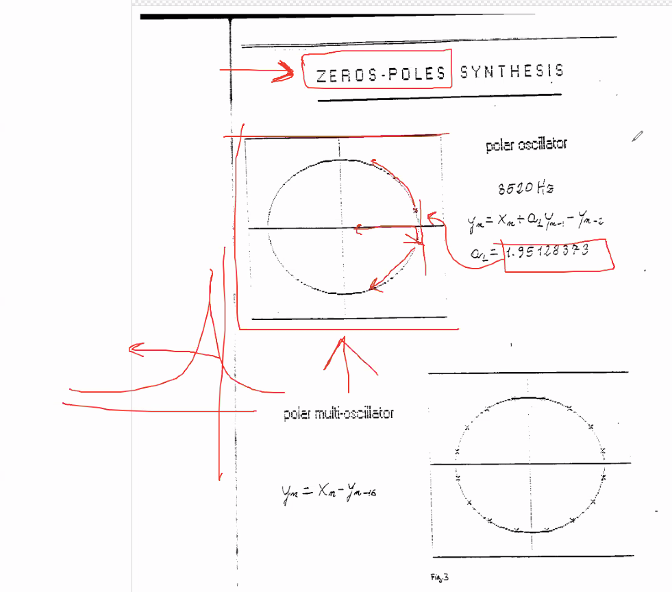
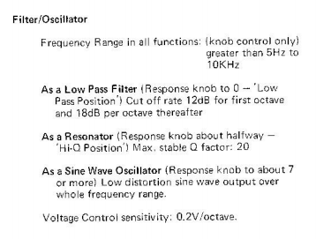
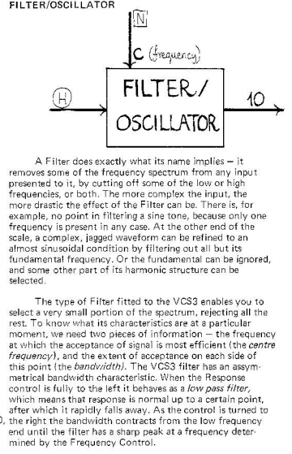
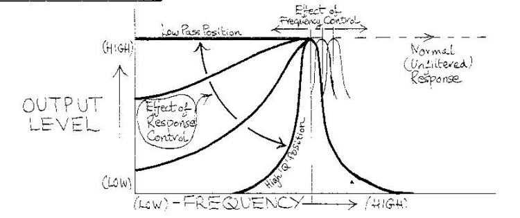
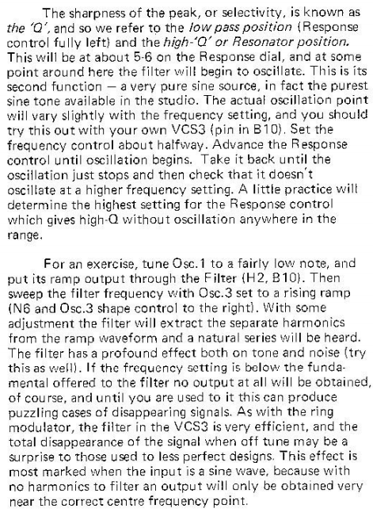
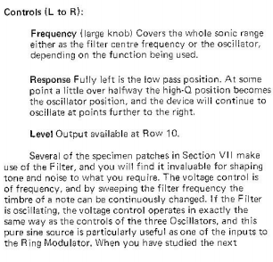
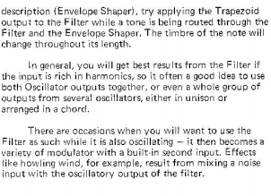

# Appunti della lezione di Mercoledí 27 Maggio 2020

Lettura [Articolo Pellecchia](https://github.com/s-e-a-m/References/blob/master/Lupone-Michelangelo/Proceedings-Int.Workshop-Man-Machine-Interaction...Pisa1991.pdf)

Secondo step legato al filtro > quello in alto a destra chiamato _FILTER/OSCILLATOR_

Tipico filtro LP con frequenza di taglio mobile con la capacità di innescare ed avere un Q alla frequenza di taglio che puó iniziare a suonare e un'ampiezza

Versione digitale di questo filtro > articolo di Pellecchia che nel 1991 sostiene che alcuni filtri posso impazzire e possono arrivare ad autoscillare.

In articolo _zeros-poles synthesis_

Polo, zero e visione z-plane non ha corrispondenza diretta con filtro che oscillae ed andamento con corrispondenza polare

Coefficienti in letteratura non hanno sempre lo stesso significato > quello che Pellecchia chiama a in Max è b

JOS > funzione molto complessa matematica ed astratta

Frequenza 8520 Hz > vera solo dentro in FLY30

Per ricostruire il valore dobbiamo cambiare i coefficenti

Lettura di Biquad di Max > struttura musicale che ricollega la visione del filtro, l'equazione matematica e la visione del filtro spettroscopicamente

Se riusciamo a rifare il biquad abbiamo una chiave di lettura piú pratica dei Coefficienti

I coefficenti sono dipendenti dall'architettura del filtro

Numero dei campioni gestiti dal filtro è un numero finito

Filtro Biquad come quello di gen~ è definito a 2 poli e 2 zeri, e numeri di ritardo massimo è definito

IR filter/oscillator > ricavare il comportamento del filtro desiderato

A diverse freq il filtro si comporterebbe in modo diverso

**RESPONSE** del filtro ha a che fare con il coefficente di risonanza, per farlo a livello digitale bisogna necessariamente capire come è fatto il Biquad

**FREQUENCY**

[Manuale VCS3](http://dl.lojinx.com/analoghell/EMSVCS3-UserManual.pdf)

Curtis Roads -> Concetto Complesso -> "Qualcosa entra in un modo ed esce in un altro cambiato"

Da musicisti -> cercare di veicolare le informazioni dei filtri per esigenze musicali

Idea dei filtri di Pellecchia a SR maggiore > cambia

Novità è l'approccio nel concetto della ricostruzione matematica del VCS3

Alimentare un percorso storico

Fuori da Faust il concetto di Feedback e ricorsione è spregiudicato

A livello di C++

`+~_` e hai fatto una ricorsione che in Max, SuperCollider e Pure Data non è possibile

Max che ha la struttura per poterlo fare, non lo fa!

Pagina Help gen~ che spiega cosa non fa gen~

Piú della costruzione del filtro stesso è importante capire poichè è legato all'architettura che tu metti in piedi

Oggetto finale decreterà come suonerà

Assembler di quell'hardware lí > dati di architettura che possono far compensare differenze

Hardware DSP è talmente costruito e blindato che è molto simile a livello analogico

Faust opzione per compilare binary nativo e non

Proggetto grosso > maneggiare l'informatica per vedere un prodotto finito

Versione piú bella z-plane > manuale di MATLAB

Conoscere il biquad in maniera semplice > per poterlo applicare in modo musicale

_loopback_ in RME è digitale mentre i meters sono analogici

NUENDO con vst > compensazione di ritardo (latenza)

Importante determinare la latenza della macchina per utilizzare un filtro su macchine diverse

**INFERNAL MACHINE**
- Qual'è l'unità di ritardo
- Diretto collegamento con l'utilizzo musicale

Modello Fisico > devi suonare su hardware che deve essere definito su un hardware con risposta all'impulso e

[Lecture di Risset](https://www.youtube.com/watch?v=nOv30rHV7Ds)

La nostra storia è cambiata dalla registrazione, suono passa da un oggetto del tempo a un oggetto dello spazio, non esiste piú un compositore slegato dal suono con il tempo

"La registrazione ha fatto cambiare qualcosa"

Controllo sul suono cambiato dalla registrazione, fino a giorno prima della registrazione non era possibile, per capire che ci siamo staccati dall'oggetto musicale

Ci siamo staccati dal modello tempo

Problema legato all'idea di strumento > che porta a classificare come strumento

differenza sostanziale tra JOS e noi non deve tenere conto dell'idea di tempo

IRCAM -> ahed RT

IEM -> fanno Ambisonic -> come sfettucciamento dello spazio

SEAM -> Nono

Nell'ottica di strumento fa la differenza usare un INFERNAL MACHINE o la pagina bianca di Max

INFERNAL MACHINE > primo ibrido analogico digitale

Nottoli ha avuto lo strumento VCS3 -> ma a lui dello strumento solamente non gli interessava

Nostro percorso focalizzato alla percezione mentale di portare su un palco un evento musicale senza una base letteraria

Archeologia è necessaria perchè qualcuno ha sbagliato

idea di repertorio -> ruolo dell'interprete e dell'esecutore

Karajan, Gould e Miles Davis > percorso attorno all'immagine di queste persone

Questa gente è analizzabile perchè c'è materiale da analizzare

Se voglio affrontare Nono in maniera "come suona Nono" con archeologia di gente che è in vita

Boulez -> ultra documentato -> eppure non capiamo le cose sulle partiture

Dottorati -> modo di vivere

Progetto SEAM -> idea di poter cambiare -> non ci sono soldi per interesse

Faust > comunità non di musicisti

a livello musicale pratico ci sono grosse problematiche

Concetti di: stereofonia, latenza etc...

Ruolo interprete -> richiede una comunità per interpretare qualcosa

2 scelte:
1. prendiamo provvedimenti
2. lasciamo perdere

Rimanere aggrappati alle comunità, c'è una mailing list per spazializzazione su Nono? NOOOO

Partecipare e prendere una scelta ->pensiero di dover dedicare tempo

Lavoro di ricostruzione

Repository sui filtri per capire

Crearci gli strumenti!

Dialogo con Pizzaleo, Zattra e SEAM

livello con I am sitting in a room -> da raggiungere con altri brani

Comunità è filtro molto stretto di ciò
