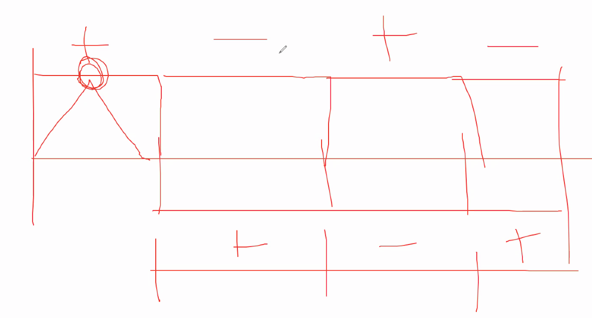
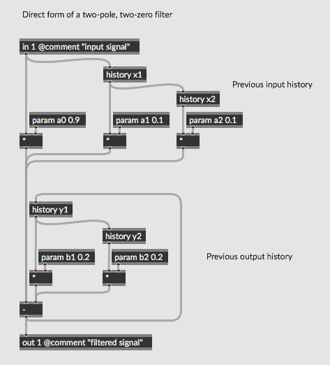
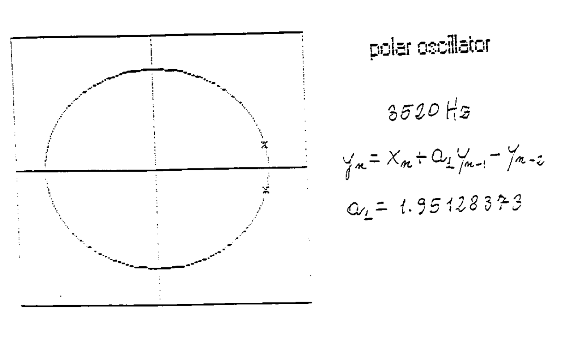

# Appunti della lezione di Venerdí 5 Giugno 2020

Implementazioni base del FIR e IIR

JOS scrive la FIR con variabile, IIR con variabile e poi con questo ci ha fatto il biquad.

Entrare in scatole cinesi è possibile farlo solo con le variabili. Ed avere un minimo di struttura mentale per capire quanto verrà compresso successivamente.

Codice MATLAB simile a Faust. Per una visione di scatole, il numero ce lo mette l'utente finale.

par e seq -> devono avere i numeri all'interno poichè non si possono modificare in tempo di compilazione

BUtterworth di Faust fi.lowpass

(Con Biennio realizzazione di filtro crossover -> che si usa in sale cinema)

Diverse soluzioni, per Brick Wall:
- brick wall ad ordine molto elevato (specificando la SR)

DSD e DXD formati di digitali che lavora a una frequenza di clock intorno ai MHz, tecnologia alla base di Merging, e dato che raspberry è combatibile con DSD (porta in un'uscita i2s) -> se questa cosa va in porto per noi si apre un altro mondo

### Come funziona il DSD

si usa una banda molto alta e si modula il suono in entrata a quelle frequenze, si fa poi una demodulazione e si rientra in banda audio, se la scheda non ha bisogno della frequenza di campionamento statica, si mette un convertitore analogico in cascata, il suono diventa dipendente dalla modulazione e quindi variabile

(Amplificatore Thomann è compatibile con DSD)

Vedere il biquad nella forma piú simile a gen~, poichè per trovare alcuni coefficenti di biquad Max è molto strutturato

### Biquad

[Filtri digitali su gitbook](https://grammaton.gitbook.io/filtri-digitali/)

Nel biquad abbiamo prima il blocco FIR e poi il blocco IIR, mentre quello di JOS a IIR e FIR invertiti

Il campione in entrata viene utilizzato nel tempo differito, mentre nell'IIR è il campione in uscita che viene re-inserito

a0 è il coefficente di amplificazione del segnale originale

L'IIR vive di se stesso, non come la FIR

Se voglio spegnere la parte FIR a0=1(ampiezza per alimentare il filtro), a1=0 e a2=0

Problema del Biquad è che l'astrazione matematica prescinde da ciò che si vuole realizzare, la formula matematica che descrive il biquad, non ha una funzione finita.

Il concetto di biquad: "È il primo prototipo di filtro astratto"

piccolo esempio in Faust
```
import("stdfaust.lib");
process = no.noise <: _+mem;

//coefficenti per biquad(1,1,0,0,0)
```
la somma dei due noise mi da una una somma del segnale a tempo 0 e del segnale a tempo meno 1, ho dunque un filtro FIR

y(n)= x(n) +x(n)^-1

per indicare un filtro IIR

y(n) = x(n)-y(n)^-1
```
//Modello onepole
import("stdfaust.lib");
process = no.noise : *(0.01) : +~*(0.99);
```
Coefficente FIR è positivo, mentre il coefficente IIR è negativo

modulo aggiunto `sub(x,y) = y-x;` per la realizzazione della sottrazione

per far funzionare il biquad nella parte FIR
biquad(1,0,0,0,-0.99,0)

Biquad di Max coefficenti FIR prima e coefficenti IIR dopo

Cyclcing ottiene il risulatato che ottiene solo con i coefficenti proprietari, mentre tutti i coefficenti

Libreria di MATLAB, è libreria di riferimento per i filtri, modellazione digitale matematica, puramente astratta

La formula di Pellecchia diventa mettere i nomi giusti ai coefficenti giusti, bisogna dunque pensare i coefficenti come dei rubinetti

Gli zplane, filtergraph, numeri che escono diventano comprensibili

Per avere il collegamento tra coefficenti e parte musicale, devi avere un oggetto come filtergraph

il filtro in VCS3 era un filtro che in maniera reale, quando il Q era troppo alto, iniziava a suonare

Abbiamo dunque visto un filtro FIR del primo ordine (`process = no.noise <: _+mem;
`) con un taglio a Nyquist che non è una frequenza ma si sposta in base al sample rate

La banda di transizione inizia subito, e non da un certo punto in poi.

Il taglio del FIR è realizzato con una somma di un suono ed il taglio di un campione. Facendo 1/SR sappiamo quanto dura un campione, dunque la lunghezza temporale di un campione è una frequenza. IL ruolo del campione sta a Nyquist. Ed è l'espressione ciclica di una frequenza che sta a 48 Khz.

A SR = 48000 Hz un campione è 1/48000 Hz, dato che non possiamo vedere 48000 ma possiamo vedere Nyquist che è 24000, e dunque a 2 campioni ho 24000 Hz, quando dico che ho un campione.

Quando rappresento Nyquist ho dunque 2 campioni per rappresentare la frequenza di Nyquist, se ritardo la sequenza di un campione ed ho quindi 2 campioni, ho l'ultimo campione in controfase con il penultimo.

A Nyquist ho un'alternanza bipolare di segno,e dunque il filtro a Nyquist ha la cancellazione maggiore.


Interpolatore è un filtro passa basso, che lavora meglio alla massima velocità, se lo fa ad una velocità superiore, avrà un'efficenza maggiore, ed interpolerà meglio i segnali in ingresso.

Il campione che giri di fase te lo trovi ribalatato a spechhio(realizzando un HP).

Legame tra un campione e lo spettro è fondamentale.

A livello informatico per evolvere ciò, servirebbe un'evoluzione con Raspberry.

Fly nel 1991 era costruito con una SR a 96KHz.

INFERNAL MACHINE SR di 50000 Hz

44100 ce lo siamo portati avanti per via dei CD

Percorso di costruzione di uno strumento nuovo.

(Dato che a Sony servivano piú di 60 minuti in un cd allora si decise di abbassare la frequenza a 44100)

#### Biquad in Faust
```
/*BIQUAD FILTER*/
/* y[n]=b0x[n]+b1x[n−1]+b2x[n−2]−a1y[n−1]−a2y[n−2]
Note that a and b parameters are inverted */
import("stdfaust.lib");

a0(a0c) = *(a0c);
a1(a1c) = @(1) : *(a1c);
a2(a2c) = @(2) : *(a2c);

b1(b1c) = *(b1c);
b2(b2c) = @(1) : *(b2c);


//Blocco FIR
a(a0c,a1c,a2c) = _ <: a0(a0c),a1(a1c),a2(a2c) :> _ ;
//process = no.noise : a(1,1,0): _;

//Blocco IIR
b(b1c, b2c) = _ <:  b1(b1c), b2(b2c):> _;
//process = no.noise : ma.sub~b(0.8,0): _;

biquad(a0,a1,a2,b1,b2) = a(a0,a1,a2) : ma.sub~(b(b1,b2));

//a = a0(0.9), a1(0.1), a2(0.1);
//b = b1(0.2), b2(0.2);
process =  biquad(.9,.1,.1,.2,.2);
```

#### TO DO LIST
1. buildare oggetto max, max gen e biquad~ (collegando i 3 biquad dovrebbe tirare fuori stessi coefficenti)
2. equazione di Pellecchia, va interpretata per essere immessa con quei coefficenti
3. dopo aver visto il filtro risonante di Pellecchia andrebbe realizzato il filtro del VCS3

### 1
Filtro realizzato in Faust e buildato come oggetto max
```
/*BIQUAD FILTER*/
/* y[n]=b0x[n]+b1x[n−1]+b2x[n−2]−a1y[n−1]−a2y[n−2]
Note that a and b parameters are inverted */
import("stdfaust.lib");

a0(a0c) = *(a0c);
a1(a1c) = @(1) : *(a1c);
a2(a2c) = @(2) : *(a2c);

b1(b1c) = *(b1c);
b2(b2c) = @(1) : *(b2c);


//Blocco FIR
a(a0c,a1c,a2c) = _ <: a0(a0c),a1(a1c),a2(a2c) :> _ ;
//process = no.noise : a(1,1,0): _;

//Blocco IIR
b(b1c, b2c) = _ <:  b1(b1c), b2(b2c):> _;
//process = no.noise : ma.sub~b(0.8,0): _;

biquad(x,a0,a1,a2,b1,b2) = x : a(a0,a1,a2) : ma.sub~(b(b1,b2));

//a = a0(0.9), a1(0.1), a2(0.1);
//b = b1(0.2), b2(0.2);
process =  biquad;
```
Confrontato con  e biquad realizzato in gen~


### 2

Equazione di Pellecchia per realizzare il filtro auto-oscillante


