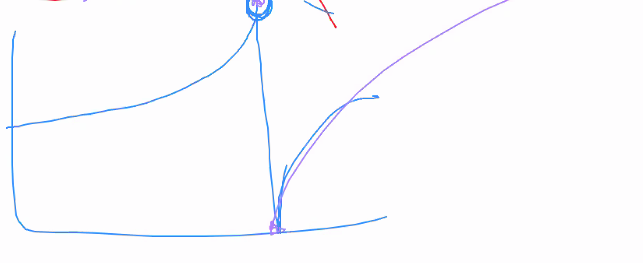

# Appunti della lezione di Mercoledí 17 Giugno 2020

[Live-Electronics-Tutorial/1.[lop~].pd at master · porres/Live-Electronics-Tutorial · GitHub](https://github.com/porres/Live-Electronics-Tutorial/blob/master/Examples/Vol.2/Part.05-Filters(Basic)/22-Filters.types/2.Filter.Types/1.Low:High-Pass/1.%5Blop~%5D.pd)

Fare un pensierino al concorso Verve di Venezia Bando [Confini](http://www.conservatoriovenezia.net/portale/index.php/it/aree-tematiche/eventi/collaborazioni/item/1397-%E2%80%9Cconfini-call-for-electroacoustic-chamber-music%E2%80%9D.html)

________

Come passare in maniera fluida da filtro a oscillatore e come tenere a bada l'ampiezza dell'oscillatore

- implementato coefficenti base di un filtro risonante (per guardare i coefficenti e per controllare che andassero anche nella direzione del filtro di Pellecchia, number di stampa sull'interfaccia di Faust)

- Coefficente omega sulla libreria matematica (angolo con cui stampare i poli in uno z-plane)

- correzzione pitchtracker -> con dichiarazione senza inizializzazione

- Su SEAM -> cartella examples (FIR e Max objects sopratutto per la gestione di x e a)

- FIR brickwall -> realizzato in Faust

- rinominato libreria sulle misure per inserirci il pitchtracker

- filtri pesati, loudness (filtri basati su curve A e C di Fletcher e Munston): utilizzati per usarli con una stima di ampiezza. Peso della sinusoide cambia in funzione della curva utilizzata. Un filtro del genere puó essere utilizzato per realizzato un envelope follower. Molto importante per dare a tutta la gamma di frequenza un peso acustico uguale e non solo numerico. (Curva in linea con le nostre curve percettive)

- Curva DSP per tutti e 4 i canali di amplificazione per allineare componenti.

- Filtro singolo ha il problema di come si comporta il singolo filtro, quando hai un crossover per un altoparlante a 2 componenti(quello che conta è cosa accade al punto del crossover)

- Filtro molto utile per crossover è il **Linkwitz-Riley**, che riparte dall'inversione di fase completa
  
  

importante coerenza di fase nel 5.1 per la localizzazione, lo sweetspot per la sala cinema è piú ampio, poichè essa è fatta almeno con 5/7 altoparlanti frontali e n altoparlanti laterali

Versione basica 7.1 -> ho tanti altoparlanti che fanno la stessa cosa, ho un continuo definire ascolto near field, e fronte è unico full range

________

Formula di JOS fa IIR e FIR a contrario

```Faust
/*BIQUAD FILTER*/
/* y[n]=b0x[n]+b1x[n−1]+b2x[n−2]−a1y[n−1]−a2y[n−2] 
Note that a and b parameters are inverted */
import("stdfaust.lib");

biquad(a0c,a1c,a2c,b1c,b2c) =  a(a0c,a1c,a2c) : ma.sub~(b(b1c,b2c))
with{
    a0(a0c) = *(a0c);
    a1(a1c) = @(1) : *(a1c);
    a2(a2c) = @(2) : *(a2c);

    b1(b1c) = *(b1c);
    b2(b2c) = @(1) : *(b2c);
    //Blocco FIR
    a(a0c,a1c,a2c) = _ <: a0(a0c),a1(a1c),a2(a2c) :> _ ; 
    //Blocco IIR
    b(b1c, b2c) = _ <:  b1(b1c), b2(b2c):> _;
};
//Coefficenti Max
//a = a0(0.9), a1(0.1), a2(0.1);
//b = b1(0.2), b2(0.2);
osco = os.impulse : biquad(1,0,0,-1.95128373,1)*0.1;

// Pitch tracker
a = hslider("n cycles", 1, 1, 100, 1);
upt(a,x) = a*ma.SR / max(M,1) - a * ma.SR * (M == 0)
with{
    // positive zero crossing
    xcr = (x' < 0) & (x >= 0);
    // counts of crossing
    xcnt = +(xcr)~ %(int(a));
    // windows of counts
    wnd = xcr & (xcnt == a);
    // counting samples inside windows
    N = (+(1) : *(1 - wnd)) ~ _;
    // sample and hold the number of cycles
    M = ba.sAndH(N == 0, N' + 1);
};
ptrack(a) = fi.dcblockerat(80) : (fi.lowpass(1) : upt(a)) ~ max(100);

process =  osco : ptrack(10);
```

Frequenza a cui ci atteniamo con il pitch tracker

TODO:

- Filtro risonante simile a quelllo visto, con pomello di risonanza che controlla sia il q che l'ampiezza per farlo esplodere(molto simile a VCS3)
