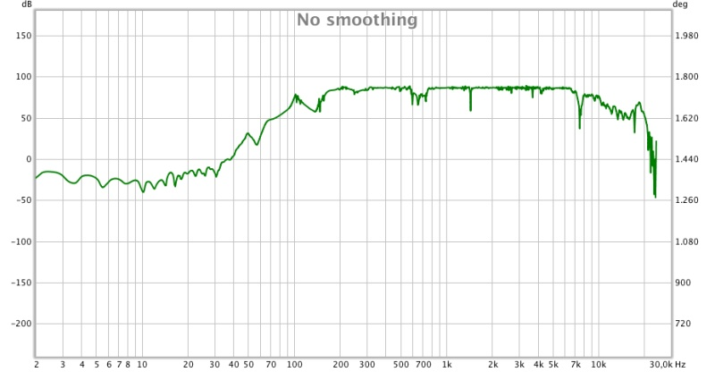

# Appunti della Lezione di Martedi 19 Maggio 2020

TO DO LIST
- IR chitarra classica sistema sensore-attuatore posizione 1 
- [software utilizzato](https://www.roomeqwizard.com/)
- implementazione filtri vari feedback
- primi esempi di sviluppo per feedback(variazioni)
- esempio bottone panic comandato da esecutore in MIDI
- feedback e ritmo
- [Intenzioni_compositive_dello_Studio_n.3](Intenzioni_compositive_dello_Studio_n.3.md)
------------
[VIDEO - implementazione di un LPF e un pedale MIDI(ON/OFF) per controllo del feedback, scordatura durante Feedback](https://youtu.be/7BwwTopM3Ek)

______________

gnu plot > per IR > in 3d e 2d

R versione Open Source di SPSS > programma di statistica piú utilizzato

notch strumento dipendono da catene strumento

notch sfruttare il notch

filtro inverso > per appiattire il filtro

non linearità > caratteristica sonoro

si riesce a riconoscere la posizione dell'attuatore all'ascolto

piú importante della posizione del filtro

erogazione di potenza > produce una saturazione > compressione necessaria

GNU plot > con dati > ricostruzione impulso

[sito gnuplot](http://www.gnuplot.info/)

Equalizzare la versione rovesciata dello sweep per farla venire rovesciata

- schema catena acustica

potenziometro > per volume > potenziometro resistivo logaritmico

sezionando il brano in modo tale da controllare il brano a bande frequenziali precise

per controllo accurato > in fase di scrittura posso generare andamento prosodico del feedback

per far uscire un suono > sistema che procede nel tempo in modo adeguato > quando riconosco un feedback:
- sistema > sta arrivando una freq precisa > pitch detector
- zero crossing

scelta per la delegazione del controllo del feedback:
- digitale > controllo Live Electronics
- potenziometro resistivo > controllo interprete

chi suona sa che sa per succedere questo > promuove e sostiene

scelte compositive opposte > ulteriore aggiunta di virtuosità dello strumentista

ragionare sull'affidabilità

Scelta estetica:
DUETTO ?? > chitarrista e regista di Live Electronics sul palco

Aspetto magico dello studio virtuoso > sopportare con la scrittura

Scelte estetiche sono una galassia di scelte

- ##### schema dettagliato dell'intero processo elettronico

1. digitale
2. amplficazione
3. posizionamente 1 costante e 2 variabili

- escludere le frequenze sopra i 150 hz

ragazza palermitano > chitarra elettrica > Matteo Mancuso > chitarrista elettrico che suono la chitarra come la chitarra classica

virtuosismo si scioglie in chiacchere

_Chitarra è un po' come la Fisarmonica > sono competizioni sportive_

Pianoforte Queen Mary > può rinascere con tecniche forti e molto evoluto rispetto al precedente

Uccellacci e Uccellini diretto da Pasolini > poesia incredibile

- bibliografia > ??

cominciare ad osservare > la teoria dei transistor > feedback negativo e feedback positivo > testi di _Teoria dei Controlli_

Fletcher Rossing > analisi vibrazionali
