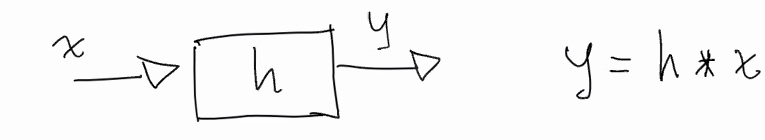
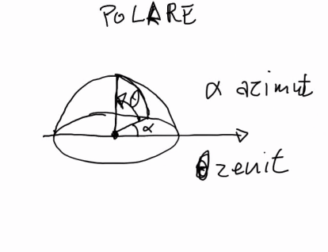
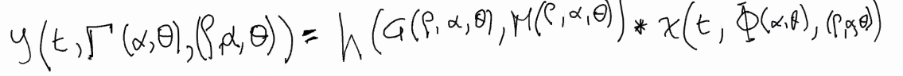

# Appunti della lezione di Mercoledí 27 Maggio 2020

Revisione strumenti del corso

Tema principale **Acustica degli ambienti**

Intenzione di coordinarci con Pasquale per i temi del corso di Acustica con i temi di Infromatica musicale

In corso di Acustica:
1. fenomeni fisici alla base della propagazione del suono-> acustica degli spazi
2. ambienza e classificazione delle sorgenti

Idea che tutto ciò abbia un fenomeno pratico

i 2 filoni paralleli del corso:
- trattazione dei fenomeni di propagazione ed interazione con i materiali

- vedere nel dettaglio i meccansimi di percezione di basso livello dello spazio e di percezione delle sorgenti

rapida revisione degli strumenti

per la lavagna usiamo webex

gestione dei gruppi classe utile e funzionante

parlare dei meccansmi percettivi

Lavagne > sono quelle che useremo di volta in volta

Le lavagne rimangono disponibili su Webex

altro strumento principe [pbworks](http://sceciliasmerm.pbworks.com/w/page/133028052/Acustica%20degli%20Ambienti%20Musicali)

su pbworks -> risorse e wiki, strumento collaborativo e di partecipazione

Anno scorso -> software di analisi acustica -> per analisi preventiva di grandezze acustiche di uno spazio

Per capire interventi e misure piú opportune per correggere l'acustica di uno spazio

Stilare l'indice della lezione e dell'incontro

Spazio dal punto di vista acustico

##### Libri
Master Handbook of Acoustics -> tomo che tratta di molti temi legati all'acustica, alla fisica acustica ambientale -> ottimo punto di partenza per approfondire temi a diversi livelli di approfondimento

##### Elementi Web
Hyperphysics ad esempio, applet di Falstad, REW -> software per fare l'analisi degli spazi, altro link, applet AMROC -> modello molto semplice di sintesi della risposta all'impulso di uno spazio parallelepipedo a scopo dimostrativo
____________
### Come si affronta lo studio degli ambienti dal punto di vista dell'acustica

Obiettivo è cercare di studiare il campo emesso da una sorgente all'interno di uno spazio e ricevuto da un punto di ricezione

Variabili e gradi di libertà in gioco sono tanti

Dal punto di vista della **sorgente** cosa entra in gioco:
1. il **tipo di segnale* (come è fatto da un punto di vista spettrotemporale il segnale)
2. **funzione di emessione del suono**(o direttività), qual'è il diagramma di potenza
3. **posizione** (posizione sorgente influisce per l'ascoltatore)

Dal punto di vista dell'**ascoltatore** cosa entra in gioco:
1. **funzione spaziale di ricezione** o sensibilità
2. la **posizione** (a seconda della posizione, otterrò una risposta ogni volta diversa)

Dal punto di vista dello **spazio** cosa entra in gioco:
1. **geometria dello spazio**(una delle cose piú difficili è la generalizzazione di uno spazio)(realizzazione di ambienti per previsioni del campo acustico nel caso di una geometria e forma completamente libera)(plugin e software di progettazione architettonica per simulazione degli ambienti)(idea che un ambiente debba essere fruibile anche a livello acustico è una cosa che sta prendendo piede da non moltissimi anni, adesso anche la gradevolezza acustica di un ambiente fa parte dell'ambiente)(Esempio del bar con rumore di fondo)(molti studi di acustica architettonica per progettazione di realizzazione della risposta acustica degli ambienti)
2. **materiali**(spazio è struttura fatta di materiali diversi)(materiali capacità di assorbimento e diffusione dell'energia)(ogni materiale ha una sua risposta)

da un punto di vista matematico possono risultare molto complessi matematicamente

trattando in formula matematica con uno schemino

processo di elaborazione di un segnale

risposta del sistema y è la convoluzione del segnale con risposta all'impulso del sistema

diagramma di emissione in cui ho bisogni di 2 angoli

x =  segnale di ingresso
t = tempo
alfa = direzione rispetto al piano orizzonatale chiamato _azimut_
tetha = angolo che dal piano orizzontale porta verso chiamato _zenit_

fi maiuscola = funzione a 3 dimensioni che definisce la _potenza di emissione_ della sorgente in una data emissione (esempio emissione omnidirezionale avremmo la fi )

modello cartesiano: x e y

modello polare -> direzione, modulo e angolo

riferimento polare per rappresentare 3 grandezze x,y e z oppure modulo, angolo 1 e angolo 2

##### Polare
2 angoli

##### Cartesiano
Azimut = piano xy (piano orizzontale)
Zenit = dimensione z

variabili del segnale in ingresso

potenza di ricezione dell'ascoltatore gamma

segnale in ingresso dipendente da phi alpha e tetha

da un punto di vista di modello lo spazio si comporta come un filtro

Lo spazio prende in ingresso un segnale e restituisce un segnale in un altro punto dello spazio

Questo modello ha talmente tante variabili che affrontarne lo studio è un qualcosa di delicato da affrontare a diversi livelli di approssimazione

variabile dimenticata ad esempio è quella di movimento

esempio di risposta all'impulso -> fatta con un microfono ed un emettitore ed è diverso

la funzione di emissione descritta sopra è sia spaziale che frequenziale sia per la sorgente che per l'ascoltatore

per avere una sorgente di emissione omnidirezionale > sfera a 0 dB a qualsiasi frequenza ed in qualsiasi omnidirezionale

ricevitore ideale -> sfera che rimane a tutte le frequenze ad ampiezza uguale

panoramica dei metodi che si usa pe lo studio dello spazio

Lavoro di tesi > software di proggettazione acustica che usa un modello

prendendo la risposta all'impulso di un ambiente non sto riprendendo la risposta all'impulso piú generale ma lo sto facendo soltanto per una coppia

Infatti software di proggettazione acustica assisita come [Ramsete](http://www.ramsete.com/)-> software per fare simulazioni per una serie di sorgenti e gruppo di ricevitori

precisione della risposta all'impulso aumenta sulla base di quante ne ho, aumenta la precisione ed il carico di analisi

simulazione -> proggettazione

ripresa -> ambiente esistente

se devo proggettare un auditorium -> elementi in gioco -> qualità di ricezione di chi fluisce di questo Spazio

software permettono di fare simulazioni che tengono conto della sala -> poichè risposta dell'ambiente cambia notevolemnte
____________

Come si fa a studiare la risposta di uno spazio acustico 3 metodi:

1. **analisi ondulatoria o modale** (scrivo equazioni campo acustico, equazioni differenziale, dopodichè le risolvo usando le condizioni al contorno imposte dall'ambiente)(pattern di onde stazionarie che si stabiliscono in sistemi molto semplici)(a.disegno struttura a una dimensione b. condizioni di vincolo)(studio della forma e famiglia di onde stazionarie, armoniche)(tutti gli strumenti a colonna d'aria e a corda sono armonici)(stesso approccio agli spazi come colonna d'aria o corda, trovando frequenze e modi naturali di quello spazio)(appena le cose si complicano un po' trattazione matematica che diventa insostenibile) (modi per non impazzire con la matematica) _descrive completamente la risposta dello spazio, ma è spesso irrisolvibile_
2. **approccio geometrico** (approccio creazione a 3 dimensioni virtuali)(simulazione del risultato di illuminazione dello spazio) (considerare l'energia come viaggiante con deviazioni precise, come dei raggi)(si usa sorgenti virtuali, retracing, con algoritmi di simulazioni si cerca di prevedere risultato di approssimazione -> che però è valida solo a un certo range di frequenze)
3. **approccio del campo diffuso** -> si valuta il campo acustico attraverso l'ipotesi che passato un po' di tempo l'energia si è diffusa omogeneamente nello spazio, condizioni macroscopiche | tempo di riverberazione | fronte d'onda sferico che urta le pareti, fronte d'onda che si spezza e riflette e cosí via, la sfera si frammenta in milioni di coriandoli, la situazione ergotica è una situazione in cui i coriandoli, si distribuiscono in maniera uniforme in uno spazio -> come con  un gas descrivo il sistema con grandezze macroscopiche -> non è vero che il campo acustico è ergotico -> capire il confine tra un approccio ergotico e non

Quindi oltre analisi ondulatoria o modale, è utile l'integrazione di varie metodologie a frequenze diverse

Equazione di Schrodër per considerare da quale frequenza in poi considerare l'approccio statistico e modale
