# Appunti della lezione di mercoledí 3 Giugno 2020

La scorsa volta abbiamo elencato i tipi di approccio che si usano nell'analisi degli ambienti(e spazi musicali)

Abbiamo elencato i 3 approcci utilizzati per l'analisi degli ambienti:

- ondulatorio o modale
- geometrico
- statistico

____

Cos'è un modo naturale di un sistema?

Richiamo del significato dei modi naturali, partendo dallo studio dei modi naturali di una coppia di pareti parallele.

Supponendo di avere una coppia di pareti parallele e perfettamente riflettenti.
Esistenza delle 2 pareti riflettenti determina dei vincoli per il campo acustico.
In corrispondenza delle pareti troviamo 2 ventri. Punti massimi di pressione.

Posso dunque stabilire il modo naturale piú grave al centro del sistema.

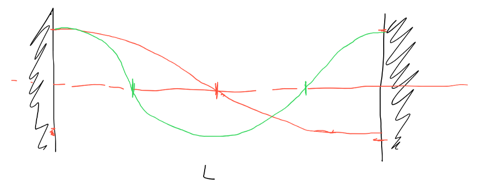
L = lunghezza fra le pareti
L = λ1/2 -> c = λ1f -> f1=c/2L

Aggiungendo un nodo posso quindi disegnare il profilo di pressione del secondo modo naturale, compatibile con i vincoli imposti dalle pareti e dunuque

L = λ2 -> f2=c/L=2f1

Troviamo quindi una famiglia di modi naturali, per i quali la frequenza associata ad ogni modo è uguale a -> fn=n*f1

Quindi nel momento in cui do energia al sistema(ad esempio sparando un colpo di pistola), tutte le frequenze si propagano nel sistema, ma quelle frequenze che non fanno parte del sistema si spengono piú velocemente; mentre tutte le frequenze che fanno parte della famiglia delle onde stazionarie armoniche, continuano a vivere piú a lungo.

Il risultato della sovrapposizione di queste onde stazionarie, sarà (secondo il Teorema di Fourier) dotato di altezza. Dunque quello che viene fuori dal filtraggio di queste pareti è un suono che è dotato di pitch.

La risposta in frequenza prescinde dal fatto che ci sia un'energia all'interno del sistema, la risposta in frequenza è quindi come è descritto il filtro realizzato dalle 2 pareti.

Se facessi un'analisi della frequenza, troverei che la famiglia delle armoniche viene eccitata.

(Esempio del battere le mani nel garage)

La funzione di trasferimento del filtro è una funzione nel dominio di Laplace, che racchiude dentro di se, il comportamento del filtro.

Se ho un sistema LTI(lineare tempo variante), l'uscita di questo sistema (y(t)) è data dalla convoluzione dell'ingresso e una funzione particolare chiamata risposta all'impulso

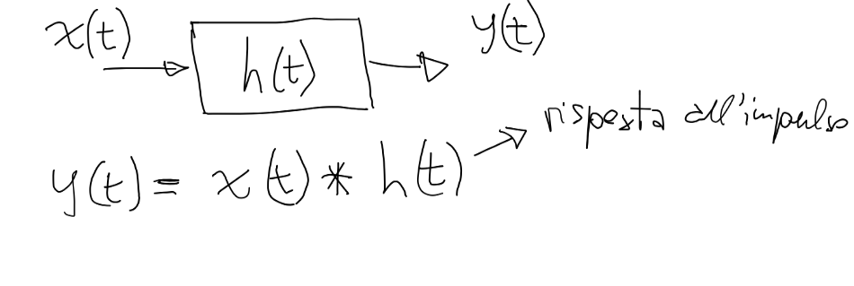

IR è l'uscita del sistema quando io gli do in ingresso una funzione matematica particolare chiamata _impulso di Dirac_, impulso per definizione è una funzione neutra(come se valesse 1), dunque facendo la convoluzione tra i(t) (impulso di dirac).

i(t)•h(t) = h(t)

Un ambiente possiamo considerarlo sicuramente come un filtro, ma non ha un solo filo di uscita, esso deve tener conto della posizione della sorgente e della posizione del microfono.

I database delle IR, sono una possibile risposta all'impulso di un ambiente, poichè sono un accoppiamento di una sorgente ed un ricevitore.

Devo dunque campionare tutto lo spazio per capire come si comporta, avendo un'idea generale del comportamento dello spazio, capendo se ci sono punti in cui ci sono criticità.

A seconda del tipo di destinazione d'uso() spazio reale o spazio non esistente):

- auditorium -> progetto lo spazio della platea, fissando un certo numero di punti, software fa la simulazione e posso quindi avere risultati
- analisi di uno spazio esistente -> riprese diverse per ognuno dei punti che mi interessa, riprendo certo numero di punti in base alle disponibilità che ho

La IR è una funzione del tempo, segnale di ingresso in _t_, segnale di uscita in _t_,  dalla convoluzione ho una risposta in funzione del tempo.

Dalla Risposta all'impulso derivo la **funzione di trasferimento**, _H(s)_

s non è variabile tempo o frequenza, ma è nel dominio di LaPlace, chiamata **variabile di LaPlace**

Funzione di trasferimento ha tutte le risposte che servono della risposta all'impulso, nel momento in cui calcolo H per una variabile _(jω)_ la funzione diviene _H(jω)_

_H(jω)_ la chiamiamo **Risposta in frequenza**, di essa mi interessa sia il modulo(| _H(jω)_ |) che la fase

Quando mi interesso della risposta in frequenza sto tagliando fuori il tempo, dunque la risposta in frequenza è rappresentativa solo di un momento nel tempo in cui un sistema si è assestato.

Se dalla risposta all'impulso mi ricavo la risposta in frequenza mi sto occupando della parte stazionaria del sistema.

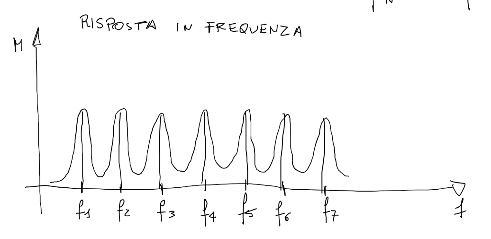
Filtraggio della risposta in frequenza viene chiamato _comb_, poichè assomiglia ad un pettine, dunque qualunque frequenza diversa da quelle che corrispondono ai picchi, viene effettivamente attenuata, solo le frequenze in corrispondenza dei picchi vengono enfatizzati.

Se non so che risposta ho in un'ambiente devo sviluppare un'equazione differenziale (impongo massima pressione sui vincoli alle pareti) con caratteristiche particolari.

Portare l'esempio descritto in un parallelepipedo di 6 pareti, trovando le soluzioni come le abbiamo trovate per le 2 pareti, cioè estendiamo il ragionamento per uno spazio a 3 dimensioni.

Il campo per le 6 pareti, avremo un'equazione a 3 dimensioni, equazione differenziale di funzioni tridimensionali, piú le condizioni di contorno e dunque avremmo qualcosa che si puó risolvere.

Per il parallelepipedo, in teoria dovrebbero essere molto semplici i calcoli...

Attraverso l'utilizzo dell'[applet Falstad](https://www.falstad.com/modebox/), abbiamo 3 indici.

**Modi assiali** o **monodimensionali** (1,0,0) o (0,0,1) che fanno riferimento esclusivamente ad una coppia di pareti.
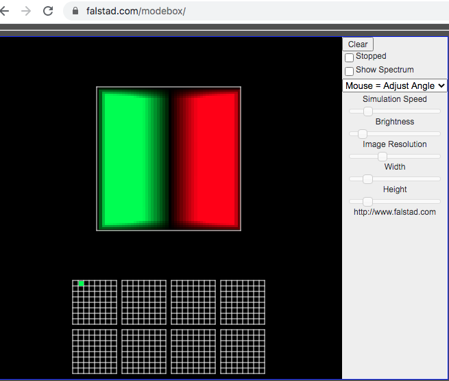

(1,1,0), in questo caso sto implicando due indici e dunque 2 coppie di pareti, **modi tangenziali** e sono modi a due dimensioni, ognuno di questi modi ha una sua frequenza associata.
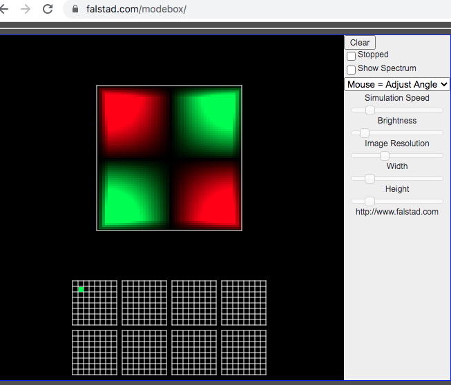

La velocità del mezzo è in quadratura di fase con la pressione.
Percorso chiuso all'interno delle 4 pareti, dunque nei punti in verde deve essere 0 la velocità del mezzo, ovvero dove la pressione ha un ventre, la velocità del mezzo ha un nodo.
Il percorso che fa l'onda si chiude, e l'onda percorre 2 lunghezze d'onda, facendo venir fuori quello che vediamo nella figura precedente. Considerando un percorso a 2 dimensioni che tocca 4 pareti.

Come abbiamo trovato la frequenza per le 2 pareti parallele, troviamo una relazione che mette in relazione 4 pareti

Questi modi si chiamano modi tangenziali a 2 dimensioni e sono bidimensionali.

Tutte le matrici accostate sono in realtà come il cubo di Rubik.

Modo (1,1,1) ha 3 superfici nodali, in cui ho un piano diverso in ogni dimensione.
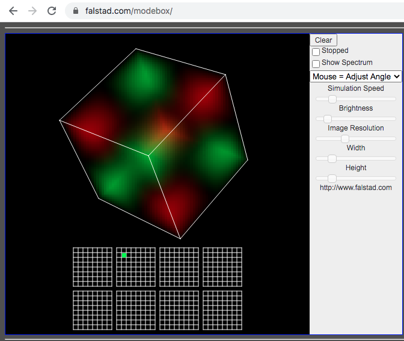
Questo modo implica tutte e 6 le pareti, e questi modi che implicano ed abbracciano tutte e 6 le pareti si chiamano **modi obliqui** o **tridimensionali**.

Membrana è sostanzialmente a 2 dimensioni, lo spazio è invece a 3 dimensioni e dunque abbiamo 3 indici associati alla descrizione.

Nella prima matrice non entra mai in gioco la terza coppia di pareti, mentre nella seconda matrice inizia ad esser presente la terza coppia di pareti.

Dal sito di amcoustics troviamo il [Room Mode Calculator](https://amcoustics.com/tools/amroc?l=500&w=700&h=300&fo=200&fu=21&r60=0.6), che ci permette di calcolare i modi naturali di una stanza, facendoci intendere dove sono i modi naturali relativi di una stanza con riferimenti alla coppia di pareti e al modo.

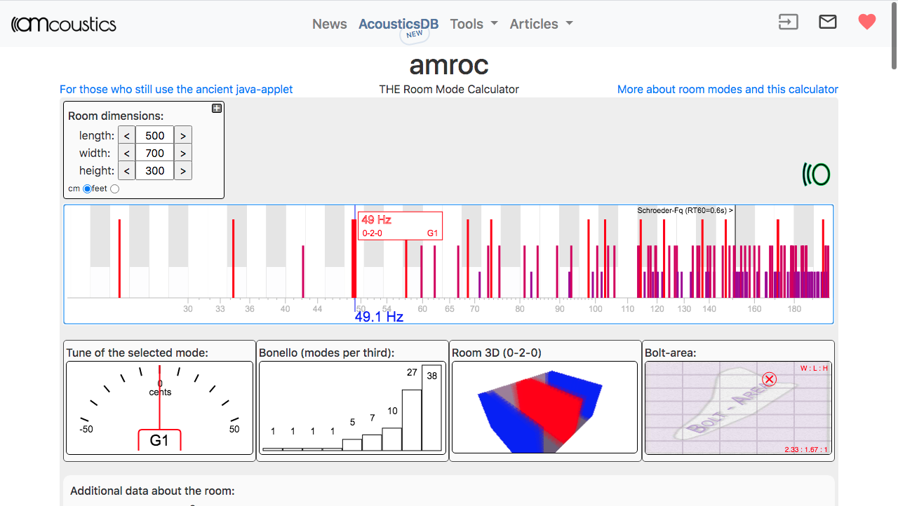

Piú andiamo avanti con la frequenza, piú si infittiscono le frequenze associate ai modi naturali.

Utilizzando sempre l'applet, scorrendo sulla pagina del Room Mode Calculator, vediamo tutti i dati delle frequenze del modo:

- frequenza
- nota
- tipologia di modo(assiale, tangenziale o obliquo)

Dunque man mano che saliamo in frequenza c'è una densità sempre maggiore di modi naturali.

Al di sotto vediamo il grafico denominato _Bonello(modi per terza)_ ci fa vedere quanti modi cascano all'interno della terza in esame.
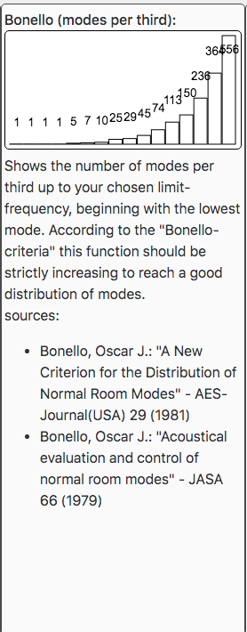

Relazione che ci dice qual'è la densità frequenziale dei modi naturali ovvero numero di modi per unità di frequenza.

D(Nf)= 4πV•(f^2/c^3)

La densità dei modi è proporzionale al volume e cresce con il quadrato della frequenza.
La curva in Bonello sembra infatti sostanzialmente una parabola.

Altra cosa da notare guardando lo schema delle frequenze dei modi naturali, vediamo la frequenza indicata la frequenza di Schreder, che nel caso in esame vale 151 Hz, essa è lo spartiacque tra 2 situazioni molto diverse.

Prima della frequenza di Schroeder, la densità di modi è tale da giustificare un approccio di tipo modale, oltre essa non ha senso usare l'approccio modale e sarà meglio descrivere la risposta dello spazio in termini di grandezze aggregate.

Nel momento in cui lo spazio diventa piú complesso e dunque diventa piú difficile risolvere le equazioni differenziali.

A più senso dopo la frequenza di Schroeder, ovvero quando la lunghezza d'onda diventa piú piccola, allora la distribuzione dell'energia per i modi sviluppati in frequenza, che possiamo intendere che i modi a frequenza sempre piú alta, contribuiscono ad una diffusione uniforme dell'energia, condizioni chiamate di _campo diffuso._ Per la situazione del campo diffuso ha piú senso descrivere le grandezze uniformemente e non singolarmente.

Riverbero descritto in genere con:

- tipologia spazio
- grandezza spazio

Senza andare nel dettaglio dunque, come la descrizione del comportamento del gas, che mi interessa descrivere macroscopicamente.

Dopo la frequenza di Schroeder ha senso valutare lo spazio in termini di grandezze macroscopiche. Quando analizziamo il comportamento di uno spazio dobbiamo pensarlo in due modi:

- comportamento microscopico
- comportamento macroscopico

All'ingrandirsi di uno spazio, minore sarà la frequenza di Schroeder, poichè le dimensioni dello spazio saranno più grandi delle dimensioni in gioco.
In spazio piccolo, lunghezze d'onda piú piccole dello spazio in cui ci si trova.
In spazio grande, ha piú senso trattare geometricamente ed in modo macroscopico il luogo.

Valuto uno studio -> analisi modale
Valuto un auditorium -> analisi geometrica.

Fino ad ora abbiamo parlato di modi naturali del campo associati a pareti parallele, dunque il filtro è relativo ai modi naturali.

Dunque se eccito il filtro con un impulso(sparo o battito di mani), risuoneranno prevalentemente frequenze nodali.

Se avessi un oscillatore, se mi sintonizzassi su una delle frequenze dei modi naturali, dovrei eccitare il corrispondente modo, e spostandomi anche di mezzo Hz, dovrei uscire dal fenomeno della risonanza.

Nella realtà se il modo fosse naturale, come mi sposto di poco, dovrei uscire dalla risonanza. Per il fatto che le pareti non  sono mai totalmente riflettenti, dunque le pareti sono piú un filtro a campana, ovvero come un filtro risonante. Dunque quel modo risonante risponde ad una banda, e non a una frequenza singola.

Rapporto tra energia riflessa(Er) e l'energia incidente(Ei), alfa è sempre maggiore di 0.

α è il coefficente di assorbimento

α = 1-(Er/Ei) >0

Parete perfettamente assorbente avrebbe coefficente α = 1, parete perfettamente riflettente avrebbe coefficente α = 0.

Nella realtà una parete ha sicuramente un α>0.

α ovviamente ha un comportamento diverso per ogni frequenza e dunque α = α(f).

Quindi la risonanza non è perfetta, ma è una campana.

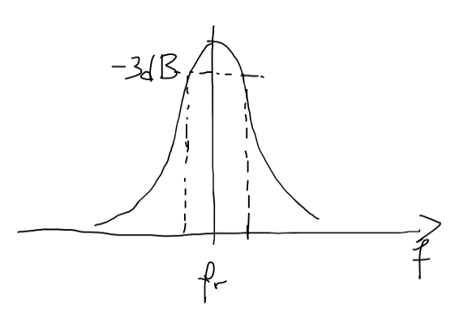

E se dunque i modi sono piú numerosi avviene una sovrapposizione di campane

delta = coefficente di smorzamento per un certo modo naturale

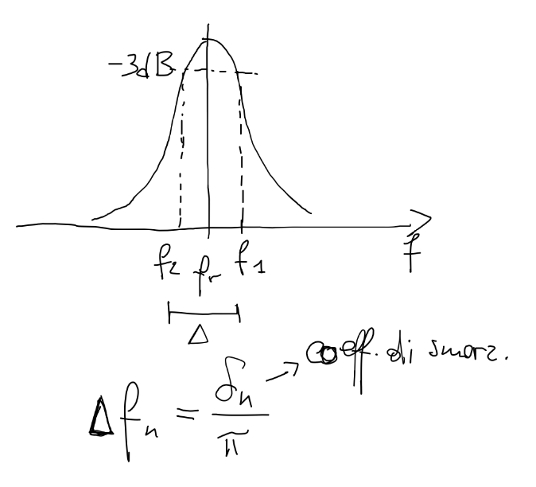

Da una certa frequenza in poi potrò avere diversi modi naturali ad ampiezze diverse e coefficente di assorbimento di modi diversi, e dunque le campane si sovrapporranno.

Piú la parete è assorbente, piú la situazione si complica, poichè la campana si allarga.

Se mi metto con un oscillatore, ad una frequenza, cascheranno dunque diversi modi naturali in piú di una campana dei modi naturali.

L'applet vista, suppone che tutt le pareti siano ideali, mentre il simulatore REW, realizza il lavoro con piú precisione e accuratezza.
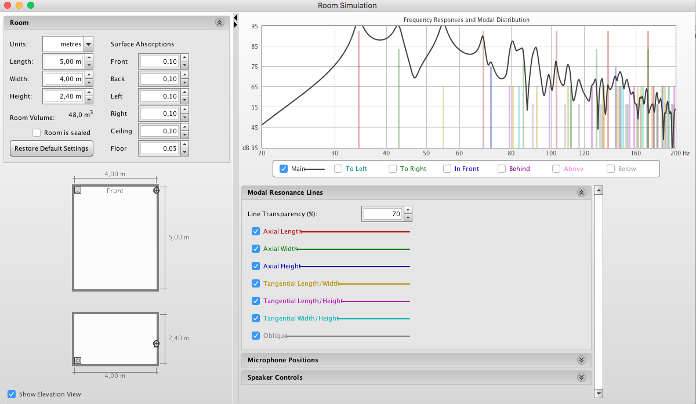

Coefficente di assorbimento di una parete?
Caratteristiche delle pareti per la correzione o la progettazione di uno spazio.

Nei software previsionali, ho database con materiali che posso utilizzare, e che sono valutati in tutta la banda.

_______

Se ho una parete, se anche vale l'approssimazione geometrica, se mando della luce sulla parete, il raggio riflesso non è piú un raggio, ma diviene un fascio di luce.(secondo la legge di Snell-Cartesio)

Quando la parete non è perfettamente lucida, l'energia viene diffusa e non la concentra nella direzione dell'onda incidente, ma la diffonde. Che è il motivo per cui noi vediamo il cielo azzurro. Se non avessimo l'atmosfera con dei gas che diffondessero la luce, vedremo il sole come si vede dallo spazio. Poichè ci sono delle molecole nei gas atmosferici, che sono della grandezza della luce blu proveniente dal sole, è per questo motivo che la luce blu viene diffusa nel cielo.

Un raggio riesce a conservare la sua direzionalità, dunque un fronte d'onda piano con una superficie molto piccola.

Differentemente dalla luce in cui la radiazione ha grosso modo 2 ordini di grandezza, mentre nel campo acustico la lunghezza d'onda è sparsa su 3 ordini, con dunque pluralità di lunghezze. Dunnque comportamento diverso in funzione della banda analizzata.

Dunque ad un coefficiente di assorbimento maggiore

Facendo la misura di uno spazio esistente, misuro la risposta in frequenza di uno spazio ed avró delle risposte all'impulso che hanno determinate caratteristiche. Se trovo un'enfasi ad una particolare banda, quello che posso fare per intervenire,

Se trovo che c'è una risonanza molto forte, mi interessa capire da dove viene fuori quella risonanza, e che tipo di modo è coinvolto, se ha una frequenza bassa, è modo tangenziale. Se è un modo assiale, quale coppie di pareti coinvolge.

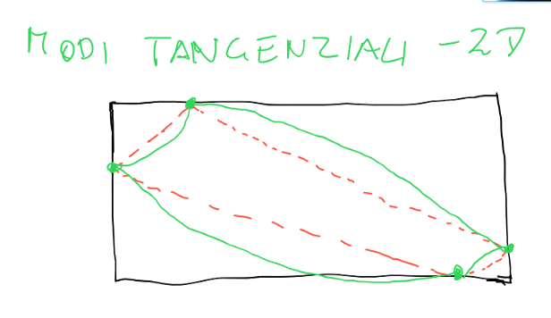

Obiettivo per la risposta in frequenza è appiattire il piú possibile la curva, ma non solo. E poi quello che vediamo nella risposta in frequenza, è la parte del comportamento stazionario del mio filtro e non mi dice nulla ad esempio dei rapporti di fase(spettro delle fasi).

Se guardiamo lo spettro del modulo di un impulso, essa è piatta e costante a tutte le frequenze. Anche di un white noise, ma se guardiamo lo spettro di fase dei due suoni è molto diverso. Dunque la risposta in frequenza non dice mai tutta la storia.
La risposta in frequenza ci da una fotografia infinita, che non tiene conto della transitorietà e del tempo, che è molto importante per la musica.

Uno dei segnali piú complessi da questo punto di vista è il parlato, che ha una tempo varianza estremamente particolare.

[Articolo Chafe Sintesi Vocale](https://ccrma.stanford.edu/~cc/vox/smac2013som/)
