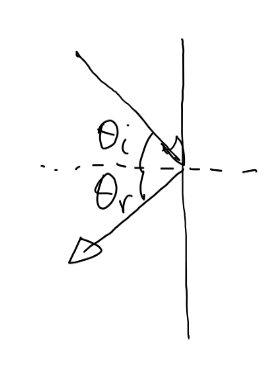

# Appunti della lezione di Mercoledi 10 Giugno 2020

##### Richiami alla scorsa lezione

La scorsa volta abbiamo cominciato a trattare dell'approccio geometrico.

Prima di approfondire l'approccio geometrico, approfondiamo ulteriormentel'approccio modale.

Abbiamo visto che la frequenza di Schroeder è quella frequenza tale che possiamo trattare la risposta dell'ambiente in modo statistico.

Citiamo dunque una relazione che ci permette di apprezzare la frequenza di Schoreder.

### Il calcolo della frequenza di Schroeder

##### Calcolo frequenza di Schroeder da Volume e coefficente di smorzamento medio

fl = 5000/√(V*delta medio) Hz

fl sta per frequenza limite

in cui V = è il volume dello spazio

delta medio = coefficente di smorzamento medio dei modi

##### Calcolo della frequenza di Schroeder

fl = 2000*√(Tr/V) Hz

in cui TR = tempo di riverberazione -> tempo oltre il quale la risposta diminuisce di 60 dB, dunque il tempo in cui la risposta si abbassa di un millionesimo

c'è una relazione fissa tra delta medio e tempo di smorzamento di riverberazione

_le costanti vengono fuori da calcoli per frequenza approssimata_

_Esempio 1_

Se

 V = 500 m^3 

RT = 25 s

fl = 126 Hz

*Esempio 2*

Se

V = 50 m^3

Tr = 0.5 s

fl = 200 Hz

La frequenza è direttamente proporzionale rispetto al volume ed inversamente proporzionale al tempo di riverberazione

A _V_ costante se _Tr_ aumenta aumenta anche _fl_

A parità di _Tr_ la variabile in gioco è l'ampiezza, e dunque il volume piú grande sarà connotato da frequenza di Schroeder piú bassa, la si intuisce poichè in un volume piú grande, il campo in cui essa si comporta come un campo diffuso è piú bassa, perchè i modi naturali coinvolti saranno di piú.

I due calcoli sono simili, poichè c'è una correlazione tra Tr e coefficente di smorzamento medio

Tr = 6.9/delta medio s

All'aumentare dello smorzamento medio, il tempo di riverberazione diminuisce.

Dunque il secondo calcolo è piú utilizzabile nel nostro campo

______________

Se abbiamo un solo modo e lo rappresentiamo linearmente (in esponenziale decrescente)

lo rappresentiamo logaritmicamente

La curva esponenziale in una curva logaritmica diventa esponenziale

Con piú nodi andamento sarà piú o meno lineare, e l'andamento della retta da la misura del tempo di riverberazione

In una situazione come quella sottostante ci dice che abbiamo due stanze, e dunque due rette che si incrociano (risposte differenti cucite)

Dunque in questa curva ci sono effetti di accoppiamento di piú ambienti.

### Approccio Geometrico

Studiare il campo acustico in condizione di approssimazione geometrica, ovvero trattare la diffusione e propagazione del campo acustico, come se fosse governata da oggetti che noi chiamiamo raggi.(pensando alla luce capiamo bene cosa sia un raggio)Un laser ad esempio è un fascio di luce coerente, che si comporta in modo tale che la sua propagazione si puó ricavare con formule semplici, come la formula di Snell-Cartesio, e dunque se raggio incontra una parete con un certo coefficente di riflessione, il raggio viene riflesso con un angolo uguale a quello di incidenza calcolato sulla perpendicolare della parete. 

Si capisce che questo approccio ha senso in una regione frequenziale le lunghezze d'onda in gioco sono piú piccole delle grandezze medie in gioco nello spazio, perchè altrimenti questo approccio non tiene conto di alcuni fenomeni: diffrazione e diffusione(che sono legati al campo).

L'approccio geometrico dunque definisce il fatto che il campo sia un proiettile.

Dunque da una lunghezza d'onda in poi calcolo la risposta del sistema geometricamente.

Sostanzialmente i due approcci che si usano sono:

1. ray tracing

2. sorgenti virtuali

Tutte e due impiegate in software commerciali che realizzano la previsione acustica degli ambienti.

##### Ray tracing

Il **ray tracing** consiste in prendere una sorgente; come se fosse la sorgente di un certo numero di raggi, supponendo che da essa partano un tot di raggi; calcolando il percorso di ogni raggio per capire quali raggiungo il punto prefissato. Per software di modellazione 3D, dopo aver scelto la scena, si fa il rendering, ovvero versione renderizzata con una visualizzazione del panorama luminoso ricavato da ciò che gli abbiamo dato in ingresso e ciò ci fa visualizzare la scena illuminata.

##### Sorgenti virtuali

Immaginando di avere un punto in una scatola, e l'ascoltatore messo in un altro punto. Invece di usare un approccio ray tracing, le pareti sono degli specchi, dunque posso sostituire al posto della parete, una sorgene virtuale facendo una simmetria all'esterno della scatola, avrò dunque tot sorgenti virtuali per quante pareti ho.

Posso sostituire il primo ordine di riflessioni con le 4 sorgenti virtuali realizzate con relazione di simmetria; quando si accende sorgente reale, si accendono quelle virtuali.

L'ascoltatore viene investito da sorgente diretta e 4 sorgenti virtuali.

Il suono delle 4 sorgenti va moltiplicato per un coefficente. Che ogni parete ha diverso (alfa), e dunque il raggio riflesso dipende dal coefficente di attenuazione.

Come faccio ad ottenere le sorgenti del secondo ordine??

Le 4 sorgenti virtuali del primo ordine mi permetto di restituire la traiettoria del raggio quando incontra una parete.

Le sorgenti del secondo ordine mi permetto invece di restituire il rimbalzo del raggio con due pareti.

Prendendo ad esempio _Sa_ e considerando che essa sia una sorgente reale, facciamo un'operazione di simmetria rispetto alla parete _c_.

_Esempio con 2 sole pareti ed una sola sorgente virtuale del primo ordine_

Percorso del tratto verde+rosso = tratto azzurro+rosso

Il raggio da Sa all'ascoltatore sarà attenuato da coefficente di attenuazione della parete e ritardato dal fatto che da _Sa_ all'ascoltatore c'è piú distanza che tra _S_ e l'ascoltatore.

Come fatto per il primo ordine, ottengo la sorgente _Sab_ che è ottenuta dalla riflessione attraverso 2 pareti(a e b), essa sarà una sorgente del secondo ordine, poichè ottenuta dalla riflessione attraverso 2 pareti. Se collego _Sab_ al punto di ricezione, dal punto che interseca la parete b di _Sab_ tiro la congiungente con _Sa_ e la congiungente con _S_ ed ho ottenuto tutto il percorso del raggio che picchia sulle due pareti. Quindi il percorso che congiunge la sorgente _Sab_ con la sorgente, è lo stesso che ho con tutto il percorso _S_, _Sa_ ed _Sab_.

Otterro dunque una costellazione che mi danno il contributo delle cosidette **prime riflessioni**.

Con le varie sorgenti si forma un reticolo, e quando si accende la sorgente reale, si accendono anche le sorgenti virtuali.

Quando mi devo fermare nel calcolare le sorgenti virtuali?

Il contributo sorgenti immagine è interessante fino a quando è percepibile questo contributo.

Piú bassa fisso la soglia del rumore, e dunque piú alto sarà l'onere di calcolo.

Le due pareti laterali hanno piú attenuazione di quella frontale e posteriore.

Grafico che corrisponde alla risposta di una parete che ha una convessità

Il pattern sottostante è invece piú generale

Di questi punti (sorgenti), l'ascoltatore indicato con una x, ne sentirà solo un tot, dunque posso ricavarmi la popolazione di tutte le sorgenti virtuali, ma esse non saranno utili sempre, e la loro utilità dipenderà dalla posizione dell'ascoltatore.

Nel secondo grafico vediamo le sorgenti utili della sorgente stando in quella determinata posizione.

**Differenze sostanziali tra ray tracing e sorgenti virtuali**, la differenza sostanziale sta nella complessità di calcolo. Con il ray tracing ho bisogno di una _potenza di calcolo costante_, ciò è indipendente dallo spazio o dall'ascoltatore. Nel caso delle sorgenti virtuali non ho un'approssimazione, perchè posso calcolare tutte le sorgenti virtuali che mi servono, dunque al crescere delle pareti e delle sorgenti che calcolo, il calcolo aumento. Primo ordine (n calcolo), secondo ordine(n*(n-1)), terzo ordine (n*(n-1)*(n-1)).

Dunque la complessità dell'algoritmo di sorgenti virtuali ha complessità _esponenziale_ (n*(n-1)^k).

Tubo ottagonale

Quando accendiamo la sorgente, l'ascoltatore viene investito dal suono diretto e da una moltitudine di sorgenti virtuali, opportunamente attenuate per assorbimento, attenuazione, ed in base all'aria(che si comporta come un LP che varia in funzione della distanza).

fc(d) funzione che da la frequenza di taglio in funzione della distanza

Motivo per cui se cade un fulmine io sento un tuono, perchè ciò che mi arriva è tutta la parte filtrata e mi arriva tutto il contributo delle medio-gravi.

Nel caso in cui ci si trovi vicino a fulmine, si sente buona parte delle frequenze contenute nella scintilla. Essa non è una sorgente lineare, ma già a 20 metri/50 metri lo si puó considerare come un petardo.

Il suono di un fulmine vicino, anfora gigante che precipita da 200 metri, l'attacco del suono è percussivo e poi viene la parte esplosiva.

Facendosi due conti sull'effetto dell'aria, già a 6 metri di distanza la frequenza è in banda audio.

A distanza di un km la frequenza di taglio è intorno ai 600Hz, ció vuol dire che a 5Khz l'attenuazione è di 44dB.

Bisogna pensare che il nostro sistema percettivo ha tutte queste funzioni incorporate.
