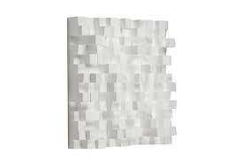

# Appunti della lezione di Mercoledí 17 Giugno 2020

##### Ripasso della scorsa lezione

Variabilità tra ritardo suono diretto e prima riflessione, esso è importante poichè ci da un'idea della collocazione della sorgente all'interno di uno spazio.

##### Sorgenti virtuali in tesi Giordano

Posizione sorgente e posizione cavità, segnale risultante (segnale visibile) ovvero tutte le sorgenti ascoltabili.

2 risposte all'impulso relativi alle due orecchie, per le due orecchie, ovvero risposte all'impulso binaurale.

L'approccio geometrico parte dal presupposto che le lunghezze d'onda in gioco sono delle dimensioni di tutti gli oggetti che sono presenti nella cavità. Anche se questa cosa non valida per tutte le frequenze, poichè un'approssimazione geometrica non tiene conto della diffrazione e delle risonanze di modi naturali molto forti. Una trattazione del genere andrebbe integrata per quella parte di banda che non è soddisfacente con il solo approccio geometrico.

Per la trattazione geometrica le lunghezze d'onda sono molto piú piccole dello spazio che stiamo generando.

Nell'approccio geometrico le relazioni di fase sono praticamente tagliate fuori, poichè dipendono dall'accuratezza con cui riesco a fare i calcoli con la risposta all'impulso. A frequenze molto alte piccoli errori, possono portare a risultati diversi dal punto di vista del risultato finale della risposta all'impulso.

##### Approccio geometrico

Lunghezze d'onda relative alle frequenze in gioco devono essere molto piú piccole e delle dimensioni dello spazio in gioco. Poichè un raggio è un oggetto fisico nel quale non mi accorgo che c'è un fenomeno oscillatorio che lo determina.

*Esempio raggio laser che si propaga in maniera rettilinea secondo determinate leggi, perchè io possa trasportare tot particelle. Se potessi vedere particelle di un'onda piano, io vedrei chiaramente la funzione sinusoidale della pressione che si muove verso l'onda piana. Distanza di 1 km da quest'onda, 50 cm sono poco apprezzabili, e vedremo l'energia che si muove verso una direzione, ma sensa il fenomeno ondulatorio.*

Dimensioni in gioco devono essere tali che la lunghezza d'onda in gioco sia trascurabile. Ciò è dato dalla dimensione della stanza e dalla forma della stanza.

*Esempio parete di 10 m^2. Se la parete è piatta lunghezze d'onda di 10 cm sono trascurabili, mentre se ho una parete di una grandezza confrontabili non posso solamente applicare un approccio geometrico.*

Anche parete molto liscia ha irregolarità, se questa parete ha irregolarità che hanno dimensione media di 2mm, nel caso del suono non ha nessun effetto. Ma se mando un laser sulla parete che ha lunghezza d'onda minore di 2mm, vedremo dei piccoli puntini(*speckels*), poichè la parete ha imperfezioni, il fronte d'onda piano del laser viene rotto dalle irregolarità della parete.

La riflessione del fronte d'onda piano si infrange e si fa in mille pezzi, tutti i mille pezzi possono sommarsi o sottrarsi.

Una parete bugnata dunque a tutte le larghezze d'onda che hanno questa distanza subiscono il fenomeno della diffusione (*scattering*).

Con la parete bugnata se di legno duro, la riflessione viene riflessa distribuita ma in maniera incoerente.

Avere delle superfici piane in spazi molto grandi puó dare luogo a elementi modali.

Quando si considera un materiale dunque, insieme ai coefficenti di assorbimento che devono essere dipendenti dalla frequenza.

##### Diagramma di radiazione/diffusione

Documento serio di un materiale dovrebbe dare una tabella del comportamento del materiale a frequenze diverse e il diagramma di diffusiono o radiazione.

Se il diagramma è fatto in questo modo, il materiale è perfettamente riflettente.

Se il diagramma è invece fatto in quest'altro modo, vuol dire che la funzione di radiazione avrà un lobo non perfettamente impulsivo.

Ovviamente questi diagrammi sono relativi a frequenze specifiche.

Quando scelgo un materiale ho diverse esigenze ovviamente...

*Esempio: voglio migliorare acustica di una sala*

1. valuto misure sala

2. vedo modi particolarmente risonanti nella sala

3. non posso sparpagliare pannelli in tutta la sala
   
   

Composizioni realizzate in uno spazio specifico studiate per lo spazio e nello spazio.

Risultati studiati per uno spazio.

*Miserere* di Allegri, Composizione di Lupone a Matera, Cappella del Battistero di Pisa costruita in una maniera specifica.

Energia va capito come gestirla.

Diagramma coefficente di assorbimento materiale.

Ordinata = coeff. assorb.

Ascissa = freq.

Grandezza in mm, porosità del sughero, che a seconda del tipo di caratteristiche si ottiene un tipo di assorbimento diverso.

Proggettazione dei materiali permette di sagomare i materiali in modo esattamente puntuale. Con frequenze di assorbimento definite e centro banda abbastanza preciso.

____________

Visione pannelli
Camera anecoica, pannelli che tagliano chirurgicamente e assorbono il piú possibile

Pannelli di schroeder

### Filtri

##### Filtri allpass

I segnali non sono stazionari, e quindi nonostante gli allpass abbiano una risposta piatta, i filtri allpass funzionano come comb.
Allpass con scopo di studiare i primi riverberi, erano realizzati con qualcosa che algoritmicamente era molto semplice.
Il riverberatore di Schroeder è realizzato da *comb* e *allpass*, allpass perchè hanno risposte di fase che mescolano le fasi e modulo della risposta in frequenza perfettamente piatta. Perció si dice che essi non colorano lo spettro, ma mescolano le fasi; dunque dovrebbero mescolare il meccanismo di diffusione nello spazio complesso.

Gli allpass sono molto stazionari con musica ad esempio di La Monte Young. Ad esempio il parlato non è per niente stazionario, esso è uno dei segnali che ha il piú alto tasso di variabilità del segnale.

Nella risposta di uno spazio vi è un parametro *clarity*, un filtro allpass nella risposta instantanea si comporta come un comb.

Bisogna sempre avere presente che un sistema ha una risposta complessa nel dominio del tempo e nel dominio della frequenza. Per avere un'immagine complessiva dobbiamo vedere o la risposta all'impulso o la funzione di trasferimento.

Dal punto di vista della risoluzione temporale analogia tra sistema continuo e digitale essa è garantita dal teorema del campionamento. Ma non bisogna perdere il comportamento di un sistema nella fase transitoria. La IR è la parte del sistema in cui esso si trova a regime, parte in cui si sono esauriti i transitori.

*Esempio: se do una sinusoide a sistema, essa è sviluppata con un gradino; in quella transizione il sistema non si comporta come se avesse filtrato la sinusoide per 6 ore; dopo un po' che si è esaurito il transitorio, si sta osservando la condizione di regime del sistema.*

Un sistema può avere ovviamente transitori che si esaurisco in tot ore, secondi e minuti.

Bisogna sempre ricordare che c'è un'altra parte della storia che non riguarda il dominio del tempo.
____________
### Introduzione all'ipotesi statistica (campo diffuso)

Terzo approccio di analisi che parte dal fatto che l'energia in uno spazio sia distribuita in modo ergotico, ovvero senza particolari organizzazioni interne.
La descrizione di una risposta acustica in questi termini usa delle grandezze che riassumono in maniera macroscopica lo spazio, e ci definiscono determinate proprietà.

Uno dei primi studi fu quello del tempo di riverbero, ovvero di una relazione che permettesse di ricavare un parametro importante come il riverbero attraverso parametri complessivi dello spazio.
La formula in questione è la **formula di Sabine**.
##### Formula di Sabine

[tempo riverbero](http://hyperphysics.phy-astr.gsu.edu/hbase/Acoustic/revtim.html#c1)
[formula sabine](http://hyperphysics.phy-astr.gsu.edu/hbase/Acoustic/revmod.html#c1)

RT60 è il tempo di riverberazione. Vi sono poi altre definizioni di tempo di riverberazione che si trovano in modo diverso.

V = volume spazio in m^3
Se = superficie di assorbimento efficace -> ovvero la somma di tutte le superfici di assorbimento pesate con il loro coefficente di assorbimento in m^2

(m^3/m^2) * s/m = s

contributo di Sabine fu quello di capire che il tempo di riverberazione era legato dalla dimensione volumetrica e una sua caratteristica bidimensionale. Pesando ogni superficie con il relativo coefficente di assorbimento.

*Caso in cui tutti i coefficenti a = 1* siamo in una camera anecoica, e dunque il coefficente RT60 dovrebbe venire 0, ma non viene fuori... Problema della formula di Sabineanecoica

Per valori piú alti del coefficenti di assorbimento, la Formula di Sabine tende a sovrastimare il tempo di riverberazione.

Approssimazione migliore per spazi piú grandi usa un coefficente di assorbimento calcolato in modo diverso.

**Problemi formula di Sabine**
1. se alfa(i) = 1 -> T60 diverso da 0
2. se alfa(i) >> 0 -> T60 sovrastimato
3. non considera assorbimento aria

Uso la formula di Norris-Eyring che risolve i primi 2 problemi

 S = superficie totale
alfa medio = superfice efficace (Se = alfa1S1+alfa2S2+...+alfanSn)/St (superficie totale)

1. Quando alfa = 1 -> tutti alfa segnati valgono 1dunque St/St = 1 -> nella relazione diviene log0 = -infinito -> T60 = 0

Se quindi alfa(i) = 1 -> T60 -> 0

2. se alfa(i) << 1 -> ln(1-alfa medio) = -alfa medio ->Sabinealfa

Per piccoli valori dei coefficenti di asorbimento relazioni coincidono, per valori piú grandi da dei valori realistici, la formula di Norris-Eyering mi da dei tempi piú vicini alla realtà e non c'è l'esagerazione della formula di Sabine.

3. Nessuna delle due formule tiene conto dell'assorbimento dell'aria. E bisogna fare delle correzioni.

Tempo di riverberazione da una misura legata al tempo, ed all'evoluzione temporale della risposta dello spazio. Anche se il tempo di riverberazione andrebbe valutato per ogni banda frequenziale per maggior chiarezza e piacevolezza dello spazio. Posso dunque calcolare dei T60 diversi per diverse bande frequenziali.

Tempo di riververazione è uno dei parametri per indicare il comportamento dello spazio.

Valori RT60 che sono variabili in funzione della frequenza

EDT = early decay time

vedremo T20 e T30 cosa significano.
____________

Correzione e trattazione del filtraggio dell'aria e vedremo altri indicatori statistici.

