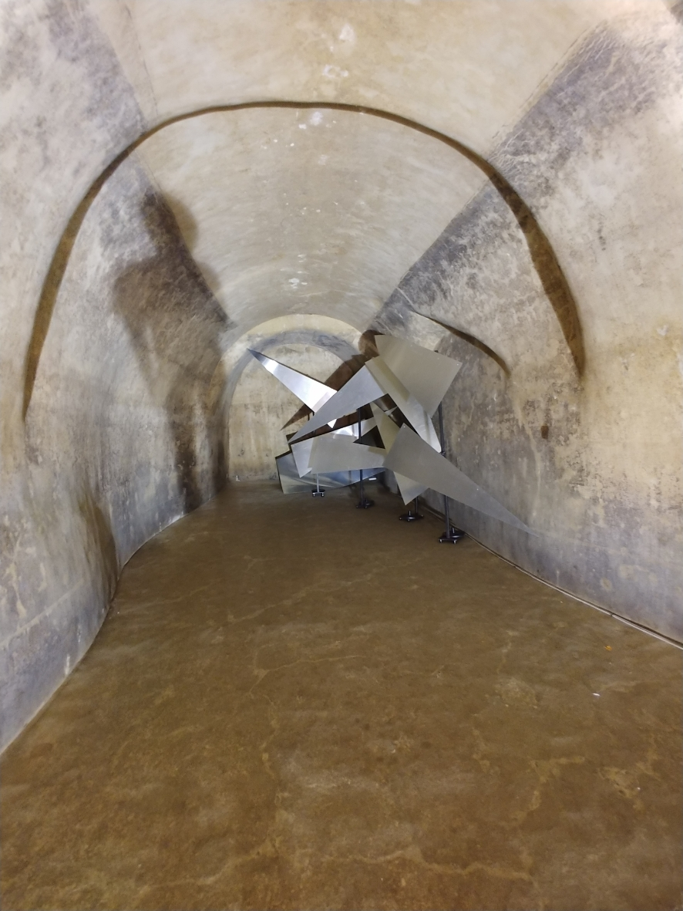

# Appunti della lezione del 24 Giungo 2020

### Introduzione
Focus sull'interazione e lo studio e l'analisi dello spazio come elemento compositivo chiave, lavoro di Matera paradigmatico poichè strettamente collegato con lo spazio utilizzato. Interazione dello spazio, l'analisi dello spazio e il ruolo che ha lo spazio nella composizione è molto importante.
___________
Incontro con il Maestro Michelangelo Lupone per parlare del progetto di Matera

Materiali fondamentali per la struttura del progetto e esempi audio, video e fotografici che esemplificano in modo amichevole ciò che è stato fatto a Matera.

Per il progetto collaborazione di Gabriela e Alessandro.

Problemi all'interno dello sviluppo di un lavoro del genere, e la documentazione prodotta.
___________
IR pre analisi realizzate con battito di mani in 3 punti diversi, attenuazione dei 60 dB dopo circa 60 secondi.
Particolare apertura dB, amplificazione tra 85-92 Hz che caratterizza con formante costante la cavità; che si attesta con energia significativa nell'ambiente.
Utilizzo e scelta dei materiali che soddisfacesse questi punti fondamentali con lunghezza d'onda di emergenza(85-150 Hz).

Cisterna d'acqua lunga 100 m posizionata sotto la piazza principale di Matera, luogo amato dai materani. Si sono dunque sfruttate le caratteristiche della cisterna.

La cisterna (denominata Palombaro Lungo) era esclusivamente funzionale, e non aveva forme particolari.

Attualmente c'è dell'acqua in alcune parti della cisterna.

Installazione mette insieme 5 compositori che ha cercato di far trovare punti di convergenza, accordo tra i compositori per sviluppare un discorso coerente.
Regole di diffusione acustica e di gestione dei materiali.

### Tema

Il tema dell'installazione è stato quello dell'acqua nelle sue varie forme; che potessero essere utilizzate per costruire tessuti ed emergenze ben integrate con l'ambiente circostante e come successione di informazioni; che contenga anche contenuti diversi fra loro.

Sono state generati criteri compositivi per poter bilanciare e supportare una fruizione per l'immersività e l'intellegibilità

### Schema

Caratteristiche acustiche del punto di fruizione determinati e variegate, essendoci anche altezze diverse e dunque sbalzi. Dunque dal fondo della grotta l'emissione anche minima tra gli 85-150 hz produceva una formazione d'onda che si propagava per tutto quanto l'ambiente.

La regia essendo posta all'inizio ha costituito molti problemi di cablaggio con circa 1 km di cavi circa.

### 1 - Suono Curvo - Laura Bianchini

Utilizzo di Planofoni per avere distribuzione di energia per aspetto di utilizzo del luogo.

Il planofono caratterizza il suono in funzione del materiale utilizzato, esso permette di emettere dei fronti d'onda piani.

I Planofoni permettono di creare una sorta di ansa acustica molto ben delineata.

Camera risonante al di dietro dei Planofoni, provoca una perdita totale del riconoscimente dell'ambiente. Laura ha sfruttato una diffusione a due canali, per generare movimenti del segnale tra i Planofoni, generando un movimenti. Risultato è che abbiamo un ambiente che risuona e gli elementi non possono essere individuati.
Dunque non si riesce a percepire con precisione punto di esposizione del Planofono o eventuale disposizione spaziale.
Emissione enfattizata dal punto di vista corale, con una percezione complessiva che occupava quasi tutto il luogo, realizzando un coro a cappella, con impostazione come luogo quasi medievale, con _luogo che risuona in modo coerente_.

Parte melismatica di gregoriano e ambrosiano regolano ritmo in funzione del luogo in cui è posto il canto. Divenendo elemento culturale ed escamotage notevole tra funzione musicale e architettura.

(intellegibilità del parlato diviene secondaria in luoghi sacri oppure no in base a scelte architettoniche)

Per compositore che si pone a scegliere tempi di attacco e decadimento in un luogo ben preciso per ottenere un particolare melange.

Elementi di riflessione rendono non intellegibile alcun materiale.

### 2 - Superficie Riflettente - Colangelo

Riflessione elementi con piccoli altoparlanti che hanno reazione di espansione, realizzando un comportamento simile ad una tromba acustica, seguendo quella forma.

I pannelli sono disposti in posizione particolare, giocando su ritardo di circa 40 ms.

Lobo di emissione degli speaker diviene molto grande, fornendo un'impressione di potenza, energia manifesta su cui il compositore ha lineato le sue scelte, fornendo anche all'acqua elaborato una forma di espressione significativa dal punto di vista energetico, con impatto conseguente sul pubblico.

### 3 - Angolo in eco - Alessio Gabriele

Installazione non visibile che si basa su un dispositivo di emissione del suono. Elemento che galleggia sull'acqua con movimenti che possono generarsi dal movimento dell'acqua.

#### Il diffusore

Quella sotto è una camera d'aria per farlo galleggiare. Vi è poi un paraboloide trasparente. Sopra vi è un altoparlante indirizzato verso il paraboloide (220 Hz in su). Resto della banda è realizzato dall'altoparlante sovrapposto a quello che sta sulla parabola e che ha un tipo di emissione diretta. Ciò fa si di avere un emettitore di suono diretto e riflesso; dunque ciò ci fa intendere che ci fosse un ritardo tra i due emettitore.

#### Il luogo
Il luogo alto 15 metri e largo due viene incanalato nell'angolo con fronte che raggiunge l'aria fornendo un risultato come se ci fosse una sorgente lontana, che ha realizzato ambiguità possibile di voce di quel luogo.
Problema di un'intellegibilità di uno spazio acustico è stato risolto con artifici degli emettitori e equalizzazione, ritardo e distribuzione dell'energia.

#### Materiali sonori

I materiali per far emergere le caratteristiche del luogo sono stati impulsivi.

Insenatura

### 4 - Flussi emergenti - Silvia Lanzalone

Elementi posti con passerella sopraelevata rispetto al pubblico, ed il punto di emissione influenza sia a destra che a sinistra.
Punto risonante usato attraverso piccoli Olofoni che restringono il punto di radiazione, con acqua che produce il suo suono al di sopra della superficie.

 _Ascoltiamo il suono dell'acqua in aria_

Essendo abituati ad ascoltare il suono dell'acqua in aria.

Nell'acqua la diffusione del segnale avviene ovviamente in modo diverso con velocità diversa.

Passegiando sulla passerella con i vari lobi degli olofoni posti in posizioni diverse, si realizzano incroci dei vari lobi. Sia a destra che a sinistra vi è l'attenzione costante al posizionamento degli olofoni, facendo collezionare memoria acustica e visiva.

È venuto fuori un gioco polifonico (numero di canali maggiore rispetto alle altre installazioni).

### 5 - Grotta risonante - Michelangelo Lupone

Grotta sensazione acustica opprimente come quella spaziale.

In essa attraverso i Planofoni in metallo, si sfrutta il luogo e lo spazio e attraverso il posizionamento del materiale.

In essa vengono sfruttate caratteristiche di ritardo dei diversi emettitori, sparpagliando il più possibile le emissioni dei planofoni e la guida d'onda del soffitto curvo. Ciò dava la sensazione di immersione totale all'interno del suono. Dunque il tipo di materiale e la forma del metallo indirizzato a indirizzare lunghezze d'onda acute.

Questa ultima posizione guarda specularmente la direzione dell'emissione del Suono Curvo.

__________

### Schema audio

[Schema Audio utilizzato](SchemaAudioMatera_1.pdf)

Le opere girano su Arduino e Max, esse girano con sensori cablati e wireless.

Distribuzione dei canali audio precisa.

Emissione capace di distribuire un'immagine spaziale dei canali per avere una gestione delle varie regioni frequenziali. Vita interna dell'opera che viene generata da una competrazione vitale attraverso il suono attraverso il movimento interno dei sistemi.

(Capacità di evocare un movimento è data da cancellazioni delle HRTF, e del filtraggio, con elevazione del segnale attraverso dei filtri, realizzando una sorta di scultura acustica).

#### Trucchi nell'assemblaggio dei componenti

Parallelo o serie dei diffusori. Le impedenze ovviamente sono indicate poichè quando si viaggia con molti metri di cavo. Ciò ha un peso rilevante con le correnti che devono attraversare i filtri di rame.

Corrente di rete sopra i 10000 Hz che poteva essere ovviamente data dai cavi che realizzano un filtro passa basso e dunque a problemi di filtraggio.

#### Cavi

Come devono essere trattati i cavi e utilizzati. Lavoro di preparazione dei cavi per l'installazione. Preparativi per le installazioni sono essenziali poichè essi servono alla predisposizione dell'opera, inventandosi dei trucchi, per dare la giusta tensione per dare la giusta tensione.

È determinante dunque un buon progetto.

__________
- trasmissione in digitale e amplificazione sul luogo??

Umidità nel luogo e formazione di condensa, non ha reso possibile il fatto di porre regie interne al Palombaro stesso.
__________
### Punti di analisi del luogo
- punto di Laura Bianchini
- punto di Alessio Gabriele
- punto Lupone

### Richiesta

Esecuzione musicale con 2 tipologie:
1. visita guidata
2. visita installazioni

#### Visita guidata

Carattere che permettesse alla guida di parlare. La guida ed il pubblico sono all'interno di quest'onda generando un inseguimento del pubblico.

#### Visita installazioni

- sfondo totale
- suoni forma

#### Regole compositivie (organizzazione materiale)
- consequenzialità
- adiacenza
- congruenza
- dialettica
- ricorsivita`
- alea controllata
- riferimento

Vi sono gradi di coerenza ben intellegibili e problematiche che hanno a che fare con simultaneità spazio dell'insieme.

##### Congruenza

Congruenza che permette di congiungere un compositore all'altro.
Con passaggio di parte dei materiali con congruenza specifica che fa legare e differenziare materiali e parti dell'Installazione.

##### Ricorsività

trasformazioni ed anche elementi con ostinati e ripetizioni anche iterate del materiale

#### Strati
3 strati:
1. sfondo totale
2. sfondo locale
3. suono forma

##### Sfondo Locale
Ciò che rappresenta la dimensione piano, sottofondo deve attenersi in modo rigoroso con congruenza e dialettica con lo _sfondo totale_ che deve integrarsi.

##### Suono Forma
Elementi in risalto, con durate minime e massime.

Macroclassificazioni per gestire la dialettica delle installazioni
_________
Sono regolati a livello algoritmico compressioni e attenuazioni per collaborazione delle varie opere e vi sono configurazioni possibili.
__________
### Lavoro in equipe

Musica elettronica, possibilità di lavoro in equipe.
Contributi diversificati che arrichiscono il profilo del lavoro d'arte, e si deve condividere sul piano umano l'idea e le passioni.

[Regole Compositive Echi d'acqua](20190913_REGOLE_COMPOSITIVE_ECHIDACQUA_v2_mik.pdf)
[Video Echi d'acqua](Video_Echi_d'acqua.mp4)

_________
### Diffusore per la parte di Alessio Gabriele

- efficacia della direzionalità del diffusore
  - accorgimento di allineamento dei 2 driver
  - analisi escursione in frequenza
- compressione della dinamica per la geometria dell'ambiente
- dati i limiti al compositore, esso ha sfruttato al massimo le limitazioni dello strumento(ultima parte che ha risolto un'attenta equalizzazione con loudness complessiva per la resa finale)

Ovviamente i driver sono scelti per avere accoppiamento con curva adeguata e rendendo il sistema complessivo adeguato.

Nella chitarra l'equilibrio dinamico tra corda piú grave e piú acuta deve esser dunque bilanciato.

_L'accoppiamento di piú parti non da quasi mai una risposta lineare._
