# Appunti della lezione del 1mo Luglio 2020

Grandezze che si usano per la caratterizzazione degli ambienti

_______________

### Filtraggio dell'aria

(Parte estratta dalla tesi dall'introduzione. Alla pagina 52 della tesi)

Attenuazione nella simulazione di uno spazio acustico.

Se ci si pone di fare un simulatore, per ricavare la risposta all'impulso con sorgenti virtuali, poi mi serve la distanza dall'ascoltatore, per calcolare l'attenuazione dovuta alla propagazione.

Al primo corso del triennio, ci siamo ricavati la legge quadratica inversa, con leggi spannometriche, come:
- raddoppio distanza
- attenuazione in dB
- etc...

In realtà questa tipologia di calcolo è semplificata, la distanza tende ad infinito quando r sta a 0, fatto non reale.

Calcolo preciso della potenza che investe l'ascoltatore per un angolo solido(angolo in 3 dimensioni, cono infinito che ha come vertice un punto) alfa.

Facendo un calcolo, con considerazioni geometriche accurate viene:
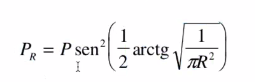

P=potenze
Pr=potenza che raggiunge l'ascoltatore

Facendo il calcolo del limite:
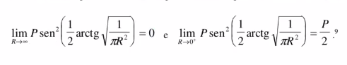

Ciò ci fa capire che questa tipologia di calcolo è valida quando R tende a 0 o a infinito.

Funzione approssimata _(T/(4πR^2))_

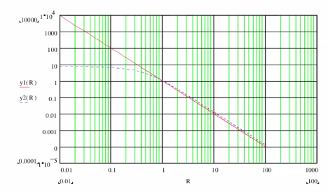

Retta è quella approssimata, curva è il calcolo piú preciso.

Legge quadratica classica:

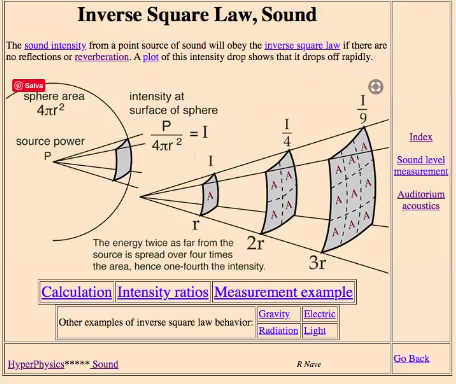

Intensità è potenza per densità di superficie.

La funzione che si trova ricavandola con considerazioni geometriche è accurata ed è quella che investe l'ascoltatore ad una distanza R.

Se volessi fare un simulatore, dovrei usare la formula Pr perchè quando vado incontro all'ascoltatore la potenza inizierebbe a divergere.

#### Legge di dipendenza dell'assorbimento dell'aria dalla frequenza

Il filtraggio dell'aria è stato implementato con filtro passa basso a n polo(del primo ordine), il problema è che questo filtro dinamico dipende dalla distanza. Ovvero ha una frequenza variabile e dipende dalla distanza, dunque piú lontano vado e piú l'aria filtra.

La funzione :
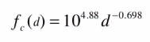

Essa la utilizzo come frequenza di taglio per il filtro

Già a 6 metri di distanza la frequenza di taglio è in banda audio. A distanza di 1 km, con ritardo di 3 secondi, la frequenza del polo è intorno ai 600Hz, a 5000Hz ho un'attenuazione di 44dB.

In generale ció vuol dire che tutte le riflessioni che superano i 3 secondi sono filtrate da filtro passa basso a 600Hz.

Se aumenta l'umidità aumenta l'effetto di attenuazione.

Quando passiamo un impulso in un filtro passa basso, non esce un singolo campione, ma bensí, abbiamo una forma simile ad una campana.

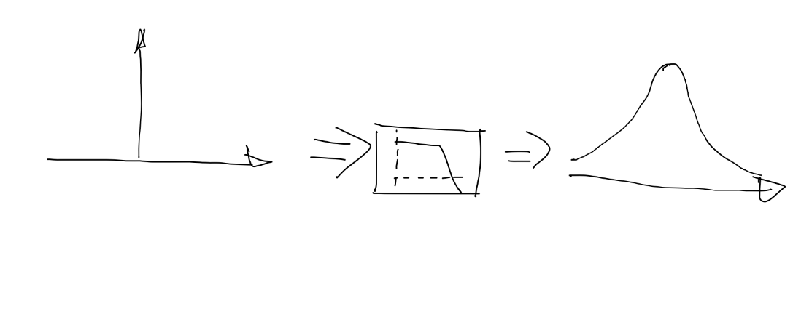

Mentre impulso in dominio discreto:
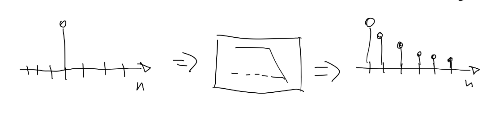

Il filtraggio smussa l'impulso, e il livello di smussatura dipende dalla banda passante del filtro.

C'è dunque un ulteriore fattore di arrotondamento degli impulsi.
Oltre al già visto coefficente di arrotondamento che arrotondava già in qualche modo. Ciò tende a far sovrappore le energie di diversi contribuiti delle diverse sorgenti, soprattuto delle sorgenti virtuali piú lontane, ovvero dai 6m di distanza in poi.

Dal punto di vista percettivo, gli effetti dell'aria, sono conosciuti, se ad esempio fulmine cade a tot km, il suono del fulmine arriva ritardato ma anche filtrato per effetto dell'aria.

L'effetto di filtraggio dell'aria per il suono, il mio cervello ce l'ha cablato e implementato di default.
Mi sono costruito un'esperienza dalle quali mi sono costruito un modello di filtraggio.

Bisogna pensare che la sorgente che emette un suono ed il suono che si propaga in esso e che messi insieme mi aiutano a costruire una rappresentazione del suono. Dunque è tutto l'insieme che mi fa intendere dov'è il suono. L'intensità del suono da sola infatti non mi dice quasi nulla.

Ci sono infatti infinite condizioni che l'intensità mi può dare.

Sono in grado di dire come è fatto uno spettro originale e se lo sento filtrato, sono in grado di dire che essa è lontana.

Distanza nell'universo percettivo non è piú una grandezza fisica, ma immagine nel mio universo percettivo. Che si costruisce nel mio universo percettivo.

La distanza è un qualcosa di percepito, il risultato è costituito da:
- ritardo suono diretto e riflesso
- filtraggio aria (profilo spettrale)
- intensità

Tutti questi indizi contribuiscono a costruire nel mio universo percettivo una rappresentazione della realtà, alla quale assegno il nome di distanza, chiarezza, intimacy.

### Tempo di riverbero

Dal punto di vista del tempo di riverbero dalla formula di Sabine:

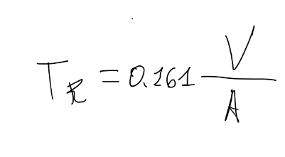

in cui la A:
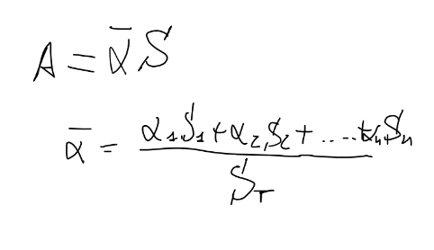

Questa è la formula di Sabine che non tiene conto del coefficente di assorbimento dell'aria.

Per avere anche il coefficente di assorbimento considerato dobbiamo usare la formula:
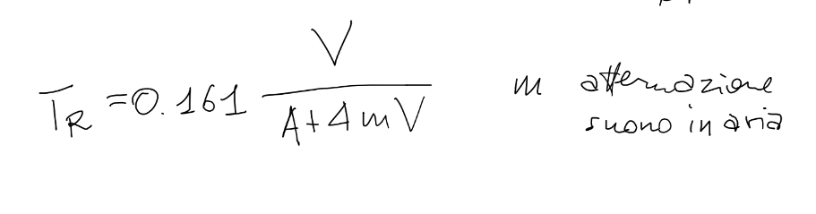

In cui la m è il coefficente di attenuazione del suono in aria ed è cosí descritto:
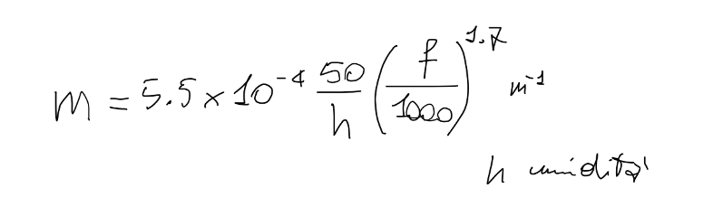

Che varia in base all'umidità ed alla frequenza.

Considerare l'attenuazione dell'aria mi porta ad avere tempi di riverberazione piú bassi e diversi.

Esempio per ambiente a 5000 m^3 differenza con la formula con attenuazione da quella senza del 30% di riverberazione.
