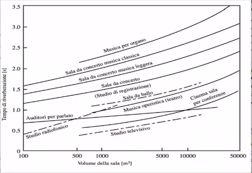
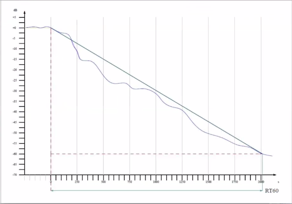
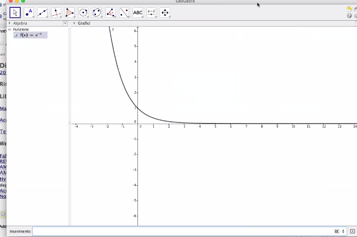
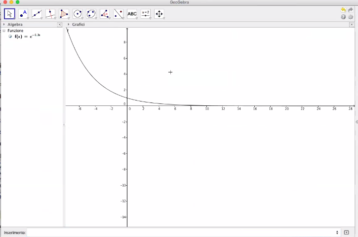
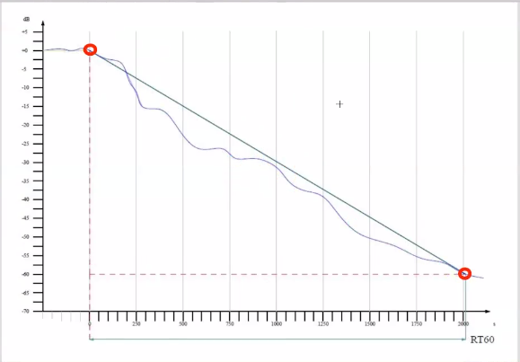
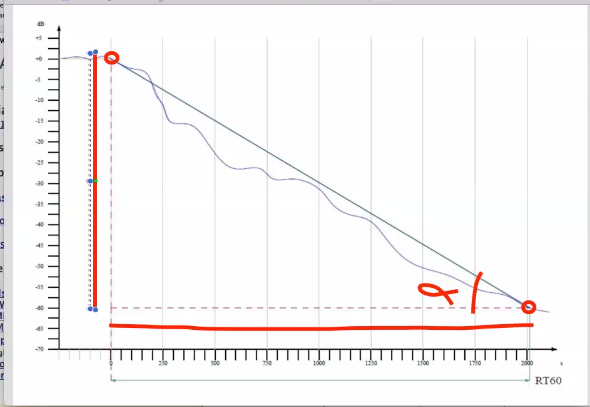
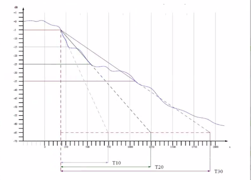
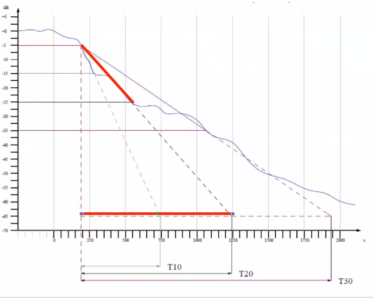
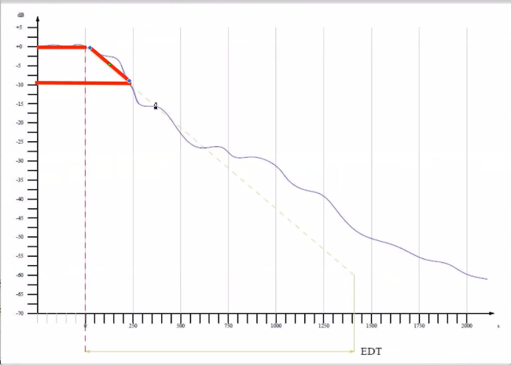
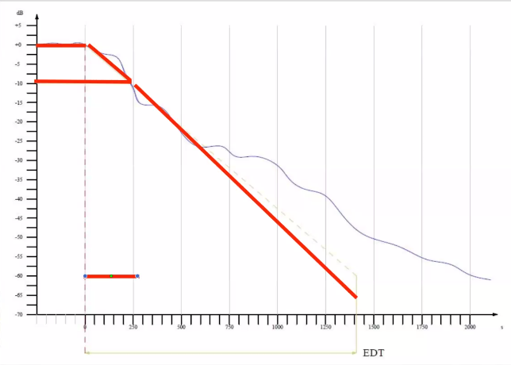

# Appunti della lezione del 1mo Luglio 2020

Grandezze che si usano per la caratterizzazione degli ambienti

_______________

### Filtraggio dell'aria

(Parte estratta dalla tesi dall'introduzione. Alla pagina 52 della tesi)

Attenuazione nella simulazione di uno spazio acustico.

Se ci si pone di fare un simulatore, per ricavare la risposta all'impulso con sorgenti virtuali, poi mi serve la distanza dall'ascoltatore, per calcolare l'attenuazione dovuta alla propagazione.

Al primo corso del triennio, ci siamo ricavati la legge quadratica inversa, con leggi spannometriche, come:
- raddoppio distanza
- attenuazione in dB
- etc...

In realtà questa tipologia di calcolo è semplificata, la distanza tende ad infinito quando r sta a 0, fatto non reale.

Calcolo preciso della potenza che investe l'ascoltatore per un angolo solido(angolo in 3 dimensioni, cono infinito che ha come vertice un punto) alfa.

Facendo un calcolo, con considerazioni geometriche accurate viene:

P=potenze
Pr=potenza che raggiunge l'ascoltatore

Facendo il calcolo del limite:

Ciò ci fa capire che questa tipologia di calcolo è valida quando R tende a 0 o a infinito.

Funzione approssimata _(T/(4πR^2))_

Retta è quella approssimata, curva è il calcolo piú preciso.

Legge quadratica classica:

Intensità è potenza per densità di superficie.

La funzione che si trova ricavandola con considerazioni geometriche è accurata ed è quella che investe l'ascoltatore ad una distanza R.

Se volessi fare un simulatore, dovrei usare la formula Pr perchè quando vado incontro all'ascoltatore la potenza inizierebbe a divergere.

#### Legge di dipendenza dell'assorbimento dell'aria dalla frequenza

Il filtraggio dell'aria è stato implementato con filtro passa basso a n polo(del primo ordine), il problema è che questo filtro dinamico dipende dalla distanza. Ovvero ha una frequenza variabile e dipende dalla distanza, dunque piú lontano vado e piú l'aria filtra.

La funzione :

Essa la utilizzo come frequenza di taglio per il filtro

Già a 6 metri di distanza la frequenza di taglio è in banda audio. A distanza di 1 km, con ritardo di 3 secondi, la frequenza del polo è intorno ai 600Hz, a 5000Hz ho un'attenuazione di 44dB.

In generale ció vuol dire che tutte le riflessioni che superano i 3 secondi sono filtrate da filtro passa basso a 600Hz.

Se aumenta l'umidità aumenta l'effetto di attenuazione.

Quando passiamo un impulso in un filtro passa basso, non esce un singolo campione, ma bensí, abbiamo una forma simile ad una campana.

Mentre impulso in dominio discreto:

Il filtraggio smussa l'impulso, e il livello di smussatura dipende dalla banda passante del filtro.

C'è dunque un ulteriore fattore di arrotondamento degli impulsi.
Oltre al già visto coefficente di arrotondamento che arrotondava già in qualche modo. Ciò tende a far sovrappore le energie di diversi contribuiti delle diverse sorgenti, soprattuto delle sorgenti virtuali piú lontane, ovvero dai 6m di distanza in poi.

Dal punto di vista percettivo, gli effetti dell'aria, sono conosciuti, se ad esempio fulmine cade a tot km, il suono del fulmine arriva ritardato ma anche filtrato per effetto dell'aria.

L'effetto di filtraggio dell'aria per il suono, il mio cervello ce l'ha cablato e implementato di default.
Mi sono costruito un'esperienza dalle quali mi sono costruito un modello di filtraggio.

Bisogna pensare che la sorgente che emette un suono ed il suono che si propaga in esso e che messi insieme mi aiutano a costruire una rappresentazione del suono. Dunque è tutto l'insieme che mi fa intendere dov'è il suono. L'intensità del suono da sola infatti non mi dice quasi nulla.

Ci sono infatti infinite condizioni che l'intensità mi può dare.

Sono in grado di dire come è fatto uno spettro originale e se lo sento filtrato, sono in grado di dire che essa è lontana.

Distanza nell'universo percettivo non è piú una grandezza fisica, ma immagine nel mio universo percettivo. Che si costruisce nel mio universo percettivo.

La distanza è un qualcosa di percepito, il risultato è costituito da:
- ritardo suono diretto e riflesso
- filtraggio aria (profilo spettrale)
- intensità

Tutti questi indizi contribuiscono a costruire nel mio universo percettivo una rappresentazione della realtà, alla quale assegno il nome di distanza, chiarezza, intimacy.

### Tempo di riverbero

Dal punto di vista del tempo di riverbero dalla formula di Sabine:

in cui la A:

Questa è la formula di Sabine che non tiene conto del coefficente di assorbimento dell'aria.

Per avere anche il coefficente di assorbimento considerato dobbiamo usare la formula:

In cui la m è il coefficente di attenuazione del suono in aria ed è cosí descritto:

Che varia in base all'umidità ed alla frequenza.

Considerare l'attenuazione dell'aria mi porta ad avere tempi di riverberazione piú bassi e diversi.

Esempio per ambiente a 5000 m^3 differenza con la formula con attenuazione da quella senza del 30% di riverberazione.
______________
### Grandezze per caratterizzare la risposta di uno spazio

Con Sabine veniva usato il _tempo di riverbero_ ovvero _RT60_. La formula di Sabine da una caratteristica astratta del tempo di riverberazione che dipende dal volume e dall'alfa segnato.

Glossario di tutti i parametri e le grandezze che si usano nel mondo dell'acustica.
[Acoustic Glossary](http://www.acoustic-glossary.co.uk/)

In esso vi sono sia termini discorsivi che termini di grandezze collegate.

Inoltre ci sono delle norme standard che definiscono i tempi di riverberazione.

La IEC 801-31-07 che definisce i parametri di cui parliamo e questi parametri sono standardizzati.

Norma [ISO 3382](http://store.uni.com/catalogo/uni-en-iso-3382-2-2008?josso_back_to=http://store.uni.com/josso-security-check.php&josso_cmd=login_optional&josso_partnerapp_host=store.uni.com) che si occupa di definire quali sono le procedure e i parametri di determinati ambienti e spazi.

Divisa in 3 parti:
1. spazi performativi, metodi per sale acustiche da spettacolo, se si volesse fare l'acustico certificato dovrebbe usare apparecchiature descritte nella prima parte
2. descrive norme per spazi ordinari
3. misura e valutazione di spazi open space

Procedure e metodi di valutazione sono già stabilite in modo standard

Per avere valutazione certificata di uno spazio acustico, bisogna seguire la norma 3382, ciò denota che è stato fatto un notevole lavoro di sistematizzazione e standardizzazione.

### Tempi di riverberazione in funzione della sala

Da questo grafico denotiamo i vari tempi di riverberazione. Valori ottenuti da campionamento di varie sale da concerto.

### _RT60_

Esso è il tempo necessario affinche la risposta all'impulso decada di 60dB.

Come faccia a calcolare tempo di riverberazione avendo una risposta all'impulso?

Sulle ordinate abbiamo i dB, mentre sulle ascisse abbiamo i ms di RT60.

Una curva esponenziale decrescente su grafico cartesiano lineare viene rappresentata in un certo modo:

se cambio il moltiplicatore all'esponenziale cambia la ripidita1 con cui scende la curva:

dipende dal coefficente della x

Se uso una rappresentazione esponenziale questo grafico diviene una retta, e la pendenza della retta è il coefficente della x.

Il piano in ordinata sono i decibel che è logaritmico e lo utilizziamo.

La retta che ho della IR mi da un'idea  di come avviene la decrescita delle RT60. Scopriamo dunque che essa decresce esponenzialmente.

Ciò ci da proprio il valore di RT60 ovvero del coefficente, quindi proprio come decresce la IR.

Una volta che ho l'angolo della retta posso ricavarmi RT60, sostanzialmente dal grafico.

Linea curva è la IR, mentre altre linee incontrano la curva in punti diversi.
Questo procedimento serve per individuare il T10, T20  e T30 che servono ad individuare quando il suono decade di tot dB.

Estrapolando la retta del T20 trovo il T20

Questi parametri sono utili, perchè mi danno delle informazioni piú precise, su quanto la curva reale di decadimento sia uniforme o meno.

Il tasso di diversità tra questi tempi di riverbero ci dice quanto è irregolare e quanto è uniforme all'inizio la risposta all'impulso.

Nel caso da noi analizzato la risposta all'impulso ha delle irregolarità all'inizio. E ciò mi da l'idea della parte iniziale dell'IR. È come se calcolassi il tempo di riverberazione in base valori in dB diversi da 60.

### EDT

Parametro chiamato EDT, ovvero Early deacy time, ovvero tempo di riferimento delle prime riflessioni

Retta a -10dB e quando incontra la curva faccio fermare il cronometro, ottengo dunque:

Se estrapolo il segmento di retta e ne prendo il tempo e lo moltiplico per 6 ottengo l'EDT.

EDT ricavato da una caduta di 10dB ma viene confrontato con RT60, l'EDT ha lo scopo di capire qual'è l'uniformità tra il profilo di decadimento delle prime riflessioni ed il profilo di decadimento della risposta diffusa.

L'EDT mi da l'RT60 stimato sulle prime riflessioni.

Chiaramente nella maggior parte dei casi i valori dell'EDT sono inferiori a quelli dell'RT60. E l'entità di questa differenza garantisce un'indicazione della mancanza di diffusione del campo in quel punto.

Il T60 è uguale e non varia al variare dei punti di misurazione dello spazio.

Il T60 ha un senso da una certa dimensione di una sala in poi; poichè in uno spazio piccolo siamo piú in campo di diffusione dei modi naturali. se sto valutando uno spazio abbastanza grande(sale con uso performativo, sale con una notevole cubatura), e lo misuro in vari punti troverò sempre tempo di riverberazione simile.

L'EDT cambia molto rispetto al punto in cui prendo la risposta all'impulso, poichè in essa hanno molto piú importanza le prime riflessioni. Se dunque consideriamo il fatto che un EDT uguale a T60 è come un campo perfettamente diffuso, vuol dire che quello è un indicatore che quello è un campo non perfettamente diffuso.

Stiamo conoscendo questi parametri con approccio statistico, parlando dunque di un campo che ha un approccio ergotico, uniformemente diffuso. Stiamo dunque conoscendo parametri che mi definiscono lo scostamento dallo spazio reale da quello perfettamente diffuso.

L'EDT è definito da caratteristiche percettive molto precise ed esso mi da indicazioni su parametri percettivi e sensazioni psicoacustiche.

Come documentazione anche l'help di REW, c'è una documentazione fatta molto  bene dei parametri utilizzati nel software.

______________
Modalità di esame:

- riprendere un proprio ambiente e documentarlo
