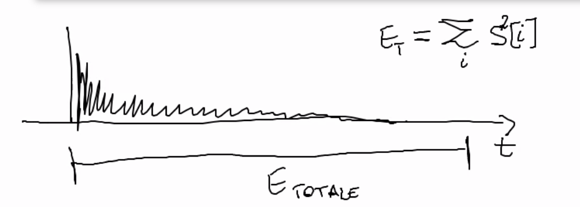

# Appunti della lezione del 8 Luglio 2020

### Revisione Appunti

Il T60 di solito è abbastanza uniforme in tutti i punti di uno spazio abbastanza grande.
________
### Riepilogo scorsa lezione

Abbiamo incominciato a parlare dei descrittori degli spazi acustici.

Definizione del T60, T10, T20 e T30 e dell'EDT

Mentre il T60 da un'indicazione globale del comportamento di uno spazio(che varia da punto a punto di uno spazio), T10, T20 e T30 danno indicazioni degli scostamenti generali dello spazio rispetto alla prima zona generale dell'impulso.

Quando T60,T10 e T30 sono simili hanno una buona uniformità del comportamento.

Immagini caricate sul wiki -> grafici che mostrano la definizione delle grandezze di cui parlavamo
____
## Descrittori degli spazio

Essi sono molti e possiamo guardare la norma 3382 e ne si trovano molti

Quelli che noi vediamo sono ovviamente solo una parte.

### Descrittori statistici relativi all'IR

#### ITDG

Altro parametro centrale e importante tra i descrittori acustici e l'ITDG

Ovvero l'_initial time delay gap_ che significa il tempo di ritardo della prima riflessione, ovvero il tempo che intercorre tra il suono diretto e la prima riflessione. Ammesso ovviamente che ci sia un suono diretto.

_Esempio_

Se ci si trova a valutare sistema di riproduzione in un'altra stanza e non si ha suono diretto.

In altri casi abbiamo sempre il suono diretto.

Qual'è il peso dell'ITDG e i valori per la fruibilità di uno spazio.

Nell' Haas effect si sfrutta proprio l'ITDG.
___________
##### Haas effect

Integriamo tutti i contributi che arrivano subito dopo, a patto che questi contribuiti arrivino entro certi tempi e che questi contributi arrivino con delle relazioni di intensità rispetto al primo suono(suono diretto), poichè le prime riflessioni sono piú deboli del suono diretto in genere. Se arriva una prima riflessione ma con intensità piú alta, l'integrazione dell'Haas effect si rompe.

La regola che viene data è che se i contribuiti al suono diretto arrivano entro i 35 ms, tutti i contenuti vengono integrati come facente parti del suono diretto. Questi eventi vengono inglobati come lo stesso evento sonoro.
_________
Le prime riflessioni arrivano in genere dalle pareti laterali, se non ci fosse l'ITDG, ci sarebbe una schizofrenia della posizione della sorgente.

Capacità di fusione di diversi stimoli è un qualcosa di prettamente umano.

Quando sentiamo un suono ovviamente non si scindono le armoniche dei vari strumenti.

Fondendo tutti i contributi in un oggetto percettivo, poichè determino che un particolare suono sia un'unica cosa.

_Esempio dominio della visione_

Visione del volto umano, che riconosciamo come un singolo oggetto; il volto è dunque un oggetto cognitivo e percettivo. Ed è importante da un punto di vista cognitivo perchè da un punto di vista economico è vantaggioso. Non mi metto dunque a seguire le armoniche ma mi interessa il tasto di pianoforte; è inutile che separi tutte le riflessioni sonore ma metto insieme tutti gli eventi sonori e le riflessioni.

Questa competenza del nostro sistema percettivo è essenziale. Poichè ci aiuta a fare economia sulle cose importanti.

Haas studiò tutti i rapporti di ampiezza che dovevano rispettare le varie riflessioni.

(Vedere Haas effect in Master's Handbook dell'Everest)

Se i contribuiti arrivano dopo un certo intervallo, circa 80 ms, si rompe l'uniformità di un suono e sentiamo l'eco.
Questa grandezza è molto importante, perchè è uno di quei parametri chiamato intimacy. Al di sopra di un certo valore avremo la sensazione di un ambiente piú grande. Dal punto di vista qualitativo, è importante che le prime riflessioni arrivino dalle pareti laterali, è importante che subito dopo il suono diretto arrivino le riflessioni dalle pareti laterali per avere una gradevolezza maggiore dello spazio. Essa viene chiama _asimmetria laterale_ o _coerenza interaurale_.

Ascolto mono in cuffia -> sistema percettivo riceve due segnali identici, e dunque tutti i sistemi di spazializzazione si spengono e suppongono che il suono venga dall'interno, ma effettivamente gli mancano le caratteristiche che permettono al nostro cervello di proiettarlo all'esterno. Dunque nel suono di per se non c'è nulla di percettivo. Quando abbiamo un suono mono di fatto la percezione che abbiamo nello spazio del suono si spegne. Questa cosa in realtà funziona anche in grande ed esso è un indice di piacevolezza dello spazio.

I valori ottimali per l'ITDG variano a seconda dello spazio:
- spazio destinato alla parola -> sotto una certa soglia di circa 50 ms -> valori di piú di 50 ms sono sconsigliati per spazi destinati alla particolare

Valore magico per l'ITDG è intorno a 30 ms

#### BR - Bass  Ratio

Esso è sostanzialmente un rapporto tra i tempi di riverbero calcolati a diverse frequenze, in particolare esso è:

Esso esprime un rapporto tra tempi di riverbero preso a delle precise frequenze.

Questo valore ci da indicazioni della pienezza del suono nel registro medio-grave. Tipicamente le sale migliori sono quelle che hanno il _BR_ tra 1.2 e 1.25.

1.2 < BR < 1.25

#### Brilliance

Allo stesso modo si definisce un altro indice molto simile denominata brilliance.

Essa ha una definizione simile alla BR ma su frequenze diverse.

Parametri per la luminosità dell'ambiente a livello acustico, ovvero quanta parte c'è di contributo medio-grave e medio-acuto.

Questi due parametri ovviamente sono collegati ai materiali dello spazio.

Materiali molto lisci e rigidi aumentano i parametri di Brilliance, mentre il legno da contributo al BR.

Legno ha la capicità di preservare la regione medio-grave dello spettro.(A seconda dell'essenza e della finitura del legno cambia molto per le qualità di risuonatore).

Questi 2 parametri vengono valutati per lavori di adattamento acustico.

(Placche di legno all'auditorium per evitare creazione di modi particolari)

___________
### Descrittori statistici relativi all'energia

Entriamo ora in una famiglia di parametri che danno informazioni di carattere energetico, utili soprattutto per determinare l'intellegibilità del segnale(per il parlato e per la musica).

Energia è relativa al quadrato della pressione.

Se faccio il quadrato e la somma di tutti gli impulsi la Etotale è la somma delle di tutti gli impulsi.

Se devo fare il calcolo solo di un tot di energia del segnale (energia parziale) prendo solo una certa regione della Etotale.

Se voglio valutare l'intellegibilità del segnale, nel caso del parlato, è importante capire quanta parte del segnale è intellegibile.

Il parlato è quella parte piú variabile del suono, e per avere intellegibilità, l'energia per avere intellegibilità ha importanza quanta energia è contenuta nella prima parte dell'IR rispetto al totale dell'energia.

#### D50 (Definition)

Rapporto fra energia utile ed energia totale. Per energia utili in questo caso va dagli 0 ai 50 ms. Energia totale va da 0 a infinito.

Nel caso del parlato il D50 deve essere maggiore di 0.5. Nei primo 50 ms ci deve essere almeno metà dell'energia totale perchè il parlato sia intellegibile.

Altri indici di chiarezza definiti **Clarity**, sono il C50 e C80.

#### C50/C80 (Clarity)

Essi sono definiti come il rapporto tra energia utile ed energia dannosa.

Ora le misure sono logaritmiche e si calcolano come:

In cui al numeratore abbiamo l'energia utile ed al denominatore abbiamo l'energia dannosa dagli 50/80 ms fino ad infinito.

Essi sono usati per l'intellegibilità del parlato(C50) e della musica(C80).

Il C50 ha bisongo che tutte le articolazioni siano percepibili. Per la musica va bene il C80 poi le articolazioni sono più lente del parlato. Il livello di intellegibilità può essere anche piú basso rispetto al parlato.

Valori ottimali per il C50 e il C80:

C50|-|C80
------|----------|--------
< 0dB|Non idoneo|< -4dB
0dB < C50 < 3dB| Discreto| 0 < C80 < 2dB
> 3dB | Idoneo | > 2dB

### Spazialità

La _spatial impression_ è una delle caratteristiche piú importanti valutate.
Per avere una sensazione di spazialità corretta le ITDG non devono superare gli 80 ms e devono arrivare all'ascoltatore da direzioni laterali, perchè questa cosa aumenta la percezione di asimmetria dello spazio.

I rapporti di intensità tra prime riflessioni e suono diretta devono rispettare le leggi dell'effetto precedenza(effetto Haas).

Dal punto di vista frequenziale, le bande di frequenza più importante per l'impressione spaziale sono quelle con banda di ottava ai 125 Hz(suono caldo) e della parte a 1000 Hz(banda di apertura), essa contribuisce a dare una presenza spaziale del suono, fronte di presenza piú alto.

Mentre la banda dei 125 Hz contribuisce a creare un suono avvolgente, la banda intorno ai 1000 Hz è legata alla sensazione di apertura del suono. L'impressione della spazialità è legata molto a coerenza interaurale. Una bassa coerenza interaurale da un piú largo ambiente spaziale. Spazio asimetterico bassa coerenza interaurale.

Una simmetria dal punto di vista spaziale ci piace, ma dal punto di vista acustico non ci piace molto.

Piú sono diversi i segnali che arrivano alle due orecchie piú ci sembra di essere in uno spazio aperto.

Ci sono diversi parametri per la coerenza del segnale tra due orecchie, tra cui la ITACC ovvero _inter aural cross correlation_. Tutti questi parametri vengono in genere registrati con delle Dummy-Head.

[parametri di sale da concerto](https://www.akutek.info/concert_hall_acoustics_files/parameters.htm)

Beranek -> studioso dell'acustica degli spazi (rank di Beranek) -> criteri di Valutazione delle sale acustiche [articolo](https://www.akutek.info/Papers/MS_Beranek_London-2017.pdf)

Parametro G da un'idea del rinforzo acustico dato dalla sala -> energia registrata/energia data dalla sorgente in campo aperto a 10 m di distanza

Lo spazio chiuso ha una funzione di rinforzo acustico naturale, G è una funzione di rinforzo acustico dello spazio(10log*Etot/Ecampo aperto a 10 m)

[sito sull'acustica](https://www.akutek.info/index.htm)
____________
Prossime lezioni -> rinfrescata ai meccanismi della percezioni(IID, ITD, HRTF, etc...), focus su REW per capire come si usa per fare una misurazione.
