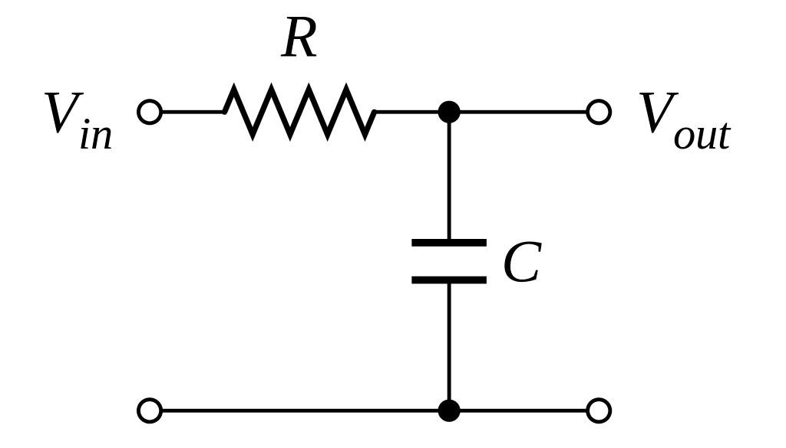
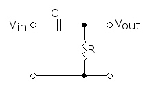
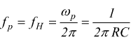

# Appunti della Lezione di Giovedí 14 Maggio 2020

Computer Nuova Elettronica copiato da Apple IIe

______________

reamplificazione > registro chitarra in studio con DI pulita > successivamente prendo segnale bilanciato lo sbilancio > e mi faccio il suono modificato con piú amplificazioni (provo diverse amplificazioni)

sbilanciandolo ovviamente lo rialzo in impedenza

[Schema DIB110](https://www.monacor.com/media/PDF/H/H2/H212140/H212140Z.pdf)

il puntino individua le fasi

componenti elettronici si dividono in 2 categorie:
1. passivi (ad esempio resistenza, resiste un tot al passaggio di cariche)
2. attivi

#### Componenti passivi
- resistenza > resiste un tot al passaggio di carica
- condensatore > corrispettivo di un recipiente per un liquido > superata una certa quantità di cariche > uscirà del "liquido" > con la fase di scarica

Oscilloscopio > alta frequenza > usato

schede che si connettono al computer

- analogico
- digitale

Oscilloscopio > serie di controlli
- ingressi > sonda
- schermo > uscita segnale in ingresso

schermo > tubo catodico (valvola) il cui fascio di elettroni viene proiettato sulla superficie > trattata da una vernice ionizzata che quando viene colpita da un elettrone si illumina > ciò passa per un magnete

capacità fosforo > si vede per un po' di tempo

monitor monocromatici > sono rimasti

------
##### -| |- simbolo condensatore

le 2 piastre sono separate da materiale dielettrico > materiale semiconduttore > isolante fino a una certa differenza di potenziale

materiale piú utilizzato è differenza di potenziale

se applico a poli condensatore una differenza di potenziale > a certa differenza di patenziale materiale fa passare le cariche elettriche

candela macchina(18000 V fa passare l'elettricità formando una scintilla), sfera di tesla

cariche elettriche si depositano su una delle due piastre dei condensatori

polarità del condensatore > data dalla fonte di corrente

piastra con cariche positive si riempie molto > ed avviene la fase di scarica > si svuota la prima armatura e ricomincia il ciclo

caratteristica di carica del condensatore è una dente di sega (rampa su carica condensatore, scarica istantanea)

_Capacità elettrica_ > fino a quante cariche posso riempirmi per poi svuotarmi (condensatori capacità in Farad)

condensatori con capacità molto grande > usati in centrali elettriche

una delle due armature del condensatore è flessibile > carica portata fino a livello di polarizzazione

se avvicino una delle due armature > cambia la capacità > crea una differenza di potenziale > con quindi una corrente modulata

condensatori:
- elettrolitici

condensatori sensibili > alla temperatura cambia comportamento condensatori

realizzazione pratica cambia:

2 piastre sempre presenti

- condensatore ad aria -> per alta tensione, condensatore variabile per la sintonia della radio, variabili
- condensatore ceramico ->
- condensatore al poliestere
- condensatore ad olio(foglio di cartone impregnato di olio minerale> liquido vaporizzaza superando una certa temperatura)

- condensatori alta tensione>  >>filtrare residui di rumore su linea elettrica

condensatore > tempo di carica lenta e tempo di scarica veloce

integratore in campo elettrico (calcolo differenziale)

integratore > taglia le fasi > diviene corrente continua

circuito di raddrizzamente > prende fase negativa e la porta in positivo

comportamento prende il nome di ripple(disturbo quel ronzio dei 50Hz che rientrano)> residuo dei 50Hz

condensatore tempo di ricarica lento > va a fare integrazione sul segnale > integrare il segnale significa filtrare il segnale

condensatore in base alla sua capacità

alimentaroe stabilizzato > uscita oscilloscopio non ha una curva dritta ma ha un suo ripple > piú o meno accentuato rispetto alla sua qualità > piú sono evidenti i picchi piú è bassa la qualità

quando si compra alimentatore stabilizzato

[alimentatore da laboratorio](https://www.reichelt.com/de/en/laboratory-power-supply-0-60-v-0-6-a-2x-usb-peaktech-6227-p270048.html)

ondulazione residua(ripple) 5mVss

uno degli utilizzi del condensatore > dato che ha questa funzione > filtro frequenza di 50Hz > integratore nel campo audio > si usa nei filtri > filtro primo ordine

realizzare un filtro passa alto, passa basso e passa banda

formule da utilizzare

libro di riferimento _Imparare elettronica da Zero_

[filtro passa basso 6 db per ottava in primo ordine](http://www.edutecnica.it/elettronica/filtrip/filtrip.htm)

filtro passa alto invertiti resistenza e condensatore

se al posto della resistenza fissa > metto resistenza mobile > filtro con cambio di frequenza di taglio

volume > resistenza variabile

tone in chitarra > passa basso > controllo di tono

frequenza di taglio dai valori _1/2πRC_

resistenza limita la quantità di corrente che va nel condensatore

condensatore in base alla capacità farà un'integrazione diversa, si carica e si scarica e dipende da quanto limito la corrente > cambio il tempo e agisco sulla frequenza di taglio

freq di taglio dipendo da tempo di carica condensatore

R variabile
C costante > scelta condensatore limitata alla frequenza di taglio che vogliamo > frequenza 300Hz

scelta condensatore in base a utilizzo che devi farne

[calcolo filtri passivi](https://www.teleprodottistore.it/calcolatore_crossover.html)

condensatore chitarre elettriche scelto in base a potenziometro > calcolo resistenza totale= potenziometro+pickup per scegliere condensatore

secondo potenziometro > per recuperare un po' le alte

procurarsi > potenziometro 200/500KOhm > quelli per chitarra

condensatore da 0,47 microFarad

ipad >come analizzatore di spettro
