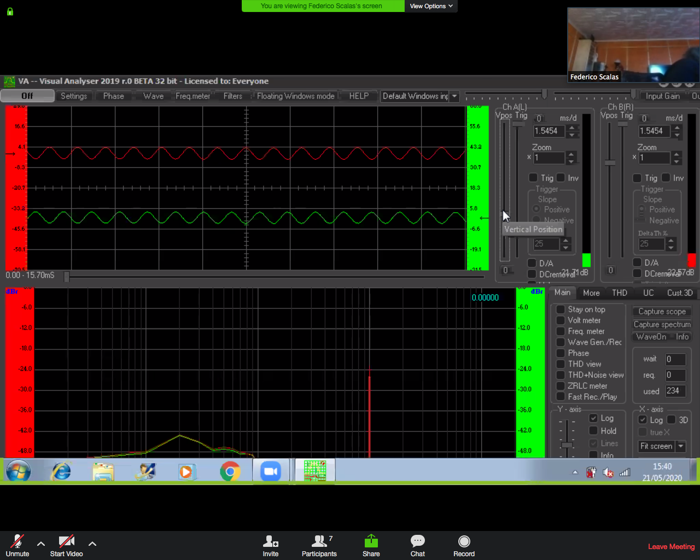
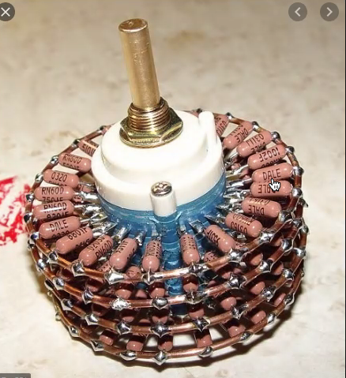

# Appunti della lezione di Giovedí 21 Maggio 2020

software interesante > oscilloscopio virtuale che usa la scheda audio come ingresso

oscilloscopio > a tutti gli effetti

per vedere se trasformatore funzione > ingresso e

[Software utilizzato](http://www.sillanumsoft.org/download.htm)

su wave > generatore di segnale

cosa migliore è usare un tester

misurare il voltaggio del pick-up di una chitarra

DI Box > pensata per un tipo di strumento

pad è in uscita sulle DI classiche > per regolare l'uscita verso il mixer

invece di cambiare il volume, cambia l'impedenza

per aumentare l'impedenza > utilizzo di una resistenza in parallelo

PAD > dispositivi già preamplificati

controllo su macchine professionale è un multi switch rotativo

potenziometri di diversa qualità > in genere viene usato strato di carbone

in una DI evitare complicazioni con potenziometro e usare quindi resistenze

#### analizzatore di spettro
che funziona
[Spectralissime](https://www.vb-audio.com/Spectralissime/index.htm)altro software utile

pesatura z > flat
pesatura a > curve isofoniche

equalizzazione di una sale con microfono

fare il filtro fisicamente

passa basso, passa alto e passa banda

fare un filtro passivo

[libro sulle casse acustiche](https://www.amazon.it/suono-Teoria-guida-progetto-acustiche/dp/8869281507)

-------
- Spazializzazione
- Ambisonics
- Parte di acustica dell'ambiente per riportarla in elettroacustica
