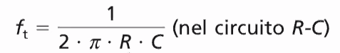
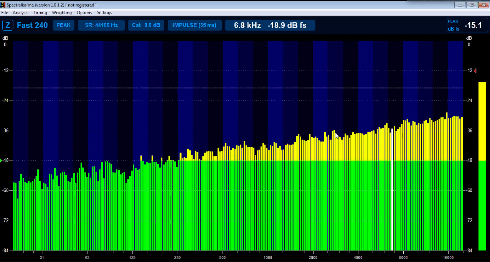
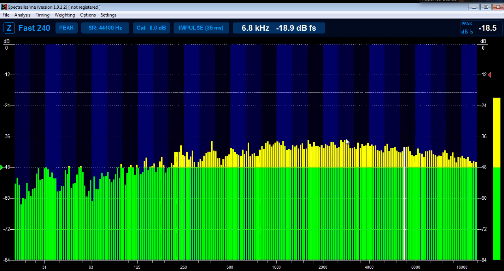
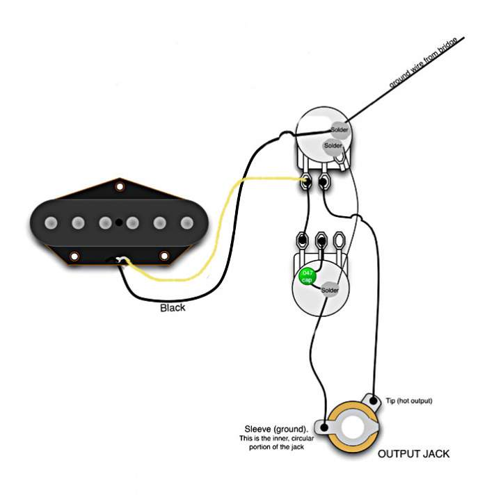
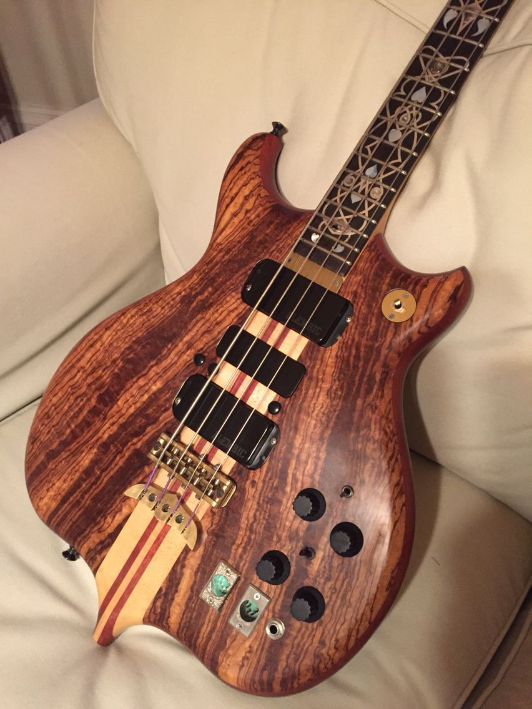

# Appunti della lezione di Giovedí 28 Maggio 2020

resistenza e condensatore in serie  -> filtro passa basso

[file spiegazione filtri](https://www.ltpaobserverproject.com/uploads/3/0/2/0/3020041/filtri_passivi.pdf
)

in genere in chitarre ->

[convertitore in farad](https://www.translatorscafe.com/unit-converter/IT/electrostatic-capacitance/13-1/microfarad-farad/)

se realizziamo un filtro RC, sapendo la capacità elettrica in Farad -> capiamo la frequenza di taglio del filtro  

Filtro RL al posto della resistenza vi è un'induttanza

Formula filtro RC

1. primo ordine: condensatore e resistore o condesatore e induttanza (2 componenti) -> filtri con la fase piú coerente
2. filtri di secondo ordine ci sono 3 componenti: condensatore, resistore e induttore (3 componenti)
3. filtro di terzo ordine

piú aumenta l'ordine piú aumentano le distorsioni di fase

sia condensatorre che induttore introducono modifiche sulla fase -> sono simili alle linee di ritardo, vantaggio di pendenza piú ripida ma con maggiori problemi in fase

in filtri per crossover -> in genere filtri di primo ordine per non modificare troppo la fase -> la variazione di fase non è la stessa a tutte le frequenze

Delay analogici si fanno in genere con condensatori e induttori

VA -> Visual Analyser -> generatore di segnali

Bug in programma -> white noise non funziona

vediamo il rumore rosa non filtrato sul visualizzatore di spettro

uscita di una scheda audio ha un impedeza di con 600 ohm + 0,022 microfarad -> 900 hz

600 ohm+0,047 microfarad -> 5000 hz

con 2 condensatori da 0,047 microfarad in serie

potenziometro logaritmico con curva che agisce tutta alla fine -> in genere potenziometro logaritmo ha la sigla che inizia con _b_, esempio di un potenziometro da 10 KOhm _B10K_

Usando un potenziometro come resistenza

- single coil -> 5000/6000 ohm
- Humbucker 15/16 Kohm  

potenziometro aperto -> tutto il segnale passa attraverso il condensatorre

se potenziometro è chiuso non fa passare corrente nel condensatore

formula dei condensatori in parallelo

[condensatori in serie e parallelo](https://www.matematicamente.it/appunti/fisica-per-le-superiori/elettromagnetismo-fisica-per-le-superiori/condensatori-serie-parallelo/)

condensatore elettrolitico ha una polarità -> il condensatore può o non puó avere una polarità

condensatori sono ceramici o a poliestere

alcuni condensatori si chiamano elettrolitici -> in cui il materiale dielettrico è un olio minerale -> per le caratteristiche del materiale dielettrico hanno una polarità -> se li utilizzi con la corrente alternata tagliano la frequenza

esistono gli elettrolitici bipolari (che in realtà sono 2 condensatori polari uno in un verso e uno nell'altro)

questi condensatori elettrolitici bipolari vengono usati sopratutto nel campo audio

condensatori in antiparallelo

in lavatrici -> si trovano in genere condensatori antiparalleli chiamati anche filtri di rete

[condensatori non polarizzati](http://circuitielettronici.it/componenti/condensatori-2/condensatori-non-polarizzati/)

[condensatori polarizzati](http://circuitielettronici.it/componenti/condensatori-2/condensatori-polarizzati/)

condensatori elettrolitici non polarizzati sono in realtà 2 condensatori

provare a fare la prova

- condensatore in parallelo sull'uscita

Per speaker -> voltaggi molto alti e resistenza dello speaker

Crossovere in genere si realizza con condensatore e induttanza

______

trasformatore in ingresso sinusoide in uscita -> oltre la fondamentale, c'è anche un po' di rumore di fondo

con diodo -> in genere si raddrizza un onda

filtro attivo è un filtro passivo seguito da un amplificatore

Basso attivo bilanciato bi mono

chris squire -> bassista con basso con 2 uscite -> con alti su distorsione e bassi non distorti

[masterclass Chris Squire](https://www.youtube.com/watch?v=cprcYnffK_o)

distorsioni con transistor e diodo
