# Appunti della lezione di giovedí 4 Giugno 2020

Tutti i cavi sono in generale dei filtri passa basso poichè funzionano come una resistenza e condensatore in serie.

Capacità = pF

Resistenza/Impedenza cavo

[specifiche cavo Klotz mc5000](https://shop.klotz-ais.com/media/msdocuments/MC5000_e.pdf)

Induttanza che come componente si rializza facendo una bobina con un cavo

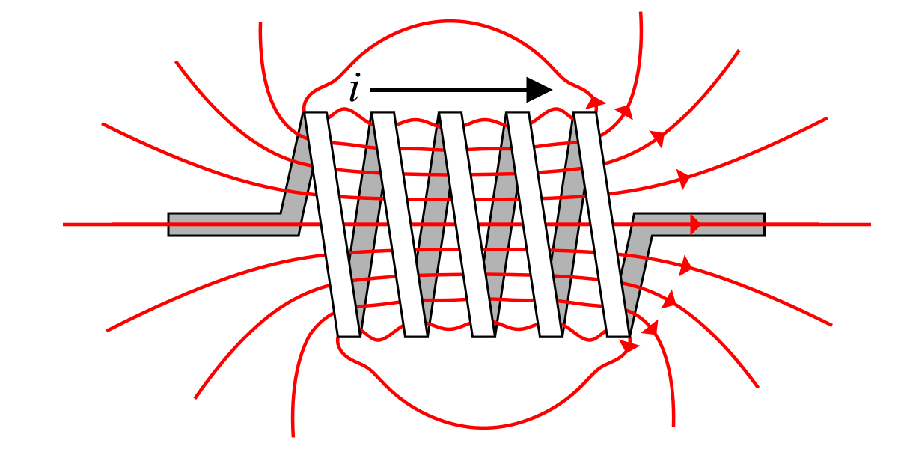

Induttanza si misura in _Henry_
data dalla formula 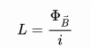

Rapporto dal campo magnetico generato e dalla corrente che l'attraversa

Quando c'è un attraversamento di un campo elettrico in un conduttore, si forma un campo magnetico.(cerca cavi che trova il campo magnetico generato da un cavo)

Proprietà campo magnetico, se la corrente che passa è una corrente alternata, il campo magnetico generato sarà un campo alternato.

Se devo fare un'induttanza, metto tante spire vicine, per avere un filo lungo concentrato in pochissimo spazio.

Ad esempio un elettromagnete è un avvolgimento di moltissime spire in pochissimo spazio.

### Diodo

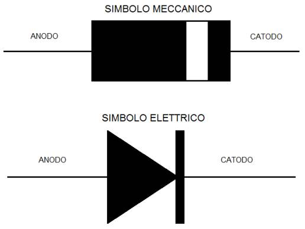
(simbolo elettrico dice comportamento elettrico, mentre il simbolo meccanico è proprio uno schemino di come è realizzato all'interno, per schema elettrico si usano i simboli elettrici, per la realizzazione e lo stampato si usano i simboli meccanici)

Componente importante, che sta alla base delle valvole e poi del transistor. Caso in oggetto per trasformare

220 v ac a 9v -> circuito che raddrizza la corrente e filtraggio stabile

Il diodo venne scoperto per caso da Fleming, realizzando qualcosa che realizzò anche Edison: una rudimentale lampadina.
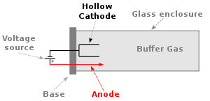

Si accorsero che facendo passare la corrente elettrica, il vetro si anneriva; il tubo è sottovuoto, non c'è aria, dunque fecero una scoperta.

Una parte di cariche si andavano a distaccare dal conduttore e si andavano a depositare sul vetro annerendolo, essi si chiamano _ioni_.

Dunque si scoprí che anche le cariche molto piccole erano materia.

Dopo altri esperimenti, ponendo un pezzo di metallo caricato con altra alimentazione.
Dunque gli ioni si andavano a posare su questa piastra. Una volta attivato il processo, il metallo caricato ovvero _ionizzato_, il metallo assumeva soltanto un verso. Il metallo diventava polarizzato e diveniva conduttore da una sola parte.

Il diodo nasce come diodo termo ionico, realizzato con:
- 2 piastre: anodo e catodo

Di attivo c'è il riscaldamento per far si che si attivi il processo.

Il posizionamento di anodo e catodo indicherà la direzione del passaggio di corrente. _Come delle valvole della camera d'aria di una bicicletta, nella quale l'aria puó passare in una singola direzione._

Termine esatto: **valvole termo-ioniche**

Il flusso di elettroni vanno dal catodo verso l'anodo.

### Tipologie di Diodo

#### Il diodo al silicio
Il diodo sottovuoto iniziale simile ad una lampadina, nel passaggio dall'elettronica sottovuoto all'elettronica allo stato solido, il diodo fu una delle prime componenti ri-realizzate.

Il primo materiale utilizzato per realizzare i diodi fu il silicio. I 2 pezzi di silicio vengono _drogati_ o polarizzati tramite un processo chimico. E si ha poi un elemento di silicio polarizzato positivamente e negativamente, facendo si che le cariche possano andare solamente in un verso.

Se nel diodo la corrente varia dall'anodo verso il catodo, se ci faccio passare una sinuoside, esce solo la parte positiva.

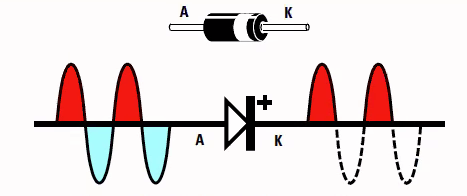

se cambio la direzione del diodo cosa succede?
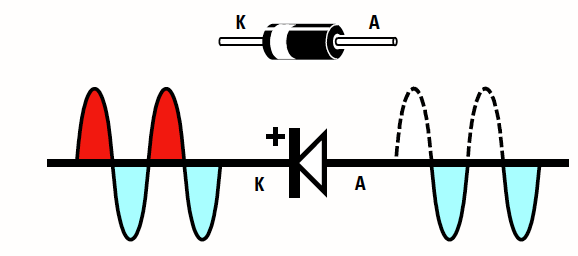

Se vado a vedere [datasheet](/datasheet-1N5400~1N5408.pdf) di un diodo e ne vedo le caratteristiche.

Di diodi nel tempo ne sono state trovate diverse tipologie come ad esempio il diodo led, che viene realizzato peró in una maniera diversa rispetto a quelli in silicio.

#### Il led
Anodo e catodo in diodo non in silicio non sono sottovuoto.

Il diodo funziona in genere non

#### il diodo Zenner

Che taglia la tensione ed in base al tipo di diodo si stabilizza la tensione ad una certa altezza, esso viene usato per evitare che quando ci sono dei picchi essi possano passare, dandomi in uscita una tensione stabile sempre a stesso voltaggio. La curva al di sopra di una curva di resistività

#### Varicap

Che ha una sua capacità interna, che puó variare in base alla tensione che applico e viene usato nella sintonia dei televisori.

#### OLED

Diodo led realizzato però su un film, tantissimi diodi. Un elemento è definito organico quando contiene una struttura costituita prevalentemente da carbonio e da qui origina il nome di led organico.

### I diodi nel campo audio

In genere vengono utilizzati degli elementi sviluppati successivamente rispetto al diodo, ma dalla derivazione di essa ovvero il **transistor**.

Come concetto il funzionamento di un elemento come il diodo è simile alla valvola.

La valvola è chiamata triodo a 3 conduttori, il terzo in piú è chiamato gate, oltre i 2 conduttori.

##### Diatriba valvola e transistor
La diatriba valvola e transistor, nasce da quando la valvola e il transistor lavorano oltre la soglia della distorisione, il cui comportamento non è lineare. Tutte le armoniche pari vengono esaltate dalla valvola, mentre le armoniche dispare sono piú esaltate dal transistor.

La reattività della valvola è molto piú bassa, dunque a frequenze molte elevate introduce un ritardo in risposta, e scala il suono e tagli le frequenze alte.

Esempio chitarrista dei Panthera con amplificatore a transistor. (Disco _Cowboys from Hell_ esempio della distorsione a transistor)

Esempio di Van Halen con amplificatore a valvole sovra alimentato.

Le valvole per come sono fatte, sono sensibilissime al campo magnetico. Gli amplificatori possono essere testate e combo, o solo ampli tutt'uno. Dato che le valvole sono sensibili al magnetismo se sono posizionate dietro ai coni, esse sono soggette al campo magnetico dei coni.

(Meshuggah esempio di distorsione valvolare.)

Differenza tra distorsione valvolare e transistor.

Distorsore dal punto di vista del suono, tende ad appiattire la dinamica. Mentre un amplificatore valvolare riesce a suonare non distorto a dinamica minore, mentre è distorto a dinamica maggiore.

#### Esempi su Diodo

- Per amplificatore in classe A, utilizziamo 2 diodi
- Raddrizzamento della corrente (in digitale modulo di una sinusoide), utilizzo un Ponte di Graetz o ponte raddrizzatore (2 diodi in una direzione e 2 diodi nell'altra)
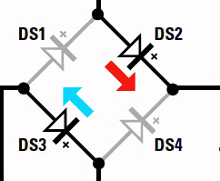

### Esperienza pratica sul diodo

Oscilloscopio e trasformatore a 12V
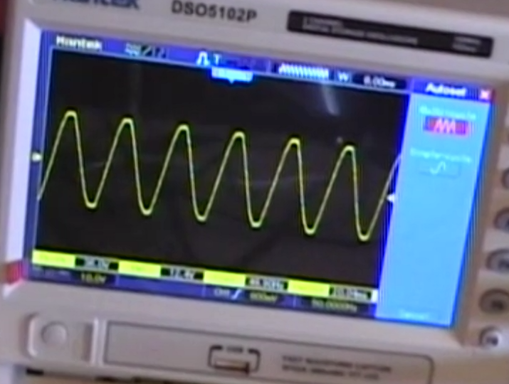

Se metto un diodo nel circuito dovrei vedere solo la semionda positiva, ma non è esattamente sinusoidale, ma è un po' distorta, poichè il comportamento ideale è diverso da quello reale.
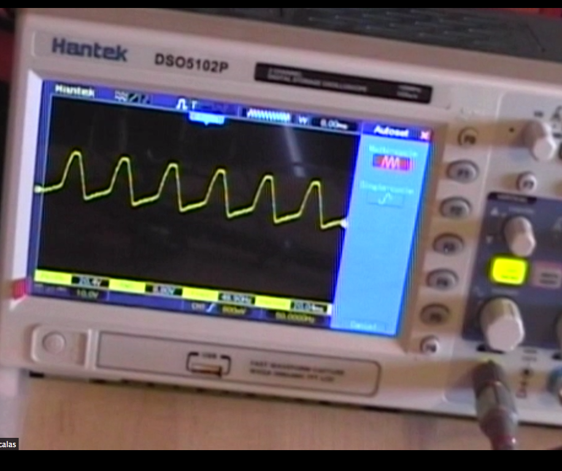

Diodo inverso
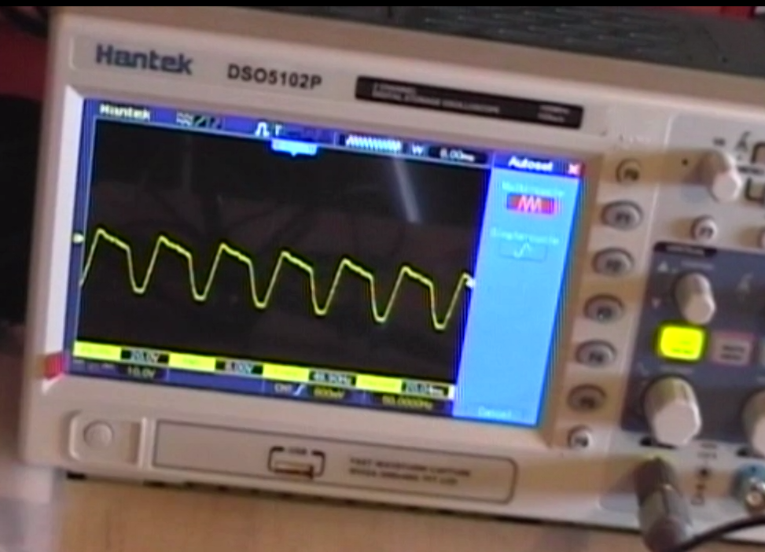

Metto un componente diverso, in questo caso ponte di Graetz
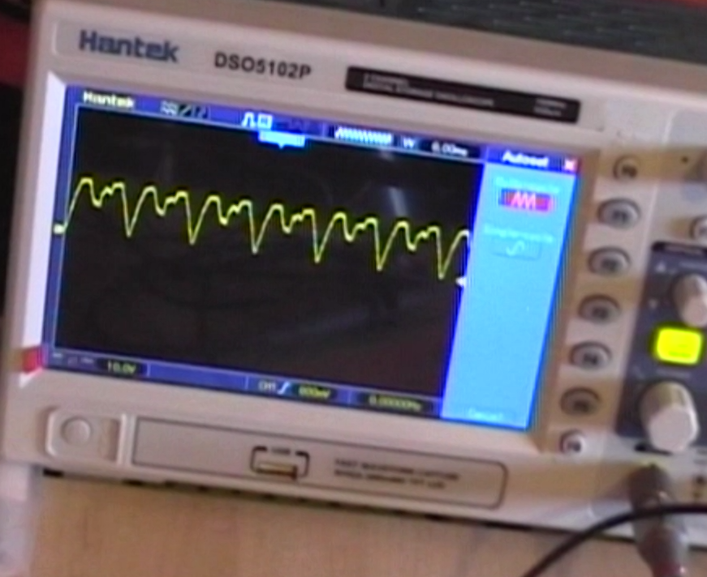

il segnale è ora positivo, ma non continuo, ma pulsante, come stabilizziamo con l'uscita pulita un segnale, come facciamo a renderla stabile.
Usiamo un'interpolazione, per raddrizzarlo in un tot di tempo, usiamo un condensatore

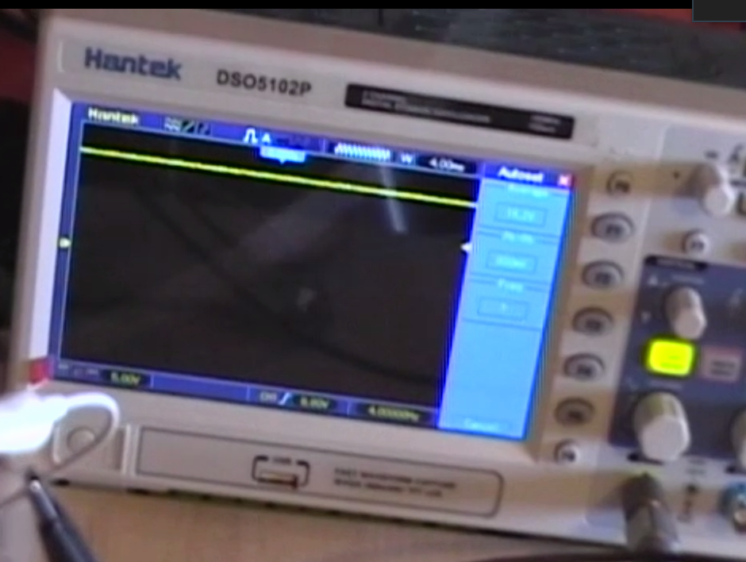

con il condensatore siamo riusciti a raddrizzare il segnale

Le increspature che si vedono, sono quelle che si chiamano ripple
