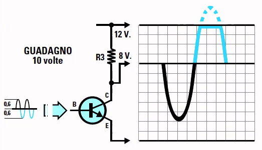
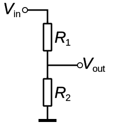

# Appunti della lezione di Giovedi 11 Giugno 2020

diodi come raddrizzatori di tensione e filtraggio

oggi affrontiamo *transistor* e *valvola(triodo)*

---

Questione esame: progetto da singolo o collettivo con una relazione, ma la cosa piú importante è che fai dei test, lo dimostri

---

### Transistor

##### Introduzione

Tutto ció che è attivo in audio in genere utilizza un transistor!

Quando parliamo di operatori logici, in elettronica essi sono fatti con transistor, essi amplificano con comportamento binario: 0 o 1.

Transistor hanno in genere un comportamento lineare.

Se un qualcosa puó funzionare in maniera lineare, possiamo anche farlo funzionare in binario.

Non faremo circuito a valvole per costo, perchè esse lavorano a tensioni altissime, poi c'è una serie di criticità

*Elettronica pratica è l'arte dell'arrotondamento*, dato che componenti hanno tolleranze molto alte

Considerare che tutti i circuiti hanno impedenza

##### Il triodo

Il diodo aveva 2 conduttori e quando filamento si scaldava, gli ioni potevano passare in una sola direzione.

Il triodo fu scoperto empiricamente, se tra catodo e anodo metto un ulteriore elemento, ci metto dunque qualcosa per poterle controllare. Se metto un conduttore esso fa da cancello, se applico però una tensione a questo cancello, esso farà passare una quantità di ioni. La quantità di ioni che passano è direttamente proporzionale alla tensione che applico al conduttore.

Se abbiamo ad esempio in ingresso 500 v, essi non passano se non applico tensione alla griglia

Se la tensione in ingresso è sempre 500 v e nella griglia metto una sinusoide da 0 a 1 volt, avrò in uscita una sinusoide da 0 a 500 v.

Il segnale da amplificare viene posto sulla griglia per essere amplificato.

[triodo_funzionamento_video_](triodo_funzionamento.mp4)

Per la vavola termoionica per far si che il passaggio tra catodo e anodo avvenga, cio sono 2 condizioni necessarie:

1. surriscaldamento del catodo per rendere incandescente il metallo

2. tensione molto alta, sennò non si riesce a far distaccare gli ioni dal catodo all'anodo

In alcuni pedali recenti vi sono valvole piú piccole che lavorano a tensione catodica bassa

Il diodo era formato da 2 parti (in silicio o germanio), nel diodo vi erano 2 pezzi di silicio polarizzati(drogati) in modo inverso, uno positivo ed uno negativo.

Nel transistor che è il triodo, ci sono un positivo, un negativo ed un altro positivo:

- NPN

- PNP

Importante è che al centro 

Il catodo si chiama **collettore**

L'anodo **emettitore**

Griglia è chiamata **base**

il transistor lo possiamo schematizzare come 2 diodi collegati

Il funzionamento rimane il medesimo sia che il transistor sia PNP e NPN

In tutti i circuiti audio abbiamo la terra nella parte negativa e il segnale nella parte positiva.

Esistono varie tipologie di transistor che hanno in genere alette di raffreddamento.

Ora esistono i componenti SMD() che si saldano sullo stampato.

Produttori di componenti in:

- Motorola

- Texas Instruments

- RCA

I transistor in genere ce sono anche centinaia in. processori, inizialmente per i computer si  usavano le valvole. Esse consumavano molta piú energia e producevano molto piú calore.

Il transistor funziona come una diga che aprendosi controlla un flusso di acqua piú grande.

In transistor emettitore, collettore e base non hanno sempre le stesse posizioni.

Servono delle resistenze per poterlo far lavorare, dunque per adattare un transistor usiamo delle resistenze.

Il transistor lavora su variazioni di corrente(e non tensione), dunque tramite una resistenza possiamo far tenere fissa la tensione e far variare la corrente.

(Pagina 235 esempio di distorsione)

Faccio lavorare un transistor oltre la tensione ottengo una distorsione(saturazione del segnale).

Utilizzando la valvola ho un effetto timbrico che esalta piú le armoniche pari.

Posso far lavorare un segnale con un offset, ottenendo una distorsione asimmetrica

Paritore di tensione serve per riscalare un tensione.

Se ho un tensione in ingresso 2 resistenze in serie, in mezzo alle 2 resistenze prelevo la tensione.

Lo utilizziamo quando vogliamo abbassare o scalare una tensione.

Il partitore divide una tensione in 2 parti.

Se ho le stesse resistenze mi esce il segnale riscalato simmetricamente.

Se ho resistenze diverse il segnale verrà riscalato asimmetricamente.

Ed un partitore puó essere usato per raddrizzare una semionda, e dunque si comporta come diodo.

Nessun amplificatore verrà progettato per lavorare ai suoi estremi e dunque sempre alla distorsione.

Valori che i costruttori danno per i transistor:

1. VCB -> voltaggio massimo base

2. VCE -> tensione massima emettitore

3. VEB -> segnale in ingresso

4. IC -> tensione massima del collettore

5. Ptot -> potenza totale di guadagno 

6. HFE -> rapporto tra corrente collettore e di base, che è a tutti gli effetti il guadagno

7. Ft -> la frequenza massima a cui può operare
