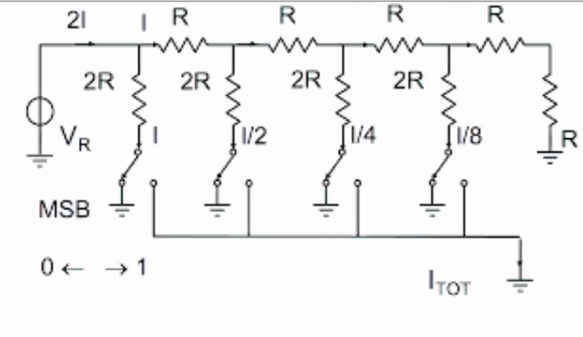
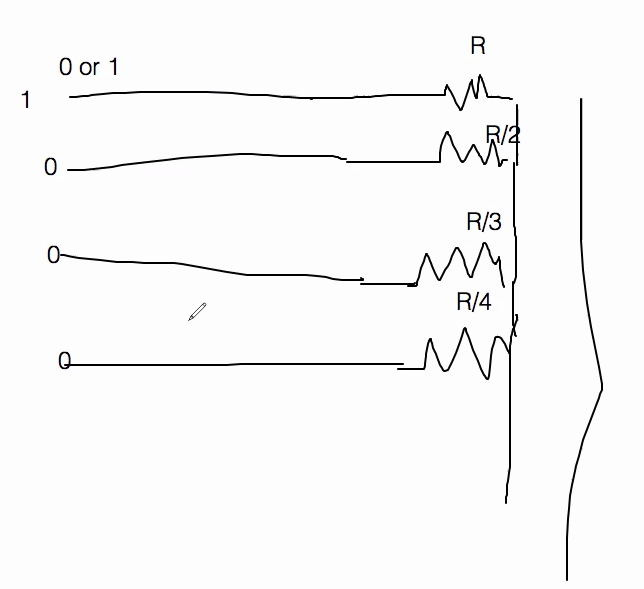
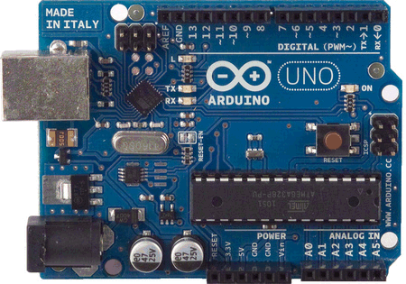
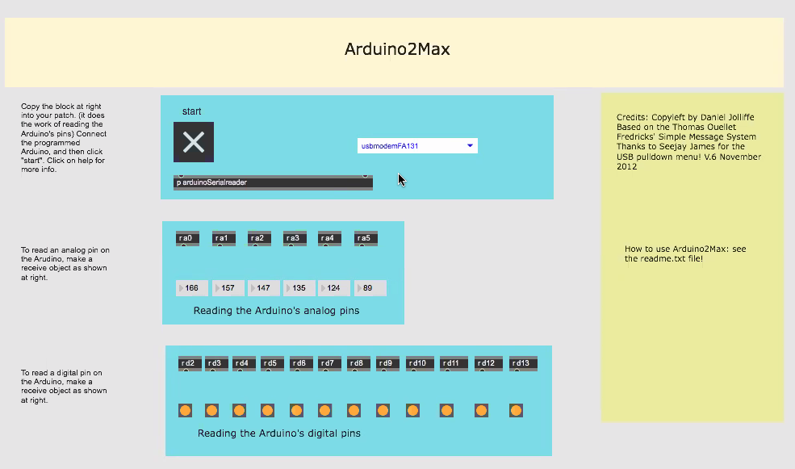

# Appunti della lezione di Giovedí 18 Giugno 2020

versione a transistor della DI-BOX

Arduino ha aperto un mondo che fino ad oggi era chiuso a molte persone. L'informatica ha sostituito parte dell'elettronica.
Con Arduino che è un oggetto informatico si è riaperto l'interesse per l'elettronica.

Protocollo che trasforma un voltaggio in midi o osc.

Il voltaggio sia nel caso dell'[expression to midi](https://beatbars.com/it/expression-to-midi.html)

Potenziometri chiusi ermeticamente.

Marchio rinomato per i potenziometri è la Alps.

Potenziometro usabile per un expression pedal è quello da 10KOhm

Potenziometro con ingranaggio che trasforma movimento lineare in rotativo.

### Pedale d'espressione

Prende il nome dall'organo a canne, che premendo aumenta o diminuisce il volume per l'organo. Era ed è utile per gestire la dinamica (ovvero il flusso d'aria). Pedale di espressione nella versione elettronica è nato per abbassare il volume, ma posso associarlo al vibrato.

### Pedale del volume

È una sola resistenza variabile

### Pedale con controlli da analogico a digitale

Con Arduino si puó realizzare il passaggio da analogico a digitale.

Interfacciamento tra 2 mondi concettuali.

Pensando ad esempio a calcolatrici meccaniche, essa faceva somme moltiplicazioni, somma e sottrazione. Tutte queste operazioni sono riconducibili a una sola operazione, ovvero somma.

Il computer, qualsiasi operazione la scompone e risolve in un insieme di somme.

La macchina di Turing era un computer meccanico.
Enigma aveva la complessità di codifica come codifiche attuali.

### Differenza analogico-digitale

Pensiamo agli accadimenti come un flusso continuo, mentre in realtà tra una particella atomica e l'altra c'è il vuoto.

Nulla è dunque continuo, e nel digitale i fenomeni vengono quantizzati. Non esistono fenomeni infiniti, viene tutto discretizzato.

Nel mondo digitale è tutto discretizzato.

Questa riduzione della realtà ci permette di imitare la realtà discretizzandola.

Ciò significa trasformare un suono in pezzettini e più sono stretti gli scalini piú essa assomiglia l'originale.

L'immagine è piú raffinata in base ai pixels per pollice.

Che la macchina che descrive valori discreti sia elettronica o meccanica, non fa differenza.

Computer organici (simili al cervello), che funziona a stati binari, invece di usare il silicio usa delle cellule simulate da impulsi elettrochimici, ma non siamo in grado di decifrarli.

Elettronica per usarla in digitale uso il transistor come un interruttore.

I computer sono tanti interruttori associati a un qualcosa che può memorizzare le posizioni di questi interruttori.

Le prime memorie degli elaboratori erano meccaniche ed erano fatte ad anello di ferrite.

Le prime ram erano un incrocio ad anello di ferrite ed incrociando l'anello tengono in memoria un contatto attraverso la magnetizzazione di uno spazio.

Con l'elettronica evoluta si è miniaturizzato tutto.

Il concetto del computer è acquisire informazioni, di cui alcune sono fissate (tipo i tipi di operazioni), mentre altre sono volatili.

Computer è formato da parte che fa i calcoli, parte che funziona con dati e parte di interfaccia.

Arduino ha al suo interno un processore che permette di fare alcuni calcoli.

Arduino usa un linguaggio simile a processing e si interfaccia con l'esterno con convertitori DAC e ADC e ciò permette di mandare un valore elettrico di tipo analogico, trasformarlo e rimandarlo indietro analogicamente.

### Convertitore ADC

Convertitore più semplice che esiste è fatto a reti di resistenze.

Ogni volta che il voltaggio arriva all'interruttore e esso scatta e andando avanti in base a quanti valori quantizzo.

Attualmente i convertitori a resistenze non sono molto usati data la larga tolleranza delle resistenze; dunque i convertitori a reti di resistenze si utilizzano solo con resistenze ad alta qualità con poca tolleranza.

### Convertitore DAC

Avendo un segnale digitale a 4 bit, ogni cavo può assumere un valore 0 o 1 (ON/OFF).

Se ho ingresso segnale 1000 avrò 5V in uscita.

Piú livelli ho di resistenze, piú definizione avrò.
-----
##### Memorie

Ram, Rom e eprom sono memorie.
Ram scrivo sopra allo spegnimento si cancellano.
Eprom scrivo dei dati e non si cancellano fino a che non ci riscrivo sopra.

Arduino ha una Rom e una Eprom per tenere in memoria i programmi.

------

### Arduino

Inventato in Italia e reso open source.
Intorno al micro processore hanno annesso convertitori che leggono valori analogici da 0 a 5V. In formato TTL.

[schemaArd](schemaArd.pdf)

Porte su pc:
- usb
- thunderbolt
- sata
- firewire

Mentre su arduino posso collegarci oggetti semplici e trasformarli in usb.

Arduino ha porte di ingresso e uscita.

Con cavo usb alimento arduino.

C'è bisogno di installare driver per arduino che dice al sistema operativo per funzionare.

[sito per comprare Arduino](https://www.robot-italy.com/)

Esistono varie tipologie di interfacciamento con varie tipologie di programmi e oggetti.

Vediamo arduino2max per l'utilizzo di Arduino con [arduino2max](https://github.com/joesanford/arduino2max).

Se ponticello uscita a 5V e la mando a entrata a0, vedo che il valore letto da quest'entrata è 1023, ovvero il massimo.

Ora se inserisco un potenziometro in mezzo, posso far variare la resistenza e dunque il valore letto dall'entrata a0.

Se il potenziometro lo collego ad un pedale posso modificare la resistenza con il movimento del pedale.

La GND mando sempre il residuo per avere un valore di riferimento e non creo la differenza.

Pin centrale è quello che si muove e il laterali sono gli estremi del carbone.

Se collego una qualsiasi cosa posso usarla con max ad esempio convertendolo in MIDI.
