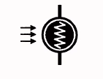

# Appunti della lezione di Giovedí 25 Giugno 2020

Dato che abbiamo visto il transistor e l'amplificazione, parliamo di controllo di amplificatore in voltaggio

### Voltage Control Amplifier

VCA è usato per modulazione e ampiezza del segnale o nei compressori.

Realizzazione di un pedale per tremolo, e modo piú antico per controllo dell'amplificazione in voltaggio, usando un componente ottico.

Esiste un formato regolabile di resistenza, ovvero un potenziometro; esiste un altro tipo di resistenza regolabile ovvero la **fotoresistenza**.

Resistenza che ha una parte sensibile alla luce che all'aumentare e diminuire della luminosità cambia la resistenza.

Se collego dunque un segnale ad una resistenza variabile, avrò in out un segnale che aumenterà in base al livello di intensità del segnale in ingresso.

Se andiamo a sostituire la resistenza con una fotoresistenza e ci accoppiamo un circuito che genera, ad esempio, una sinusoide ad una lampadina che genera luce in base all'intensità del segnale, varierà la luminosità in base al segnale.

_Simbolo della fotoresistenza_

Aumentando la luminosità della lampadina il segnale si attenuerà o no in base all'intensità del segnale, avrò dunque creato un tremolo.

Se cambio l'intensità in maniera ciclica realizzi dunque una modulazione d'ampiezza.

Ormai non usiamo piú una lampadina, ma si usano in genere i led; ovviamente ogni resistenza deve essere accoppiata ad una "lampadina" che sfrutti al meglio la fotoresistenza.

Esistono anche altri componenti foto sensibili (come i fotodiodi), come il diodo zenner o ancora i fototransistor.

Oggi in commercio esiste un componente già accoppiato che contiene emettitore luminoso e fotoresistenza, ed ovviamente la coppia deve essere isolata dall'ambiente.
Questo componente viene chiamato _accoppiatore ottico_ o _fotoaccopiatore_.

Nel fotoaccoppiatore vi è un ingresso per il controllo luminoso e altri due capi sono i capi della resistenza.

Questo accoppiamento ottico viene utilizzato anche come isolatore ottico; ad esempio nella porta midi(ingresso digitale), per evitare il rischio che un circuito in ingresso danneggi l'entrata, si usa un _optoisolatore_(simile ad un fotoaccoppiatore), con elemento luminoso e elemento che percepisce il cambiamento di luminosità(collegato con corrente continua).

Se arrivassero 300V si rompe la lampadina ma non arrivano 300V al synth, vi è dunque un segnale ottico che media all'interno e media il fatto di avere un collegamento elettrico in ingressi sensibili.

Dunque quasi tutti i segnali digitali con porte in ingresso presentano un ottoisolatore, realizzando un circuito di protezione.

Tremolo ovviamente rientra negli effetti di modulazione.

### Operazionali

Si chiamano amplificatori operazionali, e hanno all'interno transistor. Venivano usati per fare calcoli. Esso è facile da realizzare in cui vi sono un ampificatore e 2 resistenze.

La cosa particolare è che il guadagno(G) è dato da rapporto valore in uscita e valore in entrata.
G = Vout/Vin = Rf/Rin

Ovviamente un tipico operazionale è ben piú complesso dell'esempio base di operazionale.

Esempio del **TL071**, ovvero operazionale a cui viene adattato il segnale attraverso resistenze e condensatori.

Gli operazionali piú quotati nell'ambito audio sono quelli della _Burr and Brown_, essi sono operazionali ad alta qualità.

Se si compra un apparecchio della Behringer e sostituisci gli operazionali, ha una qualità maggiore.
Utilizzi degli operazionali:
- amplificare
- equalizzare

### The Tremolo - optical Tremolo kit - musikding.de

Tremolo con accoppiatore ottico (VTL5C/2).
Cambiando la resistenza, cambio la velocità(frequenza funzione che controlla resistenza), la simmetria(tra semionda positiva e negativa). Sinusoide simmetrica ha semionda positiva e negativa uguali, asimettrica ha le due semionde diverse.

La fotoresistenza  collegata ad un generatore di funzioni che controlla la quantità, velocità e profondità dell'effetto.

(potenziometro montato su circuito viene chiamato trimmer -> con regolazione di base con cacciavite)

Tutte le resistenze servono per adattare il segnale, per adattare l'alimentazione, per ottenere l'impedenza in ingresso etc...

In  questo caso l'operazionale ha 3 funzioni:
- guadagno con fotoresistenza
- controllo
- buffer, ovvero controllo che adatta impendenza di entrata e uscita.

________________
Realizzazione circuito stampato. Ovvero base di bachelite in cui vi sono piste ramate.
I circuiti stampati si possono realizzare in vari modi:

1. Piastre di rame compatto-> tracciando il circuito delle piste con una vernice o un pennarello che resiste all'acido.
L'acido usato è in genere _ipocloruro ferrico_ o _acido muriatico_ ovviamente l'acido deve attaccare i metalli.
2. Utilizzo della fotoincisione
3. macchina con fresa che incide meccanicamente il rame
4. spedizione e realizzazione di circuito in Cina
________________

Tutti i componenti al silicio in genere hanno uno zoccoletto da saldare e poi ci si incastrano sopra diodi, transistor e circuiti integrati. Se scaldo troppo il componente, esso fa rovinare i semiconduttori all'interno.

Il rame tende a ossidare, che quando se ne crea molto rende il rame meno conduttore, e dunque si mette una vernice protettiva non si fa passare l'aria e viene ostacolata l'ossidazione.
