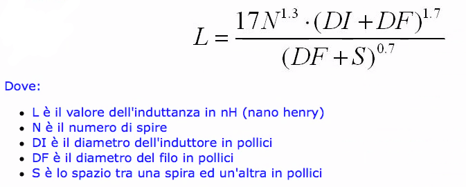

# Appunti della lezione di Giovedí 2 Luglio 2020

- realizzazione pratica
- misurazione dei parametri di qualità
- comparazione con apparecchio commerciale
- test pratico e problema

__________

Calcoli per speaker e vasta gamma di scelte soggettive e a livello progettuale.

Crossover, quanto sfruttare un altoparlante od un altro.

La selezione dei tagli di frequenza del crossover modificabili.

Crossover, resistenza, induttanza condensatore.

Resistenza rimane sempre fissa.

Switch che seleziona condensatore che serve per avere diverse bande passanti.

In genere i filtri per i crossover sono di secondo ordine per ottenere effettivamente un passa alto ed un passa basso passivo.

Tutte le caratteristiche sono molto importanti per il litraggio e per la costruzione dello speaker.

Filtro RLC, tipologia per crossover.

Ci sono programmi per inserire i parametri per la costruzione dello speaker.

L'impedenza, se hai un crossover, devi tenerla presente se hanno impedenze differenti poichè.

[calcolo crossover a 2 vie](https://www.diyaudioandvideo.com/Calculator/SpeakerCrossover/)

- impedenze
- frequenza di taglio raccomandata dal tweeter
- frequenza di risonanza

Differenza tra filtro fi primo e secondo ordine

[speaker crossover calculator](https://www.v-cap.com/speaker-crossover-calculator.php)

[crossover calculator](https://www.omnicalculator.com/physics/crossover)

__________

Fare frequenze di taglio del crossover:

- 2500
- 3500
- 4500

### Sfasamento altoparlanti

Se hai uno sfasamento di altoparlanti di 90 gradi, avrei lo sfasamento su tutti e due

La resistenza è dunqe l'altoparlante fino al terzo ordine.

__________

tripla copia del circuito con Switch

dimensionare il condensatore e l'induttanza per lavorare tranquillamente con quei vattaggi inseriti

possiamo dedurre il voltaggio con I=V/R, dimensionando e stando

Condensatore a 250V in genere anche se viene raggiunto un massimo di 50V

Basetta realizzata in bachelite o basetta millefori.

Per relizzazione induttanza si prende rame smaltato.

### Induttanza

Essa ha forme diverse e si realizza con la formula:

Speaker e microfono omnidirezionale, con noise per vedere se la risposta è uguale.

Utilizzare un programma come REW.
Oscilloscopio.

Parametri meccanici altoparlante
- cedevolezza
- litraggio
- materiale all'interno

Realizzazione di cassa chiusa

- basette resistenti e isolanti in vetroresina
- cavi interni, cavi da 2,5mm con una buona sezione
- fisso da fissare interno alla cassa per non farlo vibrare
- selettore a switch

### Differenza tra distorsore e overdrive

Circuito elettrico e come funziona
