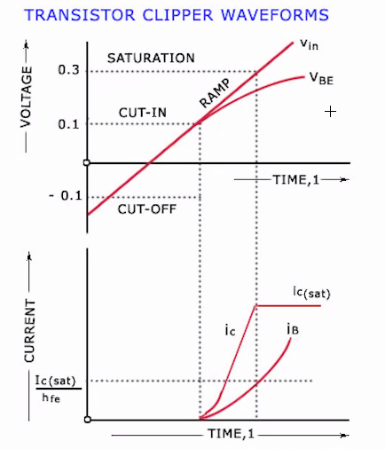
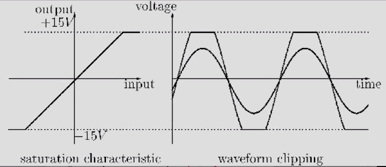
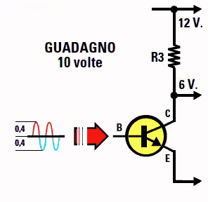
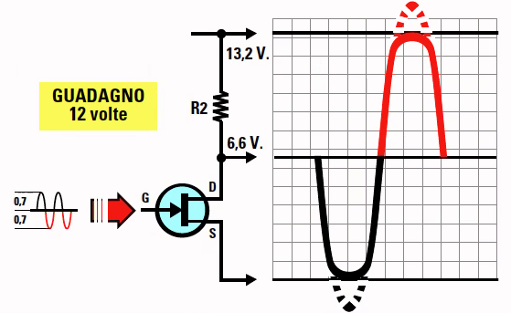
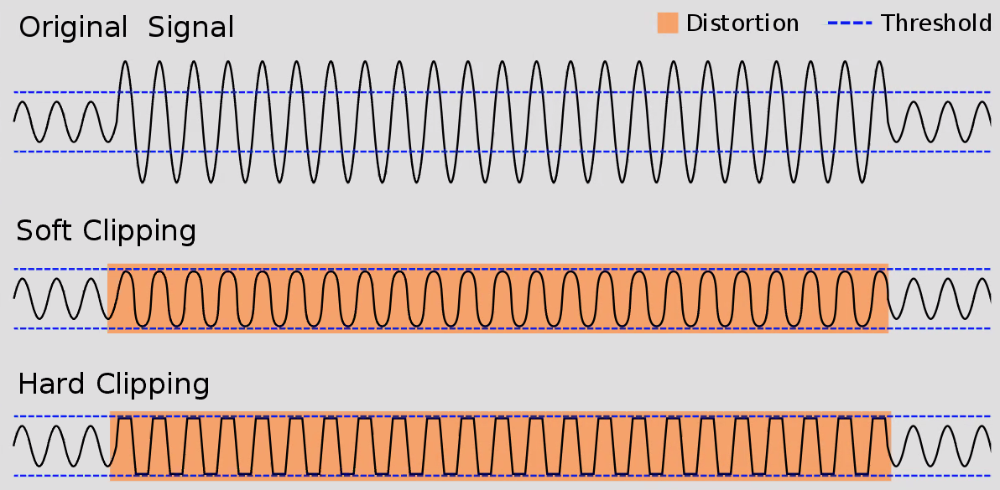
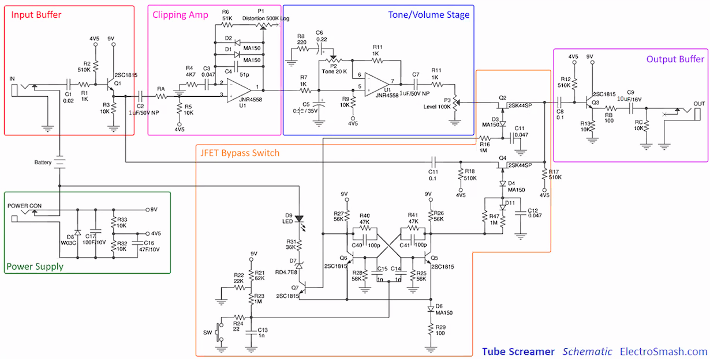
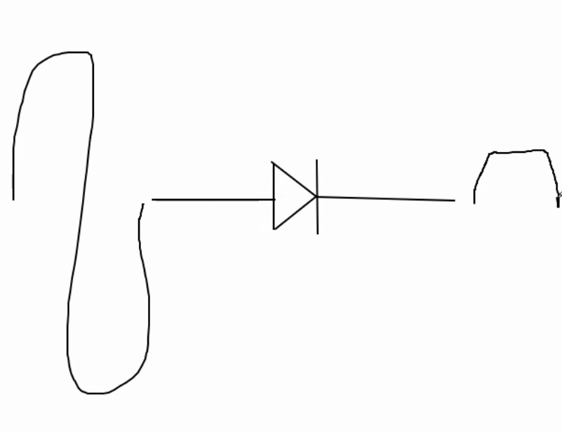

# Appunti della lezione di Giovedí 9 Luglio 2020

Oggi vediamo cos'è un overdrive e la differenza tra distorsore, overdrive e Fuzz

Effetti che sono sovrapponibili come suono, ma il circuito e la maniera in cui lavora è qualcosa di totalmente diverso

### Distorsore

Caratteristica di un comportamento non usuale di questi componenti

#### Comportamento elettrico

Fino a un tot di volt il transistor è un moltiplicatore, superato un certo voltaggio si supera la soglia di lavoro del transistor, e diminiuisce l'amplificazione e il transistor non amplifica piú, si raggiunge dunque il punto di saturazione. Il semiconduttore superato quel certo voltaggio si avrà sempre lo stesso valore in uscita, anche la corrente superato un certo punto rimane orizzontale.

#### Comportamento sonoro

Se il picco della sinusoide supera la soglia di distorsione, viene tagliata la parte di sinusoide che supera di saturazione, il segnale viene _pettinato_, il segnale in piú viene tagliato, questa è la vera e propria distorsione.

Il distorsore fa lavorare un transistor per far squadrare il segnale.

Ci sono poi delle varianti a questa distorsione.

Il punto da cui il transistor squadra la forma d'onda è chiamato _soglia di saturazione_

Comportamento di questo tipo, l'onda quadra nel punto in cui il segnale cambia livello abbiamo una frequenza d'onda.

In un segnale ciclico l'ampiezza varia nel tempo, mentre in un segnale sinusoidale l'ampiezza varia continuamente.

L'onda quadra reale ha piú una parte tonda orizzontalmente che perfettamente squadrata.

Il distorsore fa lavorare oltre il livello di amplificazione del transistor.

Andando a vedere i datasheet dei transistor troviamo i dati che indicano questa soglia di distorsione, [sito con molti transistor](alltransistors.com)

I transistor non si usano solo in audio, ma anche ad esempio in radio.

Ci sono dei grafici che indicano la curva di distorsione, in cui è indicato dopo quale voltaggio il transistor inizia a comportarsi in maniera non lineare.

Il transistor ha base, collettore ed emettitore.

Il TS9 non è in realtà un vero e proprio distorsore.

Oltre il livello di ampiezza abbiamo la distorsione(saturazione)

Se immetto na tensione maggiore di quella che puó accettare, vado a realizzare una saturazione del transistor. Ed ho quindi una saturazione del componente.

_esso è un soft clip_

_con un hard clip invece viene fuori una forma d'onda quadra_

Tensione massima 13,2 V ma mando in ingresso 16,8.

Se rimaniamo a temperatura bassa, il transistor non viene sforzato, ma comunque nei datasheet abbiamo una temperatura massima.

In realtà negli amplificatori reali si lavora sempre al di sotto della tensione di utilizzo.

Effetti per pedale alimentati a 9V, possono essere alimentati fino a 15V.

Per un distorsore a pedale, maggiore corrente in ingresso da meno headrum di distorsione.

#### Overdrive

In realtà nell'overdrive non è il transistor che realizza la distorsione, ma è un preamplificatore che manda l'ingresso della chitarra a volume piú alto, producendo poi una distorsione.

Il vero overdrive in uscita ha il suono pulito, è solo piú alto in ampiezza, ma rende controllabile la distorsione che posso graduare la distorsione anche suonando lo strumento.

Pilotare l'ingresso da un ampiezza minore, ed in uscita abbiamo un suono con la stessa forma d'onda, ma con ampiezza 1 volta e mezzo maggiore.

#### Fuzz

Esso adotta un hard clip mentre l'overdrive adotta un soft clip.

Tipo di distorsore -> (parola che significa peluria), definizione estetica piú che sonora

#### TS9

Tube Screamer, ha 2 controlli:
1. Drive
2. Distortion

(il buffer in elettronica adatta un segnale ad alta impedenza, creando un livello che può esser processato dai componenti successivi nel circuito)

Schema del TS9

Il tube screamer ha in realtà vari blocchi.

Gestione dei bypass del segnale, in questo caso il bypass non è thru-bypass, poichè il segnale è sempre veicolato da buffer ed altri componenti, il thru-bypass difatto scavalca tutto in teoria.

##### Tone/volume stage

Il vero overdrive è quello in blu, amplificatore che aumenta il volume e che ha anche un controllo di toni.

##### Distorsore/Clipping amp

Esso realizza una distorsione con amplificatore operazionale, amplificatore con diversi transistor, che ci permette di gestire l'ampiezza.

Nella retroazione hanno inserito una coppia di diodi(che fa passare il segnale in una sola direzione), ed un condensatore.

Quindi il TS9 è sia un distorsore che un overdrive.

Anche il diodo ha una soglia, ma il diodo non amplifica, ma dopo una certa soglia non ce la fa a restituire il segnale intonso.

Anche il diodo può far squadrare il segnale in base alla tensione che mandiamo all'interno del circuito.

Nel TS9 usano 2 diodi per avere tutte e due le semionde, e con il potenziometro dosiamo la quantità di energia che entra.

Il condensatore è un aggiustamento.

#### Primi pedali Overdrive definiti Boost

Realizzati con un solo transistor ed un solo controllo come l'Electro-Harmonic LPB-1 Booster

________
La distorsione è stata scoperta con pre-amplificatori con la batteria scarica, o per far saturare un amplificatore, se ne mettevano uno in cascata all'altro.

Le distorsioni dei Beatles erano realizzate facendo saturare il canale del mixer.

________
Nel distorsore è il circuito che crea la distorsione

Nell'overdrive è il circuito che segue l'overdrive che va a distorcere, la distorsore dell'overdrive dipende dunque dal componente successivo all'overdrive.

_Esempio con l'acqua_

Acqua sporca a pressione uguale all'ingresso -> distorsore
Acqua limpida a pressione maggiore -> overdrive -> il componente successivo va a _sporcare_ l'acqua
_________

I Kfraftwerk avevano un'estetica visuale e sonora di un futuro cibernetico, mentre i Tangerine Dream erano piú umani.
