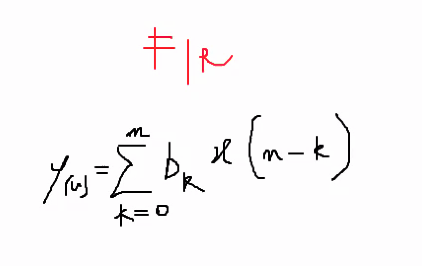

# Appunti della lezione di Giovedi 4 Giugno 2020

tutte le lezioni verranno registrate, con la playlist con link univoco

[link alla playlist]()

__________

Il riverbero di Schroeder è uno dei primi modelli di riverberazione

Da una parte vedremo il modello matematico, e dall'altra un modello _fisico_ (nel senso dell'implementazione), ovvero la simulazione o approssimazione di un modello matematico.

Tutti i modelli fisici sono in genere sempre approssimazioni, che sono in rapporto 1:10 con il modello fisico-matematico.

### Riverbero di Schroeder

I coefficenti iniziali erano in genere scelti per non far combaciare i comb fra loro. Dunque è una semplificiazione.

4 filtri comb e serie di filtri allpass

Modello di Chowning, ovvero inversione del modello di Schroeder.

Modello di Moore che raffina il modello di Schroeder.

Potremo arrivare a fare simulazioni di riverbero con feedback delay network.

Non faremo la convoluzione, poichè pensiamo che sia l'esatta fotografia di un ambiente ma in realtà non lo è.

Dal punto di vista applicativo la convoluzione è molto semplice, che è una moltiplicazione.

In genere pensiamo gli algoritmi quasi come patch di Max, ma lo è veramente.

Da FFT abbiamo in uscita numeri complessi.

### Filtro comb

Nella costruzione di un filtro comb, per rendere il tutto piú realistico, va inserito un filtro low pass.

Vediamo processo insieme e poi lo faccio.

### Filtri FIR e IIR

La differenza fra queste 2 tipologie di filtri:

- FIR: y(n) = 

- IIR: feedback prende i campioni all'uscita, il filtro si ciba dei campioni all'uscita 

Quali sono le caratteristiche

1. Risposta all'impulso finita
2. Risposta all'impulso infinita (data dal feedback)

L'impulso corrisponde in digitale ad un campione contenente tutte le frequenze alla stessa ampiezza.

Impulso deve essere la parte minima piú breve possibile, ovvero un campione.

Il digitale in una scala digitale è già al terzo grado di approssimazione.

Analogico->Discreto->Digitale

Orologio con scatti continui o discreti.

Il digitale è una codifica della discretizzazione in pochi caratteri.

Filtri FIR e IIR hanno ognuno delle caratteristiche:

La risposta dei filtri è inficiata in fase, il FIR non viene inficiata in fase.

Gli IIR sono quelli che vengono definiti in regime analogico.

Vediamo come realizzare l'uno e l'altro.

Dal punto di vista dello schema per realizzare un filtro si possono realizzare in questo modo.

FIR

IIR

Nel momento in cui fai uscire un segnale e lo riporti su stesso, il ricircolo porta già su di se un campione di ritardo.

Lavorando in audio rate questo procedimento si puó fare.

Biquad -> è un filtro IIR -> dato che ha una ricorsione.

Implementazione in Max e Csound

Filtro passa basso con frequenza di taglio con cutoff a N

##### Filtro FIR di primo ordine

Per realizzare un filtro di secondo ordine la somma si complica, ma il procedimento computazionale potrebbe pesare di piú.

##### Filtro FIR di secondo ordine

Filtro divisibile in:
- pass band
- transition band -> inizia quando la banda di segnale si abbassa di 3dB -> pendenza del filtro -> che coincide con la frequenza di tagli (fc), la magnitudine in dB
- stop band

Un filtro teorico blocca da una certa frequenza in poi, nel caso del filtro i coefficenti devono essere finiti, dunque la banda di transizione deve avere una pendenza. Ma ciò porta con se anche dei problemi, ovvero i problemi di ripple.

Capire il tot di campioni per relazionarlo alla frequenza di taglio.

##### Schema filtro IIR

