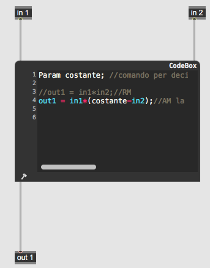
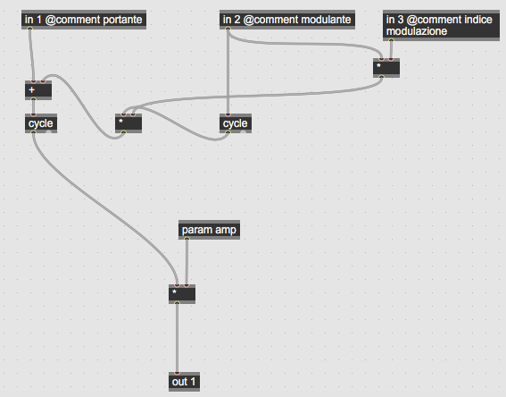
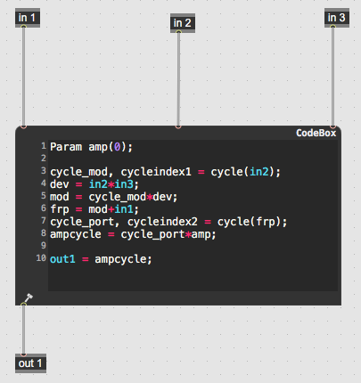
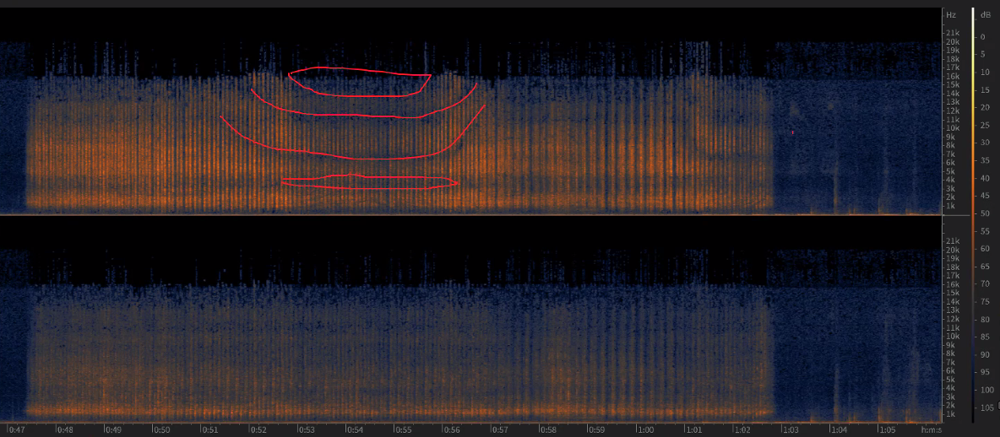
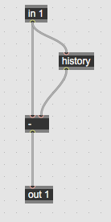

# Appunti della lezione di Giovedi 11 Giugno 2020

[Articolo su FIR e IIR](https://theaudioprogrammer.com/digital-filter-design-fir-vs-iir-filters/)

- Cos'è un filtro

- Funzione di trasferimento

- Differenza tra filtro reale ed ideale

Perchè avviene il taglio a Nyquist?

poichè la rappresentazione di una sinusoide a Nyquist è realizzata da 2 campioni e dunque se ritardiamo un campione creiamo una controfase.

Se ritardo di 2 campioni (ho un secondo ordine), ho dunque l'annullamento alla metà di Nyquist

C'e` una bella distinzione tra filtro reale ed ideale, e la banda passante ideale è diversa da quella reale.

AM ed RM

FM in gen~

FM in codebox

Determiniamo l'elevazione solamente con un parametro (a differenza)

Usiamo IID e ITD insieme perchè tutte le frequenze inferiori a 17cm vengono schermate dalla testa, dunque tutte le frequenze che hanno grandezza minore di 17 cm arriveranno con intesità diversa. A tutte le altre frequenze, la differenza non è di intensità, ma di tempo.

Per una banda che va da 0 a 2000 hz con ITD da 2000 in poi con IID.

In realtà c'è una zona di organizzazione tra 2000 e 3000 hz, la definizione di localizzazione è piú scarsa.

Abbiamo una definizione pessima a basse frequenze. Definizione ottima a frequenze altissime. E mediocre definizione a 2000/3000 Hz. 

Suoni gravi sono dati da fenomeni che non sappiamo da dove provenga, e dunque sono date da mappe mentali pregresse.

Dobbiamo capire invece nella parte acuta, da dove sta arrivando il pericolo.

Mentre nella parte centrale ci siamo abituati a capire.

##### Determinazione altezza

Filtraggi selettivi che il padiglione auricolare.

E dunque l'elevazione nel momento in cui andiamo a filtrare in maniera selettiva con larghezze di banda ben definite.

Dunque ciò che ascoltiamo è diverso da ciò che vediamo.

Se prendiamo un suono e lo filtriamo, abbiamo un suono filtrato, ma se abbiamo un suono con zone precise che il cervello ha come mappa mentale, abbiamo solo zone diverse.

Registrazione binaurale di fiammiferi.

Registrazione con testa di un materiale di 17 cm e 2 microfoni omnidirezionali.

Filtraggio di 5/6db. Il suono è dunque la somma di diversi comb filter che sommati arrivano a microfoni omnidirezionali e non lo percepiamo come cambio timbrico ma come cambio di direzione.

Siamo partiti dai filtri perchè?

Facciamo informatica musicale, quindi probabilmente modificando lo spazio modifichiamo il timbro e modificando lo spazio modifichiamo gli strumenti. Manovrado lo spazio manovriamo tutto il resto. Schöenberg nell'Harmonielere dice che "considerando il suono come timbro", altezza si misura in un modo solo, l'ampiezza si misura in un modo solo, durata in un solo modo, mentre il timbro non sappiamo come si misuri. Dunque cambiando un timbro modifichiamo tutti i parametri.

Probabilmente lo spazio racchiude già tutto.

Nella simulazione di spazi, quello che facciamo è non solo creare l'outer space ma anche l'inner space.

Potremmo dire che **ogni spazio è uno strumento** ed **ogni strumento è uno spazio**

Il pianoforte è un luogo dove succedono cose... Qualcosa che produce vibrazioni e qualcosa intorno che fa da risuonatore.

Un luogo è costruito per far si che determinate onde arrivino all'ultima persona in fondo.

Passeggiata di suono in uno strumento.

------

Prova d'esame applicazione musicale con composizione che preveda un tipo di riverberazione e distribuzione spaziale(parametri messi in gioco da Chowning).

Esperimento con i fiammiferi fatto da Zicarelli e bassista dei Nomadi, che loro chiamavano *Olofonia*. Alcuni artisti musicali hanno iniziato a considerare questa tecnologia. (Pink Floyd e Micheal Jackson)

La Blumlein è forse la configurazione piú importante delle stereofoniche.

Derivata prima in Max

Libro di Bessiere su matematica Calcolo differenziale e integrale

____________

Fasore deve comandare un oscillatore sinusoidale che deve essere convertita in un'onda quadra.
