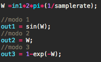
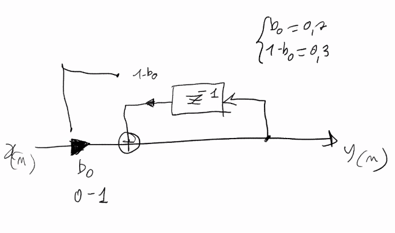
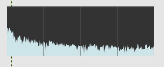
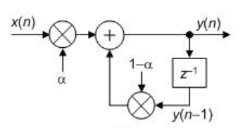
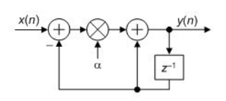
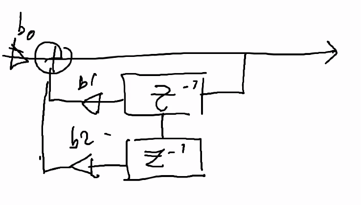

# Appunti della lezione di Giovedí 18 Giugno 2020

Decidere se tirare avanti tutto Luglio o finire di fare lezione Giugno e poi fermarsi continuare il 23 Luglio e il 30 Luglio per riniziare a Settembre.

Persona che riesce a capire il concetto riesce a capire come funzionano.

Ogni persona da delle risposte personali che vengono chiamate stile.
È la cosa bella negli artisti è l'incoerenza.

Intervista di persona che parla della stessa cosa a distanza di 35 anni.

______________

Determiniamo un metodo rispetto al filtro FIR ad un campione di ritardo.
Al secondo ordine la cancellazione si sposta a metà di Nyquist.

Adesso noi abbiamo un valore fisso -> ma vorremmo introdurre un metodo per determinare in modo abbastanzapreciso una frequenza di taglio.

Somma tra b0 e + (1-b0) = 1

Per convertire la pulsazione in campioni usiamo 3 modi per approssimare la frequenza di taglio che vediamo nella patch.

Vi sono inoltre 2 modi per implementare un filtro IIR.

### IIR del primo ordine
Schema

Spettrogramma

Primo metodo

Secondo metodo

### IIR del secondo ordine

