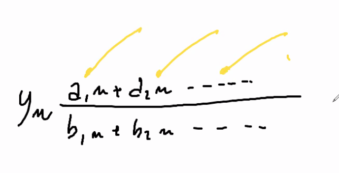
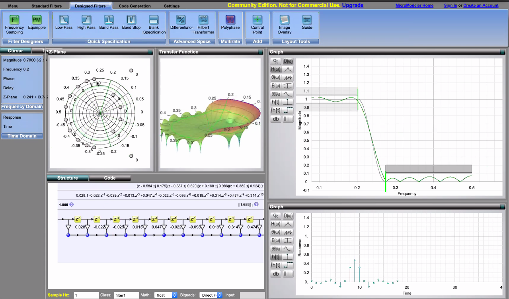
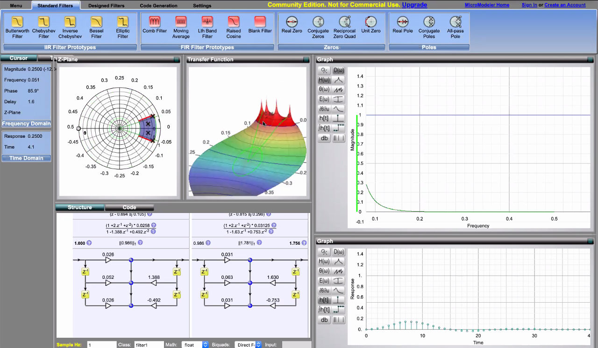
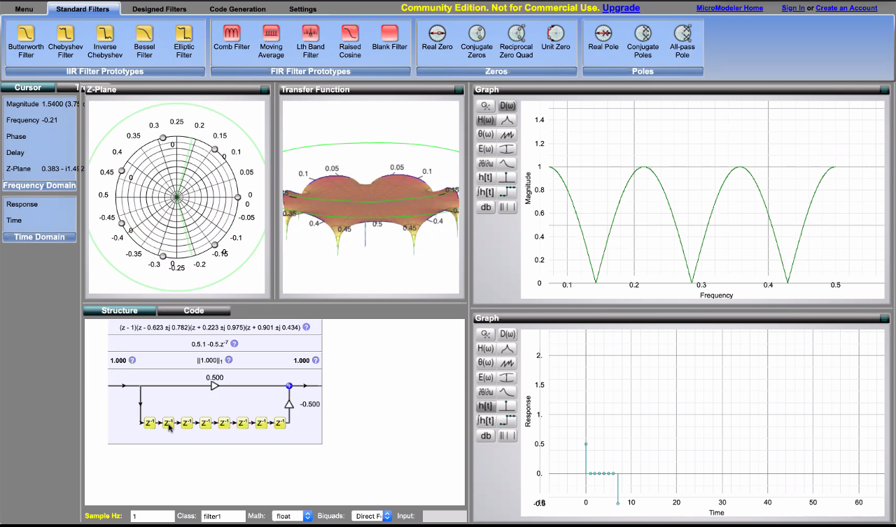
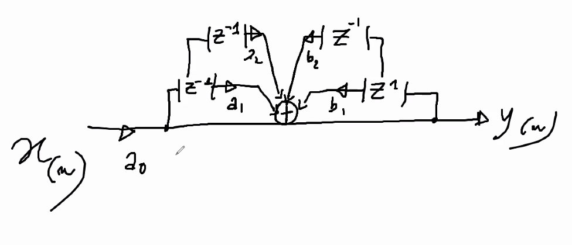
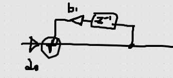
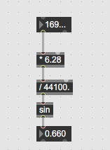

# Appunti della lezione di Giovedí 23 Luglio 2020

Funzionamento di one pole -> si fa in un certo modo, cosa ci si può fare di musicale?

Primo anno di Biennio -> tutta algoritmica di base e poi risolvendo facendo piú precisamente

Secondo anno -> specificità sul progetto del singolo

Filtro comb porta a certi artifici -> devo metterci un filtro low pass per farlo funzionare meglio

- frequenza naturale del filtro comb??

Progetto di composizione non deve essere una composizione...

Modifica in frequenza e FFT

- costruire un algoritmo proprio di riverberazione ricercando e non facendo cose che sono già state fatte, e vedere dunque qual'è la nostra visione

Chowning ha messo al contrario il riverbero di Schroaeder(Schroaeder 4 comb e 2 allpass), perchè gli servivano 4 uscite diverse per la spazializzazione, girare dunque compositiviamente in base a ciò che mi serve.

___________

Concetto di poli e zeri

La funzione seno

## trasformata
È in genere utilizzata per passare da un dominio ad un altro

## Trasformata di Fourier

_Passare da dominio del tempo al dominio della frequenza_

Ciò che appare sullo spettroscopio è nel dominio del tempo

Fare un passaggio a dominio del tempo a dominio della frequenza ci permette di passare per somme algebriche

Sapendo che il teorema di Fourier che dice che _ogni suono è rappresentabili come sinusoidi_

Con Fourier l'asse x diviene la frequenza mentre l'asse y è l'ampiezza

Infatti non si usa a livello digitale la FT ma la DFT

Parte digitale si passa alla discretizzazione della trasformata di Fourier

## Differenza tra trasformata di La Place e Z

La trasformata di LaPlace serve per determinare cosa succede in un sistema a scatola nera, ma possiamo determinare la funzione di trasferimento.
Per capire come si comporta un sistema se all'ingresso do un valore e ricevo un certo out e realizzo la funzione di trasferimento.
Essa ci serve per capire cosa fa la black box.

Per riuscire a determinare cosa fa una funzione di trasferimento, dovremmo avere a che fare con funzioni complicate(equazioni di differenziali e integro-differenziali); possiamo ragionare in altro modo.

## Trasformata di LaPlace

Trasforma le funzioni di trasferimento in somme algebriche, con numeri reali e numeri immaginari.

La funzione di trasferimento si definisce come la trasformata di LaPlace di tutte le risposte all'impulso.

Per sapere come funziona in sistema immetto tutte le frequenze nello stesso momento alla stessa ampiezza, ovvero l'impulso. IR, come risponde un sistema a tutte le frequenze che gli piazziamo all'interno, poichè non abbiamo differenza ne di tempo ne di intensità.

La trasformata di LaPlace è infinita come la trasformata di Fourier.

## La trasformata Z

È la discretizzazione della trasformata di LaPlace; ovvero la discretizzazione di tutte le risposte all'impulso di un sistema a livello temporale e di ampiezza.

Da essa abbiamo sempre numeri complessi che ci determinano la posizione dell'oscillazione in quel momento.

La trasformata Z, ci fa capire come funziona il sistema e quindi dove sono posizionati gli zeri e i poli.

## Poli e zeri

Che cosa sono poli e zeri?

In un'equazione che descrive un filtro ci sono dei coefficenti.

### Zeri

Valori che annullano la funzione, che stanno al numeratore.
Essi rendono la funzione nulla.

### Poli

Funzione in cui la funzione tende a infinito ed annullano il denominatore.

## I coefficenti dei filtri

Filtro FIR base, abbiamo con esso 2 coefficenti a e b.

A in genere è il numeratore e b è il denominatore.

I filtri fir non possono avere dei poli, ma solo zeri, ed essi si chiamano _all-zero filters_.

I FIR sono finiti non hanno poli che la annullano.

Filtri IIR o a un solo polo, ha un punto solo in cui la funzione diventa infinita, ovvero un solo punto di retroazione.

Nel filtro filtro FIR  passa basso, dobbiamo mettere diversi ritardi per ottenere un filtro passa basso.

[sito per modellazione di filtri](https://www.micromodeler.com/dsp/)

Cambiando la posizione degli zeri nella parte opposta, e realizzi un filtro passa alto.

filtro con 4 zeri e un polo

Cambiando zero e poli si determina una funzione di trasferimento diversa, e una posizione diversa di zeri e poli determina filtri diversi.

Comb feedforward

Ha solo zeri, esso è costante ma ha delle valli periodiche, e corrisponde a la risposta in frequenza del Filtro

## LTI

Tutti i filtri sono **LTI** lineari a tempo invariante, i filtri funzionano sempre nello stesso modo.

## Biquad

Che si trova in Max

ho 2 fir e due iir e dunque due poli e due zeri

se metto a1 a2 e b1 e b2 a 0 ho un filtro flat in cui esce solo a0 ovvero il solo suono diretto.

## Realizzazione di biquad

in passa banda i poli definiscono la frequenza centrale e gli zeri il modo in cui tagliano

Nel filtro notch gli zeri e poli si spostano in parallelo

## Il lowpass

taglia tutto ciò al di sopra della frequenza di taglio

## il lowshelf

da la possibilità di alzare e abbassare oltre la frequenza di taglio, in esso poli e zeri si muovono nella stessa direzione ed hanno lo stesso angolo

(fare un po' di pratica su filtri per chiarire poli e zeri)

## one pole

Filtro con un polo, con un feedback

a0 ciò che ho in ingresso, b1 filtro one pole

_________

- da 0 a 1 devo convertirlo in radianti da 0 a 6,28 e essp poi entra dentro il filtro

Problema di questa formula è che con questa tipologia di filtro, arrivati alla metà di Nyquist il filtro torna indietro

Goniometria e trigonometria (studio angoli e studio dei triangoli)

La formula che utilizziamo è più complessa di quella vista 
