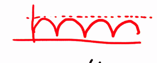
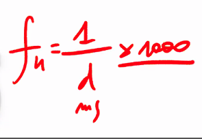
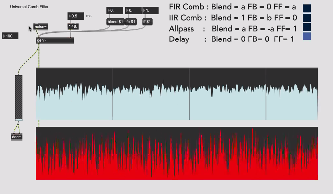

# Appunti della lezione di Giovedì 30 Luglio 2020


## SVF

## Riverberazione

ER+segnale diretto

in max abbiamo già _comb_ e _allpass_

Il modello classico della Riverberazione vuole diversi comb i parallelo, sommati passano degli allpass e vanno in uscita -> questa tipologia di algoritmo è approssimato

su libro di Bianchini e Cipriani mettono lp di primo ordine prima e dopo _allpass_

problema è che il comb in se produce dei suoni ben precisi

i riverberi seri, mettono un LP all'interno

(2 modi per simulazione, perdita di intensità e filtro a frequenze alte)

## comb


In genere vengono utilizzati T20 e T60, che vogliono dire il tempo che intercorre del suono diretto a decadere di 20 o 60 dB

_______

Nostro problema è di riuscire a capire quali strumenti usare per avere più numeri di echi avendo spazio computazionale minore possibile

_______________

più linee di ritardo -> echii multipli

Una retroazione permette di creare diversi echi con una sola linea di ritardo

_______________

2 tipologie:
1. FIR -> solo zeri
2. IIR -> solo poli


### Comb FIR


### Comb IIR


### Differenza tra comb  

differenza in frequenza di taglio, una opposta dell'altro

Differenza tra _onepole_ e comb è la z^-n -> il numero dei campioni non è uno soltanto

Con il FIR si creano delle valli,
 con IIR si creano dei picchi 

### Frequenza naturale
Non ha una frequenza di taglio ma frequenza naturale, esso è intonato su una frequenza base, dunque ogni _comb_ è armonico

#### Calcolo della frequenza naturale



con 2 ms di ritardo ho la frequenza naturale di 500 Hz

La frequenza naturale è accurata con il calcolo sia per IIR che per FIR

### Intensità picco e valle


_______________

## FFCF & FBCF

In  genere usiamo il FBCF quindi il filtro comb IIR

in genere viene usato il feedback perchè crea delle risonanze

ne usiamo 4 in parallelo per creare una stanza, usiamo ovviamente tutti ritardi diversi

dunque 4 FBCF in modi diversi


Scegliamo dunque numeri di campioni di ritardo con tutti numeri diversi(ad esempio numeri solamente prime)

Noi ragioniamo non in campioni ma in ci servono i millisecondi per il ritardo

### ms di ritardo con campioni
numero*sr/1000= numero campioni di ritardo

______

fare il comb feedback in codebox

_______
Max attraverso il comando _require_ ed è come _include_ in C e prende su una libreria i nostri oggetti.

I file per require sono con estensione .genexpr

questo file non vuole _in_, ma dobbiamo rispettare la logica degli ingressi usati sopra.

```
fbcf (sig, delT, gain)
{
	Delay zmn(samplerate);
	delTime = delT*(samplerate/1000);
	g = clamp(gain, 0., 0.999);

	zmnDel = zmn.read(delTime);
	zmnG = zmnDel*g;
	yn = sig+zmnG;

	zmn.write(yn);

return yn;
}
```

Non serve _out_, e ci va il comando _return_

File .genexpr deve essere all'interno della stessa cartella


Il gain determina il T60

_____
### calcolo T60 in base a gain

Come calcolare il T60 in base al gain

mettere il T60 riparametrato in gain

(3/log(1/g)) * tau


se noi andiamo a scegliere il nostro ritardo nella catena del comb, scegliano z^(-n)

g lo calcoliamo in base alla formula inversa per il T60

il fattore g ci serve per definire il decadimento, ciò determina il tempo che ci mette il decadimento di echi per arrivare al di sotto di 60 dB

_______________

nel circuito ci manca una parte, ovvero l'allpass

Il comb ha un decadimento lineare, ma ci interessa innestare sul punto del ricircolo prima del ritardo un onepole, ovvero un low pass, cosí ad ogni ricircolo perde un po' di energia ed è piú uniforme

nel comb c'è ricircolo e quindi perdita di energia, che filtrerà in modo diverso.

LP all'interno del ricircolo del comb


_______

Frequenza di taglio la puoi impostare...


Ci sono molti modi per fare allpass, modo moderno usare un feedback ed un feedforward


- ci può servire un solo algoritmo per fare due tipi di comb e un allpass  ->  e puoi usare ciò per realizzare 4 cose diverse
1. feedforward
2. feedback
3. allpass
4. delay




_______

#### Funzioni _allpass_

- con allpass togliamo picchi risonanti -> muove le fasi
- muovere la fase

I riverberi realizzati con _allpass_ non hanno modi naturali

_______

provare filtri comb

[link alla playlist](https://www.youtube.com/playlist?list=PLxcqYDjKDVLRVfkGh4HpOirz2w46nol8q
)
