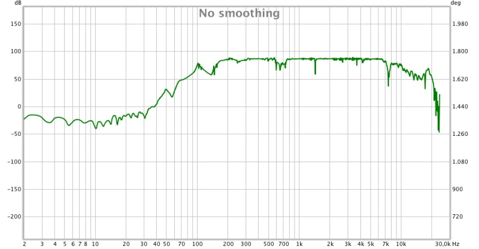

# Repository del ciclo di Biennio di Davide Tedesco

## [COME-01](/COME-01)
#### _Esecuzione e interpretazione della musica elettroacustica. Ambienti esecutivi e di controllo per il live electronics_

_Maestro Giuseppe Silvi_

### Brani trattati durante il corso:
- Luigi Nono - Post-prae-ludium n. 1 per Donau
- Giorgio Nottoli - Incontro

#### Giorgio Nottoli - Incontro
- realizzazione del VCS3 in Faust
  - realizzazione dei 3 oscillatori
  - realizzazione del filter/oscillator

#### Luigi Nono - Post-prae-ludium n. 1 per Donau
- 

## [COME-02](/COME-02)
#### _Composizione musicale elettroacustica_

_Maestro Michelangelo Lupone - Maestro Nicola Bernardini_
### Primo Progetto: Chitarra Classica

Ricerca sulla chitarra classica(acustica con corde in nylon) e primo approccio allo sviluppo di studi per lo strumento "espanso".

- la chitarra come percussione, ovvero catalogazione delle modalità di percussione-> [schema ed esempi](https://github.com/SMERM/BN-Tedesco/blob/master/COME-02/Bernardini/20200204/Modi%20di%20percussione%20con%20le%20dita.pdf)
- eccitazione del piano armonico attraverso un attuatore [Visaton EX 60 R](https://github.com/SMERM/BN-Tedesco/blob/master/COME-02/Lezioni_in_Compresenza/20200407/ex60r_8.pdf) -> [analisi spettrale ed esempi](https://github.com/SMERM/BN-Tedesco/tree/master/COME-02/Lezioni_in_Compresenza/20200317/Various_Sweeps)
- ripresa con sensore piezoelettrico dello strumento(Rappresentazione del _micro_, il "da vicino") -> [Esempi]()
- ripresa microfonica con microfono esterno dallo strumento (Rappresentazione del _macro_, il "davanti allo strumento") -> [esempi]()
- catalogazione dei suoni consonantici e vocalici per implementazione in live degli stessi sull'attuatore -> esempi
- criteri per la spazializzazione in sala da concerto ???
- gestione agevole del suono ripreso micro e macro (algoritmo di interpolazione fra i due???)
- algoritmo di sintesi della corda "Karplus-Strong" -> [articolo](https://github.com/SMERM/BN-Tedesco/blob/master/COME-02/Lezioni_in_Compresenza/20200303/Kevin%20Karplus%20and%20Alex%20Strong%20-%20Digital%20Synthesis%20of%20Plucked-String%20and%20Drum%20Timbres.pdf), [algoritmo realizzato in Faust](https://github.com/SMERM/BN-Tedesco/blob/master/COME-02/Lezioni_in_Compresenza/20200324/karplus_filtrato.dsp), [Esempi](https://github.com/SMERM/BN-Tedesco/tree/master/COME-02/Lezioni_in_Compresenza/20200331/Esempi_Karplus-Strong_Attuatore_su_chitarra)
- estensioni dell'algoritmo di sintesi della corda "Karplus-Strong" -> [articolo](https://github.com/SMERM/BN-Tedesco/blob/master/COME-02/Lezioni_in_Compresenza/20200407/David%20A.%20Jaffe%20and%20Julius%20O.%20Smith%20-%20Extensions%20of%20the%20Karplus-Strong%20Plucked-String%20Algorithm.pdf)
- Lettura e studio del manuale "The Contemporary Guitar" di John Schneider -> [Manuale](https://github.com/SMERM/BN-Tedesco/blob/master/COME-02/Lezioni_in_Compresenza/20200331/The-Contemporary-Guitar-Schneider-Vol-5.pdf)
- Lettura e studio di "Principles of Idiomatic Guitar Writing" di Jonathan Godfrey ->[Testo](https://github.com/SMERM/BN-Tedesco/blob/master/COME-02/Lezioni_in_Compresenza/20200331/Principles%20of%20Idiomatic%20Guitar%20Writing%20-%20Jonathan%20Godfrey.pdf),  [Esempi Audio](https://github.com/SMERM/BN-Tedesco/tree/master/COME-02/Lezioni_in_Compresenza/20200331/Principles%20of%20Idiomatic%20Guitar%20Writing%20-%20Jonathan%20Godfrey_Audio_Tracks)
- sostegno infinito del suono di chitarra attraverso l'[algoritmo realizzato in Faust](https://github.com/SMERM/BN-Tedesco/blob/master/COME-02/Lezioni_in_Compresenza/20200324/karplus_filtrato.dsp) -> [esempi]()
- lettura del [testo di Emilio Pujol "The dilemma of Timbre on the Guitar"](https://github.com/SMERM/BN-Tedesco/blob/master/COME-02/Lezioni_in_Compresenza/1979-Emilio-Pujol-Il-Dilemma-del-Timbro-sulla-Chitarra/1979-emilio-pujol-el-dilema-del-sonido-en-la-guitarra.pdf), [traduzione in italiano del testo di Emilio Pujol "The dilemma of Timbre on the Guitar"](https://github.com/SMERM/BN-Tedesco/tree/master/COME-02/Lezioni_in_Compresenza/1979-Emilio-Pujol-Il-Dilemma-del-Timbro-sulla-Chitarra/1979-Emilio-Pujol-Il-Dilemma-del-Timbro-sulla-Chitarra-Traduzione)
- analisi dei brani di [chitarra elettrica contemporanea](https://github.com/SMERM/BN-Tedesco/tree/master/COME-02/Lezioni_in_Compresenza/Chitarra_Elettrica_Contemporanea)
- [VIDEO - esempio chitarra classica distorta](https://youtu.be/K3yqyxcJStg)
- [VIDEO - esempio feedback strutturale(piezo-attuatore) su chitarra classica](https://www.youtube.com/watch?v=TraqAMf5Exo)-> nella descrizione del video, minutaggio segnato di alcuni primi esempi di feedback
- [algoritmo per la gestione del feedback realizzato in Faust(FEEDBACK_CONTROLLER v.0.1)](https://github.com/SMERM/BN-Tedesco/blob/master/COME-02/Lezioni_in_Compresenza/20200512/FEEDBACK_CONTROLLER.dsp)

- IR chitarra classica sistema sensore-attuatore [posizione 1](COME-02/Lezioni_in_Compresenza/20200519/Sistema_Sensore-Attuatore_Posizione_1) 
- IR chitarra classica sistema sensore-attuatore posizione 2(da fare) 
- [VIDEO - implementazione di un LPF e un pedale MIDI(ON/OFF) per controllo del feedback, scordatura durante Feedback](https://youtu.be/7BwwTopM3Ek)

### Lavori 
- [Sketches](https://github.com/SMERM/BN-Tedesco/blob/master/COME-02/Lezioni_in_Compresenza/20200324/Sketches.pdf)

#### Studi 
- Legenda: [Draft_1_Legenda](https://github.com/SMERM/BN-Tedesco/blob/master/COME-02/Lezioni_in_Compresenza/20200407/Legenda_Part_Perc.jpg)
- Legenda elettroacustica: [Schema 1](/COME-02/Lezioni_in_Compresenza/20200616/guitar_Electroacustic_Scheme_I.jpg)
- Studio n.1: [Intenzioni compositive dello Studio n.1](https://github.com/SMERM/BN-Tedesco/blob/master/COME-02/Lezioni_in_Compresenza/20200505/Intenzioni_compositive_dello_Studio_n.1.md),[Draft_1 Studio n.1 Partitura](https://github.com/SMERM/BN-Tedesco/blob/master/COME-02/Lezioni_in_Compresenza/20200331/Draft_1_Studio_n.1_Partitura.pdf), [Draft_1 Studio n.1 Audio](https://github.com/SMERM/BN-Tedesco/blob/master/COME-02/Lezioni_in_Compresenza/20200331/Draft_1_Studio_n.1_Audio.wav)
- Studio n.2: [Draft_1 Studio n.2 Partitura](https://github.com/SMERM/BN-Tedesco/blob/master/COME-02/Lezioni_in_Compresenza/20200407/Draft_1%20Studio%20n.2%20Partitura.pdf)
- Studio n.3: [Intenzioni compositive dello Studio n.3](COME-02/Lezioni_in_Compresenza/20200519/Intenzioni_compositive_dello_Studio_n.3.md), [Appunti Studio n.3 (a)](COME-02/Lezioni_in_Compresenza/20200519/Appunti_Studio_n.3_a.jpeg)
- Studio n.4 a: [partitura alla prima versione](/COME-02/Lezioni_in_Compresenza/20200616/Studio_n.4_a.pdf)
- Studio n.5:  (sfuttare la scordatura naturale della chitarra)
- Studio n.6: 

## [COME-03](/COME-03)
#### _Acustica degli ambienti musicali_

_Ingegnere Marco Giordano_

[Libri e risorse utilizzate](/COME-03/Risorse)

- [Prima Lezione](/COME-03/20200527/)
- [Seconda Lezione](/COME-03/20200603/)
- [Terza Lezione](/COME-03/20200610/)
- [Quarta Lezione](/COME-03/20200617/)
- [Quinta Lezione](/COME-03/20200624/)
- [Sesta Lezione](/COME-03/20200701)
- [Settima Lezione](/COME-03/20200708/)

## [COME-04](/COME-04)
#### _Elettroacustica_

_Maestro Federico Scalas_

### Argomenti trattati:
#### Teoria
- Audio multi-canale
- Ambiophonics
- Ambisonics
#### Pratica
- Inizio di saldatura di componenti hardware per l'audio
- La resistenza
- Il condensatore
- Esempi di primi filtri
- Il diodo
- Il transistor

## [COME-05](/COME-05)
#### _Informatica Musicale_ 

_Maestro Pasquale Citera_

- Filtri FIR
- Filtri IIR

## [CODM-05](/CODM-05)
#### _Storia della musica elettroacustica_

_Maestro Luigino Pizzaleo_

- [Seminario software per l'analisi](/CODM-05/20200514/Seminario_software_per_l'analisi.md/)

- [Prima Lezione](/CODM-05/20200521)
- [Seconda Lezione](/CODM-05/20200528)
- [Terza Lezione](/CODM-05/20200528/)
- [Quarta Lezione](/CODM-05/20200604/)
- [Quinta Lezione](/CODM-05/20200611/)
- [Sesta Lezione](/CODM-05/20200618/)
- [Settima Lezione](/CODM-05/20200625/)
- [Ottava Lezione](/CODM-05/20200702/)
- [Nona Lezione](/CODM-05/20200706/)
- [Decima Lezione](/CODM-05/20200709/)

- [Lezioni sul paradigma Stockhausen](/CODM-05/Stockhausen_Paradigma)

